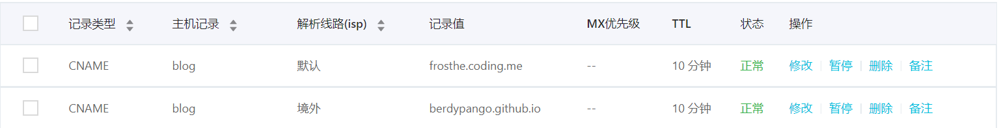
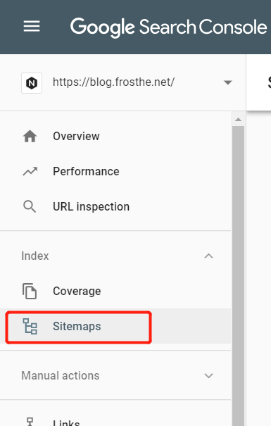

---
title: Hexo 及 NexT 定制
date: 2015-06-27 23:21:36
description: 本文记录了一些 Hexo NexT 主题进行定制化的常见需求
categories:
  - Hexo
tag:
  - hexo
  - next-theme
---本文索引:

<!-- TOC -->

- [前言](#前言)
- [配置搜索引擎优化](#配置搜索引擎优化)
  - [安装站点地图插件](#安装站点地图插件)
  - [向谷歌提交站点地图](#向谷歌提交站点地图)
  - [向百度站长平台提交站点地图](#向百度站长平台提交站点地图)
  - [百度站长平台自动提交及主动提交](#百度站长平台自动提交及主动提交)
    - [自动提交](#自动提交)
    - [手动提交](#手动提交)
- [与站点配置相关的定制](#与站点配置相关的定制)
  - [设置页面文章的篇数](#设置页面文章的篇数)
- [与主题配置相关的定制](#与主题配置相关的定制)
  - [修改主题文字的显示文本](#修改主题文字的显示文本)
  - [设置 Copyright 声明](#设置-copyright-声明)
  - [开启博文打赏功能](#开启博文打赏功能)
    - [为指定文章添加打赏功能](#为指定文章添加打赏功能)
  - [添加「Fork me on Github」](#添加fork-me-on-github)
  - [添加置顶文件标识](#添加置顶文件标识)
- [修改文章底部标签的图标](#修改文章底部标签的图标)

<!-- /TOC -->

## 前言

针对 Hexo 博客的定制化分为两部分，一部分仅与**站点配置文件**有关，主项目跟踪文件的变化，第二部分与**主题配置文件**有关，虽然 NexT 主题提供了强大的定制空间，但目前没有找到好的办法将定制化的内容由主 Repo 跟踪并在生成阶段替换这些内容。因此现阶段不得不将已经修改的定制化文件单独备份，以防下次主题更新之后覆盖了原有的内容。以下将分开进行讨论。

## 配置搜索引擎优化

### 安装站点地图插件

安装站点地图相关的组件，一个用于 google 搜索引擎优化，一个用于百度站点优化。

```bash
$ npm install hexo-generator-sitemap --save
$ npm install hexo-generator-baidu-sitemap --save
```

在**站点配置文件**中添加如下代码:

```yaml
Plugins:
  - hexo-generator-baidu-sitemap
  - hexo-generator-sitemap

# Sitemap
baidusitemap:
  path: baidusitemap.xml

sitemap:
  path: sitemap.xml
```

重新生成站点:

```bash
$ hexo clean
$ hexo g
```

在 `public` 文件夹下发现多了 `sitemap.xml` 和 `baidusitemap.xml` 即表示生成成功了，接下来重新部署一次站点。

### 同时将博客部署至 Github Pages 及 Coding Pages

修改 `站点配置文件` 中的 `deploy` 配置节，如下:

```yaml
deploy:
  - type: git
    repo: https://github.com/BerdyPango/BerdyPango.github.io.git
    branch: master
  - type: git
    repo: https://git.coding.net/frosthe/blogs.git
    branch: master
```

这样，当每次执行 `hexo d` 时都将同时推送至 Github 和 Coding。

### 在 Coding Pages 绑定自定义域名时 SSL 证书无法获取

当在 Coding 绑定自定义域名后，阿里云的域名解析记录如下:


此时为 Coding Pages 申请 SSL 证书会失败，原因是同一个二级域名记录解析到了两个记录值，只是线路不一样，而 Coding 的服务器也在境外，导致 Coding 在向 CA 申请证书时获取了错误的域名解析记录值。解决办法是，在申请 Coding Pages 的 SSL 证书前，先暂停境外路线的解析记录，申请成功之后，再启用该条记录。

### 向谷歌提交站点地图

登陆 [Google Web Master](https://www.google.com/webmasters/)，找到左侧的提交站点地图的位置:


### 向百度站长平台提交站点地图

登陆 [百度搜索资源平台](https://ziyuan.baidu.com)，按照步骤添加并验证站点，之后百度可能需要一天时间来验证站点的 HTTPS。

### 百度站长平台自动提交及主动提交

#### 自动提交

修改主题配置文件中的如下节点:

```yaml
baidu_push: true
```

在目录 `\themes\next\layout\_third-party\seo\baidu-push.swig` 中的 JS 替换为:

```js
<script>
(function(){
    var bp = document.createElement('script');
    var curProtocol = window.location.protocol.split(':')[0];
    if (curProtocol === 'https') {
        bp.src = 'https://zz.bdstatic.com/linksubmit/push.js';
    }
    else {
        bp.src = 'http://push.zhanzhang.baidu.com/push.js';
    }
    var s = document.getElementsByTagName("script")[0];
    s.parentNode.insertBefore(bp, s);
})();
</script>
```

#### 手动提交

Github 禁止百度爬虫访问博客，导致博客无法被百度收录，百度提供了主动提交的接口，使用主动推送还将:

- 及时发现：可以缩短百度爬虫发现您站点新链接的时间，使新发布的页面可以在第一时间被百度收录
- 保护原创：对于网站的最新原创内容，使用主动推送功能可以快速通知到百度，使内容可以在转发之前被百度发现

有作者专门制作了针对 hexo 手动提交百度链接的链接生成器: https://github.com/huiwang/hexo-baidu-url-submit

安装该插件:

```bash
$ npm install hexo-baidu-url-submit --save
```

> 插件的配置文件中包含秘钥，请把 Hexo 博客源文件托管到私有仓库里，密钥可从[百度搜索资源平台](https://ziyuan.baidu.com/linksubmit/index?site=https://blog.frosthe.net/) 查找。

在**站点配置文件**中加入以下内容:

```yaml
baidu_url_submit:
  count: 3 ## 比如3，代表提交最新的三个链接
  host: blog.example.com ## 在百度站长平台中注册的域名
  token: your_token ## 请注意这是您的秘钥，请不要发布在公众仓库里
  path: baidu_urls.txt ## 文本文档的地址，新链接会保存在此文本文档里
```

最后，在**站点配置文件**中添加新的 deployer:

```yaml
deploy:
  - type: git
    repo: https://your-hexo-pages-repo.git
    branch: master
  - type: baidu_url_submitter
```

这样，当执行 `hexo g` 时将生成包含链接的 `baidu_urls.txt` 文件，在执行 `hexo d` 时提取该文件并推送至百度搜索引擎。

---## 与站点配置相关的定制

### 设置页面文章的篇数

在 Hexo 里可以为首页和归档页面设置不同的文章篇数，但可能需要安装 Hexo 插件。详细步骤如下。

```bash
npm install --save hexo-generator-index
npm install --save hexo-generator-archive
npm install --save hexo-generator-tag
```

安装完成后，在**站点配置文件**中设定如下:

```yaml
index_generator:
  per_page: 5

archive_generator:
  per_page: 20
  yearly: true
  monthly: true

tag_generator:
  per_page: 10
```

---## 与主题配置相关的定制

这部分将涉及替换主题 Repo 的某些文件

### 修改主题文字的显示文本

在主题 repo 下的 language 目录下，有针对各个 key 在不同语言下的显示名称，此处找到 `languages/default.yml` 文件中的对应的键，改为自定义的值。

> 同时，在**站点配置文件**中要将 language 设置为对应的语言才能生效

### 设置 Copyright 声明

在**主题配置文件**中，添加如下节点:

```yaml
post_copyright:
  enable: true
  license: CC BY-NC-SA 3.0
  license_url: https://creativecommons.org/licenses/by-nc-sa/3.0/
```

可在 `themes/next/layout/_macro/post-copyright.swig` 编辑显示细节:

```html
<ul class="post-copyright">
  <li class="post-copyright-author">
    <strong>{{ __('post.copyright.author') + __('symbol.colon') }}</strong>
    {{ post.author | default(config.author) }}
  </li>
  <li class="post-copyright-link">
    <strong>{{ __('post.copyright.link') + __('symbol.colon') }}</strong>
    <a href="{{ post.url | default(post.permalink) }}" title="{{ post.title }}"
      >{{ post.url | default(post.permalink) }}</a
    >
  </li>
  <li class="post-copyright-license">
    <strong
      >{{ __('post.copyright.license_title') + __('symbol.colon') }}
    </strong>
    {{ __('post.copyright.license_content', theme.post_copyright.license_url,
    theme.post_copyright.license) }}
  </li>
</ul>
```

### 添加置顶文件标识

找到 `/themes/next/layout/_macro/post.swig`，搜索 `<div class="post-meta">`，在下一行添加以下代码:

```html

<i class="fa fa-thumb-tack"></i>
<font color="7D26CD">Stick on Top</font>
<span class="post-meta-divider">|</span>

```
