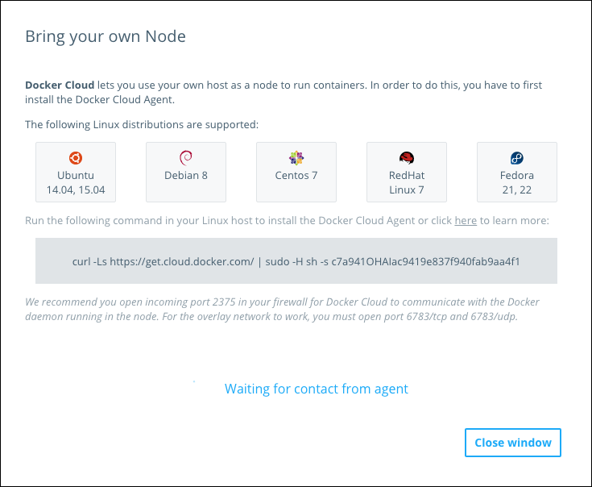
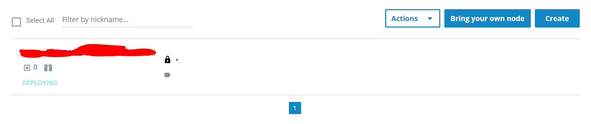

参考资料:
- [Deploy your app](https://docs.docker.com/get-started/part6/)
- [Use the Docker Cloud Agent](https://docs.docker.com/docker-cloud/infrastructure/byoh/)
- [The Docker Cloud CLI](https://docs.docker.com/docker-cloud/installing-cli/)

# Docker Cloud
`Docker Cloud` 提供了 `image` 托管，持续集成和集群部署等服务，之前已经使用 `Docker ID` 登录过 `Docker Cloud` 并上传 `image`。使用 `Docker Cloud` 在云服务提供商的虚拟主机上部署和运行 app 是官方推荐的做法，要实现这一点，需要:
- 将 `Docker Cloud` 连接至偏好的云服务提供商，并对 `Docker Cloud` 赋予适当的权限以自动容易化这些虚拟主机
- 使用 `Docker Cloud` 创建计算资源和创建集群
- 部署应用

`Docker Cloud` 提供了与亚马逊 AWS 和 微软 Azure 的自动集群部署服务，但其他云服务商需要自行在 Docker Cloud UI 上手动操作，文本介绍手动进行部署的路径。

# Docker Cloud Agent
`Docker Cloud` 允许使用任何 Linux 发行版的系统来部署 `container`，但要在这些 `Linux` 主机上安装 `Docker Cloud Agent` 才能对它们进行远程管理。

> `Docker Cloud Agent` 目前仅支持 x64 架构。

`Docker Cloud Agent` 会将所有需要的包都安装好，并自动移除任何现有的 `Docker` 引擎。之后仍然可以在这些主机上执行 `docker` 命令，但会多出一些以 `dockercloud/` 开头的运行的系统 `container`。

## 通过 Docker Cloud 网页界面安装 Docker Cloud Agent
1. 开始安装之前，请确保目标主机上的
- TCP/UDP 6783 端口: 允许该节点加入 `Docker Cloud` 账号下所有节点组成的叠加网络以支持服务发现
- TCP 2375 端口: 允许 `Docker CLoud` 与目标主机的 `Docker` 守护进程直接通过 TSL 认证进行通信，如果该端口未开启，`Docker Cloud` 会让目标主机建立一个反向隧道以访问该端口。
2. 登录 `Docker Cloud`，导航至节点仪表盘(`Nodes`)。
3. 点击 `Bring your own node`。弹出窗口会展示目前支持的所有 Linux 发行版本并生成一行包含 token 的命令以使主机上的 `Docker Cloud Agent` 与 `Docker Cloud` 通信。

4. 在目标 Linux 主机上执行该命令，该命令会下载一个脚本，安装并配置好 `Docker Cloud Agent`，最后将其注册到 `Docker Cloud`。
```bash
*******************************************************************************
Docker Cloud Agent installed successfully
*******************************************************************************

You can now deploy containers to this node using Docker Cloud
```
5. 当出现以上提示之后，关闭弹出框，刷新节点仪表盘，发现该主机已经与 `Docker Cloud` 关联:


该主机现在已经准备好部署了。

## 通过 CLI 安装 Docker Cloud Agent
也可以借助 `docker-cloud` 命令来安装 `Docker Cloud Agent`，这种方式对熟悉命令行工具的同学来说更明白发生了什么，首先，需要在目标主机上安装 `docker-cloud` CLI，参考[The Docker Cloud CLI](https://docs.docker.com/docker-cloud/installing-cli/)可以不同的方式安装。

使用 `python pip` 安装 `docker-cloud` CLI:
``` bash
$ pip install docker-cloud
```
使用以下命令取得一个节点的 `token`:
```bash
$ docker-cloud node byo

Docker Cloud lets you use your own servers as nodes to run containers. For
this you have to install our agent.

Run the following command on your server:

curl -Ls https://get.cloud.docker.com/ | sudo -H sh -s 63ad1c63ec5d431a9b31133e37e8a614
```
执行上述代码将下载一段脚本，安装并运行 `dockercloud-agent` 服务，然后在配置文件中设置 token，该 `token` 有一定的时限，服务向 `Docker Cloud` 进行注册，并开始下载 `docker` 引擎:
```bash
2018/05/11 20:18:34 Registering in Docker Cloud via PATCH: https://cloud.docker.com/api/agent/v1/node/d4289a2e-4a98-4767-b9c8-8c67b24a2ca3
2018/05/11 20:18:34 Downloading docker binary...
2018/05/11 20:18:34 Downloading docker definition from https://cloud.docker.com/api/tutum/v1/agent/docker/1.11.2-cs5/1.1.0.json
2018/05/11 20:18:34 Downloading docker from https://files.cloud.docker.com/packages/docker/docker-1.11.2-cs5.tgz
```
该过程由网络带宽决定耗时长短，下载过程中 `Docker Cloud` 会一直打印 docker 端口未开启:
```bash
Waiting for docker port to be open...
Waiting for docker port to be open...
```
这是因为 `docker` 引擎还未在目标主机上就绪，无法找到端口 2375，由于笔者的云服务器只有 1Mbps 的带宽，下载该包的时间超过了 `Docker Cloud` 的超时时间，于是造成 `Docker Cloud` 等待超时，在 `docker` 包下载完成后，尝试重新启动 `dockercloud-agent` 服务，而由于 token 又过期了，所以只能重新申请 token 并设置配置文件: 
```bash
Cannot register node in Docker Cloud: unauthorized. Please try again with a new token.

$ docker-cloud node byo
```
取得新的 token 后，需要修改配置文件中的 token 值，重新启动服务。
```bash
$ dockercloud-agent set Token=xxx
$ sudo service dockercloud-agent restart
```


## 卸载 Docker Cloud Agent
```bash
$ apt-get remove dockercloud-agent
$ rm -rf /etc/dockercloud
```
## 升级 Docker Cloud Agent
```bash
$ apt-get update && apt-get install -y dockercloud-agent
```