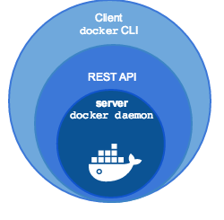

参考资料: 
- [Swarms](https://docs.docker.com/get-started/part4/)
- [Docker Machine](https://docs.docker.com/machine/overview/)

# 前言
[Docker GetStarted Swarm](https://docs.docker.com/get-started/part4/) 官方文档中，为了在单机上演示如何搭建 `Docker Swarm` 而引入了 `Docker Machine`，并在其中穿插了虚拟 shell 环境的内容，个人认为这部分内容干扰了集群搭建的关键信息。
# Docker Machine
通过 `Docker Machine` 可实现在虚拟主机或远程主机上安装 `Docker` 引擎，并使用 `docker-machine` 命令行对其进行管理的工具。`Docker Machine` 在 `Docker for Mac` 和 `Docker for Windows` 上都已经预装，`Linux` 系统需要手动安装。

`Docker Machine` 有以下两种常用场景:
- 有些老的桌面系统主机如 `Windows` 和 `Mac`，它们不满足预装 `Docker for Windows` 或 `Docker for Mac` 的条件，但我想要在这些系统上运行 `Docker`。
- 我想要在远程主机系统上运行统一的 `Docker image`。

`docker` 守护进程由服务端和客户端两部分组成，服务端发布 REST API 接口开放给客户端，`docker CLI` 客户端通过 REST API 接口与服务端通信。



无论你的管理主机是 `Windows`，`Mac` 还是 `Linux`，都可以安装 `Docker Machine` 并使用 `docker-machine` 命令统一管理大量的 `Docker` 从机。通常，你会将 `Docker Machine` 安装到本地主机，`Docker Machine` 包含 `docker-machine` 命令行工具和 `Docker` 引擎的客户端 `docker` 命令行工具。可通过 `docker-machine` 命令行工具在本地主机的虚拟环境或云主机上安装 `Docker` 引擎，它将自动创建虚拟环境，安装 `Docker` 引擎，配置好 `docker` 客户端，每一个被管理的从机由 `Docker host`(运行了 Docker 引擎的主机) 和一个配置好的客户端组成，它们通常又被称为 **_"machines"_**。



> 意即，如果仅仅安装 `Docker Machine`，将不会在本机安装 `Docker` 引擎，仅仅安装其客户端管理工具

## 在 Linux 上安装 Docker Machine
首先在 [docker/machine release page](https://github.com/docker/machine/releases/) 页面上找到最新的发布版本号，并修改以下命令对应的位置
```bash
$ base=https://github.com/docker/machine/releases/download/v0.14.0 &&
  curl -L $base/docker-machine-$(uname -s)-$(uname -m) >/tmp/docker-machine &&
  sudo install /tmp/docker-machine /usr/local/bin/docker-machine
```
打印 `docker-machine` 的版本以确认安装完成:
```bash
$ docker-machine --version
docker-machine version 0.14.0, build 89b8332
```

# 以非 driver 方式添加主机
`Docker Machine` 为众多的虚拟机和云服务商提供了 `driver`，以通过这些驱动在不同的服务商主机上安装 `Docker` 引擎，但也提供了一种 url 的方式来添加已有 `docker` 主机:
```bash
$ docker-machine create --driver none --url=tcp://50.134.234.20:2376 custombox
$ docker-machine ls
NAME        ACTIVE   DRIVER    STATE     URL
custombox   *        none      Running   tcp://50.134.234.20:2376
```
此后，便可通过 `docker-machine` 远程管理列表中的所有主机，可通过 `docker-machine ssh custombox` 向该主机发送指令，例如:
``` bash
$ docker-machine ssh custombox "docker container ls"
```
> 如果出于某些原因出现 ssh 连接的问题，那么可以改用系统本地的 ssh 进行通信，加入 `--native-ssh` 参数即可: `docker-machine --native-ssh ssh`

# 配置虚拟 Docker 主机的 shell 环境
除了通过 `docker-machine ssh` 向 Docker 主机发送命令之外，还可以使用 `docker-machine env <machine>` 配置一个虚拟 shell 环境直接与目标主机的 Docker 守护进程通信。这样，便可访问执行 `docker-machine` 的本地主机的资源，如 `docker-compose.yml` 文件:
```bash
$ docker-machine env custombox

export DOCKER_TLS_VERIFY="1"
export DOCKER_HOST="tcp://50.134.234.20:2376"
export DOCKER_CERT_PATH="/Users/pango/.docker/machine/machines/custombox"
export DOCKER_MACHINE_NAME="custombox"
# Run this command to configure your shell:
# eval $(docker-machine env custombox)
```
执行输出结果返回的最后一行命令:
``` bash
eval $(docker-machine env myvm1)
```
执行 `docker-machine ls` 验证 `custombox` 变成了活动主机，Active 一栏的 `*` 指示了该状态:
```
$ docker-machine ls

NAME        ACTIVE   DRIVER       STATE     URL                         SWARM     DOCKER        ERRORS
custombox   *        none         Running   tcp://50.134.234.20:2376              v17.06.2-ce   
```

# 清除 docker-machine 的 shell 变量设置
```bash
eval $(docker-machine env -u)
```
该命令退出与目标主机建立的虚拟 shell 环境并回到之前的环境中。

有关 `Docker Machine` 更多详情参考 [Docker Machine](https://docs.docker.com/machine/overview/)。