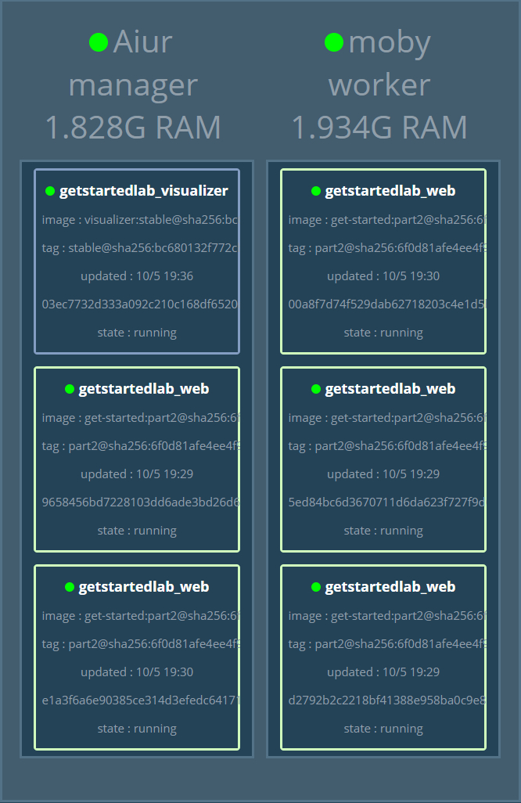

参考资料:
- [Stacks](https://docs.docker.com/get-started/part5/)

# 前言
一个 `Stack` 是一组相互作用并共享依赖的 `service`，并且一起协同和伸缩的单元，一个 `Stack` 可以能够定义包含一个系统的所有功能。之前关于 `Service` 的介绍中已经用到了 `stack`，但那只是包含单个服务的 `stack`，在生产环境中 `stack` 往往许多服务，并将它们运行在不同的主机上。

# 添加一个新的 service 并重新部署
首先添加一个免费的可视化服务以监控 `swarm` 是如何调度 `container` 的。
1. 打开 docker-compose.yml，填充以下内容:
``` YAML
version: "3"
services:
  web:
    # replace username/repo:tag with your name and image details
    image: username/repo:tag
    deploy:
      replicas: 5
      restart_policy:
        condition: on-failure
      resources:
        limits:
          cpus: "0.1"
          memory: 50M
    ports:
      - "80:80"
    networks:
      - webnet
  visualizer:
    image: dockersamples/visualizer:stable
    ports:
      - "8080:8080"
    volumes:
      - "/var/run/docker.sock:/var/run/docker.sock"
    deploy:
      placement:
        constraints: [node.role == manager]
    networks:
      - webnet
networks:
  webnet:
```
在 `web` 服务之后，添加了一个名为 `visualizer` 的服务，注意两项: 
- `volumns` 表示给予其访问 `docker` 主机的 `socket` 文件的权限。
- `placement` 确保该服务仅能在 `swarm manager` 上运行。

2. 重新部署 stack
``` bash
$ docker stack deploy -c docker-compose.yml getstartedlab

Updating service getstartedlab_web (id: fmh8sn491klzx4vnz6uft0wc9)
Creating service getstartedlab_visualizer
```

从图上可以看出，`visualizer` 的单副本服务运行在了作为 `Swarm Manager` 的 `Aiur` 主机上。`Visualizer` 是一个可以包含在任何 `stack` 中单独运行的服务，它没有任何依赖。

# 持久化数据
现在，为 Stack 添加 Redis 数据库服务。
1. 在 docker-compose.yml 文件中新增服务声明:
```YAML
  redis:
    image: redis
    ports:
      - "6379:6379"
    volumes:
      - "/home/pango/data:/data"
    deploy:
      placement:
        constraints: [node.role == manager]
    command: redis-server --appendonly yes
    networks:
      - webnet
```
Redis 官方提供了 Docker 的 image 并将其命名为 `redis`，所以没有 `username/repo` 的前缀，redis 的 container 预设端口为 6379，在 Compose 文件中同样以 6379 端口加以映射并对外界开放。在 redis 服务的声明中，有如下几点重要信息:
- redis 始终在 `swarm manager` 上运行，所以它总是使用相同的文件系统
- redis 访问 `container` 中的 `/data` 目录来持久化数据，并映射到主机文件系统的 `/home/docker/data` 目录

> 如果不加以映射，那么 `redis` 仅将数据保存在 `container` 中的 `/data` 目录下，一旦该 `container` 被重新部署则数据就会被清除。

2. 在 `Swarm Manager` 主机上创建 `/data` 目录:
``` bash
mkdir ~/data
```
3. 重新部署 stack:
``` bash
$ docker stack deploy -c docker-compose.yml getstartedlab

Updating service getstartedlab_web (id: fmh8sn491klzx4vnz6uft0wc9)
Updating service getstartedlab_visualizer (id: oj86dzaracmuoxb3ucvi7ro1e)
Creating service getstartedlab_redis
```
4. 执行 `docker service ls` 验证 3 个服务都已运行:
```bash
$ docker service ls

ID                  NAME                       MODE                REPLICAS            IMAGE                             PORTS
kuuocvu54rd1        getstartedlab_redis        replicated          1/1                 redis:latest                      *:6379->6379/tcp
oj86dzaracmu        getstartedlab_visualizer   replicated          1/1                 dockersamples/visualizer:stable   *:8080->8080/tcp
fmh8sn491klz        getstartedlab_web          replicated          5/5                 frosthe/get-started:part2         *:80->80/tcp
```
现在访问任意节点的 ip:8080，可以看到 `redis` 服务已经运行在 `Swarm Manager` 节点上。