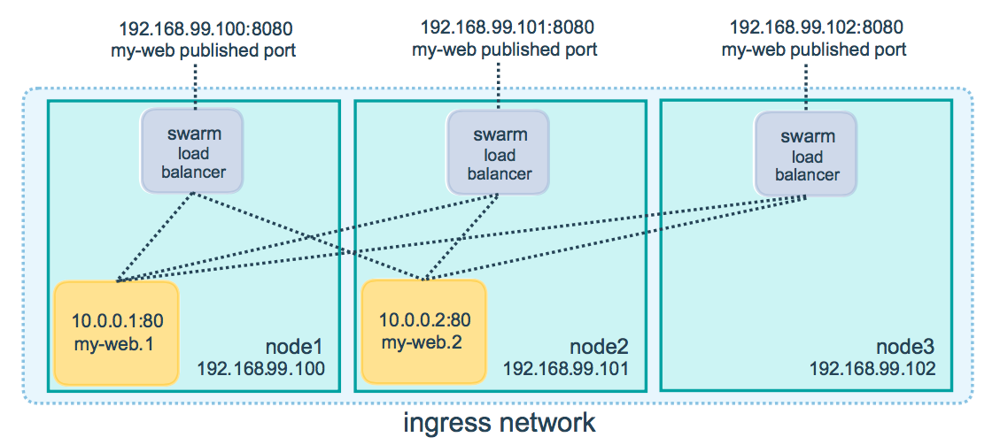

参考资料: 
- [Swarms](https://docs.docker.com/get-started/part4/)
- [Create a swarm](https://docs.docker.com/engine/swarm/swarm-tutorial/create-swarm/)

# Swarm 简介
`Swarm` 是一组运行了 `Docker` 的机器并加入到同一个集群，通过使用相同的命令，但这些命令由在该集群上被称作 **「集群管理员(Swarm Manager)」** 的机器执行。集群上的机器可以是物理主机，也可以是虚拟主机，在加入集群之后，它们统一称为**「节点(nodes)」**。

`Swarm Manager` 是唯一能够执行命令的主机，并且负责授权其他主机以 `worker` 身份加入到集群中，`worker` 仅提供集群容量，没有任何指挥其他主机的权限。`Swarm Manager` 可通过

- 「最小化节点」策略: 提取最为空闲的主机运行 `container`。
- 「全局化」策略: 确保集群中的每一个节点都运行一个指定的 `container`。

采用何种策略在 `docker-compose.yml` 文件中配置。

之前的案例都是以**「单机模式」**运行应用程序，`Docker` 可转换为**「集群模式」**，启用集群模式的主机将立即成为 `Swarm Manager`，自此之后，所有的命令都将作用于整个集群而非仅仅本地主机。

# 搭建 Docker 集群
执行 `docker swarm init` 便可启用集群模式便将当前主机作为 `Swarm Manager`。然后在另外一台主机执行 `docker swarm join` 命令以 `worker` 身份加入集群。

接下来以一个可由公网访问的 `Linux` 主机(`Aiur`) 作为 `Swarm Manager`，一台 Windows PC(`moby`) 作为 `Worker`:

> 可借助 `Docker Machine` 在一台第三方的主机执行 `docker-machine ssh <hostname> "<command>"` 远程连接到另外一台 `docker` 主机，并执行相应的命令，简单起见，这里统一采用本机执行命令的方式。有关 Docker Machine 的更多信息参考 [Docker Machine](/deployment/note-docker-machine)


1. 首先创建 `Swarm` 并暴露 `Manager` 的公网 ip 地址:
``` bash
$ docker swarm init --advertise-addr 192.168.99.100

Swarm initialized: current node (bsa93xks81o4ab971nv8ppzza) is now a manager.

To add a worker to this swarm, run the following command:

    docker swarm join --token SWMTKN-1-40lg4ocglu93sdfyp28nosqvrupjgmb4iv9cnxv46kcwdqvqtw-btzb7tu4ks5stfe0spf0x62ty 192.168.99.100:2377

To add a manager to this swarm, run 'docker swarm join-token manager' and follow the instructions.
```
`--advertise-addr` 配置 `Manager` 节点以 `192.168.99.100` 向外发布，其他主机或集群中的其他节点必须能够访问该地址，输出的内容包含了如何加入新的 `worker` 节点以及如何加入新的 `manager` 节点。`--token` 是加入集群的凭证。

> 2377 是 `Docker` 集群的默认管理端口，2376 是 Docker 守护进程的端口。

查看当前 `docker` 的状态:
```bash
$ docker info

# ...snip...
Swarm: active
 NodeID: bsa93xks81o4ab971nv8ppzza
 Is Manager: true
 ClusterID: s767fic8a9abaxq6n42d8vhd2
 Managers: 1
 Nodes: 1
# ...snip...
```
```bash
$ docker node ls

ID                            HOSTNAME            STATUS              AVAILABILITY        MANAGER STATUS      ENGINE VERSION
bsa93xks81o4ab971nv8ppzza *   Aiur                Ready               Active              Leader              18.03.1-ce
```

2. 将其他主机加入该节点
由创建集群提供的命令行代码将其他主机加入到节点:
```bash
docker swarm join --token SWMTKN-1-40lg4ocglu93sdfyp28nosqvrupjgmb4iv9cnxv46kcwdqvqtw-btzb7tu4ks5stfe0spf0x62ty 192.168.99.100:2377
This node joined a swarm as a worker.
```
执行 `docker node ls` 查看节点:
```bash
$ docker node ls

ID                            HOSTNAME            STATUS              AVAILABILITY        MANAGER STATUS      ENGINE VERSION
bsa93xks81o4ab971nv8ppzza *   Aiur                Ready               Active              Leader              18.03.1-ce
l1tat89t1ihfi04ad11mccsmi     moby                Ready               Active                                  17.09.1-ce
```
ID 后面的 `*` 表示当前连接的节点。

# 在集群上部署应用
现在，在 Swarm Manager 主机环境中执行在[Docker 初探 - Serivces](/deployment/note-docker-services) 中相同的命令 `docker stack deploy` 来部署应用:
``` bash
$ docker stack deploy -c docker-compose.yml getstartedlab

Creating network getstartedlab_webnet
Creating service getstartedlab_web
```
执行相同的命令来查看 service 中的 containers，与之前不同的是，5 份 container 的副本被分配到了集群的两个节点上 `Aiur` 和 `moby`。
```bash
$ docker stack ps getstartedlab

ID                  NAME                  IMAGE                       NODE                DESIRED STATE       CURRENT STATE                ERROR               PORTS
aumkvyzfh3oo        getstartedlab_web.1   frosthe/get-started:part2   moby                Running             Running about a minute ago
y82s9nuonx3p        getstartedlab_web.2   frosthe/get-started:part2   Aiur                Running             Running about a minute ago
yp2zx0bncv55        getstartedlab_web.3   frosthe/get-started:part2   moby                Running             Running about a minute ago
ul7f48j0grzy        getstartedlab_web.4   frosthe/get-started:part2   moby                Running             Running about a minute ago
jzn0fndpf206        getstartedlab_web.5   frosthe/get-started:part2   Aiur                Running             Running about a minute ago
```

# 访问集群
通过访问 `Aiur` 和 `moby` 两者的 ip 地址都可以访问应用程序，返回的 `Hostname` 轮流展示 5 个 container 的 ID。但这些 container 实例分别运行于两个节点上。

之所以访问任何一个节点的 ip 地址都可以到达应用程序是因为参与集群的节点共用**「入口路由网格」**，这保证了一个 `service` 在部署到集群的某个端口后，无论哪个节点正在运行或没有运行任何 `container` 实例，该端口都会保留给该 `service`。下图表示了一个名为 `my-web` 的服务在一个三节点的集群中发布 8080 端口:



> 要使入口路由网格正常运作，请确保集群中各个节点的以下端口是可访问的:
- 7946 TCP/UDP 端口用于发现 container 网络
- 4789 UDP 端口用于 ingress network


# 清理与重启
停止 `stack`:
```bash
$ docker stack rm getstartedlab

Removing service getstartedlab_web
Removing network getstartedlab_webnet
```
将节点主机从集群分离:
- `Worker`:
```bash
$ docker swarm leave
Node left the swarm.
```
- `Manager`:
```bash
$ docker swarm leave --force
Node left the swarm.
```