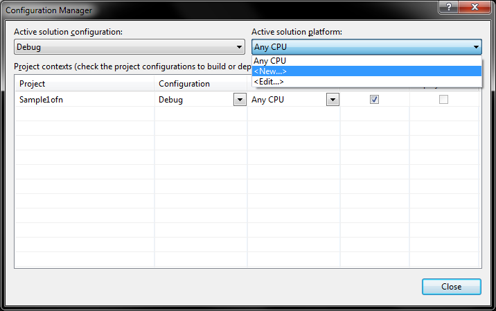
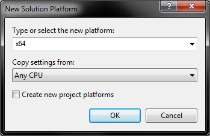
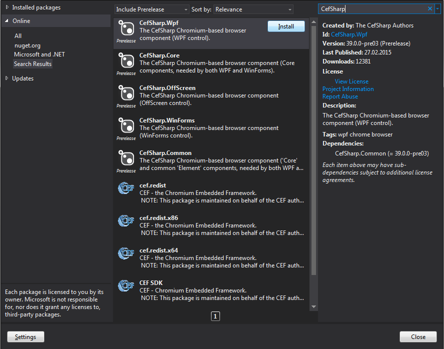

参考文档:
- [General Usage](https://github.com/cefsharp/CefSharp/wiki/General-Usage)
- [Display HTML in WPF and CefSharp Tutorial Part 1](https://www.codeproject.com/Articles/881315/Display-HTML-in-WPF-and-CefSharp-Tutorial-Part)

本文索引:
- [快速开始](#%E5%BF%AB%E9%80%9F%E5%BC%80%E5%A7%8B)
- [进程 Process](#%E8%BF%9B%E7%A8%8B-process)
- [线程 Threads](#%E7%BA%BF%E7%A8%8B-threads)
- [Initialize 和 Shutdown](#initialize-%E5%92%8C-shutdown)
    - [Initialize](#initialize)
    - [Shutdown](#shutdown)
- [配置](#%E9%85%8D%E7%BD%AE)
    - [CefSettings](#cefsettings)
    - [BrowserSettings](#browsersettings)
- [IBrowser，IFrame 和 IBrowserHost 对象](#ibrowseriframe-%E5%92%8C-ibrowserhost-%E5%AF%B9%E8%B1%A1)
- [Handlers](#handlers)
- [配置代理](#%E9%85%8D%E7%BD%AE%E4%BB%A3%E7%90%86)
- [请求上下文](#%E8%AF%B7%E6%B1%82%E4%B8%8A%E4%B8%8B%E6%96%87)
- [高 DPI 显示器支持](#%E9%AB%98-dpi-%E6%98%BE%E7%A4%BA%E5%99%A8%E6%94%AF%E6%8C%81)
- [Javascript 集成](#javascript-%E9%9B%86%E6%88%90)
    - [从 .NET 中调用 Javascript 方法](#%E4%BB%8E-net-%E4%B8%AD%E8%B0%83%E7%94%A8-javascript-%E6%96%B9%E6%B3%95)
    - [从 .NET 中调用带有返回结果的 Javascript 方法](#%E4%BB%8E-net-%E4%B8%AD%E8%B0%83%E7%94%A8%E5%B8%A6%E6%9C%89%E8%BF%94%E5%9B%9E%E7%BB%93%E6%9E%9C%E7%9A%84-javascript-%E6%96%B9%E6%B3%95)
    - [将一个 .NET 类型暴露给 Javascript](#%E5%B0%86%E4%B8%80%E4%B8%AA-net-%E7%B1%BB%E5%9E%8B%E6%9A%B4%E9%9C%B2%E7%BB%99-javascript)
        - [异步 Javascript Binding API](#%E5%BC%82%E6%AD%A5-javascript-binding-api)
        - [CefSharp.BindObjectAsync](#cefsharpbindobjectasync)
        - [CefSharp.DeleteBoundObject](#cefsharpdeleteboundobject)
        - [CefSharp.RemoveObjectFromCache](#cefsharpremoveobjectfromcache)
        - [CefSharp.IsObjectCached](#cefsharpisobjectcached)
        - [集成示例](#%E9%9B%86%E6%88%90%E7%A4%BA%E4%BE%8B)

## 快速开始
创建一个新的 WPF 项目，目标框架为 `.NET Framework 4.5.2`，本项目将使用 `CefSharp 3` 库，该库仅支持 `x86` 和 `x64` 应用程序，这意味着项目必须指定编译目标，不支持 `Any Cpu`。创建项目后，首先打开配置管理器，Solution -> Configuration Manager:

由默认 `Debug` 配置创建新的 `x86` 和 `x64` 的编译配置:

完成配置创建后，引入 `CefSharp.Wpf` Nuget 包:

现在，**保存所有更改并关闭 Visual Studio**，因为 CefSharp 需要完全重启以加载其依赖项。重启打开 `Visual Studio` 项目，编译。

## 进程 Process
`CEF` 运行时包含多个进程
- `browser` 进程: 主进程，负责创建窗口，渲染和网络访问，该进程大部分情况下等同于「宿主应用程序」所在的进程，且执行大部分逻辑。
- `render` 进程: 渲染和与 `Javascript` 交互(如 JS 对象绑定)由另一个 `render` 进程处理，进程模型将会为每一个单独的 `Origin`([scheme] + [domain]) 开辟一个 `render` 进程。
- `plugin` 进程: 负责处理诸如 `Flash` 等插件
- `gpu` 进程: 处理渲染加速等

___
## 线程 Threads
不同级别的进程可管理多个线程，`browser` 进程包含了以下线程:
- UI 线程: `browser` 进程的主线程，默认情况下 `CefSharp` 使用 `setting.MultiThreadedMessageLoop = true` 设置，这使得 `CEF` 的 UI 线程与宿主应用程序的 UI 线程使用不同的线程。
- IO 线程: 在 `browser` 进程中负责处理 IPC 和网络消息
- File 线程: 在 `browser` 进程中负责与「文件系统」交互
- Renderer 线程: `render` 进程的主线程

___
## Initialize 和 Shutdown
### Initialize
`Initialize` 方法仅允许每个应用程序调用一次，该方法用于初始化底层 `CEF` 库，可以显式或隐式的调用该方法:
- 隐式调用: 首次创建 `ChromiumWebBrowser` 实例时，将检查 `CEF` 是否已被初始化，如果没有，则使用默认配置调用初始化方法
- 显式调用: 当希望指定自定义配置时，可显式调用 `CEF.Initialize(CefSettings settings)` 方法

### Shutdown
`ChromiumWebBrowser` 的 WPF 和 Winform 的实现都在对应的 `Exit` 事件中默认调用了 `Shutdown` 方法。要禁用这一行为，可在任一 `ChromiumWebBrowser` 实例创建之前设置 `CefSharpSettings.ShutdownOnExit = false`。

> `Initialize` 和 `Shutdown` 都必须在应用程序的主线程中调用，如果在另外的线程中调用它们，应用程序将会挂起。

在 `CefSharp.OffScreen` 应用中，在应用程序退出前必须显式调用 `Cef.Shutdown()` 方法。

___
## 配置
### CefSettings
`CefSettings` 覆盖了应用程序级别的配置，一些常见的配置包括:
- `BrowserSubprocessPath `: 启用子进程的路径，通常不建议更改
- `MultiThreadedMessageLoop`: 默认为 `true`，也可以设置为 `false` 并将 `Cef` 集成至现有应用程序的消息泵中，参考 https://github.com/cefsharp/CefSharp/issues/1748
- `CommandLineArgsDisabled`: 设置为 `true` 以禁用使用标准的 `Chromium` 命令行参数控制浏览器行为
- `CachePath`: 缓存数据在本机上存放的路径，若为空，则使用临时缓存和内存缓存。仅当该设置不为空时，HTML5 数据库(如 `localStorage`)才会被持久化
- `Locale`: 传给 Blink 的本地化信息，`en-US` 为默认值，可由命令行参数 `lang` 控制
- `LogFile`: Debug 日志使用的持久化目录与文件名。`./debug.log` 为默认值。可由命令行参数 `log-file` 控制
- `LogSeverity`: 类似于 LogLevel，仅当等于或高于该级别的日志将会记录，可由 `log-severity` 命令行参数控制，可接收 `verbose`、`info`、`warning`、`error`、`error-report` 和 `disabled` 值。
- `ResourceDirPath`: 资源路径，可由 `resources-dir-path` 命令行参数控制
- `LocalesDirPath`: 本地化信息路径，可由 `locales-dir-path` 命令行参数控制
- `RemoteDebuggingPort`: 可在 1024 - 65535 之间取值，用以启用远程调试，可由另一个 CEF 或谷歌浏览器访问，可由 `remote-debugging-port` 命令行参数控制。

### BrowserSettings
`BrowserSettings` 覆盖 `ChromiumWebBrowser` 实例级别的配置，具体参考 `BrowserSettings` 类型
___

## IBrowser，IFrame 和 IBrowserHost 对象
`IBrowser` 和 `IFrame` 对象用于向浏览器发送命令及从回掉函数中接收状态信息，每一个 `IBrowser` 对象都至少包含一个 `IFrame` 对象代表顶层窗口。即，如果一个浏览器窗口加载了两个 `<iframe>` 元素将会包含 3 个 `IFrame` 对象(一个顶层 IFrame 和两个 `<iframe>`)。

在一个 `IBrowser` 对象中加载 url:
```csharp
browser.MainFrame.LoadUrl(url);
```
`IBrowserHost` 代表更底层的浏览器方法，例如:
- `Print()`
- `ShowDevTools()`
- `CloseDevTools()`
- `StartDownload(string url)`

___

## Handlers
`CefSharp` 提供了一系列 `Handler` 对象，这些对象以 .NET 实现封装了浏览器的常见行为和事件。例如，当需要知道一个页面是否加载完成时，可侦听 `LoadingStateChanged` 事件。多数 `Handler` 的方法都提供了异步实现，所有 `Handler` 都遵循一个实现模式: 返回 `bool` 的方法意味着询问你是否需要自行处理，返回 `false` 表示使用默认实现，返回 `true` 表示由开发人员提供自定义实现。`IWebBrowser` 定义了以下常见的 `IXXXHandler`:
- `IDownloadHandler`: 下载文件，进度通知，暂停，取消等
- `IRequestHandler`: 处理导航、重定向、资源加载通知等
- `IDialogHandler`: 文件对话框通知
- `IDisplayHandler`: 地址栏变更，状态信息，控制台信息，全屏模式更改通知等
- `ILoadHandler`: 加载状态信息、事件，弹出框通知信息
- `ILifeSpanHandler`: 弹出框弹出及关闭事件
- `IKeyboardHandler`: 键盘事件
- `IJsDialogHandler`: javascript 消息框/弹出框
- `IDragHandler`: 拖拽事件
- `IContextMenuHandler`: 定制右键菜单
- `IFocusHandler`: 焦点相关通知
- `IResourceHandlerFactory`: 拦截资源请求相关
- `IGeolocationHandler`: 地理位置请求相关
- `IRenderProcessMessageHandler`: 从 `render` 进程发送的自定义 `CefSharp` 消息相关
- `IFindHandler`: 与查找通知相关

通常，使用定制化的 `Handler` 需要在创建 `ChromiumWebBrowser` 之后立即对相应的 `Handler` 赋值:
```csharp
browser.DownloadHandler = new DownloadHandler();
```
各个 `Handler` 的具体用法参见 [Handlers](https://github.com/cefsharp/CefSharp/wiki/General-Usage#handlers)

___

## 配置代理
`CEF` 遵循使用同样的命令行命令来设置代理，如果代理有认证要求，可通过 `IRequestHandler.GetAuthCredentials()` 方法提供。

___

## 请求上下文
请求上下文(`RequestContext`)用于隔离 `IBrowser` 实例，包括可提供单独的缓存路径、单独的代理配置、单独的 `Cookie` 管理器及其他相关设置。`RequestContext` 有以下关键点:
- 默认情况下，提供一个全局 `RequestContext`，由多个 `IBrowser` 实例共享设置
- 可在运行时通过 `Preferences` 更改某些设置，这种情况下不要使用命令行工具
- Winform 在创建 `IBrowser` 实例之后立即设置 `RequestContext`；`OffScreen` 则须将 `RequestContext` 作为构造函数参数传入；WPF 则在 InitialComponent() 方法之后设置
- Plugin 加载通知通过 `IRequestContextHandler` 接口处理
- 设置 `RequestContextSettings.CachePath` 以持久化 `Cookie`，`localStorage` 等数据

___

## 高 DPI 显示器支持
如果应用程序经常显示为黑屏，则很有可能需要开启「高 DPI」支持。要启用「高 DPI」支持，需要在对应应用程序的 `app.manifest` 文件中加入相应的节点以通知 Windows 该程序支持「高 DPI」，
- WinForm: 加入 `app.manifest` 并在第一时间调用 `Cef.EnableHighDPISupport()`
- WPF: 加入 `app.manifest`
- OffScreen: 加入 `app.manifest`

`app.manifest` 类似于以下内容:
```xml
<asmv3:application>
  <asmv3:windowsSettings xmlns="http://schemas.microsoft.com/SMI/2005/WindowsSettings">
    <dpiAware>true/PM</dpiAware>
  </asmv3:windowsSettings>
</asmv3:application>
```
___

## Javascript 集成
### 从 .NET 中调用 Javascript 方法
`Javascript` 方法仅能在一个 `V8Context` 中执行，`IRenderProcessMessageHandler.OnContextCreated` 和 `IRenderProcessMessageHandler.OnContextReleased` 为 `Javascript` 代码的执行划定了一个清晰的边界。通常:
- `Javascript` 在 `Frame` 级别执行，每个页面至少包含一个 `Frame`
- `IWebBrowser.ExecuteScriptAsync` 方法保留下来用于向后兼容，该方法可作为快速执行 `Javascript` 方法的入口
- `OnFrameLoadStart` 事件触发时 `DOM` 还没有加载完成
- `IRenderProcessMessageHandler.OnContextCreated` 和 `IRenderProcessMessageHandler.OnContextReleased` 仅在主 `Frame` 上触发。

```csharp
browser.RenderProcessMessageHandler = new RenderProcessMessageHandler();

public class RenderProcessMessageHandler : IRenderProcessMessageHandler
{
  // Wait for the underlying JavaScript Context to be created. This is only called for the main frame.
  // If the page has no JavaScript, no context will be created.
  void IRenderProcessMessageHandler.OnContextCreated(IWebBrowser browserControl, IBrowser browser, IFrame frame)
  {
    const string script = "document.addEventListener('DOMContentLoaded', function(){ alert('DomLoaded'); });";

    frame.ExecuteJavaScriptAsync(script);
  }
}

//Wait for the page to finish loading (all resources will have been loaded, rendering is likely still happening)
browser.LoadingStateChanged += (sender, args) =>
{
  //Wait for the Page to finish loading
  if (args.IsLoading == false)
  {
    browser.ExecuteJavaScriptAsync("alert('All Resources Have Loaded');");
  }
}

//Wait for the MainFrame to finish loading
browser.FrameLoadEnd += (sender, args) =>
{
  //Wait for the MainFrame to finish loading
  if(args.Frame.IsMain)
  {
    args.Frame.ExecuteJavaScriptAsync("alert('MainFrame finished loading');");
  }
};
```

### 从 .NET 中调用带有返回结果的 Javascript 方法
如果希望调用一个带有返回结果的 Javascript 方法，使用 `Task<JavascriptResponse> EvaluateScriptAsync(string script, TimeSpan? timeout)`，Javascript 异步执行并最终返回一个 `JavascriptResponse` 类型的实例，包含错误消息，执行结果和是否成功的标志。
```csharp
// Get Document Height
var task = frame.EvaluateScriptAsync("(function() { var body = document.body, html = document.documentElement; return  Math.max( body.scrollHeight, body.offsetHeight, html.clientHeight, html.scrollHeight, html.offsetHeight ); })();", null);

task.ContinueWith(t =>
{
    if (!t.IsFaulted)
    {
        var response = t.Result;
        EvaluateJavaScriptResult = response.Success ? (response.Result ?? "null") : response.Message;
    }
}, TaskScheduler.FromCurrentSynchronizationContext());
```

> 返回结果的类型仅支持基元类型，如 `int`，`bool`，`string` 等，目前还没有一个合适的方法将 `Javascript` 类型映射为一个 .NET 类型，但可借助 `JSON.toStringify()` 返回 JSON 字符串的形式来组织复杂类型，之后在 .NET 中利用 JSON.NET 将该字符串反序列化为相应的类型。

### 将一个 .NET 类型暴露给 Javascript
Javascript 绑定(JSB)实现了 `Javascript` 和 `.NET` 之间的通信，目前该方法提供了异步和同步版本的实现
#### 异步 Javascript Binding API
- 利用 `Native Chromium IPC` 在 `browser` 进程和 `render` 进程之间传递数据，非常快速
- 仅支持 .NET 方法，属性的 `Get/Set` 不能以异步模型完成绑定
- 方法可返回基元类型，结构和复杂类型，这些类型仅属性被传递自 `Javascript`，可将其看作 DTO
- 通过 `IJavascriptCallback` 接口支持 `Javascript` 回调函数
- 异步模型返回一个标准的 `Javascript Promise`

`CefSharp` 提供了 `Javascript` 对象 `CefSharp` 以支持 JSB，`CefSharp.BindObjectAsync()` 方法返回一个 `Promise` 对象，并在绑定对象可用时解析该对象，绑定的对象在全局上下文(`window` 对象的属性)创建。

#### CefSharp.BindObjectAsync
`CefSharp.BindObjectAsync(objectName, settings)` 绑定对象:
```javascript
async function bindBridgeObject(){
    await CefSharp.BindObjectAsync(objectName, settings);
}
```
`settings` 由以下两个属性:
- `NotifyIfAdlreadyBound`: 若为 `true` 则触发 .NET `IJavascriptObjectRepository.ObjectBoundInJavascript` 事件，默认值 true
- `IgnoreCache`: 若为 true，则忽略本地缓存

返回一个 `JavaScript Promise` 对象。

#### CefSharp.DeleteBoundObject
`CefSharp.DeleteBoundObject(objectName)`，删除匹配名称匹配的绑定对象:
```javascript
CefSharp.DeleteBoundObject("boundAsync");
```
返回 `true/false`
#### CefSharp.RemoveObjectFromCache
`CefSharp.RemoveObjectFromCache(objectName)`，从缓存中移除匹配名称的绑定对象:
```javascript
CefSharp.RemoveObjectFromCache("boundAsync");
```
#### CefSharp.IsObjectCached
`CefSharp.IsObjectCached(objectName)` 检查指定名称的对象是否被缓存:
```javascript
CefSharp.IsObjectCached("boundAsync") === true;
```
返回 `true/false`

#### 集成示例
1. 在 .NET 中创建一个将要暴露给 `Javascript` 的类型:
```csharp
public class BoundObject
{
    public class AsyncBoundObject
    {
        public void Error()
        {
            throw new Exception("This is an exception coming from C#");
        }
	
        public int Div(int divident, int divisor)
        {
            return divident / divisor;
        }
    }
}
```
2. 将上述类型的实例注册至 `IBrowser.JavascriptObjectRepository`:
```csharp
            // set ConcurrentTaskExecution to true if you want do concurrent jobs at one time.
            CefSharpSettings.ConcurrentTaskExecution = true;
            
            browser.JavascriptObjectRepository.ResolveObject += (sender, e) =>
            {
                var repo = e.ObjectRepository;
                if (e.ObjectName == "bridge")
                {
                    var boundObject = new ServiceBridge();
                    var bindingOptions = new BindingOptions();
                    repo.Register("bridge", boundObject, isAsync: true, options: bindingOptions);
                }
            };
```
3. 在 `Javascript` 中调用 `CefSharp.BindObjectAsync()` 方法解析绑定对象:
```javascript
    await CefSharp.BindObjectAsync("boundAsync");

	boundAsync.div(16, 2).then(function (actualResult)
	{
        alert("Calculated value from calling .NET Object: " + actualResult);
	});
```

在 .NET 中接收绑定成功事件:
```csharp
browser.JavascriptObjectRepository.ObjectBoundInJavascript += (sender, e) =>
{
	var name = e.ObjectName;

	Debug.WriteLine($"Object {e.ObjectName} was bound successfully.");
};    
```