参考资料:
- [Github - eShopOnContainers](https://github.com/dotnet-architecture/eShopOnContainers)
- [eShopOnContainers 知多少[1]：总体概览](https://mp.weixin.qq.com/s/sQ8QBKhSIJ6YfX3Ri-NfCA)

本文索引:
- [eShopOnContainers](#eshoponcontainers)
- [架构风格与架构模式](#%E6%9E%B6%E6%9E%84%E9%A3%8E%E6%A0%BC%E4%B8%8E%E6%9E%B6%E6%9E%84%E6%A8%A1%E5%BC%8F)
- [为何选择 CQRS](#%E4%B8%BA%E4%BD%95%E9%80%89%E6%8B%A9-cqrs)
  - [简单实现 CQRS](#%E7%AE%80%E5%8D%95%E5%AE%9E%E7%8E%B0-cqrs)
- [设计与实现面向 DDD 的 Ordering 服务](#%E8%AE%BE%E8%AE%A1%E4%B8%8E%E5%AE%9E%E7%8E%B0%E9%9D%A2%E5%90%91-ddd-%E7%9A%84-ordering-%E6%9C%8D%E5%8A%A1)
  - [实体](#%E5%AE%9E%E4%BD%93)
  - [值对象](#%E5%80%BC%E5%AF%B9%E8%B1%A1)
  - [聚合](#%E8%81%9A%E5%90%88)
  - [聚合根或根实体](#%E8%81%9A%E5%90%88%E6%A0%B9%E6%88%96%E6%A0%B9%E5%AE%9E%E4%BD%93)
- [实现 .NET Core 的域模型微服务](#%E5%AE%9E%E7%8E%B0-net-core-%E7%9A%84%E5%9F%9F%E6%A8%A1%E5%9E%8B%E5%BE%AE%E6%9C%8D%E5%8A%A1)
  - [在 .NET Standard 库中构建域模型](#%E5%9C%A8-net-standard-%E5%BA%93%E4%B8%AD%E6%9E%84%E5%BB%BA%E5%9F%9F%E6%A8%A1%E5%9E%8B)
  - [在实体中封装数据](#%E5%9C%A8%E5%AE%9E%E4%BD%93%E4%B8%AD%E5%B0%81%E8%A3%85%E6%95%B0%E6%8D%AE)
  - [SeedWork(域模型中可重用的基类型及接口)](#seedwork%E5%9F%9F%E6%A8%A1%E5%9E%8B%E4%B8%AD%E5%8F%AF%E9%87%8D%E7%94%A8%E7%9A%84%E5%9F%BA%E7%B1%BB%E5%9E%8B%E5%8F%8A%E6%8E%A5%E5%8F%A3)
    - [IAggregateRoot 接口](#iaggregateroot-%E6%8E%A5%E5%8F%A3)
    - [实体基类](#%E5%AE%9E%E4%BD%93%E5%9F%BA%E7%B1%BB)
    - [仓储接口](#%E4%BB%93%E5%82%A8%E6%8E%A5%E5%8F%A3)
    - [值对象实现](#%E5%80%BC%E5%AF%B9%E8%B1%A1%E5%AE%9E%E7%8E%B0)
    - [使用可枚举类型替代 C# 原生枚举类型](#%E4%BD%BF%E7%94%A8%E5%8F%AF%E6%9E%9A%E4%B8%BE%E7%B1%BB%E5%9E%8B%E6%9B%BF%E4%BB%A3-c-%E5%8E%9F%E7%94%9F%E6%9E%9A%E4%B8%BE%E7%B1%BB%E5%9E%8B)
    - [在域模型中定义及实现验证](#%E5%9C%A8%E5%9F%9F%E6%A8%A1%E5%9E%8B%E4%B8%AD%E5%AE%9A%E4%B9%89%E5%8F%8A%E5%AE%9E%E7%8E%B0%E9%AA%8C%E8%AF%81)
- [设计及实现领域事件](#%E8%AE%BE%E8%AE%A1%E5%8F%8A%E5%AE%9E%E7%8E%B0%E9%A2%86%E5%9F%9F%E4%BA%8B%E4%BB%B6)
  - [实现域事件](#%E5%AE%9E%E7%8E%B0%E5%9F%9F%E4%BA%8B%E4%BB%B6)
  - [发布域事件](#%E5%8F%91%E5%B8%83%E5%9F%9F%E4%BA%8B%E4%BB%B6)
  - [跨聚合单一事务还是多事务最终一致性](#%E8%B7%A8%E8%81%9A%E5%90%88%E5%8D%95%E4%B8%80%E4%BA%8B%E5%8A%A1%E8%BF%98%E6%98%AF%E5%A4%9A%E4%BA%8B%E5%8A%A1%E6%9C%80%E7%BB%88%E4%B8%80%E8%87%B4%E6%80%A7)
  - [映射事件至事件处理器](#%E6%98%A0%E5%B0%84%E4%BA%8B%E4%BB%B6%E8%87%B3%E4%BA%8B%E4%BB%B6%E5%A4%84%E7%90%86%E5%99%A8)
  - [域事件可以生成集成事件跨越服务边界](#%E5%9F%9F%E4%BA%8B%E4%BB%B6%E5%8F%AF%E4%BB%A5%E7%94%9F%E6%88%90%E9%9B%86%E6%88%90%E4%BA%8B%E4%BB%B6%E8%B7%A8%E8%B6%8A%E6%9C%8D%E5%8A%A1%E8%BE%B9%E7%95%8C)
- [实现基础设施持久化层](#%E5%AE%9E%E7%8E%B0%E5%9F%BA%E7%A1%80%E8%AE%BE%E6%96%BD%E6%8C%81%E4%B9%85%E5%8C%96%E5%B1%82)
  - [每个聚合定义一个仓储](#%E6%AF%8F%E4%B8%AA%E8%81%9A%E5%90%88%E5%AE%9A%E4%B9%89%E4%B8%80%E4%B8%AA%E4%BB%93%E5%82%A8)

## eShopOnContainers
[eShopOnContainers](https://github.com/dotnet-architecture/eShopOnContainers) 是微软官方推出的基于 .NET Core 和 Docker 实现的一整套微服务架构体系的参考项目，以下简称「参考项目」。其各个子系统的复杂度迥异，因此文章一再强调不要把一个子系统的架构模式应用在所有系统上，本文主要提取了该书对 `Ordering` 子系统的实现思路。在阅读这些内容之前，我们至少应该对以下概念有所了解:
- [领域驱动设计](/categories/Domain-Driven-Design/)的基本概念
- [CQRS](/architecture-cqrs)
- [Repository 模式](/architecture-repository-pattern/)
- [Mediator 模式](/architecture-mediator-pattern/)

## 架构风格与架构模式
无论是 CQRS 还是 DDD，都不是「架构风格(architecture styles)」，它们是「架构模式(architecture patterns)」，微服务，SOA，事件驱动架构是「架构风格」，而「架构模式」描述了一个子系统或组件的构建方式。不同的有界上下文应该采用不同的「架构模式」。

在实际介绍 DDD 之前，文章用了大量篇幅论述了有关 CQRS(Command and Query Responsibility Segregation) 的方法论。

## 为何选择 CQRS
CQRS 是一种分离读写数据的架构模式，以下是 **Bertrand Meyer** 在其著作 **Object Oriented Software Construction** 首次对对两者的定义:
- Queries: 返回结果但不改变系统的状态，无副作用(These return a result and do not change the state of the system, and they are free of side effects.)
- Commands: 改变系统的状态(These change the state of a system.)

在参考项目的实现中，其高层视图为:
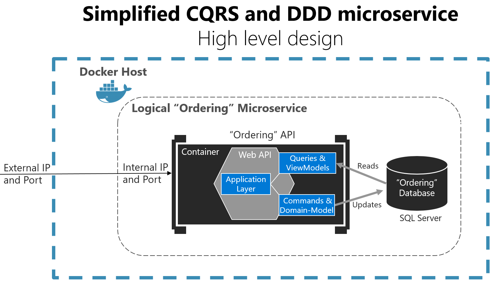
简单起见，参考项目的「读」和「写」操作同一个数据库，但核心的思路是，「读」被处理成一种非常轻量的「幂等」操作；而「写」则暗示系统的状态变化，这意味着在处理「写」操作时要格外小心，任何业务规则的变化都可能引起一系列域模型的改变。因此，查询通常伴随着 ViewModels，命令则与域模型息息相关，将两者进行分离的目的在于**将查询以及如何组装视图数据从域模型对事务及数据更新的限制条件中独立出来**。

### 简单实现 CQRS
参考项目的实现方法非常简单:
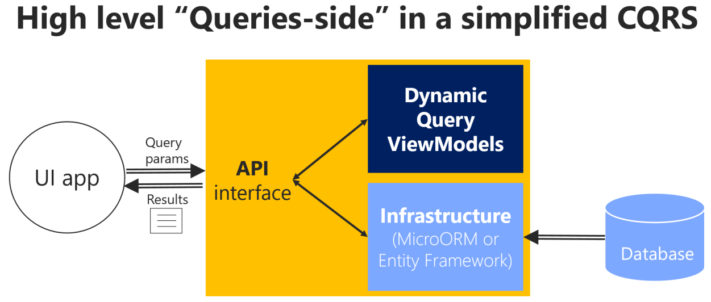
图中的 `API Interface` 代表了 `Ordering.API` ASP.NET Core 项目，其 `Controllers` 直接调用 `Infrastructure` 中的 ORM 对象(这里是 Dapper)，再以 `dynamic` 类型作为 ViewModel 返回结果，其结构及源代码如下:
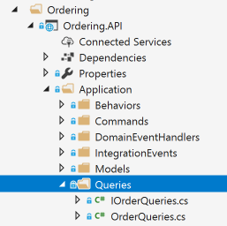
```csharp
    public interface IOrderQueries
    {
        Task<Order> GetOrderAsync(int id);
    }

    public class OrderQueries : IOrderQueries
    {
        ...
        public async Task<Order> GetOrderAsync(int id)
        {
            using (var connection = new SqlConnection(_connectionString))
            {
                connection.Open();

                var result = await connection.QueryAsync<dynamic>(
                   @"select o.[Id] as ordernumber,o.OrderDate as date, o.Description as description,
                        o.Address_City as city, o.Address_Country as country, o.Address_State as state, o.Address_Street as street, o.Address_ZipCode as zipcode,
                        os.Name as status, 
                        oi.ProductName as productname, oi.Units as units, oi.UnitPrice as unitprice, oi.PictureUrl as pictureurl
                        FROM ordering.Orders o
                        LEFT JOIN ordering.Orderitems oi ON o.Id = oi.orderid 
                        LEFT JOIN ordering.orderstatus os on o.OrderStatusId = os.Id
                        WHERE o.Id=@id"
                        , new { id }
                    );

                if (result.AsList().Count == 0)
                    throw new KeyNotFoundException();

                return MapOrderItems(result);
            }
        }
    }

```
值得注意的是:
1. 这里的 `OrderQueries` 类型直接在 `Ordering.API` 项目中实现，在哪一层实现并不重要，**重点在于，用于表现层的数据可能来自于数据库不同的表，这些数据可能分属于不同的域对象，然而 Query 本身绕过了整个域模型而直接从数据库表提取数据**，这解释了前文提及的**查询独立于域模型的限制**，这种方式为开发人员在更新查询时提高了灵活性和生产力。
2. 这里直接以 `dynamic` 动态类型作为返回结果，但这不是必须的，传统上我们习惯创建对应的 `ViewModel` 静态类型。返回动态类型的好处在于，当为数据表增减列或修改列名时，无需在静态类型同步这些改变，这也暗示了这些类型仅仅是服务于表现层的数据包装，它们只是 DTO。但也存在缺点，比如无法对返回类型进行版本控制，无法自动集成 `Swashbuckle` 等。

___
## 设计与实现面向 DDD 的 Ordering 服务
面对复杂性，聚合根必须确保所有处理不变性和业务规则的逻辑都经过统一的入口(聚合根实体)与关联的实体进行交互，下图展示了 `Ordering` 服务以 DDD 实现划分的不同的层以及它们的依赖关系:
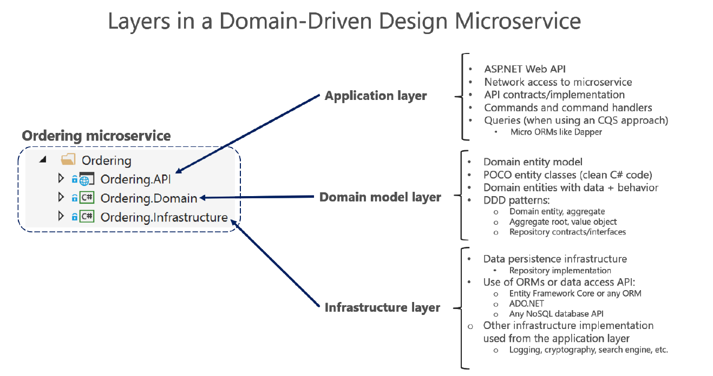
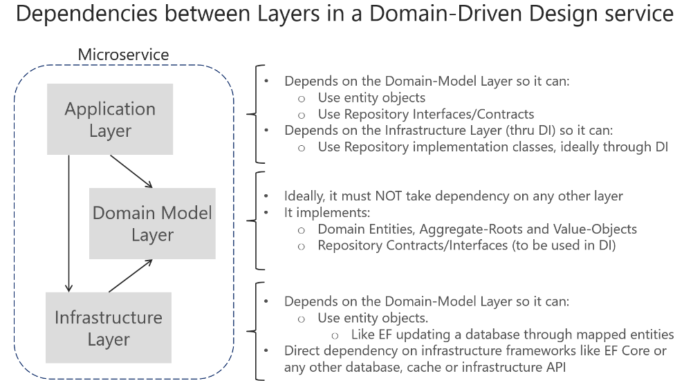

### 实体
域实体主要由其身份标识、连续性和持久化定义，实体的标识可跨越多个有界上下文或微服务。实体实现其代表的业务规则和读写状态数据，但并非所有实体都必须包含逻辑，这些实体通常都是一个聚合中的子实体，因为多数逻辑都在聚合根中实现。相反，如果大量逻辑放置在服务层(传统项目中的业务逻辑层)中，最终将导致贫血模型。
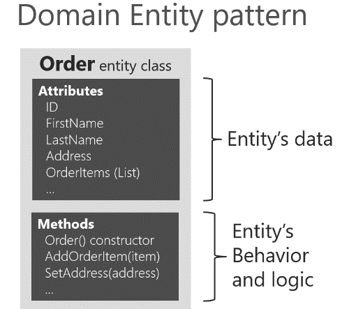
然而，如果业务场景非常简单，看上去像是贫血模型的域模型也是足够的，重点在于，创建这些模型的出发点是为了便于「数据映射」还是「领域驱动」。两者的区别在于，「数据映射」仅仅从持久化的角度考虑，而忽略了模型在业务领域中代表的概念。根据业务复杂度选用合适的架构模式非常重要，这也是为何参考项目中的 `Catalog` 微服务以「数据驱动」模式实现而 `Ordering` 微服务以「领域驱动」模式实现。实体的详细描述可参考[这里](/ddd-tactical-entity/)。 

### 值对象
值对象不包含身份标识，其仅为一组数据的「逻辑集合」，有关值对象的详细描述可参考[这里](/ddd-tactical-value-object/)。
### 聚合
聚合描述了一系列或一组高度内聚的实体和行为，定义聚合通常以事务作为边界，一个典型的例子为: 一个 `Order`，通常包含一个 `Item` 列表，`Item` 通常被定义为**实体**，但 `Item` 是 `Order` 聚合的子实体，并将 `Order` 实体作为其根实体，而类似 `Order` 这样的**实体**通常被称为「聚合根」。聚合表示了一组必须维持「事务一致性」的对象，识别聚合通常由一个业务概念开始，并考虑在其事务边界内所需的所有实体。考虑「事务性边界」通常是识别一个聚合的起点。

### 聚合根或根实体
一个「聚合」至少由一个「实体」组成——聚合根，它可能包含多个子实体、值对象。**聚合根最重要的职责是确保聚合边界内的一致性，它必须是修改聚合的唯一入口**。下图展示了 `Buyer` 聚合和 `Odrer` 聚合，包括它们的聚合根实体、子实体及值对象
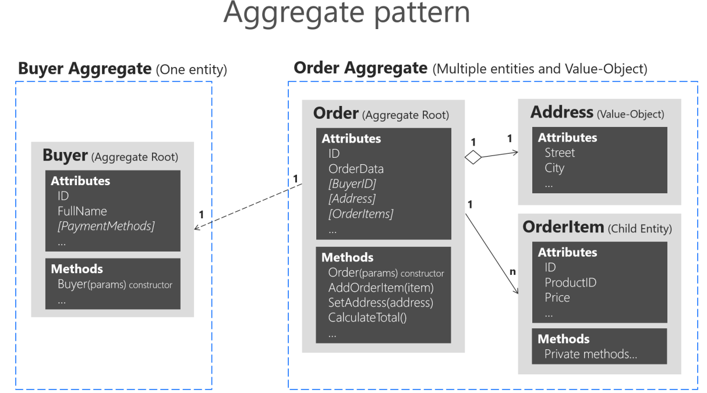
`Buyer` 代表了只包含一个实体的聚合。为了在聚合之间维持清晰的边界，一个最佳实践是禁止在一个聚合中直接引用另一个聚合，转而利用外键进行引用。如下代码中，`Order` 实体仅包包了一个 `Buyer` 聚合的外键，而非对象引用:
```csharp
public class Order : Entity, IAggregateRoot
{
private DateTime _orderDate;
public Address Address { get; private set; }
private int? _buyerId; //FK pointing to a different aggregate root
public OrderStatus OrderStatus { get; private set; }
private readonly List<OrderItem> _orderItems;
public IReadOnlyCollection<OrderItem> OrderItems => _orderItems;
//… Additional code
}
```
___
## 实现 .NET Core 的域模型微服务
有了前文对概念理论的解释，接下来，将探索基于 ASP.NET Core 实现以 DDD 设计的 Ordering 服务。

### 在 .NET Standard 库中构建域模型
首先来看参考项目的 `Ordering` 工程的文件组织：
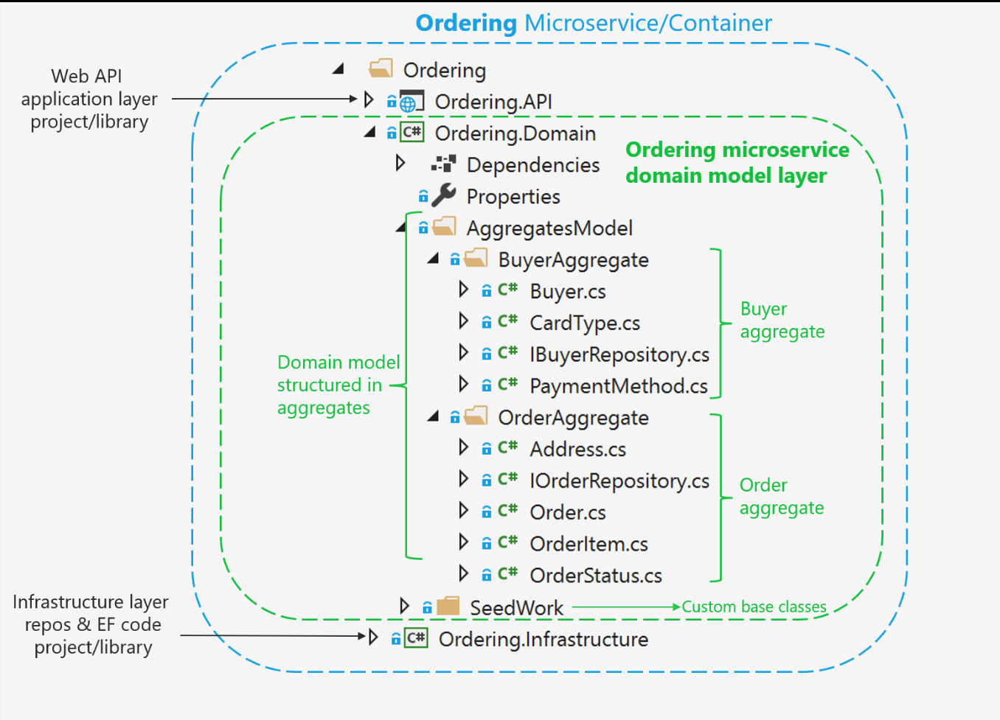
`Order` 和 `Buyer` 两个聚合所包含的实体和值对象均位于其对应的目录下，同时:
- 聚合中包含了 `IRepository` 接口，这些接口的实现必须放置在域模型之外的层——基础设施层，这样与基础设施有关的实现不至于污染域模型
- `SeedWork` 目录包含了定义实体及值对象的基类

深入 `Order` 聚合，可以清晰的看出为了维持事务边界，聚合所包含的不同职责的类型:
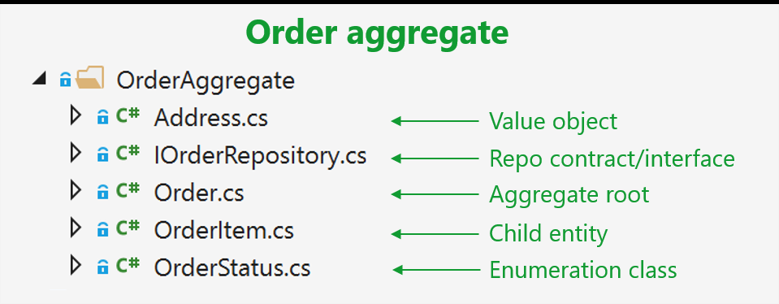
打开其中任何一个类型，无论是实体，值对象还是枚举类型，都继承自 `SeedWork` 文件夹下的类型，关于这些基类的实现，我们稍后会详述。

### 在实体中封装数据
实体中一个常见的问题是，他们暴露了一些 `public` 的 `Collection` 类型，消费这些类型的开发人员不经意间可能会修改集合的元素，这种情况就会绕过集合本身所代表的业务规则，从而导致对象保持无效的状态。为了避免类似情况，可以将集合类型定义为 `IReadOnlyCollection`，并显式暴露修改集合的方法。
```csharp
public IReadOnlyCollection<OrderItem> OrderItems {get; private set;};
public void AddOrderItem(productId, productName, pictureUrl, unitPrice, discount, units);
...
```
`AddOrderItem` 定义在 `Order` 聚合根中，其实现会包含验证，创建等与业务规则相关的逻辑(特别是与该集合中其他元素有关的逻辑)。另一方面，实体类型不应该将任何 `Setter` 方法暴露出来，**修改实体状态应该由显式定义的描述业务规则的方法完成**。

### SeedWork(域模型中可重用的基类型及接口)
`Seedwork` 是由 **Michael Feathers** 提出，并由 **Martin Fowler** 推广的用于概括这些类型的名称，也可以自行将其命名为 `Common`，`SharedKernel` 等。下图展示了 `Ordering` 域模中这些基类及接口:
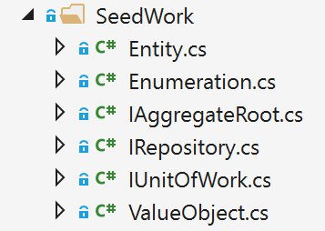

#### IAggregateRoot 接口
一个空接口，仅用于标记某些实体为聚合根，实现了该接口的实体通常意味着保持业务逻辑一致性的逻辑都实现在该实体中，所有子实体的创建或更新都必须经过该类型。

#### 实体基类
查看 `Entity` 类型，定义了 `ID`，相等性比较器方法，域事件列表等。关于域事件将在后文中详述。

#### 仓储接口
将接口定义于域模型中遵循了抽象与实现分离的模式，同时仓储又结合了 CQRS 模式，仅是对聚合的「增删改」操作。

#### 值对象实现
唯一标识是实体及聚合用于身份跟踪的基础，而系统中还存在着大量无需进行标识及跟踪的对象和数据集合，它们是值对象。值对象可以引用实体，例如，一个程序生成了一个从 A 点至 B 点的路线，该「路线」是一个值对象，但它会引用 A 点和 B 点，A 点和 B 点则可能是代表「城市」或「街道」的实体类型。值对象是两个特征:
- 无需身份标识
- 不变性

以上特性意味着在实现值对象基类时，仅需考虑以它们的值来区别不同的对象。

#### 使用可枚举类型替代 C# 原生枚举类型
在 `SeedWork` 目录下有一个 `Enumeration` 的抽象类，其定义如下:
```csharp
public abstract class Enumeration : IComparable
{
    public string Name { get; private set; }
    public int Id { get; private set; }
    protected Enumeration(){ }
    protected Enumeration(int id, string name)
    {
        Id = id;
        Name = name;
    }

    public override string ToString() => Name;
    public static IEnumerable<T> GetAll<T>() where T : Enumeration
    {
        var fields = typeof(T).GetFields(BindingFlags.Public |
        BindingFlags.Static |
        BindingFlags.DeclaredOnly);
        return fields.Select(f => f.GetValue(null)).Cast<T>();
    }

    public override bool Equals(object obj)
    {
        var otherValue = obj as Enumeration;
        if (otherValue == null)
            return false;
        var typeMatches = GetType().Equals(obj.GetType());
        var valueMatches = Id.Equals(otherValue.Id);
        return typeMatches && valueMatches;
    }
    public int CompareTo(object other) => Id.CompareTo(((Enumeration)other).Id);
        // Other utility methods ...
}
```
创建该类型的意图在于扩展由于 C# 语言原生 `enum` 类型的限制而无法应用的场景，例如，原生的 `enum` 类型仅支持单个值，并且无法通过简单的手段遍历枚举值。但这不是必须的，以下是一个 `CardType` 可枚举类型的实现:
```csharp
public class CardType : Enumeration
{
    public static CardType Amex = new CardType(1, "Amex");
    public static CardType Visa = new CardType(2, "Visa");
    public static CardType MasterCard = new CardType(3, "MasterCard");
    protected CardType() { }
    public CardType(int id, string name): base(id, name)
    {
    }
    public static IEnumerable<CardType> List() => Enumeration.GetAll<CardType>();
    // Other util methods
}
```

#### 在域模型中定义及实现验证
在 DDD 中，验证规则可被视为「不变条件」，聚合的主要职责之一是在跨多个子实体的状态变化中维持「不变条件」，实体对象可能包含若干个「不变条件」，必须总是验证为真。举例来说，`OrderItem` 的 `Quantity` 值必须总是一个正整数，且总是包含有效的 `ProductName` 和 `Price` 值。聚合根对象必须确保这些对象的有效性，当不满足「不变条件」时应该发出通知或抛出异常。多数不易察觉的 Bug 都是由于对象处于「非预期」的状态导致的。

有效性验证通常在实体的构造器或更新状态的方法中实现，以下代码段展示了实体有效性验证最简单的手段——抛出异常:
```csharp
public void SetAddress(Address address)
{
    _shippingAddress = address?? throw new ArgumentNullException(nameof(address));
}
```
更多先进的实现手段可参考:
- [Specification and Notification Patterns](https://www.codeproject.com/Tips/790758/Specification-and-Notification-Patterns)
- [Martin Fowler. Replacing Throwing Exceptions with Notification in Validations](https://martinfowler.com/articles/replaceThrowWithNotification.html)
- [Lev Gorodinski. Validation in Domain-Driven Design (DDD)](http://gorodinski.com/blog/2012/05/19/validation-in-domain-driven-design-ddd/)

___
## 设计及实现领域事件
在语义上，「域事件」和「集成事件」在行为上似乎是同一个概念——都表达了某个事件的发生。但它们的作用范围和协调目的都不一样。「域事件」仅仅是将消息推送至某个「域事件分发器」，而它可由 IoC 或其他方式实现。而「集成事件」则用于向其他系统广播刚刚提交的事务，消费方可能是某个微服务、有界上下文或外部应用程序。这意味着「集成事件」仅在实体成功持久化时发生，如果失败，对于其他系统来说，该操作就像没有发生过一样。

而「域事件」的作用范围是**同一个域中某个聚合的操作需要引起另外的聚合执行额外的操作**，这种由单个聚合引起的「副作用」应该由「域事件」承担，如下图所示:
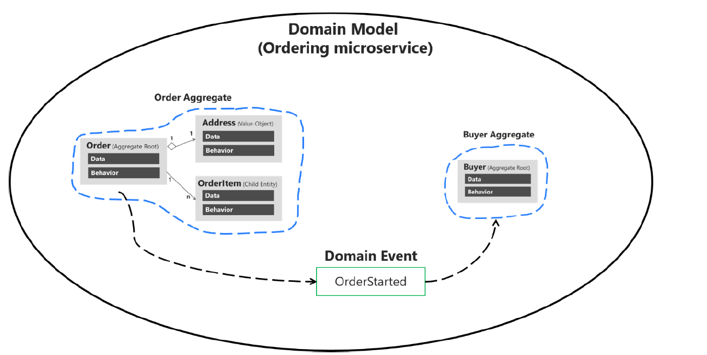
查看参考项目的源代码，当用户提交一个订单:
1. `Ordering.API` 从外部接收一个请求，请求模型为 `CreateOrderDraftCommand` 类型
2. `Controller` 调用 `Mediator` 发送该请求
```csharp
        [Route("draft")]
        [HttpPost]
        public async Task<IActionResult> GetOrderDraftFromBasketData([FromBody] CreateOrderDraftCommand createOrderDraftCommand)
        {
            var draft  = await _mediator.Send(createOrderDraftCommand);
            return Ok(draft);
        }
```
3. `CreateOrderDraftCommandHandler` 处理该请求，创建 `Order` 对象，并返回一个 `OrderDraftDTO` 对象
```csharp
        public Task<OrderDraftDTO> Handle(CreateOrderDraftCommand message, CancellationToken cancellationToken)
        {
            var order = Order.NewDraft();
            var orderItems = message.Items.Select(i => i.ToOrderItemDTO());
            foreach (var item in orderItems)
            {
                order.AddOrderItem(item.ProductId, item.ProductName, item.UnitPrice, item.Discount, item.PictureUrl, item.Units);
            }
            return Task.FromResult(OrderDraftDTO.FromOrder(order));
        }
```
4. `Order.NewDraft()` 方法返回一个 `IsDraft = true` 的 `Order` 对象，确认需要持久化之后，创建 `OrderStartedDomainEvent` 的实例，并添加至 `Order` 实体的 `DomainEvents` 集合属性，后者是一个 `MediatR.INotification` 的只读集合。`Ordering.Infrastructure.MediatorExtension` 的扩展方法 `DispatchDomainEventsAsync` 检测当前实体的 `DomainEvents` 发生变化时借由 `Mediator` 发布事件。
```csharp
        public static async Task DispatchDomainEventsAsync(this IMediator mediator, OrderingContext ctx)
        {
            var domainEntities = ctx.ChangeTracker
                .Entries<Entity>()
                .Where(x => x.Entity.DomainEvents != null && x.Entity.DomainEvents.Any());

            var domainEvents = domainEntities
                .SelectMany(x => x.Entity.DomainEvents)
                .ToList();

            domainEntities.ToList()
                .ForEach(entity => entity.Entity.ClearDomainEvents());

            var tasks = domainEvents
                .Select(async (domainEvent) => {
                    await mediator.Publish(domainEvent);
                });

            await Task.WhenAll(tasks);
        }
```
5. `Ordering.API.Application.DomainEventHandlers.OrderStartedEvent` 命名空间下我们看到了两个响应 `OrderStartedDomainEvent` 事件的 `SendEmailToCustomerWhenOrderStartedDomainEventHandler` 和`ValidateOrAddBuyerAggregateWhenOrderStartedDomainEventHandler` 处理器类型。

> 另外，可以在聚合根实体中订阅其子实体中的域事件。举例来说，`OrderItem` 实体在价格高于某个特定值或数量太多时发起事件，聚合根在收到这些事件后处理为全局计算或聚合计算。

重要的是理解事件通信并不直接在聚合中实现，而应由单独的域事件处理器(Domain Event Handler)来处理域事件，域事件的消费方是应用层和其他聚合，两者的数量且会随着时间不断增长，在设计时应尽可能考虑开闭原则和单一职责原则，基于域事件的通信方式可以更好的分离职责:
1. 发送命令(例如，`CreateOrder`)
2. 在命令处理器中接收命令
    - 执行聚合的单一事务
    - 如果产生副作用，广播域事件(例如，OrderStartedDomainEvent)
3. 其他聚合或应用层响应域事件，例如:
    - 验证或创建 `Buyer` 和 `PaymentMethod`
    - 创建并广播一个相关的集成事件至其他微服务，或触发一个外部动作(如发送 Email)
    - 处理其他副作用

如下图所示:
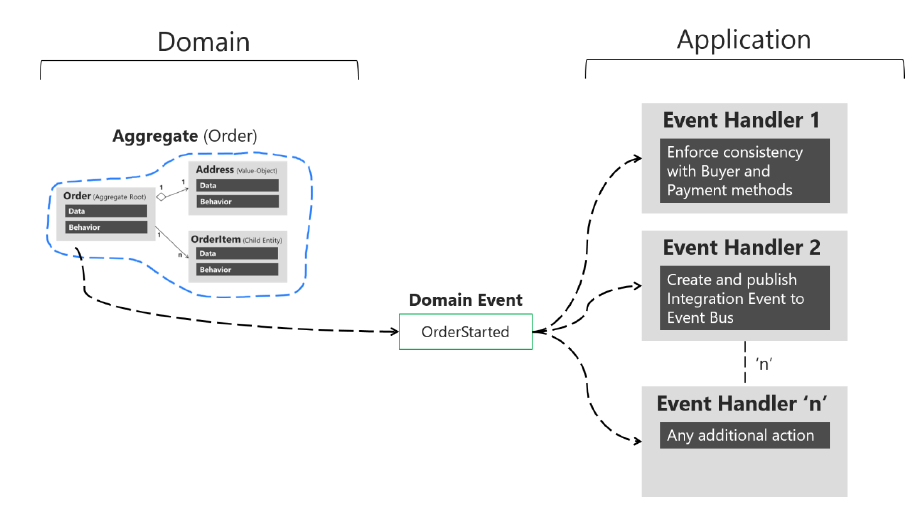
与命令处理器不同的是，命令处理器只能被处理一次，而域事件可由一个或多个处理器响应，两者服务的目的不同，后者可以保证当业务功能增加时仅需增加更多的消费方而无需修改原有的部分。

### 实现域事件
在 C# 中，域事件类型包含所有与该事件相关的数据，定义为简单的数据集类型，与 DTO 类型类似:
```csharp
public class OrderStartedDomainEvent : INotification
{ 
    public string UserId { get; }
    public int CardTypeId { get; }
    public string CardNumber { get; }
    public string CardSecurityNumber { get; }
    public string CardHolderName { get; }
    public DateTime CardExpiration { get; }
    public Order Order { get; }
    
    public OrderStartedDomainEvent(Order order,
                                   int cardTypeId, string cardNumber,
                                   string cardSecurityNumber, string cardHolderName,
                                   DateTime cardExpiration)
    {
        Order = order;
        CardTypeId = cardTypeId;
        CardNumber = cardNumber;
        CardSecurityNumber = cardSecurityNumber;
        CardHolderName = cardHolderName;
        CardExpiration = cardExpiration;
    }
}
```
由于事件是过去发生的事情，所以定义域事件的类型必须是不可变类型，上述类型中的属性均为只读属性，构造器是唯一为这些属性赋值的地点。值得一提的是，如果需要对 `DomainEvent` 进行序列化和反序列化，则需要在这些属性中加入 `private set`。

### 发布域事件
发布领域事件有两种方向的思潮，一种是当事件发生时立即推送至其对应的处理器，另一种是先将其添加至内存集合中，在提交事务之前或之后集中分发域事件，参考项目采用了第二种方法，还方法的好处可参考 [A better domain events pattern](https://lostechies.com/jimmybogard/2014/05/13/a-better-domain-events-pattern/)。

决定在提交事务前后分发域事件与否非常重要，这意味着「副作用」是在事务边界之内还是之外。参考项目采用了延期集中分发事件的方式，实体首先将发生的事件添加至其 `DomainEvents` 集合，其定义在 `Entity` 基类中:
```csharp
public abstract class Entity
{
    //...
    private List<INotification> _domainEvents;
    public List<INotification> DomainEvents => _domainEvents;
    public void AddDomainEvent(INotification eventItem)
    {
        _domainEvents = _domainEvents ?? new List<INotification>();
        _domainEvents.Add(eventItem);
    }
    public void RemoveDomainEvent(INotification eventItem)
    {
        _domainEvents?.Remove(eventItem);
    }
//... Additional code
}
```
当事务提交至数据库时，所有的域事件会在这时进行分发，参考项目使用了 `MediatR` 和 `EF Core`:
```csharp
public class OrderingContext : DbContext, IUnitOfWork
{
    public async Task<bool> SaveEntitiesAsync(CancellationToken cancellationToken = default(CancellationToken))
    {
        await _mediator.DispatchDomainEventsAsync(this);
        var result = await base.SaveChangesAsync();
    }
    // ...
}
```
这种方式也使得实体对发布事件的实现解除了耦合。

### 跨聚合单一事务还是多事务最终一致性
跨聚合事务的一致性问题一直是业界争论的焦点，早期的 DDD 作者们主张将事务边界划分得越小越好，即单一事务仅与单个聚合相关，产生的任何副作用交由另外的事务，并由最终一致性确保状态正确。随着技术实现的发展，跨聚合事务的应用场景越屈合理化，特别是当某个聚合发布的域事件会引起其他聚合的状态改变，如果原始事务提交成功而改变其他聚合状态的事务提交失败，那么这两个聚合将产生不一致性。确保最终一致性将引入更多的代码复杂度，而像 EF Core 等类似的工具已经提供了跨数据库的分布式事务功能，从实现层面确保了跨聚合单一事务的可能性。意即，原始事务及其域事件产生的副作用事务同属一个 `Scope`，任何一步提交失败，整个 `Scope` 都将回滚。参考项目采用了这种实现方式。

### 映射事件至事件处理器
分发事件完成之后，我们需要某种组件将事件推送至对应的事件处理器。一种方式是采用「消息队列」或「事件总线」，它们通常用于实现跨进程的异步通信，而对于域事件来说有点大材小用，因为域事件和域事件处理器属于同一个进程，只是实现在不同的层中。另一种方式是将域事件与处理器在 IoC 中注册，推送事件时动态解析处理器，如下图所示:
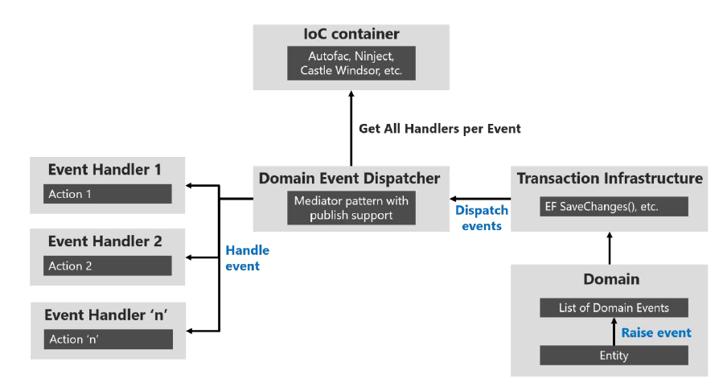
参考项目采用了 `MediatR` 库来实现这一环节

### 域事件可以生成集成事件跨越服务边界
值得提及的一点是，域事件处理器可以利用「事件总线」发布集成事件。
___

## 实现基础设施持久化层
数据持久化组件提供了在有界上下文边界内访问数据的功能，它们包含了诸如「仓储」和「工作单元」等的实现类型。

### 每个聚合定义一个仓储
应该为聚合或聚合根定义一个仓储，在 DDD 模式中，仓储是在持久化层面修改聚合的唯一通道。仓储与聚合是一对一关系，负责控制其不变条件与事务的持久化工作。如前文讨论的那样，查询可以借由另外的通道实现(如 CQRS)，因为查询不会更改系统的状态。

必须强调的是，每个聚合有且只能有一个对应的仓储，而不是为每个实体或每张数据库表创建仓储，下图展示了 `Ordering` 域下各个模型的关系:
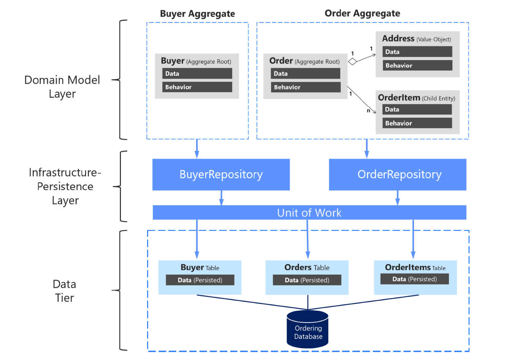
或者确切的说，仓储仅面向聚合根实体创建，在代码实现上可采用泛型仓储接口约束类型参数必须实现如上文提及过的 `IAggregateRoot` 接口，而具体的仓储实现可在基础设施层中定义，正如参考项目那样:
```csharp

public interface IRepository<T> where T : IAggregateRoot{}

public interface IOrderRepository : IRepository<Order>{}

namespace Microsoft.eShopOnContainers.Services.Ordering.Infrastructure.Repositories
{
    public class OrderRepository : IOrderRepository{}
}
```
尽管论述了很多使用「仓储」所带来的好处，但它不是实现 DDD 的必要条件。**Jimmy Bogard** 指出，仓储隐藏了持久化机制的具体实现，不使用模拟仓储的原因在于始终要采用集成测试来覆盖测试代码，采用 CQRS 模式之后也意味着对采用仓储模式的需求减弱了。
