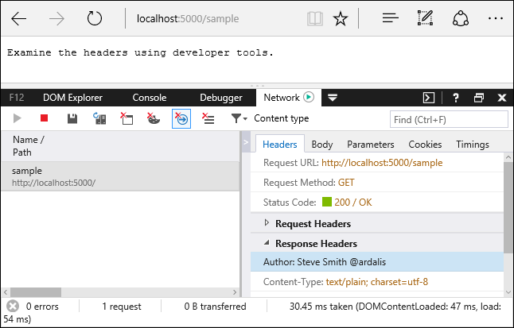

参考资料:
- [Filters in ASP.NET Core](https://docs.microsoft.com/en-us/aspnet/core/mvc/controllers/filters?view=aspnetcore-2.1)

## 过滤器类型
每个过滤器类型都将在管道的不同阶段被执行:
- Authorization 过滤器: **第一个**运行的过滤器，决定执行请求的当前用户是否被授权。
- Resource 过滤器: 紧随 Authorization 过滤器之后处理请求的过滤器，其代码在管道的其余部分之前或之后被执行，它们是实现缓存或因性能原因阻塞请求的最佳位置，它们在「Model Binding」之前运行，所以其代码可以影响模型绑定。
- Action 过滤器: 在特定的 Action 之前或之后运行的过滤器，它们被用于操作传入 Action 的参数以及被其返回的结果。
- Exception 过滤器: 用于将全局策略应用于在返回响应之前未被捕获的异常。
- Result 过滤器: 在 Action 返回结果之前或之后执行代码，仅当 Action 方法成功之后才会运行，它们被用于处理必须围绕视图的逻辑。

## 实现
**过滤器通过定义不同的接口**支持同步及异步实现。同步实现以 On*Stage*Executing 和 On*Stage*Executed 方法为模板，例如 `OnActionExecuting` 在方法执行之前运行，`OnActionExecuted` 在方法执行之后运行。
```csharp
using FiltersSample.Helper;
using Microsoft.AspNetCore.Mvc.Filters;

namespace FiltersSample.Filters
{
    public class SampleActionFilter : IActionFilter
    {
        public void OnActionExecuting(ActionExecutingContext context)
        {
            // do something before the action executes
        }

        public void OnActionExecuted(ActionExecutedContext context)
        {
            // do something after the action executes
        }
    }
}
```
异步过滤器定义一个 On*Stage*ExecutionAsync 方法，该方法接收一个 `FilterTypeExecutionDelegate` 委托参数 `next`，`next` 参数代表 `Action` 本身，可在其之前或之后添加扩展逻辑:
```csharp
using System.Threading.Tasks;
using Microsoft.AspNetCore.Mvc.Filters;

namespace FiltersSample.Filters
{
    public class SampleAsyncActionFilter : IAsyncActionFilter
    {
        public async Task OnActionExecutionAsync(
            ActionExecutingContext context,
            ActionExecutionDelegate next)
        {
            // do something before the action executes
            var resultContext = await next();
            // do something after the action executes; resultContext.Result will be set
        }
    }
}
```

> 过滤器的同步和异步接口版本只要实现一个就够了，框架会首先检查过滤器类型是否实现了异步接口，如果是，则执行异步版本。否则，才会执行同步版本。如果同时实现了两个接口，则同步接口会被忽略。

### IFilterFactory
`IFilterFactory` 实现了 `IFilterMetaData` 接口，所以 `IFilterFactory` 可以当作 `IFilterMetaData` 接口的实例在管道的任何地方使用。当框架准备调用 `Filter` 时，首先尝试将其转换成 `IFilterFactory` 接口，如果转换成功，接下来调用接口的 `CreateInstance` 方法以构造 `IFilterMetaData` 实例，这种设计更加灵活，因为不必在应用程序启动时显式指定具体的 `Filter` 类型。可以在自定义的 `Attribute` 上实现 `IFilterFactory` 接口以另一种方式创建 `Filter`:
```csharp
public class AddHeaderWithFactoryAttribute : Attribute, IFilterFactory
{
    // Implement IFilterFactory
    public IFilterMetadata CreateInstance(IServiceProvider serviceProvider)
    {
        return new InternalAddHeaderFilter();
    }

    private class InternalAddHeaderFilter : IResultFilter
    {
        public void OnResultExecuting(ResultExecutingContext context)
        {
            context.HttpContext.Response.Headers.Add(
                "Internal", new string[] { "Header Added" });
        }

        public void OnResultExecuted(ResultExecutedContext context)
        {
        }
    }

    public bool IsReusable
    {
        get
        {
            return false;
        }
    }
}
```

### 框架内置过滤器特性 Filter Attribute
框架包含了可继承或自定义的内置 `attribute-based` 形式的 `Filter`。例如以下 `ResultFilter` 在响应头添加了一个 `Header`。
```csharp
using Microsoft.AspNetCore.Mvc.Filters;

namespace FiltersSample.Filters
{
    public class AddHeaderAttribute : ResultFilterAttribute
    {
        private readonly string _name;
        private readonly string _value;

        public AddHeaderAttribute(string name, string value)
        {
            _name = name;
            _value = value;
        }

        public override void OnResultExecuting(ResultExecutingContext context)
        {
            context.HttpContext.Response.Headers.Add(
                _name, new string[] { _value });
            base.OnResultExecuting(context);
        }
    }
}
```
特性允许 `Filter` 接收参数，在上面的例子中，可以用该 `Attribute` 修饰一个 `Controller` 或 `Action` 方法并指定 `Http Header` 的名称。
```csharp
[AddHeader("Author", "Steve Smith @ardalis")]
public class SampleController : Controller
{
    public IActionResult Index()
    {
        return Content("Examine the headers using developer tools.");
    }

    [ShortCircuitingResourceFilter]
    public IActionResult SomeResource()
    {
        return Content("Successful access to resource - header should be set.");
    }
```
`Index` Action 的结果如下:


Filter 特性:
- ActionFilterAttribute
- ExceptionFilterAttribute
- ResultFilterAttribute
- FormatFilterAttribute
- ServiceFilterAttribute
- TypeFilterAttribute

`TypeFilterAttribute` 和 `ServiceFilterAttribute` 将在后文介绍。

## Filter 应用级别和执行顺序
过滤器可以以三种级别应用 - 以 Attribute 的形式应用在特定的 `Action` 或 `Controller` 类上。或者在 `ConfigureServices` 方法中配置 `MvcOptions.Filters` 以全局方式应用到所有 `Action` 和 `Controller` 上。
```csharp
public void ConfigureServices(IServiceCollection services)
{
    services.AddMvc(options =>
    {
        options.Filters.Add(new AddHeaderAttribute("GlobalAddHeader", 
            "Result filter added to MvcOptions.Filters")); // an instance
        options.Filters.Add(typeof(SampleActionFilter)); // by type
        options.Filters.Add(new SampleGlobalActionFilter()); // an instance
    });

    services.AddScoped<AddHeaderFilterWithDi>();
}
```
多个内置的 `Filter` 接口都实现了对应的 Attribute 用于继承以支持自定义实现。

### 过滤器的默认执行顺序
当管道中多处都应用了过滤器，scope 决定了过滤器的默认执行顺序。该序列看来如下:
- 全局过滤器的 before 部分
    - Controller 级别过滤器的 before 部分
        - Action 方法级别过滤器的 before 部分
        - Action 方法级别过滤器的 after 部分
    - Controller 级别过滤器的 after 部分
- 全局过滤器的 after 部分

> 所有继承自 `Controller` 类型的控制器都包含 `OnActionExecuting` 和 `OnActionExecuted` 方法。这些方法先于任何应用其上的过滤器的 `OnActionExecuting` 方法并且后于 `OnActionExecuted` 方法。

### 重写默认顺序
可以通过实现 `IOrderedFilter` 接口来重写过滤器的默认执行顺序。该接口暴露一个 `Order` 属性先与过滤器的应用级别来影响执行顺序。`Order` 的属性值越低，其 before 部分代码先执行，after 部分后执行。

## 取消和短路
通过在 `context` 上设置 `Result` 属性可以在任何点上短路管道。

## 依赖注入
过滤器以服务的形式注册到 IoC，但实现为 `Attribute` 的过滤器无法通过依赖注入的方式获取构造器参数，这是因为 `Attribute` 类型的构造器参数必须在使用时指定，这是 `Attribute` 的一个限制。

如果过滤器在其创建过程种依赖 DI，可以通过以下方式之一解决该问题:
- ServiceFilterAttribute
- TypeFilterAttribute
- IFilterFactory

> 你可能想要在过滤器中从 DI 获取 logger。应该避免将过滤器仅用作日志目的，因为框架内置的[日志系统](/aspnetcore-fundamentals-logging)介绍了更科学的记录日志的方法，如果一定要将日志功能加入过滤器逻辑中，那么该日志应该侧重于记录该过滤器与业务领域逻辑相关的内容，而不是 `MVC Action` 或其他框架事件。

### ServiceFilterAttribute
`ServiceFilterAttribute` 从 DI 中请求一个特定过滤器的实例，你应该在 `ConfigureServices` 方法中注册该过滤器类型，并在 `ServiceFilter` 引用它。
```csharp
public void ConfigureServices(IServiceCollection services)
{
    services.AddScoped<AddHeaderFilterWithDi>();
}

[ServiceFilter(typeof(AddHeaderFilterWithDi))]
public IActionResult Index()
{
    return View();
}
```

### TypeFilterAttribute
`TypeFilterAttribute` 与 `ServiceFilterAttribute` 非常相似，但它并不是从 DI 中解析过滤器类型的实例，而是通过 `Microsoft.Extensions.DependencyInjection.ObjectFactory` 创建过滤器类型的实例。因此:
- 被 `TypeFilterAttribute` 类型引用的过滤器类型无需在 IoC 中注册。
- `TypeFilterAttribute` 可以有选择地传递过滤器类型的构造函数参数。

以下示例演示了如何将构造函数参数传递给 `TypeFilterAttribute`:
```csharp
[TypeFilter(typeof(AddHeaderAttribute),
    Arguments = new object[] { "Author", "Steve Smith (@ardalis)" })]
public IActionResult Hi(string name)
{
    return Content($"Hi {name}");
}
```

## Authorization 过滤器
- 管道中第一批被执行的过滤器
- 有 before 方法，没有 after 方法
- 不要在该过滤器中的抛出异常

## Resource 过滤器
- 实现 `IResourceFilter` 或 `IAsyncResourceFilter` 之一
- 包围大多数管理过滤器
- 只有 `Authorization` 过滤器先于它执行

Resource 过滤器用于短路请求的大多数工作，例如，缓存过滤器如果检查到响应位于缓存中，则跳过管道中的其余逻辑

## Action 过滤器
实现 `IActionFilter` 或 `IAsyncActionFilter` 接口之一，以下是一个示例 `Action` 过滤器:
```csharp
public class SampleActionFilter : IActionFilter
{
    public void OnActionExecuting(ActionExecutingContext context)
    {
        // do something before the action executes
    }

    public void OnActionExecuted(ActionExecutedContext context)
    {
        // do something after the action executes
    }
}
```

`ActionExecutingContext` 提供了以下属性:
- `ActionArguments`: 操作提供给方法的输入参数
- `Controller`: 操作控制器实例
- `Result`: 设置该值以短路该 Action 方法及其后的过滤器，抛出异常亦然，但会被认为是一个失败请求。

`ActionExecutedContext` 提供了以下属性:
- `Canceled`: 当 Action 执行短路时为 true
- `Exception`: 抛出异常时该值不为空，将该值显式设置为 `null` 则被认为异常已经过处理，之后 `Result` 属性将被处理。

对于 `IAsyncActionFilter`，执行 `ActionExecutionDelegate` 将:
- 同时执行所有后续的过滤器和 Action 方法本身
- 返回 `ActionExecutedContext`

要短路，则设置 `ActionExecutingContext.Result` 并且不要调用 `ActionExecutionDelegate`。

## Exception 过滤器
Exception 实现 `IExceptionFilter` 或 `IAsyncExceptionFilter` 接口之一。其用于实现通用错误处理策略。`Exception` 过滤器:
- 没有 before 和 after 事件
- 实现 `OnException` 或 `OnExceptionAsync`
- 处理发生在创建控制器，模型绑定，`Action` 过滤器或 `Action` 方法中未捕获的异常
- 不要在 `Resource` 过滤器，`Result` 过滤器或 MVC Result 执行过程中捕获异常

设置 `ExceptionContext.ExceptionHandled` 为 true 并返回一个请求响应以指示异常被处理。`Exception` 过滤器:
- 对于处理 MVC Action 中抛出的异常是最佳位置
- 不如错误处理中间件来得灵活

「仅当需要针对性对某个 MVC Action 进行特殊处理时采用 `Exception` 过滤器。」

## 在管道中使用过滤器中间件
`Resource` 过滤器由于其包围了管道其后的所有执行过程，所以其职责非常类似于一个过滤器中间件。然而其与中间件最大的区别在于，`Resource` 过滤器是 MVC 的一部分，这意味着它们可以访问 MVC 的 context 和构造。

当使用中间件时同时也希望能够访问 MVC 的路由数据或仅仅为某个特定的 `Controller` 或 `Action` 服务。定义一个包含 `Configure` 方法的类型，以下示例展示了一个使用本地化中间件为请求建立当前文化:
```csharp
public class LocalizationPipeline
{
    public void Configure(IApplicationBuilder applicationBuilder)
    {
        var supportedCultures = new[]
        {
            new CultureInfo("en-US"),
            new CultureInfo("fr")
        };

        var options = new RequestLocalizationOptions
        {

            DefaultRequestCulture = new RequestCulture(culture: "en-US", uiCulture: "en-US"),
            SupportedCultures = supportedCultures,
            SupportedUICultures = supportedCultures
        };
        options.RequestCultureProviders = new[] 
            { new RouteDataRequestCultureProvider() { Options = options } };

        applicationBuilder.UseRequestLocalization(options);
    }
}
```
之后，可以在 `Controller` 上或 `Action` 上或全局地通过 `MiddlewareFilterAttribute` 应用该中间件:
```csharp
[Route("{culture}/[controller]/[action]")]
[MiddlewareFilter(typeof(LocalizationPipeline))]
public IActionResult CultureFromRouteData()
{
    return Content($"CurrentCulture:{CultureInfo.CurrentCulture.Name},"
        + $"CurrentUICulture:{CultureInfo.CurrentUICulture.Name}");
}
```

中间件过滤器与 `Resource` 过滤器运行在同一阶段。