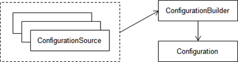
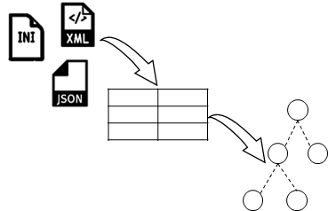
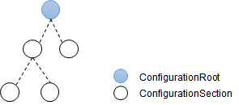
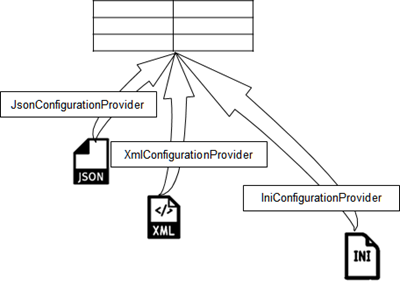
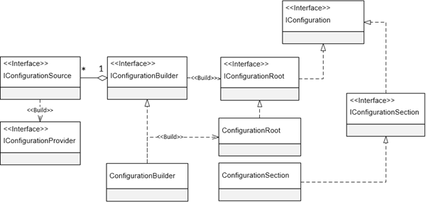

参考资料:
- [Configuration in ASP.NET Core](https://docs.microsoft.com/en-us/aspnet/core/fundamentals/configuration/?view=aspnetcore-2.1&tabs=basicconfiguration)
- http://www.cnblogs.com/artech/p/new-config-system-01.html

本文大纲: 
<!-- TOC -->

- [前言](#%E5%89%8D%E8%A8%80)
- [从编程角度认识配置系统](#%E4%BB%8E%E7%BC%96%E7%A8%8B%E8%A7%92%E5%BA%A6%E8%AE%A4%E8%AF%86%E9%85%8D%E7%BD%AE%E7%B3%BB%E7%BB%9F)
- [从设计角度认识配置系统](#%E4%BB%8E%E8%AE%BE%E8%AE%A1%E8%A7%92%E5%BA%A6%E8%AE%A4%E8%AF%86%E9%85%8D%E7%BD%AE%E7%B3%BB%E7%BB%9F)
    - [配置数据的转换](#%E9%85%8D%E7%BD%AE%E6%95%B0%E6%8D%AE%E7%9A%84%E8%BD%AC%E6%8D%A2)
    - [Configuration 对象](#configuration-%E5%AF%B9%E8%B1%A1)
    - [ConfigurationProvider 对象](#configurationprovider-%E5%AF%B9%E8%B1%A1)
    - [ConfigurationSource 对象](#configurationsource-%E5%AF%B9%E8%B1%A1)
    - [ConfigurationBuilder 对象](#configurationbuilder-%E5%AF%B9%E8%B1%A1)
- [对象关系图](#%E5%AF%B9%E8%B1%A1%E5%85%B3%E7%B3%BB%E5%9B%BE)
- [同步 Configuration 的更改](#%E5%90%8C%E6%AD%A5-configuration-%E7%9A%84%E6%9B%B4%E6%94%B9)

<!-- /TOC -->

# 前言
配置 API 提供了统一的方式以键值对的形式来读取和设置配置项，配置项在运行时从多个配置源读取信息，并以一个多层级的字典表树来存储这些值。配置源支持以下提供器:
- 文件格式(INI, JSON 和 XML)
- 命令行参数
- 环境变量
- 内存对象
- [Secret Manager](https://docs.microsoft.com/en-us/aspnet/core/security/app-secrets?view=aspnetcore-2.1&tabs=visual-studio) 存储
- [Azure Key Vault](https://docs.microsoft.com/en-us/aspnet/core/security/key-vault-configuration?view=aspnetcore-2.1&tabs=aspnetcore2x)
- 自定义配置源提供器

任何一个配置项的值都映射到一个字符串键，框架内置了实现类型将配置项映射到一个 POCO 对象。`Options` 模式使用 `Options` 类型代表一组关联的设置项。

# 从编程角度认识配置系统
从编程角度来看，开发人员主要用到了以下三个对象
- `Configuration`: 客户代码最终使用的包含配置项的对象
- `ConfigurationBuilder`: 构建 `Configuration` 的对象
- `ConfigurationSource`: 配置源对象



读取配置时，根据配置的定义方式创建相应的 `ConfigurationSource` 对象，并将其注册到创建的 `ConfigurationBuilder` 对象上，后者利用注册的这些 `ConfigurationSource` 提供最终的 `Configuration` 对象。

`IConfiguration`, `IConfigurationSource` 和 `IConfigurationBuilder` 接口分别代表这些对象的抽象，三者均定义在 `Microsoft.Extensions.Configuration.Abstractions` 包中，默认实现定义在 `Microsoft.Extensions.Configuration` 包中。

虽然大部分情况下配置从整体来说都具有结构化的层次关系，但是**「原子」**配置项都以最简单的**「键-值对」**的形式来体现，并且键和值通常都是字符串。

```csharp
var configBuilder = new ConfigurationBuilder();
var configuration = configBuilder
                    .Add(new MemoryConfigurationSource { InitialData = source })
                    .Build();
```
这里首先创建了一个 `ConfigurationBuilder` 对象，然后将一个 `MemoryConfigurationSource` 对象注册到它上面，随后调用 `IConfigurationBuilder.Build` 方法得到一个 `IConfiguration` 对象。

真实项目中涉及的配置大都具有结构化的层次，`Configuration` 对象同样具有这样的结构，结构化配置具有一个配置树，一个 `Configuration` 对象对应这棵树的某个节点，而整棵配置树也可由根节点对应的 `Configuration` 来表示，以键值对体现的原子配置项对应配置树中不具有子节点的**「叶子节点」**。

# 从设计角度认识配置系统
配置具有多种原始来源，如内存对象，物理文件，数据库或其他自定义存储介质。如果采用物理文件来存储配置数据，我们还可以选择不同的文件格式(JSON, XML 和 INI)。因此配置的原始数据结构是不确定的，配置模型的最终目的在于提取原始的配置数据并将其转换成一个 `Configuration` 对象以对客户代码提供统一的编程模型。

## 配置数据的转换
配置从原始结构向逻辑结构的转换需要一种**「中间结构」**——数据字典，整棵配置树的所有节点都会转换成基于字典的中间结构，最终再完成到 `Configuration` 对象的转换，父子级节点之间以 `:` 进行连接。



一个 `Configuration` 对象具有树形层次结构的意思不是说该类型具有对应的数据成员(字段或属性)定义，而是它提供的 API **「在逻辑上体现出树形层次结构」**，配置树是一种逻辑结构。
## Configuration 对象
一个 `Configuration` 对象表示配置树的某个配置节点，表示根节点的对象与表示其它配置节点的对象是不同的，所以配置模型采用 `IConfigurationRoot` 接口来表示根节点，根节点以外的其他配置节点则用 `IConfigurationSection` 接口表示，这两个接口都继承自 `IConfiguration`。下图为我们展示了由一个 `ConfigurationRoot` 对象和一组 `ConfigurationSection` 对象构成的配置树。

下面的代码展示了 `IConfigurationRoot` 接口的定义，该接口仅定义了一个 `Reload` 方法实现对配置数据的重新加载。`ConfigurationRoot` 对象表示配置树的根，也代表整棵配置树，如果它被重新加载，意味着整棵配置树的所有配置数据均被重新加载。
```csharp
public interface IConfigurationRoot : IConfiguration
{
    void Reload();
}
```
非根配置节点的 `IConfigurationSection` 接口具有如下三个属性: 
- Key: 只读，用来唯一标识多个具有相同父节点的 `ConfigurationSection` 对象
- Path 表示当前配置节点在配置树中的路径，该路径由多个 Key 值组成，并采用冒号(`:`)分隔纵深节点。Path 和 Key 的值体现了当前配置节在整个配置树中的位置。
- Value: 表示当前 `IConfigurationSection` 配置节点的值。只有配置树的**叶子节点**对应的`ConfigurationSection` 对象的 Value 属性才有值，非叶子节点对应的 `ConfigurationSection` 对象仅表示存放子配置节点的逻辑容器，它们的 Value 为 Null。值得一提的是，这个 Value 属性并不是只读的，而是可读可写的，但是写入的值不会被持久化，因为配置树只是逻辑结构，而非物理结构。所以一旦配置树被重新加载，写入的值将会丢失。
```csharp
public interface IConfigurationSection : IConfiguration
{    
    string Path { get; }
    string Key { get; }
    string Value { get; set; }
}
```
现在来看看 `IConfiguration` 接口的定义: 
```csharp
public interface IConfiguration
  {
      IEnumerable<IConfigurationSection> GetChildren();
      IConfigurationSection GetSection(string key);
      IChangeToken GetReloadToken();
     
      string this[string key] { get; set; }
  }
```
- `GetChildren`: 返回 `ConfigurationSection` 的集合，表示所有从属于它的配置节点
- `GetSection`: 根据指定的 key 返回一个具体的子配置节点。key 参数与当前配置对象的 Path 属性的值进行组合以确定目标配置节点所在的路径。
- `GetReloadToken`: 返回当配置重新加载时进行回调的 `IChangeToken` 对象，有关 `IChangeToken` 详见后文。

以下示例通过不同的 key 值获得相同配置节点的值:
```csharp
Dictionary<string, string> source = new Dictionary<string, string>
{
    ["A:B:C"] = "ABC"
};
IConfiguration root = new ConfigurationBuilder()
        .Add(new MemoryConfigurationSource { InitialData = source })
        .Build();
 
IConfigurationSection section1 = root.GetSection("A:B:C");
IConfigurationSection section2 = root.GetSection("A:B").GetSection("C");
IConfigurationSection section3 = root.GetSection("A").GetSection("B:C");
 
Debug.Assert(section1.Value == "ABC");
Debug.Assert(section2.Value == "ABC");
Debug.Assert(section3.Value == "ABC");
 
Debug.Assert(!ReferenceEquals(section1, section2));
Debug.Assert(!ReferenceEquals(section1, section3));        
Debug.Assert(null != root.GetSection("D"));
```
虽然上述代码得到的 `ConfigurationSection` 对象均指向配置树的同一个节点，但是它们并非同一个对象。当调用 `GetSection` 方法时，无论配置树是否存在一个与指定路径匹配的配置节点，它总是会创建一个 `ConfigurationSection` 对象。

> `IConfiguration` 的索引器执行与 `GetSection` 方法相同的逻辑。
## ConfigurationProvider 对象
虽然每种不同类型的配置源都具有一个对应的 `ConfigurationSource` 类型，但对原始数据的读取并不由 `ConfigurationSource` 实现，而是委托一个对应的 `ConfigurationProvider` 对象来完成。不同配置类型的 `ConfigurationSource` 由不同的 `ConfigurationProvider` 实现读取。

`ConfigurationProvider` 将配置数据从原始结构转换为数据字典，因此定义在 `IConfigurationProvider` 接口中的方法大多为针对字典对象的操作:
```csharp
public interface IConfigurationProvider
{
  void Load();
 
  bool TryGet(string key, out string value);
  void Set(string key, string value);
  IEnumerable<string> GetChildKeys(IEnumerable<string> earlierKeys, string parentPath)
}
```
配置数据通过调用 `ConfigurationProvider` 的 `Load` 方法完成加载。`TryGet` 方法获取由指定的Key 所标识的配置项的值。`ConfigurationProvider` 是只读的，`ConfigurationProvider` 只负责从持久化资源中读取配置数据，而不负责更新保存在持久化资源的配置数据，它的 `Set` 方法设置的配置数据只会保存在内存中。`ConfigurationProvider` 的 `GetChildKeys` 方法用于获取某个指定配置节点的所有子节点的 Key。
## ConfigurationSource 对象
`ConfiurationSource` 在配置模型中代表配置源，它通过注册到 `ConfigurationBuilder` 上为后者创建的 `Configuration` 提供原始的配置数据。由于原始配置数据的读取实现在相应的 `ConfigurationProvider` 中，所以 `ConfigurationSource` 的作用在于提供相应的 `ConfigurationProvider`。如下面的代码片段所示，该接口具有一个唯一的 `Build` 方法根据指定的 `ConfigurationBuilder` 对象提供对应的`ConfigurationProvider`。
```csharp
public interface IConfigurationSource
{
    IConfigurationProvider Build(IConfigurationBuilder builder);
}
```
## ConfigurationBuilder 对象
`ConfigurationBulder` 在整个配置模型中处于一个核心地位，它是 `Configuration` 的创建者，`IConfigurationBulder` 接口定义了两个方法，其中 `Add` 方法用于注册 `ConfigurationSource`，最终的 `Configuration` 则通过 `Build` 方法创建，后者返回一个代表整棵配置树的`ConfigurationRoot` 对象。注册的 `ConfigurationSource` 保存在 `Sources` 属性表示的集合中，`Properties` 属性则以字典的形式存放任意的自定义数据。
```csharp
public interface IConfigurationBuilder
{
    IEnumerable<IConfigurationSource>  Sources { get; }
    Dictionary<string, object>         Properties { get; }
 
    IConfigurationBuilder     Add(IConfigurationSource source);
    IConfigurationRoot        Build();
}
```
配置系统提供了 `ConfigurationBulder` 类型作为 `IConfigurationBulder` 接口的默认实现者。

> 无论是 `ConfigurationRoot` 还是 `ConfigurationSection`，它们自身都没有维护任何数据。这句话有点自相矛盾，因为配置树仅仅是 API 在逻辑上所体现的数据结构，并不代表具体的配置数据也是按照这样的结构进行存储的。

# 对象关系图
配置系统的四个核心对象之间的关系简单而清晰，可以通过一句话来概括: `ConfigurationBuilder` 利用注册的 `ConfigurationSource` 得到相应的 `ConfigurationProvider`，再调用 `ConfigurationProvider` 的 `Load` 方法读取原始配置数据并创建出相应的 `Configuration` 对象。下图所示的 UML 展示了配置模型涉及的主要接口/类型以及它们之间的关系:


# 同步 Configuration 的更改
参考[配置的同步机制是如何实现的？](http://www.cnblogs.com/artech/p/new-config-system-10.html)