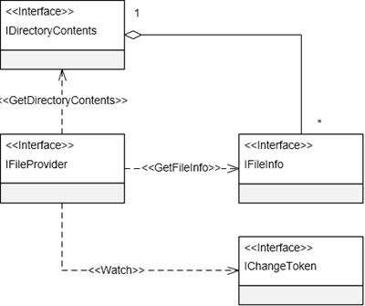

参考资料:
- [ASP.NET Core 的文件系统](http://www.cnblogs.com/artech/p/net-core-file-provider-01.html)
- [File Providers in ASP.NET Core](https://docs.microsoft.com/en-us/aspnet/core/fundamentals/file-providers?view=aspnetcore-2.1)

本文大纲:
<!-- TOC -->

- [抽象的「文件系统」](#%E6%8A%BD%E8%B1%A1%E7%9A%84%E6%96%87%E4%BB%B6%E7%B3%BB%E7%BB%9F)
- [FileProvider 抽象](#fileprovider-%E6%8A%BD%E8%B1%A1)
- [文件系统的实现者](#%E6%96%87%E4%BB%B6%E7%B3%BB%E7%BB%9F%E7%9A%84%E5%AE%9E%E7%8E%B0%E8%80%85)
    - [PhysicalFileProvider](#physicalfileprovider)
    - [EmbeddedFileProvider](#embeddedfileprovider)
    - [CompositeFileProvider](#compositefileprovider)
- [监控变化](#%E7%9B%91%E6%8E%A7%E5%8F%98%E5%8C%96)
- [文件系统详解](#%E6%96%87%E4%BB%B6%E7%B3%BB%E7%BB%9F%E8%AF%A6%E8%A7%A3)
    - [FileInfo & GetFileInfo 方法](#fileinfo--getfileinfo-%E6%96%B9%E6%B3%95)
    - [DirectoryContents & GetDirectoryContents 方法](#directorycontents--getdirectorycontents-%E6%96%B9%E6%B3%95)
    - [ChangeToken 及 Watch 方法](#changetoken-%E5%8F%8A-watch-%E6%96%B9%E6%B3%95)
    - [路径前缀 「/」](#%E8%B7%AF%E5%BE%84%E5%89%8D%E7%BC%80)
    - [对象关系图](#%E5%AF%B9%E8%B1%A1%E5%85%B3%E7%B3%BB%E5%9B%BE)

<!-- /TOC -->

# 抽象的「文件系统」
ASP.NET Core 利用一个抽象化的 `FileProvider` 以统一的方式提供所需的文件。`FileProvider` 是所有实现了 `IFileProvider` 接口的类型的统称，`FileProvider` 是个抽象的概念，所以由它构建的也是一个抽象的文件系统。

这个文件系统采用目录的方式来组织和规划文件，这里所谓的目录和文件都是抽象的概念，并非对一个具体物理目录和文件的映射。文件系统的目录仅仅是文件的逻辑容器，而文件可能对应一个物理文件，也可能保存在数据库中，或者来源于网络，甚至有可能根本就不能存在，其内容需要在读取时动态生成。

一个 `FileProvider` 可以视为针对一个根目录的映射。目录除了可以存放文件之外，还可以包含多个子目录，所以目录/文件在整体上呈现出树形层细化结构。

# FileProvider 抽象
`IFileProvider` 接口提供了获取文件信息(`IFileInfo`)和目录信息的方法，并支持追踪变化并发送通知(`IChangeToken`)的功能。

`IFileInfo` 接口代表单独的文件信息或目录，其含有以下属性: 
- Exists: 标识是否存在
- IsDirectory: 标识是否为目录
- Name: 描述「文件」的名称
- Length: 以字节计算
- LastModified: 上次修改的日期
- CreateReadStream: 调用该方法来读取内容

# 文件系统的实现者
IFileProvider 内置了三个实现类型:
- Physical: 访问真实的物理文件结构
- Embedded: 访问嵌套于程序集内的文件
- Composite: 组合来自于其他提供器的文件和目录访问

## PhysicalFileProvider
`PhysicalFileProvider` 实现了对访问物理文件系统的支持，其内部包裹了 `System.IO.File` 类型，该类型将所有可访问路径限制在一个根目录下，在初始化该类型时必须为其提供一个代表目录的路径参数。以下代码演示了如何创建一个 `PhysicalFileProvider`:
```csharp
IFileProvider provider = new PhysicalFileProvider(applicationRoot);
IDirectoryContents contents = provider.GetDirectoryContents(""); // the applicationRoot contents
IFileInfo fileInfo = provider.GetFileInfo("wwwroot/js/site.js"); // a file under applicationRoot
```

## EmbeddedFileProvider
在 .NET Core 中，通过在 *.csproj* 文件中使用 `<EmbeddedResource>` 元素将文件嵌套至程序集中: 
``` xml
<ItemGroup>
  <EmbeddedResource Include="Resource.txt;**\*.js" Exclude="bin\**;obj\**;**\*.xproj;packages\**;@(EmbeddedResource)" />
  <Content Update="wwwroot\**\*;Views\**\*;Areas\**\Views;appsettings.json;web.config">
    <CopyToPublishDirectory>PreserveNewest</CopyToPublishDirectory>
  </Content>
</ItemGroup>
```
向 `EmbeddedFileProvider` 类型的构造函数提供 `Assembly` 对象来创建它。
```csharp
var embeddedProvider = new EmbeddedFileProvider(Assembly.GetEntryAssembly());
```
嵌套资源没有「目录」的概念，不同命名空间的资源同样可以通过 `.` 语法来访问。`EmbeddedFileProvider` 类型的构造器接收一个可选的 `baseNamespace` 参数，指定该参数可以将调用 `GetDirectoryContents` 方法访问的范围限制在该命名空间下。
## CompositeFileProvider
`CompositeFileProvider` 组合多个 `IFileProvider` 对象并暴露一个针对不同 provider 的统一访问接口，创建 `CompositeFileProvider` 实例需要向其传递一个或多个 `IFileProvider` 对象。
```csharp
var physicalProvider = _hostingEnvironment.ContentRootFileProvider;
var embeddedProvider = new EmbeddedFileProvider(Assembly.GetEntryAssembly());
var compositeProvider = new CompositeFileProvider(physicalProvider, embeddedProvider);
```

# 监控变化
`IFileProvider` 包含一个 `Watch` 方法对监控文件和目录变化提供了支持，该方法接收一个路径参数，该参数可通过 [globbing patterns](https://docs.microsoft.com/en-us/aspnet/core/fundamentals/file-providers?view=aspnetcore-2.1#globbing-patterns) 来指定多个文件。`Watch` 方法返回一个 `IChangeToken` 对象，该对象包含一个 `HasChanged` 属性和一个 `RegisterChangeCallback` 方法。`RegisterChangeCallback` 在指定路径的文件发送变化后被调用。

值得注意的是，每一个 `IChangeToken` 对象仅监控**一次**变化。单个 `ChangeToken` 对象的使命在于当绑定的数据源第一次发生变换时对外发送相应的信号，而不具有持续发送数据变换的能力。它具有一个 `HasChanged` 属性表示数据是否已经发生变化，而并没有提供一个让这个属性「复位」的方法。

如果需要对文件进行持续监控，需要在注册的回调中重新调用 `FileProvider` 的 `Watch` 方法，并利用新生成的 `ChangeToken` 再次注册回调。除此之外，考虑到 `ChangeToken` 的 `RegisterChangeCallback` 方法以一个 `IDisposable` 对象的形式返回回调注册对象，我们应该在对回调实施二次注册时调用第一次返回的回调注册对象的 `Dispose` 方法将其释放掉。

或者，可以使用定义在 `ChangeToken` 类型中如下两个方法 `OnChange` 方法来注册数据发生改变时自动执行的回调。这两个方法具有两个参数:
- `Func<IChangeToken>`: 用于创建 `ChangeToken`对象的委托对象
- `Action<object>/Action<TState>`: 代表回调操作的委托对象

```csharp
public static class ChangeToken
{
    public static IDisposable OnChange(Func<IChangeToken> changeTokenProducer, Action changeTokenConsumer)
    {        
        Action<object> callback = null;
        callback = delegate (object s) {
            changeTokenConsumer();
            changeTokenProducer().RegisterChangeCallback(callback, null);
        };
        return changeTokenProducer().RegisterChangeCallback(callback, null);
    }

    public static IDisposable OnChange<TState>(Func<IChangeToken> changeTokenProducer, Action<TState> changeTokenConsumer, TState state)
    {
        Action<object> callback = null;
         callback = delegate (object s) {
            changeTokenConsumer((TState) s);
            changeTokenProducer().RegisterChangeCallback(callback, s);
        };
        return changeTokenProducer().RegisterChangeCallback(callback, state);
    }
}
```

也可以使用 `TaskCompletionSource` 对象: 
```csharp
private static async Task MainAsync()
{
    IChangeToken token = _fileProvider.Watch("quotes.txt");
    var tcs = new TaskCompletionSource<object>();

    token.RegisterChangeCallback(state => 
        ((TaskCompletionSource<object>)state).TrySetResult(null), tcs);

    await tcs.Task.ConfigureAwait(false);

    Console.WriteLine("quotes.txt changed");
}
```
> 基于 Docker 容器和网络共享的文件系统不会正确的发送改变通知，可通过设置 `DOTNET_USE_POLLINGFILEWATCHER` 环境变量为 1 或者 true 每 4 秒轮询文件改变。

# 文件系统详解
`FileProvider` 的定义:
```csharp
public interface IFileProvider
{    
    IFileInfo GetFileInfo(string subpath);
    IDirectoryContents GetDirectoryContents(string subpath);
    IChangeToken Watch(string filter);
}
```

## FileInfo & GetFileInfo 方法

可以通过向 `GetFileInfo` 传递一个子路径(通常为相对路径)来访问指定文件的信息，当调用这个方法的时候，无论指定的路径是否存在，该方法总是返回一个具体的 `FileInfo` 对象。即使指定的路径对应一个具体的目录，这个 `FileInfo` 对象的 `IsDirectory` 也总是返回 False（它的Exists属性也返回False）。

## DirectoryContents & GetDirectoryContents 方法

调用 `FileProvider` 的 `GetDirectoryContents` 方法，目录内容通过该方法返回 `DirectoryContents` 对象来表示。一个 `DirectoryContents` 对象实际上表示一个 `FileInfo` 的集合，组成这个集合的所有 `FileInfo` 是对所有文件和子目录的描述。和 `GetFileInfo` 方法一样，不论指定的目录是否存在，`GetDirectoryContents` 方法总是会返回一个具体的 `DirectoryContents` 对象，它的 Exists 属性会帮助我们确定指定目录是否存在。
```csharp
public interface IDirectoryContents : IEnumerable<IFileInfo>
{
    bool Exists { get; }
}
```

## ChangeToken 及 Watch 方法

目前仅 `PhysicalFileProvider` 类型提供了 Watch 方法的实现，它会委托一个 `FileSystemWatcher` 对象来完成最终的文件监控任务。`Watch` 方法的返回类型为 `IChangeToken` 接口，`ChangeToken` 可视为一个与某个数据进行关联，并在数据发生变化对外发送通知的令牌。如果关联的数据发生改变，它的 `HasChanged` 属性将变成 `True`。调用它的 `RegisterChangeCallback` 方法注册一个在数据发生改变时可以自动执行的回调方法。该方法以一个 `IDisposable` 对象的形式返回注册对象，原则上讲我们应该在适当的时机调用其 `Dispose` 方法注销回调的注册，以免内存泄漏。`IChangeToken` 接口的另一个属性 `ActiveChangeCallbacks`，它表示当数据发生变化时是否需要主动执行注册的回调操作。

## 路径前缀 「/」
无论是调用 `GetFileInfo`，`GetDirectoryContents` 方法指定的目标文件和目录的路径，还是在调用 `Watch` 方法时指定筛选表达式，都是针对当前 `FileProvider` 根目录的相对路径。指定的这个路径可以采用 `/` 字符作为前缀，但是这个前缀是不必要的。

## 对象关系图
文件系统还涉及到其他一些对象，如 `DirectoryContents`、`FileInfo` 和 `ChangeToken`。这些对象都具有对应的接口定义，下图所示的 UML 展示了涉及的这些接口以及它们之间的关系。

