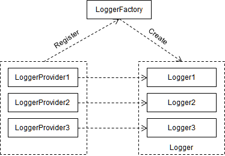

参考资料: 
- [Logging in ASP.NET Core](https://docs.microsoft.com/en-us/aspnet/core/fundamentals/logging/?view=aspnetcore-2.1&tabs=aspnetcore2x)
- [Logging with Logger Message](https://docs.microsoft.com/en-us/aspnet/core/fundamentals/logging/loggermessage?view=aspnetcore-2.1)
- [.NET Core 的日志](http://www.cnblogs.com/artech/p/logging-for-net-core-01.html)

本文大纲: 
<!-- TOC -->

- [前言](#%E5%89%8D%E8%A8%80)
- [日志模型三要素](#%E6%97%A5%E5%BF%97%E6%A8%A1%E5%9E%8B%E4%B8%89%E8%A6%81%E7%B4%A0)
- [创建 Logger](#%E5%88%9B%E5%BB%BA-logger)
- [采用依赖注入来创建日志](#%E9%87%87%E7%94%A8%E4%BE%9D%E8%B5%96%E6%B3%A8%E5%85%A5%E6%9D%A5%E5%88%9B%E5%BB%BA%E6%97%A5%E5%BF%97)
- [日志类别(Category)](#%E6%97%A5%E5%BF%97%E7%B1%BB%E5%88%ABcategory)
- [日志级别(LogLevel)](#%E6%97%A5%E5%BF%97%E7%BA%A7%E5%88%ABloglevel)
- [日志事件 ID(EventId)](#%E6%97%A5%E5%BF%97%E4%BA%8B%E4%BB%B6-ideventid)
- [日志消息模板(Message Template)](#%E6%97%A5%E5%BF%97%E6%B6%88%E6%81%AF%E6%A8%A1%E6%9D%BFmessage-template)
- [日志过滤](#%E6%97%A5%E5%BF%97%E8%BF%87%E6%BB%A4)
    - [通过配置创建日志过滤规则](#%E9%80%9A%E8%BF%87%E9%85%8D%E7%BD%AE%E5%88%9B%E5%BB%BA%E6%97%A5%E5%BF%97%E8%BF%87%E6%BB%A4%E8%A7%84%E5%88%99)
    - [以编程方式创建日志过滤规则](#%E4%BB%A5%E7%BC%96%E7%A8%8B%E6%96%B9%E5%BC%8F%E5%88%9B%E5%BB%BA%E6%97%A5%E5%BF%97%E8%BF%87%E6%BB%A4%E8%A7%84%E5%88%99)
    - [日志过滤规匹配算法](#%E6%97%A5%E5%BF%97%E8%BF%87%E6%BB%A4%E8%A7%84%E5%8C%B9%E9%85%8D%E7%AE%97%E6%B3%95)
    - [日志提供器别名](#%E6%97%A5%E5%BF%97%E6%8F%90%E4%BE%9B%E5%99%A8%E5%88%AB%E5%90%8D)
    - [默认最小日志级别](#%E9%BB%98%E8%AE%A4%E6%9C%80%E5%B0%8F%E6%97%A5%E5%BF%97%E7%BA%A7%E5%88%AB)
    - [日志全局过滤器委托](#%E6%97%A5%E5%BF%97%E5%85%A8%E5%B1%80%E8%BF%87%E6%BB%A4%E5%99%A8%E5%A7%94%E6%89%98)
- [日志区限(Log Scopes)](#%E6%97%A5%E5%BF%97%E5%8C%BA%E9%99%90log-scopes)
- [内置日志提供器](#%E5%86%85%E7%BD%AE%E6%97%A5%E5%BF%97%E6%8F%90%E4%BE%9B%E5%99%A8)
    - [Console 提供器](#console-%E6%8F%90%E4%BE%9B%E5%99%A8)
    - [Debug 提供器](#debug-%E6%8F%90%E4%BE%9B%E5%99%A8)
    - [EventSource 提供器](#eventsource-%E6%8F%90%E4%BE%9B%E5%99%A8)
    - [Windows EventLog 提供器](#windows-eventlog-%E6%8F%90%E4%BE%9B%E5%99%A8)
    - [TraceSource 提供器](#tracesource-%E6%8F%90%E4%BE%9B%E5%99%A8)
    - [Azure App Service 提供器](#azure-app-service-%E6%8F%90%E4%BE%9B%E5%99%A8)
- [LoggerMessage 模式](#loggermessage-%E6%A8%A1%E5%BC%8F)
    - [LoggerMessage.Define](#loggermessagedefine)
    - [LoggerMessage.DefineScope](#loggermessagedefinescope)

<!-- /TOC -->

# 前言
.NET Core提供了独立的日志模型使我们可以采用统一的 API 来完成针对日志记录的编程，我们同时也可以利用其扩展点对这个模型进行定制，比如可以将第三方日志提供器整合到我们的应用中。

# 日志模型三要素
日志记录编程的核心对象:
- ILogger: 将日志消息写到对应的目的地(如文件，数据库等)
- ILoggerFactory: 创建组合式的 Logger，该 Logger 其实是对一组 Logger 的封装，自身并不提供日志写入功能，而是委托内部封装的 Logger 来写日志。
- ILoggerProvider: 创建具有写入日志功能的 Logger。

LoggerFactory 可以注册多个 LoggerProvider 对象，在进行日志编程时，我们会利用 LoggerFactory 对象创建 Logger 来写日志，而该对象委托的内部 Logger 则由这些 LoggerProvider 提供。这三者的关系如下: 



# 创建 Logger
引入以下 Nuget Package 以实现原始的日志功能: 
- Microsoft.Extensions.Logging.Abstractions: 引入 `ILoggerFactory` 和 `ILogger` 接口
- Microsoft.Extensions.Logging: 引入 `ILoggerFactory` 的默认实现 `LoggerFactory`
- Microsoft.Extensions.Logging.Console: 引入 `ConsoleLoggerProvider`
- Microsoft.Extensions.Logging.Debug: 引入 `DebugLoggerProvider`
- System.Text.Encoding.CodePages: 由于 .NET Core 在默认情况下并不支持中文编码，需要在程序启动的时候显式注册一个支持中文编码的 `EncodingProvider`

首先创建 `LoggerFactory` 对象，然后通过 `AddProvider` 方法将一个 `ConsoleLoggerProvider` 和 `DebugLoggerProvider` 对象注册到 `LoggerFactory` 上，这两个 `LoggerProvider` 的构造函数接收一个 `Func<string, LogLevel, bool>` 类型的参数，该委托对象的两个输入参数分别代表日志消息的类型和等级，布尔类型的返回值决定创建的 `Logger` 是否会写入给定的日志消息。由于传入的委托对象总是返回 True，意味着所有级别的日志消息均会被这两个 `LoggerProvider` 创建的 `Logger` 对象写入对应的目的地。日志提供器注册完成之后，调用 `LoggerFactory` 的 `CreateLogger` 方法创建一个指定类别的 `Logger` 对象。
```csharp
class Program
    {
        static void Main(string[] args)
        {
            // 注册 EncodingProvider 实现对中文编码的支持
            Encoding.RegisterProvider(CodePagesEncodingProvider.Instance);

            Func<string, LogLevel, bool> filter = (category, level) => true;
            ILoggerFactory loggerFactory = new LoggerFactory();
            loggerFactory.AddProvider(new ConsoleLoggerProvider(filter, false));
            loggerFactory.AddProvider(new DebugLoggerProvider(filter));
            ILogger logger = loggerFactory.CreateLogger(nameof(Program));

            int eventId = 3721;
            logger.LogInformation(eventId, $"升级到 .NET Core version 1.0.0");
            logger.LogWarning(eventId, "并发量接近上限");
            logger.LogError(eventId, "数据库连接失败(数据库：{Database}，用户名：{User})", "TestDb", "sa");
        }
    }
```

# 采用依赖注入来创建日志
在 ASP.NET Core 应用中，总是以依赖注入的方式来获取相关的服务类型实例，`ILoggerFactory` 就是服务类型的一种。在创建 `ServiceCollection` 对象之后，调用 `AddLogging()` 向其注册日志服务，再从 `ServiceCollection` 对象中获取 `ILoggerFactory` 对象，调用 `ILoggerFactory` 的 `AddConsole()` 和 `AddDebug()` 扩展方法完成日志提供器向 `ILoggerFactory` 的注册。
```csharp
var logger = new ServiceCollection()
                .AddLogging() // call this extension method to register logging service
                .BuildServiceProvider() // build service provider to get services
                .GetService<ILoggerFactory>() // get ILoggerFactory service
                .AddConsole() // register console logger provider to logger factory
                .AddDebug() // register debug logger provider to logger factory
                .CreateLogger(nameof(Program)); // create logger of category 'Program'
```

同一个 `LoggerFactory` 可以注册多个 `LoggerProvider，当` `LoggerFactory` 创建出相应的 `Logger` 对象来写入日志时，日志消息实际上会分发给所有 `LoggerProvider`。而每条日志消息都携带了日志等级， `LoggerProvider` 通过其构造函数传入的 Func 委托来过滤不同等级的日志消息，这样就实现了一条日志消息只写入特定的日志提供器的目的地。

# 日志类别(Category)
每一条日志消息都带有日志类别信息，在创建 ILogger 时可以指定类别，类别为任何字符串值，但按照惯例日志类别为类型的完全限定名，例如: "TodoApi.Controllers.TodoController"。

调用 `ILoggerFactory.CreateLogger` 时可以指定日志类别: 
```csharp
public class TodoController : Controller
{
    private readonly ITodoRepository _todoRepository;
    private readonly ILogger _logger;

    public TodoController(ITodoRepository todoRepository,
        ILoggerFactory logger)
    {
        _todoRepository = todoRepository;
        _logger = logger.CreateLogger("TodoApi.Controllers.TodoController");
    }
```
更多时候使用 `ILogger<T>` 则更简单: 
```csharp
public class TodoController : Controller
{
    private readonly ITodoRepository _todoRepository;
    private readonly ILogger _logger;

    public TodoController(ITodoRepository todoRepository,
        ILogger<TodoController> logger)
    {
        _todoRepository = todoRepository;
        _logger = logger;
    }
```

# 日志级别(LogLevel)
日志级别由轻至重分别为: 
- Trace = 0: 提供给发开人员用于跟踪和调试的信息，通常包含一些敏感数据，绝不能暴露给用户
- Debug = 1: 在开发与调试阶段帮助开发人员分析调试的信息，这些消息通常是短期有效的信息，在部署环境中不会启用该级别
- Information = 2: 记录应用程序的正常行为的日志级别，这些消息通常具有长期有效性。
- Warning = 3: 记录应用程序运行期间不正常或意外事件的日志，这些行为不会导致应用程序崩溃但需要记录下来以供后续调查。
- Error = 4: 记录无法被处理的错误及异常，这些消息指示在单一事务边界内失败，但不影响应用程序的其他部分
- Critical = 5: 记录需要立即进行修正的致命错误，最高警戒级别

ASP.NET Core 将框架级别的事件日志以 Debug 级别日志分发给不同的日志提供器。

# 日志事件 ID(EventId)
每记录一条日志，都可以为其指定事件 ID，事件 ID 用于将一系列相互关联的日志消息串起来，例如，将某件产品添加至购物车相关的日志的 ID 可为 1000，而与结账付款的事件 ID 可为 1001。日志事件 ID 以数据的形式将不同的日志进行逻辑分组，方便日后的查阅与分析。

# 日志消息模板(Message Template)
在调用 ILogger.Log() 时，需要为每条日志消息提供消息模板，该消息模板不同于传统 C# 格式化字符串和最新的插值字符串，其中包含命名占位符而不是数字占位符，填充到占位符的顺序又不与其名称相对应，而是按照占位符的顺序，日志框架这样设计是为了让日志提供器能够实现语义化或结构化的日志存储。如果采用以下方式写入日志: 
```csharp
string p1 = "parm1";
string p2 = "parm2";
_logger.LogInformation("Parameter values: {p2}, {p1}", p1, p2);
```
将会得到的输出结果为: 
```
Parameter values: parm1, parm2
```
> 按照笔者的理解，许多日志提供器都采用了将占位符参数以字段的形式进行存储的功能，在消息模板中的占位符既是可以在消息输出中被替代的字符串，也是在结构化存储中的字段信息，当收集到大量的日志数据之后，通过结构化查询语句将大大提供分析效率。

# 日志过滤
可以针对特定的提供器，或类别，或所有提供器或所有类别指定最小记录的日志级别，小于该级别的日志消息将不会分布至相应的日志提供器，同样，可通过将日志级别设置为 `LogLevel.None` 来忽略所有日志。

## 通过配置创建日志过滤规则
ASP.NET Core 项目模板的代码调用 CreateDefaultBuilder 方法了，该方法默认注册了 `Console` 和 `Debug` 提供器，同时告知日志系统查询 `Logging` 配置块来加载日志配置。
```csharp
public static void Main(string[] args)
{
    var webHost = new WebHostBuilder()
        .UseKestrel()
        .UseContentRoot(Directory.GetCurrentDirectory())
        .ConfigureAppConfiguration((hostingContext, config) =>
        {
            var env = hostingContext.HostingEnvironment;
            config.AddJsonFile("appsettings.json", optional: true, reloadOnChange: true)
                  .AddJsonFile($"appsettings.{env.EnvironmentName}.json", optional: true, reloadOnChange: true);
            config.AddEnvironmentVariables();
        })
        .ConfigureLogging((hostingContext, logging) =>
        {
            logging.AddConfiguration(hostingContext.Configuration.GetSection("Logging"));
            logging.AddConsole();
            logging.AddDebug();
        })
        .UseStartup<Startup>()
        .Build();

    webHost.Run();
}
```
配置数据以日志提供器和类别为单位指定了最小日志级别，例如: 
``` JSON
{
  "Logging": {
    "IncludeScopes": false,
    "Debug": {
      "LogLevel": {
        "Default": "Information"
      }
    },
    "Console": {
      "LogLevel": {
        "Microsoft.AspNetCore.Mvc.Razor.Internal": "Warning",
        "Microsoft.AspNetCore.Mvc.Razor.Razor": "Debug",
        "Microsoft.AspNetCore.Mvc.Razor": "Error",
        "Default": "Information"
      }
    },
    "LogLevel": {
      "Default": "Debug"
    }
  }
}
```

## 以编程方式创建日志过滤规则
考虑以下代码: 
```csharp
WebHost.CreateDefaultBuilder(args)
    .UseStartup<Startup>()
    .ConfigureLogging(logging =>
        logging.AddFilter("System", LogLevel.Debug)
               .AddFilter<DebugLoggerProvider>("Microsoft", LogLevel.Trace))
    .Build();
```
- 第一个 `AddFilter` 方法指示所有提供器的 "System" 类别最小日志级别为 `Debug`。
- 第二个 `AddFilter` 方法指示 `Debug` 日志提供器的 "Microsoft" 类别最小日志级别为 `Trace`。

## 日志过滤规匹配算法
综合以上配置项和编程方式添加的过滤规则，其可以解释为: 

<style type="text/css">
<!-- 改变表格第一列的宽度 --!>
table th:nth-of-type(1) {
    width: 10%;
}
<!-- 改变表格第二列的宽度 --!>
table th:nth-of-type(2) {
    width: 10%;
}
</style>

| Number | Provider      | Categories that begin with ...          | Minimun log level |
| ------ | ------------- | --------------------------------------- | ----------------- |
| 1      | Debug         | All categories                          | Information       |
| 2      | Console       | Microsoft.AspNetCore.Mvc.Razor.Internal | Warning           |
| 3      | Console       | Microsoft.AspNetCore.Mvc.Razor.Razor    | Debug             |
| 4      | Console       | Microsoft.AspNetCore.Mvc.Razor          | Error             |
| 5      | Console       | All categories                          | Information       |
| 6      | All providers | All categories                          | Debug             |
| 7      | All providers | System                                  | Debug             |
| 8      | Debug         | Microsoft                               | Trace             |

当一个指定类别的 ILogger 对象写入日志消息时，框架尝试使用以下逻辑来匹配过滤规则:
1. 选出所有匹配提供器或其别名的规则，如果没有任何规则匹配到该提供器，则应用所有不指定提供器的规则
2. 在从 1 中筛选出的结果的基础上，选出匹配类别的最长类别规则，如果找不到任何规则，则应用所有未指定类别的规则
3. 如果有多个规则匹配，则选择**最后**一个
4. 如果没有任何匹配的规则，则应用[默认最小日志级别](#默认最小日志级别)

假设现在有一个类别为 "Microsoft.AspNetCore.Mvc.Razor.RazorViewEngine" 的 `ILogger` 对象，当其写入日志消息时: 
- Debug 提供器为其筛选出表格中的 1, 6, 8 规则，由于规则 8 最具体，所以规则 8 被应用
- Console 提供器为其筛选出 3, 4, 5, 6 规则，规则 3 最具体，它会被应用

因此，当该 `ILogger` 对象写入日志时，Debug 提供器将输出把级别 `Trace` 以上的日志消息，而 Console 提供器则输出级别 `Debug` 以上的日志消息。

## 日志提供器别名
在配置项中可以将提供器的类型名作为其配置项的根节点，每个日志提供器也定义了别名，.NET Core 定义了以下日志提供器的别名:
- Console: 
- Debug: 
- EventLog: 
- AzureAppServices
- TraceSource
- EventSource

## 默认最小日志级别
前文提到，在没有任何日志过滤规则匹配时，会采用默认最小日志级别，以下代码展示了如何设置默认最小级别: 
```csharp
WebHost.CreateDefaultBuilder(args)
    .UseStartup<Startup>()
    .ConfigureLogging(logging => logging.SetMinimumLevel(LogLevel.Warning))
    .Build();
```

> 如果没有显式指定默认最小日志级别，那么框架的默认值为 `Information`。

## 日志全局过滤器委托
可以向框架注册一个 `Func<Provider, Category, LogLevel>`  的委托，让匹配不到任何日志过滤规则的 `ILogger` 对象通过该委托获得日志级别: 
```csharp
WebHost.CreateDefaultBuilder(args)
    .UseStartup<Startup>()
    .ConfigureLogging(logBuilder =>
    {
        logBuilder.AddFilter((provider, category, logLevel) =>
        {
            if (provider == "Microsoft.Extensions.Logging.Console.ConsoleLoggerProvider" && 
                category == "TodoApi.Controllers.TodoController")
            {
                return false;
            }
            return true;
        });
    })
    .Build();
```

# 日志区限(Log Scopes)
可通过 `scope` 的方式将一系列由在逻辑上相互关联的操作产生的日志消息组合成一个集合，例如，你可能希望将一个数据库事务中产生的所有日志消息包含相同的事务 ID。调用 `ILogger.BeginScope<TState>` 返回一个 Scope 对象，该对象实现了 `IDisposable` 接口，通常使用 `using` 语句将一组与 Scope 相关的日志消息写入包围起来: 
```csharp
public IActionResult GetById(string id)
{
    TodoItem item;
    using (_logger.BeginScope("Message attached to logs created in the using block"))
    {
        _logger.LogInformation(LoggingEvents.GetItem, "Getting item {ID}", id);
        item = _todoRepository.Find(id);
        if (item == null)
        {
            _logger.LogWarning(LoggingEvents.GetItemNotFound, "GetById({ID}) NOT FOUND", id);
            return NotFound();
        }
    }
    return new ObjectResult(item);
}
```
以下代码在 Program.cs 中为 Console 提供器启用了日志区限:
```csharp
.ConfigureLogging((hostingContext, logging) =>
{
    logging.AddConfiguration(hostingContext.Configuration.GetSection("Logging"));
    logging.AddConsole(options => options.IncludeScopes = true);
    logging.AddDebug();
})
```
> 在 `appsetings` 配置文件中使用配置项启用该功能仅在 ASP.NET Core 2.1 版本以后可用

这样，每条日志消息都会包含完整的区限信息: 
```
info: TodoApi.Controllers.TodoController[1002]
      => RequestId:0HKV9C49II9CK RequestPath:/api/todo/0 => TodoApi.Controllers.TodoController.GetById (TodoApi) => Message attached to logs created in the using block
      Getting item 0
warn: TodoApi.Controllers.TodoController[4000]
      => RequestId:0HKV9C49II9CK RequestPath:/api/todo/0 => TodoApi.Controllers.TodoController.GetById (TodoApi) => Message attached to logs created in the using block
      GetById(0) NOT FOUND
```
# 内置日志提供器
ASP.NET Core 内置了以下提供器:
- Console
- Debug
- EventLog
- AzureAppServices
- TraceSource
- EventSource

## Console 提供器
Microsoft.Extensions.Logging.Console 包将日志消息输出到控制台: 
```
logging.AddConsole()
```
## Debug 提供器
Microsoft.Extensions.Logging.Debug 包通过 System.Diagnostics.Debug 类(调用 Debug.WriteLine 方法)输出日志消息，在 Linux 系统中，该提供器将日志写入 `/var/log/message` 中。
```
logging.AddDebug()
```
## EventSource 提供器
Microsoft.Extensions.Logging.EventSource 包实现了事件追踪，在 Windows 系统下，它使用 ETW，该提供器是跨平台的，但在 Linux 或 macOS 下尚无可用的可视化工具。
```
logging.AddEventSourceLogger()
```
## Windows EventLog 提供器
Microsoft.Extensions.Logging.EventLog 包将日志发送至 Windows Event Log。
```
logging.AddEventLog()
```
## TraceSource 提供器
Microsoft.Extensions.Logging.TraceSource 包利用 System.Diagnostics.TraceSource 库和提供器。
```
logging.AddTraceSource(sourceSwitchName)
```
> 该提供当前仅支持 .NET Framework 版本。
## Azure App Service 提供器
Microsoft.Extensions.Logging.AzureAppServices 包将日志写入到 Azure App Service 应用的文件系统的文本文件和 Azure Storage 帐号的 [blob storage](https://docs.microsoft.com/en-us/azure/storage/blobs/storage-quickstart-blobs-dotnet?tabs=windows#what-is-blob-storage)，该提供器仅在 ASP.NET Core 1.1 版本以后可用。

# LoggerMessage 模式
与日志系统的扩展方法模式相比，`LoggerMessage` 模式可减少对象的分配和计算量以提供性能。该模式提供了以下优点:
- 扩展方法模式，如 `LogInformation`, `LogDebug` 和 `LogError` 等方法会装箱值对象，而 `LoggerMessage` 模式通过使用强类型参数的 `Action` 委托避免了装箱
- 扩展方法模式在每条日志消息写入时都要求传递消息模板，而 `LoggerMessage` 模式仅在消息定义时传递消息模板

## LoggerMessage.Define

`LoggerMessage.Define` 的示例代码可参考[示例代码](https://github.com/aspnet/Docs/tree/master/aspnetcore/fundamentals/logging/loggermessage/sample/)

`LoggerMessage.Define` 静态方法创建并返回一个 `Action` 委托用以记录日志，其重载最高支持 6 个消息模板的命名参数，传递至 Define 方法的字符串是一个包含变量占位符的消息模板而不是一个插值字符串(形如 `This is a {variable}.`)，占位符以定义的参数顺序依次被填充
> 占位符的名称应该在多个消息模板之间保持一致，它们在结构化存储中扮演了字段名的角色，推荐以 Pascal 风格来命名占位符，例如 `{Count}`, `{FirstName}`。

每条日志记录方法都是一个由 `LoggerMessage.Define` 方法创建的 `Action` 委托，例如: 
```csharp
private static readonly Action<ILogger, Exception> _indexPageRequested;
```
对于该 Action，指定:
- 日志级别
- 一个唯一的事件 ID(EventId)和包含扩展方法的类型的名称
- 消息模板

```csharp
_indexPageRequested = LoggerMessage.Define(
    LogLevel.Information, 
    new EventId(1, nameof(IndexPageRequested)), 
    "GET request for Index page");
```
上述代码表示:
- 日志级别设置为 `Information`
- 事件 ID 设为 1 并传入 `IndexPageRequested` 类型的名称
- 自定义的消息模板

`Action` 委托由一个定义为 `ILogger` 的强类型 `IndexPageRequested` 扩展方法调用:
```csharp
public static void IndexPageRequested(this ILogger logger)
{
    _indexPageRequested(logger, null);
}
```
`ILogger` 在 `OnGetAsync` 方法中调用 `IndexPageRequested` 扩展方法完成日志记录。
```csharp
public static void IndexPageRequested(this ILogger logger)
{
    _logger.IndexPageRequested();
    Quotes = await _db.Quotes.AsNoTracking().ToListAsync();
}
```

## LoggerMessage.DefineScope
`LoggerMessage.DefineScope` 遵循一样的模式，不同之处在于其返回一个 `Func<T,IDisposable>` 委托，在使用该对象时，必须确保区限功能已启用，并使用 `using` 包裹上下文。