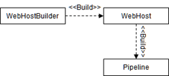
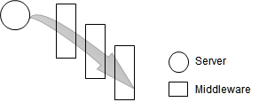
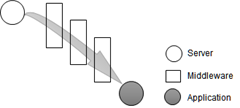
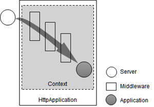
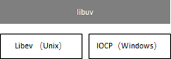
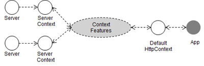
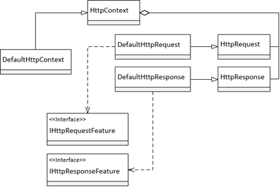
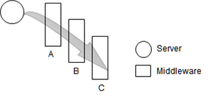

参考资料: 
- [采用管道处理请求](http://www.cnblogs.com/artech/p/rebuild-pipeline-01.html)
- [管道如何处理请求](http://www.cnblogs.com/artech/p/rebuild-pipeline-02.html)
- [管道如何创建](http://www.cnblogs.com/artech/p/rebuild-pipeline-03.html)
- [中间件究竟是什么](http://www.cnblogs.com/artech/p/asp-net-core-real-pipeline-01.html)

本文大纲:
<!-- TOC -->

- [概述](#%E6%A6%82%E8%BF%B0)
    - [一个简单的 Hello World 应用](#%E4%B8%80%E4%B8%AA%E7%AE%80%E5%8D%95%E7%9A%84-hello-world-%E5%BA%94%E7%94%A8)
    - [管道的构成](#%E7%AE%A1%E9%81%93%E7%9A%84%E6%9E%84%E6%88%90)
    - [定制管道](#%E5%AE%9A%E5%88%B6%E7%AE%A1%E9%81%93)
- [服务器](#%E6%9C%8D%E5%8A%A1%E5%99%A8)
    - [HttpApplication](#httpapplication)
    - [HostingApplication](#hostingapplication)
    - [KestrelServer](#kestrelserver)
    - [ServerAddressesFeature](#serveraddressesfeature)
- [WebHost](#webhost)
    - [WebHostOptions](#webhostoptions)
    - [构建管道](#%E6%9E%84%E5%BB%BA%E7%AE%A1%E9%81%93)
- [WebHostBuilder](#webhostbuilder)
    - [几个常用的扩展方法](#%E5%87%A0%E4%B8%AA%E5%B8%B8%E7%94%A8%E7%9A%84%E6%89%A9%E5%B1%95%E6%96%B9%E6%B3%95)
- [HttpContext](#httpcontext)
    - [FeatureCollection](#featurecollection)
    - [DefaultHttpContext](#defaulthttpcontext)
    - [HttpContextFactory](#httpcontextfactory)
- [ApplicationBulder](#applicationbulder)
    - [ApplicationBuilderFactory](#applicationbuilderfactory)
- [中间件类型](#%E4%B8%AD%E9%97%B4%E4%BB%B6%E7%B1%BB%E5%9E%8B)
    - [中间件类型注册](#%E4%B8%AD%E9%97%B4%E4%BB%B6%E7%B1%BB%E5%9E%8B%E6%B3%A8%E5%86%8C)

<!-- /TOC -->

# 概述
HTTP 协议自身的特性决定了任何一个 Web 应用的工作方式都是监听、接收并处理 HTTP 请求，并最终对请求予以响应。HTTP 请求处理是管道式设计典型的应用场景，ASP.NET Core 根据一个具体的 HTTP 请求构建一个管道，接收到的 HTTP 请求消息像水一样流入这个管道，组成这个管道的各个环节依次对它作相应的处理。整个请求处理完成后的结果同样转变成消息逆向流入这个管道进行处理，并最终变成回复给客户端的 HTTP 响应。

## 一个简单的 Hello World 应用
首先来看一个简单的 .NET Core 应用程序:

```csharp
public class Program
{
    public static void Main()
    {
        new WebHostBuilder()
            .UseKestrel()
            .Configure(app => app.Run(async context=> await context.Response.WriteAsync("Hello World")))            
            .Build()
            .Run();
    }
}
```

`WebHost` 对象可以看成是 Web 应用的宿主，启动 Web 应用本质上就是启动 `WebHost` 宿主对象。`WebHostBuilder` 负责创建 `WebHost` 对象，它的 `Build` 方法创建并返回相应的 `WebHost`。

`Configure` 方法注册到 `WebHostBuilder` 上的委托对象(委托类型为 `Action<IApplicationBuilder>`)用于定制管道的逻辑。调用 `WebHost` 的扩展方法 `Run` 启动应用程序时，用于监听，接收，处理和响应 HTTP 请求的管道也随之被建立。

## 管道的构成
HTTP 请求处理流程始于对请求的监听，终于对请求的响应，这两项工作均由同一个对象来完成，我们称之为 **「服务器(Server)」** 。尽管 ASP.NET Core 的请求处理管道可以任意定制，但是该管道必须有一个 Server，Server 是整个管道的**「水龙头」**。在上述的 Hello World 应用中，在 `Build` 一个 `WebHost` 之前，首先调用了扩展方法 `UseKestrel`，该方法就是为后续构建的管道注册一个名为 `KestrelServer` 的**「服务器」**。

调用 `WebHost` 的 `Start` 方法(调用 `WebHost` 的扩展方法 `Run` 时，它的 `Start` 方法会被自动调用)之后，定制的管道会被构建出来，管道的服务器将绑定到一个预设的端口(`KestrelServer` 默认采用 5000 作为监听端口)开始监听请求。HTTP 请求一旦抵达，服务器将其标准化并分发给管道后续的节点。管道中位于服务器之后的节点称为**「中间件(Middleware)」**。每个中间件都具有各自独立的功能，例如有专门实现路由功能的中间件，有专门实施用户认证的中间件。**所谓的管道定制体现在根据具体的需求选择对应的中间件组成最终的请求处理管道**。下图揭示了由一个服务器和一组中间件构成的请求处理管道:

一个基于 ASP.NET Core 的应用程序通常是根据某个框架开发的，而框架本身就是通过某个或多个**「中间件」**构建出来的。ASP.NET Core MVC 就是典型的基于 ASP.NET Core 的开发框架，它定义了一个叫做**「路由」**的中间件实现了请求地址与 `Controller/Action` 之间的映射，并在此基础实现了激活 `Controller`，执行 `Action` 以及呈现 `View` 等一系列的功能。所以应用程序可以视为某个中间件的一部分，如果一定要将它独立出来，整个请求处理管道将呈现出如下图所示的结构: 


## 定制管道
在上述的 Hello World 程序中，调用扩展方法 `UseKestrel` 注册 `KestrelServer` 服务器之后，还调用 `WebHostBuilder` 的 `Configure` 的扩展方法注册了一个类型为 `Action<IApplicationBuilder>` 的委托对象。注册这个委托对象的目的在于对构建的管道定制请求处理逻辑，即为管道注册中间件。这个委托对象调用 `ApplicationBuilder` 的 `Run` 扩展方法注册了一个中间件来为每个请求响应一个「Hello World」字符串。
```csharp
public static IWebHostBuilder Configure(this IWebHostBuilder hostBuilder, Action<IApplicationBuilder> configureApp)
```
除了调用 `WebHostBuilder` 的 `Configure` 方法来注册一个 `Action<IApplicationBuilder>` 类型的委托，注册中间件定义管道的逻辑更多地还是定义在一个单独的类型中。由于管道的定制总是在应用程序启动(**Startup**)的时候进行，一般称这个用于定制管道的类型为**「启动类型」**，并在大部分情况下会直接命名为 `Startup`。**按照约定，通过注册中间件定制管道的操作会实现在名为 `Configure` 的方法中，方法的第一个参数必须是一个 `IApplicationBuilder` 接口的实例**，后续可定义任意数量和类型的参数，当 ASP.NET Core 框架调用该方法的时候，会以依赖注入的方式提供这些参数的值。启动类型可以通过调用 `WebHostBuilder` 的扩展方法 `UseStartup<T>` 来指定，如下面的代码与前面演示的示例是完全等效的。
```csharp
public class Startup
{
    public void Configure(IApplicationBuilder app)
    {
        app.Run(async context => await context.Response.WriteAsync("Hello World"));
    }
}

public class Program
{
    public static void Main()
    {
        new WebHostBuilder()
            .UseKestrel()
            .UseStartup<Startup>()         
            .Build()
            .Run();
    }
}
```
在真正的项目开发中，我们会利用 `ApplicationBuilder` 注册相应的中间件进而构建一个符合需求的请求处理管道。如下所示，我们除了按照上面的方式调用扩展方法 `UseMvc` 注册了支撑 MVC 框架的中间件(实际上是一个实现路由的中间件)之外，还调用了其它的扩展方法注册了相应的中间件实现了对静态文件的访问(`UseStaticFiles`)，错误页面的呈现(`UseExceptionHandler`)以及基于 ASP.NET Identity Framework 的认证(`UseIdentity`):
```csharp
public class Startup
{
    public void Configure(IApplicationBuilder app)
    {
        app.UseExceptionHandler("/Home/Error");
        app.UseStaticFiles();
        app.UseIdentity();           
 
        app.UseMvc();
    }
}
```

# 服务器

服务器是 ASP.NET Core 管道的第一个节点，它负责请求的监听和接收，并最终完成对请求的响应。服务器是所有实现了 `IServer` 接口的类型及其对象的统称。`IServer` 接口定义了一个只读属性 `Features` 返回描述自身特性集合的 `IFeatureCollection` 对象，`Start` 方法用于启动服务器。
```csharp
public interface IServer
{
    IFeatureCollection Features { get; }
    void Start<TContext>(IHttpApplication<TContext> application);    
}
```

`Start` 方法一旦执行，服务会马上开始监听工作。任何 HTTP 请求抵达，该方法接收一个 `HttpApplication` 对象创建一个上下文，并在此上下文中完成对请求的所有处理操作。当完成了对请求的处理任务之后，`HttpApplication` 对象会自行负责回收释放由它创建的上下文。

## HttpApplication
ASP.NET Core 请求处理管道由一个服务器和一组有序排列的中间件组合而成。如果在此之上作进一步抽象，将后者抽象成一个 `HttpApplication` 对象，该管道就成了一个 `Server` 和 `HttpApplication` 的组合。`Server` 将接收到的 HTTP 请求转发给 `HttpApplication` 对象，后续的请求完全由它来负责。
`HttpApplication` 从服务器获得请求之后，会使用注册的中间件对请求进行处理，并最终将请求递交给应用程序。`HttpApplication` 针对请求的处理在一个执行上下文中完成，这个上下文为对单一请求的整个处理过程定义了一个边界。描述 HTTP 请求的 `HttpContext` 是这个执行上下文中最核心的部分，除此之外，我们还可以根据需要将其他相关的信息定义其中，所以 `IHttpApplication<TContext>` 接口采用泛型来表示定义这个上下文的类型。

一个 `HttpApplication` 对象在接收到 `Server` 转发的请求之后完成三项基本的操作，即**「创建上下文」**，**「在上下文中处理请求」**以及**「请求处理完成之后释放上下文」**，这些操作通过三个方法来完成。
```csharp
public interface IHttpApplication<TContext>
{
    TContext CreateContext(IFeatureCollection contextFeatures); 
    Task ProcessRequestAsync(TContext context);
    void DisposeContext(TContext context, Exception exception);
}
```

`CreateContext` 和 `DisposeContext` 方法分别体现了执行上下文的创建和释放，`CreateContext` 方法的参数 `contextFeatures` 表示描述原始上下文的特性集合。在此上下文中针对请求的处理实现在另一个方法 `ProcessRequestAsync` 中。
## HostingApplication
在 ASP.NET Core 中，`HostingApplication` 类型是 `IHttpApplication<Context>` 默认实现类，它创建的执行上下文有如下定义: 
```csharp
public struct Context
        {
            public HttpContext HttpContext { get; set; }
            public IDisposable Scope { get; set; }
            public long StartTimestamp { get; set; }
        }
```

该类型封装了一个 `HttpContext` 对象，后者是真正描述当前 HTTP 请求的上下文，承载着核心的上下文信息。除此之外，`Context` 还定义了 `Scope` 和 `StartTimestamp` 两个属性，两者与日志记录和事件追踪有关，前者用来将针对同一请求的多次日志记录关联到同一个上下文区限(见[日志区限](/Web/ASP-NET-Core/aspnetcore-fundamentals-logging/#日志类别Category)；后者表示请求开始处理的时间戳，如果在完成请求处理的时候记录下当时的时间戳，就可以计算出整个请求处理所花费的时间。

```csharp
public class HostingApplication : IHttpApplication<HostingApplication.Context>
    {
        public HostingApplication(RequestDelegate application, ILogger logger, DiagnosticSource diagnosticSource, IHttpContextFactory httpContextFactory);

        public Context CreateContext(IFeatureCollection contextFeatures);
        public void DisposeContext(Context context, Exception exception);
        public Task ProcessRequestAsync(Context context);
    }
```
`HostingApplication` 的构造函数依赖一个 `RequestDelegate` 的委托对象，该对象由 `IApplicationBuilder` 注册的中间件生成，`HttpContextFactory` 用以创建 `HttpContext` 对象:
```csharp
public class HostingApplication : IHttpApplication<HostingApplication.Context>
{
    private readonly RequestDelegate         _application;
    private readonly DiagnosticSource        _diagnosticSource;
    private readonly IHttpContextFactory     _httpContextFactory;
    private readonly ILogger                 _logger;
 
    public HostingApplication(RequestDelegate application, ILogger logger, DiagnosticSource diagnosticSource, IHttpContextFactory httpContextFactory)
    {
        _application          = application;
        _logger               = logger;
        _diagnosticSource     = diagnosticSource;
        _httpContextFactory   = httpContextFactory;
    }
}
```
`logger` 和 `diagnosticSource` 是与日志记录有关的参数。`HostingApplication` 对 `CreateContext`，`ProcessRequestAsync` 和 `DisposeContext` 有如下实现:
```csharp
public Context CreateContext(IFeatureCollection contextFeatures)
    {
        //省略其他实现代码
        return new Context
        {
               HttpContext      = _httpContextFactory.Create(contextFeatures),
               Scope            = ...,
               StartTimestamp   = ...
        };
    }
 
    public Task ProcessRequestAsync(Context context)
    {
        Return _application(context.HttpContext);
    }
 
    public void DisposeContext(Context context, Exception exception)
    {        
        //省略其他实现代码
        context.Scope.Dispose();
        _httpContextFactory.Dispose(context.HttpContext);
    }
```
- `CreateContext` 直接利用私有字段 `_httpContextFactory` 创建一个 `HttpContext` 对象并将其赋值给 `Context` 的同名属性。
- `ProcessRequestAsync` 方法则使用 `HttpContext` 传入 `RequestDelegate` 委托。
- `DisposeContext` 方法执行时 `Context` 属性的 `Scope` 会率先被释放，此后 调用 `IHttpContextFactory.Dispose` 方法释放 `HttpContext` 对象。

## KestrelServer
跨平台是 ASP.NET Core 一个显著的特性，而 `KestrelServer` 是目前微软推出的唯一一个能够真正跨平台的服务器。`KestrelServer` 基于 `KestrelEngine` 的网络引擎实现对请求的监听，接收和响应。`KetrelServer` 之所以可以跨平台，在于 `KestrelEngine` 是在 `libuv` 跨平台网络库上开发的。

> `libuv` 是基于 Unix 系统针对事件循环和事件模型的网络库 `libev` 开发的。`libev` 不支持 Windows，有人在 `libev` 之上创建了一个抽象层以屏蔽平台之间的差异，这个抽象层就是 `libuv`。`libuv` 在 Windows 平台上使用 IOCP 的形式实现，到目前为止，`libuv` 已经支持更多除 Unix 和 Windows 以外的平台了，如 Linux(2.6)、MacOS 和 Solaris (121以及之后的版本)。下图揭示了 `libuv` 针对 Unix 和 Windows 的跨平台实现原理。


以下是 `KestrelServer` 类型的定义:
```csharp
public class KestrelServer : IServer
{   
    public IFeatureCollection     Features { get; }
    public KestrelServerOptions   Options { get; }
 
    public KestrelServer(IOptions<KestrelServerOptions> options, IApplicationLifetime applicationLifetime, ILoggerFactory loggerFactory);
    public void Dispose();
    public void Start<TContext>(IHttpApplication<TContext> application);
}
```

除了实现接口 `IServer` 定义的 `Features` 属性之外，`KestrelServer` 还包含一个类型为 `KestrelServerOptions` 的只读属性 Options。这个属性表示 `KestrelServer` 的配置信息，构造函数通过输入参数 `IOptions<KestrelServerOptions>` 对其进行初始化，这里同样采用 [Options 模式](/Web/ASP-NET-Core/aspnetcore-fundamentals-configuration/#options-模式)。例如可以通过一个 JSON 文件来配置 `KestrelServer`:
``` JSON
{
  "noDelay"            : false,
  "shutdownTimeout"    : "00:00:10",
  "threadCount"        :  10
}
```

构造函数的另外两个参数 - `IApplicationLifetime` 与与应用的生命周期管理有关， `ILoggerFactory` 则用于创建记录日志的 `Logger`。

通常，通过调用 `WebHostBuilder` 的 `UseKestrel` 扩展方法来注册 `KestrelServer`。`UseKestrel` 方法有两个重载，其中一个接收一个类型为 `Action<KestrelServerOptions>` 的参数，通过赋值该参数直接完成对 `KestrelServer` 的配置。代码如下:
```csharp
public static class WebHostBuilderKestrelExtensions
{
    public static IWebHostBuilder UseKestrel(this IWebHostBuilder hostBuilder);
    public static IWebHostBuilder UseKestrel(this IWebHostBuilder hostBuilder, Action<KestrelServerOptions> options);
}
```
由于服务器负责监听，接收和响应请求，它是影响整个 Web 应用响应能力和吞吐量最大的因素之一，为了更加有效地使用服务器，可以根据具体的网络负载状况对其作针对性的设置。现在来看看 `KestrelServerOptions` 类型的定义:
```csharp
public class KestrelServerOptions
{   
    //省略其他成员
    public int          MaxPooledHeaders { get; set; }
    public int          MaxPooledStreams { get; set; }
    public bool         NoDelay { get; set; }
    public TimeSpan     ShutdownTimeout { get; set; }
    public int          ThreadCount { get; set; }
}
```

## ServerAddressesFeature
`KestrelServer` 默认采用 `http://localhost:5000` 作为监听地址，服务器的监听地址可以显式指定，其通过 `IServerAddressesFeature` 提供支持。服务器接口 `IServer` 中定义了一个类型为 `IFeatureCollection` 的只读属性 `Features`，它表示当前服务器的特性集合，`ServerAddressesFeature` 作为一个重要的特性，就包含在这个集合中。该接口只有一个唯一的只读属性返回服务器的监听地址列表。ASP.NET Core 默认使用 `ServerAddressesFeature` 类型实现 `IServerAddressesFeature` 接口，定义如下:
```csharp
public interface IServerAddressesFeature
{
    ICollection<string> Addresses { get; }
}
 
public class ServerAddressesFeature : IServerAddressesFeature
{
    public ICollection<string> Addresses { get; }
}
```
`WebHost` 通过依赖注入创建的服务器的 `Features` 属性中会默认包含一个 `ServerAddressesFeature` 对象。`WebHost` 会将显式指定的地址(一个或者多个)添加到该对象的监听地址列表中。地址列表其作为配置项保存在一个 `Configuration` 对象上，配置项对应的 Key 为 `urls`，可以通过 `WebHostDefaults` 的静态只读属性 `ServerUrlsKey` 返回这个 Key。
```csharp
new WebHostBuilder()
    .UseSetting(WebHostDefaults.ServerUrlsKey, "http://localhost:3721/")
    .UseKestrel()
    .UseStartup<Startup>()
    .Build()
    .Run();
```

WebHost 的配置最初来源于创建它的 `WebHostBuilder`，`WebHostBuilder` 提供了一个 `UseSettings` 方法来设置某个配置项的值。对监听地址的显式设置，最直接的编程方式是调用 `WebHostBuilder` 的扩展方法 `UseUrls`，该方法的实现逻辑与上面完全一致:
```csharp
public static class WebHostBuilderExtensions
{
    public static IWebHostBuilder UseUrls(this IWebHostBuilder hostBuilder, params string[] urls) 
    =>hostBuilder.UseSetting(WebHostDefaults.ServerUrlsKey, string.Join(ServerUrlsSeparator, urls)) ;    
}
```

# WebHost
ASP.NET Core 管道是由作为应用程序宿主的 `WebHost` 对象创建出来的。应用的启动和关闭是通过启动或者关闭对应 `WebHost` 的方式实现的。`IWebHost` 接口定义了如下三个基本成员:
```csharp
public interface IWebHost : IDisposable
{    
    void Start();
    IFeatureCollection     ServerFeatures { get; }
    IServiceProvider       Services { get; }
}
```
`Start` 方法用于启动宿主程序。编程中通常会调用它的一个扩展方法 `Run` 来启动 `WebHost`，`Run` 方法会在内部调用 `Start` 方法。当 WebHost 启动后，服务器立即开始监听请求。`IWebHost` 接口的默认实现类是 `WebHost`，它总是由一个 `WebHostBuilder` 对象创建，`WebHost` 的构造函数依赖 4 个参数:
```csharp
public class WebHost : IWebHost
{
    private IServiceCollection   _appServices;
    private IServiceProvider     _hostingServiceProvider;
    private WebHostOptions       _options;
    private IConfiguration       _config;
    private ApplicationLifetime  _applicationLifetime;
    
    public IServiceProvider       Services { get; private set; }
    public IFeatureCollection     ServerFeatures 
    {
         get { return this.Services.GetRequiredService<IServer>()?.Features; }
    }

    public WebHost(IServiceCollection appServices, IServiceProvider hostingServiceProvider, WebHostOptions options, IConfiguration config)
    {
        _appServices                 = appServices;
        _hostingServiceProvider      = hostingServiceProvider;
        _options                     = options;
        _config                      = config;
        
        _applicationLifetime         = new ApplicationLifetime();
        appServices.AddSingleton<IApplicationLifetime>(_applicationLifetime);
    }

    public void Dispose()
    {
        _applicationLifetime.StopApplication();
        (this.Services as IDisposable)?.Dispose();
        _applicationLifetime.NotifyStopped();
    }
    
    public void Start()
    {
        
    }
}
```
- appServices 从直接注册到 `WebHostBuilder` 上的服务而来
- hostingServiceProvider 是由 appServices 创建的`IServiceProvider`。
- 只读属性 `Services` 返回一个 `ServiceProvider` 对象，其利用构造函数传入的 `ServiceCollection` 对象创建。
- 只读属性 `ServerFeatures` 返回服务器的特性集合，而服务器本身使用 `ServiceProvider` 获得
- `Dispose` 方法释放服务器对象，并利用 `ApplicationLifetime` 发送相应的信号。

## WebHostOptions
一个 `WebHostOptions` 对象为构建的 `WebHost` 对象提供一些预定义的选项，这些选项很重要，它们决定了由 `WebHost` 构建的管道进行内容加载以及异常处理等方面的行为。以下是其类型定义:
```csharp
public class WebHostOptions
{
    public string     ApplicationName { get; set; }
    public bool       DetailedErrors { get; set; }
    public bool       CaptureStartupErrors { get; set; }
    public string     Environment { get; set; }        
    public string     StartupAssembly { get; set; }
    public string     WebRoot { get; set; }
    public string     ContentRootPath { get; set; }
 
    public WebHostOptions()
    public WebHostOptions(IConfiguration configuration) 
}
```
可以将这些选项定义在配置中，并利用 Options 模式创建一个 `WebHostOptions` 对象。 
## 构建管道
`Start` 方法真正启动 `WebHost`:
```csharp
public void Start()
    {
        //注册服务
        IStartup startup = _hostingServiceProvider.GetRequiredService<IStartup>();
        this.Services = startup.ConfigureServices(_appServices);
           
        //注册中间件
        Action<IApplicationBuilder> configure = startup.Configure;
        configure = this.Services.GetServices<IStartupFilter>().Reverse().Aggregate(configure, (next, current) => current.Configure(next));
        IApplicationBuilder appBuilder = this.Services.GetRequiredService<IApplicationBuilder>();
        configure(appBuilder);
 
        //为服务器设置监听地址
        IServer server = this.Services.GetRequiredService<IServer>();
        IServerAddressesFeature addressesFeature = server.Features.Get<IServerAddressesFeature>();
        if (null != addressesFeature && !addressesFeature.Addresses.Any())
        {
            string addresses = _config["urls"] ?? "http://localhost:5000";
            foreach (string address in addresses.Split(';'))
            {
                addressesFeature.Addresses.Add(address);
            }
        }
        //启动服务器
        RequestDelegate application = appBuilder.Build();
        ILogger logger = this.Services.GetRequiredService <ILogger<MyWebHost>>();
        DiagnosticSource diagnosticSource = this.Services.GetRequiredService<DiagnosticSource>();
        IHttpContextFactory httpContextFactory = this.Services.GetRequiredService<IHttpContextFactory>();
        server.Start(new HostingApplication(application, logger, diagnosticSource, httpContextFactory));
 
        //对外发送通知
        _applicationLifetime.NotifyStarted();
    }
```
1. 注册服务: `Start` 方法首先通过 `ServiceProvider` 获取 `Startup` 的实例，并调用 ConfigureServices 注册所有服务。
2. 注册中间件: 使用 `ServiceProvider` 获取所有注册的 `StartupFilter`，并结合之前提取的 `Startup` 对象创建一个注册中间件的委托(`Action<IApplicationBuilder>`)。从 `ServiceProvider` 获取 `ApplicationBuilder` 对象作为参数传入该委托，完成中间件的注册。
3. 设置服务器监听地址: 使用 `ServiceProvider` 提取注册在 `WebHostBuilder` 上的服务器对象，从该对象的 `Features` 属性中提取 `IServerAddressesFeature` 对象，从配置中提取显式指定的监听地址，将其逐个加入到 `IServerAddressesFeature` 的 `Addresses` 集合中。如果没有任何显式指定的监听地址，那么默认值为 `http://localhost:5000`。
4. 启动服务器: 准备就绪的服务器由 `IServer.Start` 方法启动，该方法接收一个 `HttpApplication<TContext>` 作为参数，创建该接口的默认实现者 `HostingApplication` 需要 4 个参数: 
    1. `RequestDelegate`: 中间件链表，通过 `IApplicationBuilder.Build` 获取。
    2. `Logger`: 日志记录器，通过 `ServiceProvider` 获取。
    3. `DiagnosticSource`: 通过 `ServiceProvider` 获取。
    4. `HttpContextFactory`: Http 上下文工厂，通过 `ServiceProvider` 获取。
5. 发布通知: 服务器成功启动之后，向外发送通知

# WebHostBuilder
`WebHostBuilder` 是 `WebHost` 的创建者，`IWebHostBuilder` 接口除了定义用来创建 `WebHost` 的核心方法 `Build` 之外，还定义了其他一些方法:
```csharp
public interface IWebHostBuilder
{
    IWebHost Build();
    IWebHostBuilder ConfigureServices(Action<IServiceCollection> configureServices);
    IWebHostBuilder UseLoggerFactory(ILoggerFactory loggerFactory);
    IWebHostBuilder ConfigureLogging(Action<ILoggerFactory> configureLogging);
    string GetSetting(string key);    
    IWebHostBuilder UseSetting(string key, string value);
}
```
ASP.NET Core 有两种注册服务的途径，一种是将服务注册实现在启动类的 `ConfigureServices` 方法中，另一种就是调用 `IWebHostBuilder` 的 `ConfigureServices` 方法。前者实际上是在 `WebHost` 启动时提取 `Startup` 对象调用其 `ConfigureServices` 进行注册，而 `IWebHostBuilder.ConfigureServices` 直接将服务提供给创建的 `WebHost`。

`UseLoggerFactory` 设置一个默认的 `ILoggerFactory` 对象，`ConfigureLogging` 则对 `ILoggerFactory` 进行配置，具体参见[日志系统](/Web/ASP-NET-Core/aspnetcore-fundamentals-logging/)。

`IWebHostBuilder` 的默认实现类型时 `WebHostBuilder`，以下代码展示了除 Build 方法以外的其他成员的实现:
```csharp
public interface IWebHostBuilder
public class WebHostBuilder : IWebHostBuilder
{
    private List<Action<ILoggerFactory>> _configureLoggingDelegates = new List<Action<ILoggerFactory>>();
    private List<Action<IServiceCollection>> _configureServicesDelegates = new List<Action<IServiceCollection>>();
    private ILoggerFactory _loggerFactory = new LoggerFactory();
    private IConfiguration _config = new ConfigurationBuilder().AddEnvironmentVariables("ASPNETCORE_").Build();
 
    public IWebHostBuilder ConfigureLogging(Action<ILoggerFactory> configureLogging)
    {
        _configureLoggingDelegates.Add(configureLogging);
        return this;
    }
 
    public IWebHostBuilder ConfigureServices(Action<IServiceCollection> configureServices)
    {
        _configureServicesDelegates.Add(configureServices);
        return this;
    }
 
    public string GetSetting(string key)
    {
        return _config[key];
    }
 
    public IWebHostBuilder UseLoggerFactory(ILoggerFactory loggerFactory)
    {
        _loggerFactory = loggerFactory;
        return this;
    }
 
    public IWebHostBuilder UseSetting(string key, string value)
    {
        _config[key] = value;
        return this;
    }
    ...
}
```
默认创建了一个 `Configuration` 类型的字段 `_config` 表示应用使用的配置，它默认采用环境变量(用于筛选环境变量的前缀为`ASPNETCORE_`)作为配置源，`GetSetting` 和 `UseSetting` 方法都在内部操作这个字段。另一个字段 `_loggerFactory` 表示默认使用的 `ILoggerFactory`，`UseLoggerFactory` 方法指定的 `LoggerFactory` 用来对这个字段进行赋值。`ConfigureLogging` 和 `ConfigureServices` 仅仅将传入的委托对象保存在一个集合中。

`Build` 方法实现创建 `WebHost` 对象并注册必要的服务，以下列出这些服务的不完全列表:
- 用于注册服务和中间件的 `Startup` 对象。
- 用来创建 `Logger` 的 `LoggerFactory` 对象
- 构建中间件链表的 `ApplicationBuilder` 对象
- 创建 HTTP 上下文的 `HttpContextFactory` 对象
- 用户实现诊断功能的 `DiagnosticSource` 对象
- 用来保存承载环境的 `HostingEnvironment` 对象

以下代码展示了 `Build` 方法的实现:
```csharp
public class WebHostBuilder : IWebHostBuilder
{
    private List<Action<ILoggerFactory>> _configureLoggingDelegates = new List<Action<ILoggerFactory>>();
    private List<Action<IServiceCollection>> _configureServicesDelegates = new List<Action<IServiceCollection>>();
    private ILoggerFactory _loggerFactory = new LoggerFactory();
    private IConfiguration _config = new ConfigurationBuilder().AddInMemoryCollection().Build();
 
    public IWebHost Build()
    {
        //根据配置创建WebHostOptions
        WebHostOptions options = new WebHostOptions(_config);
 
        //注册服务IStartup
        IServiceCollection services = new ServiceCollection();
        if (!string.IsNullOrEmpty(options.StartupAssembly))
        {
            Type startupType = StartupLoader.FindStartupType(options.StartupAssembly, options.Environment);
            if (typeof(IStartup).GetTypeInfo().IsAssignableFrom(startupType))
            {
               services.AddSingleton(typeof(IStartup), startupType);
            }
            else
            {
                services.AddSingleton<IStartup>(_ => new ConventionBasedStartup(StartupLoader.LoadMethods(_, startupType, options.Environment)));
            }
        }
 
        //注册ILoggerFactory
        foreach (var configureLogging in _configureLoggingDelegates)
        {
            configureLogging(_loggerFactory);
        }
        services.AddSingleton<ILoggerFactory>(_loggerFactory);
 
        //注册服务IApplicationBuilder，DiagnosticSource和IHttpContextFactory
        services
            .AddSingleton<IApplicationBuilder>(_ => new ApplicationBuilder(_))
            .AddSingleton<DiagnosticSource>(new DiagnosticListener("Microsoft.AspNetCore"))
            .AddSingleton<IHttpContextFactory, HttpContextFactory>()
            .AddOptions()
            .AddLogging()
            .AddSingleton<IHostingEnvironment, HostingEnvironment>()
            .AddSingleton<ObjectPoolProvider, DefaultObjectPoolProvider>();          
                      
        //注册用户调用ConfigureServices方法设置的服务
        foreach (var configureServices in _configureServicesDelegates)
        {
            configureServices(services);
        }
 
        //创建MyWebHost
        return new WebHost(services, services.BuildServiceProvider(), options, _config);
    }  
}
```

## 几个常用的扩展方法
除了使用 `GetSetting` 和 `UseSetting` 方法来以键值对的形式来获取和设置配置项，还可以通过 `UseConfiguration` 扩展方法直接指定一个 `IConfiguration` 对象作为参数，该对象会原封不动的拷贝至内部的配置项中，其内部依旧是调用了 `UseSettings` 方法来实现的。
```csharp
public static class HostingAbstractionsWebHostBuilderExtensions
{
    public static IWebHostBuilder UseConfiguration(this IWebHostBuilder hostBuilder, IConfiguration configuration);
}
```
`WebHostBuilder` 在创建 `WebHost` 的时候需要一个 `WebHostOptions` 对象，为了方便设置 `WebHostOptions` 的配置项，ASP.NET Core 定义了一系列扩展方法，这些方法最终也是通过 `UseSettings` 方法。
```csharp
public static class HostingAbstractionsWebHostBuilderExtensions
{
    public static IWebHostBuilder CaptureStartupErrors(this IWebHostBuilder hostBuilder, bool captureStartupErrors);
    public static IWebHostBuilder UseContentRoot(this IWebHostBuilder hostBuilder, string contentRoot);
    public static IWebHostBuilder UseEnvironment(this IWebHostBuilder hostBuilder, string environment);
    public static IWebHostBuilder UseStartup(this IWebHostBuilder hostBuilder, string startupAssemblyName);
    public static IWebHostBuilder UseWebRoot(this IWebHostBuilder hostBuilder, string webRoot);
    public static IWebHostBuilder UseUrls(this IWebHostBuilder hostBuilder, params string[] urls);
    public static IWebHostBuilder UseServer(this IWebHostBuilder hostBuilder, IServer server);
    public static IWebHostBuilder UseUrls(this IWebHostBuilder hostBuilder, params string[] urls);    
}
```
# HttpContext

对于管道来说，**请求的接收者和最终响应者都是服务器，服务器接收到请求之后会创建与之对应的「原始上下文」，请求的响应也通过这个「原始上下文」来完成。**

但对于建立在管道上的应用程序来说，它们不需要关注管道究竟采用了何种类型的服务器，更不会关注由这个服务器创建的**「原始上下文」**。ASP.NET Core 定义了 `HttpContext` 抽象类来描述当前请求的上下文，**对当前上下文的抽象解除了管道对具体服务器类型的依赖**，这使得可以为 ASP.NET Core 应用程序自由地选择寄宿(`Hosting`)方式，而不是像传统的 ASP.NET 应用一样只能寄宿在 IIS 中。抽象的 `HttpContext` 为请求处理提供了标准化的方式，这使得位于管道中的中间件与具体的服务器类型进行了解耦，中间件只要遵循标准来实现其自身的逻辑即可。`HttpContext` 包含了当前请求的所有细节，可以直接利用它完成对请求的响应:
```csharp
public abstract class HttpContext
    {
        public abstract IFeatureCollection Features { get; }
        public abstract HttpRequest Request { get; }
        public abstract HttpResponse Response { get; }
        public abstract ConnectionInfo Connection { get; }
        public abstract WebSocketManager WebSockets { get; }
        public abstract AuthenticationManager Authentication { get; }
        public abstract ClaimsPrincipal User { get; set; }
        public abstract IDictionary<object, object> Items { get; set; }
        public abstract IServiceProvider RequestServices { get; set; }
        public abstract CancellationToken RequestAborted { get; set; }
        public abstract string TraceIdentifier { get; set; }
        public abstract ISession Session { get; set; }
        public abstract void Abort();
    }
```

当需要中止对请求的处理时，可通过为 `RequestAborted` 属性设置一个 `CancellationToken` 对象将终止通知发送给管道。如果需要对整个管道共享一些与当前上下文相关的数据，可以将它保存在 `Items` 属性表示的字典中。`RequestServices` 属性返回一个 `IServiceProvider` 对象，该对象为中间件提供注册的服务实例，只要相应的服务事先注册到指定的服务接口上，就可以利用这个 `IServiceProvider` 来获取对应的服务对象。

表示请求和响应的 `HttpRequest` 和 `HttpResponse` 同样是抽象类: 
```csharp
public abstract class HttpRequest
{
        public abstract QueryString QueryString { get; set; }
        public abstract Stream Body { get; set; }
        public abstract string ContentType { get; set; }
        public abstract long? ContentLength { get; set; }
        public abstract IRequestCookieCollection Cookies { get; set; }
        public abstract IHeaderDictionary Headers { get; }
        public abstract string Protocol { get; set; }
        public abstract IQueryCollection Query { get; set; }
        public abstract IFormCollection Form { get; set; }
        public abstract PathString Path { get; set; }
        public abstract PathString PathBase { get; set; }
        public abstract HostString Host { get; set; }
        public abstract bool IsHttps { get; set; }
        public abstract string Scheme { get; set; }
        public abstract string Method { get; set; }
        public abstract HttpContext HttpContext { get; }
        public abstract bool HasFormContentType { get; }
        
        public abstract Task<IFormCollection> ReadFormAsync(CancellationToken cancellationToken = default(CancellationToken));
}

public abstract class HttpResponse
{
        public abstract HttpContext HttpContext { get; }
        public abstract int StatusCode { get; set; }
        public abstract IHeaderDictionary Headers { get; }
        public abstract Stream Body { get; set; }
        public abstract long? ContentLength { get; set; }
        public abstract string ContentType { get; set; }
        public abstract IResponseCookies Cookies { get; }
        public abstract bool HasStarted { get; }

        public abstract void OnCompleted(Func<object, Task> callback, object state);
        public virtual void OnCompleted(Func<Task> callback);
        public abstract void OnStarting(Func<object, Task> callback, object state);
        public virtual void OnStarting(Func<Task> callback);
        public virtual void Redirect(string location);
        public abstract void Redirect(string location, bool permanent);
        public virtual void RegisterForDispose(IDisposable disposable);
}
```

## FeatureCollection
在 ASP.NET Core 管道式处理设计中，特性是一个非常重要的概念，它是实现抽象化的 `HttpContext` 的途径，不同类型的服务器在接收到请求时会创建一个**「原始上下文」**，接下来服务器将**「原始上下文」**的操作封装成一系列标准的特性对象(`IFeature`)，进而封装成一个 `FeatureCollection` 对象，当调用 `DefaultHttpContext` 相应的属性和方法时，其内部又借助封装的特性对象去操作**「原始上下文」**。

当原始上下文被创建出来之后，服务器会将它封装成一系列标准的特性对象，`HttpContext` 正是对这些特性对象的封装。这些特性对象对应的类型均实现了某个预定义的标准接口，接口定义了相应的属性来读写原始上下文中描述的信息，还定义了相应的方法来操作原始上下文。`HttpContext` 的 `Features` 属性返回这组特性对象的集合，类型为 `IFeatureCollection`，该接口用于描述某个对象所具有的一组特性，我们可以将其视为一个 `Dictionary<Type, object>` 对象，字典的 Value 代表特性对象，Key 则表示该对象的注册类型(特性描述对象的具体类型，具体类型的基类或者接口)。调用 `Set` 方法来注册特性对象，而 `Get` 方法则根据指定的注册类型得到对应的特性对象。
```csharp
public interface IFeatureCollection : IEnumerable<KeyValuePair<Type, object>>, IEnumerable
    {
        object this[Type key] { get; set; }
        bool IsReadOnly { get; }
        int Revision { get; }
        TFeature Get<TFeature>();
        void Set<TFeature>(TFeature instance);
    }
```

特性对象的注册和获取也可以通过的索引器来完成。如果 `IsReadOnly` 属性返回 True，便不能注册新的特性或修改已经注册的特性。只读属性 `Revision` 可视为 `IFeatureCollection` 对象的版本，注册新特性或修改现有的特性都将改变这个属性的值。

`IFeatureCollection` 的默认实现类型是 `FeatureCollection`:
```csharp
public class FeatureCollection : IFeatureCollection
{   
    //其他成员
    public FeatureCollection();
    public FeatureCollection(IFeatureCollection defaults);
}
```
`FeatureCollection` 类型的 `IsReadOnly` 总是返回 False，如果调用无参构造函数，它的 `Revision` 默认返回 0。如果调用第二个构造函数，其 `Revision` 属性将延续传入参数的 `IFeatureCollection.Revision` 的值，并采用递增来修改其值。

## DefaultHttpContext
ASP.NET Core 使用 `DefaultHttpContext` 类型作为 `HttpContext` 的默认实现，原始上下文由「特性集合」来创建 `HttpContext` 的策略就体现在该类型上。

`DefaultHttpContext` 的构造函数如下:
```csharp
public class DefaultHttpContext : HttpContext
{
    public DefaultHttpContext(IFeatureCollection features);
}
```
无论是组成管道的中间件还是建立在管道上的应用程序，都统一采用 `DefaultHttpContext` 对象来获取请求信息，并利用它完成对请求的响应。针对 `DefaultHttpContext` 的调用(属性或方法)最终都转发给具体服务器创建的**「原始上下文」**，构造函数接收的 `FeatureCollection` 对象所代表的特性集合是这两个上下文对象进行沟通的唯一渠道。定义在 `DefaultHttpContext` 中的所有属性几乎都具有一个对应的特性，这些特性又都对应一个接口。下表列出了部分特性接口以及 `DefaultHttpContext` 对应的属性:

| 接口                          | 属性                      | 描述                                                                           |
| ----------------------------- | ------------------------- | ------------------------------------------------------------------------------ |
| IHttpRequestFeature           | Request                   | 获取描述请求的基本信息                                                         |
| IHttpResponsetFeature         | Response                  | 控制对请求的响应                                                               |
| IHttpAuthenticationFeature    | AuthenticationManger/User | 提供用户认证的 AuthenticationHandler 对象和表示当前用户的 ClaimsPrincipal 对象 |
| IHttpConnectionFeature        | Connection                | 提供描述当前 HTTP 连接的基本信息。                                             |
| IItemsFeature                 | Items                     | 提供客户代码存放关于当前请求的对象容器。                                       |
| IHttpRequestLifetimeFeature   | RequestAborted            | 传递请求处理取消通知和中止当前请求处理。                                       |
| IServiceProvidersFeature      | RequestServices           | 提供根据服务注册创建的 ServiceProvider。                                       |
| ISessionFeature               | Session                   | 提供描述当前会话的 Session 对象。                                              |
| IHttpRequestIdentifierFeature | TraceIdentifier           | 为追踪日志(Trace)提供针对当前请求的唯一标识。                                  |
| IHttpWebSocketFeature         | WebSockets                | 管理 WebSocket                                                                 |

其中最重要的两个接口为表示请求和响应的 `IHttpRequestFeature` 和 `IHttpResponseFeature`。这两个接口分别与抽象类 `HttpRequest` 和 `HttpResponse` 具有一致的定义。

```csharp
public interface IHttpRequestFeature
{
        string Protocol { get; set; }
        string Scheme { get; set; }
        string Method { get; set; }
        string PathBase { get; set; }
        string Path { get; set; }
        string QueryString { get; set; }
        string RawTarget { get; set; }
        IHeaderDictionary Headers { get; set; }
        Stream Body { get; set; }
}

public interface IHttpResponseFeature
{
        int StatusCode { get; set; }
        string ReasonPhrase { get; set; }
        IHeaderDictionary Headers { get; set; }
        Stream Body { get; set; }
        bool HasStarted { get; }
        void OnCompleted(Func<object, Task> callback, object state);
        void OnStarting(Func<object, Task> callback, object state);
}
```
`DefaultHttpContext` 对象中表示请求和响应的 `Request` 和 `Response` 属性就是分别提取 `HttpRequestFeature` 和 `HttpResponseFeature` 特性创建出 `DefaultHttpRequest` 和 `DefaultHttpResponse` 对象，它们分别继承自 `HttpRequest` 和 `HttpResponse`。以下是伪代码的实现:
```csharp
public class DefaultHttpRequest : HttpRequest
{
    public IHttpRequestFeature RequestFeature { get; }
    public DefaultHttpRequest(DefaultHttpContext context)
    {
        this.RequestFeature = context.HttpContextFeatures.Get<IHttpRequestFeature>();
    }
    public override Uri Url
    {
        get { return this.RequestFeature.Url; }
    }
 
    public override string PathBase
    {
        get { return this.RequestFeature.PathBase; }
    }
}
```

```csharp
public class DefaultHttpResponse : HttpResponse
{
    public IHttpResponseFeature ResponseFeature { get; }
 
    public override Stream OutputStream
    {
        get { return this.ResponseFeature.OutputStream; }
    }
 
    public override string ContentType
    {
        get { return this.ResponseFeature.ContentType; }
        set { this.ResponseFeature.ContentType = value; }
    }

    public override int StatusCode
    {
        get { return this.ResponseFeature.StatusCode; }
        set { this.ResponseFeature.StatusCode = value; }
    }
 
    public DefaultHttpResponse(DefaultHttpContext context)
    {
        this.ResponseFeature = context.HttpContextFeatures.Get<IHttpResponseFeature>();
    }
}
```

## HttpContextFactory
在服务器接收到请求时，它并不是直接利用原始上下文来创建 `HttpContext` 对象，而是通过 `HttpContextFactory` 来创建。`IHttpContextFactory` 接口除了定义创建 `HttpContext` 对象的 `Create` 方法之外，还定义了一个 `Dispose` 方法来释放指定的 `HttpContext` 对象。 `HttpContextFactory` 类是该接口的默认实现者，由它的 `Create` 方法创建并返回的是一个 `DefaultHttpContext` 对象:
```csharp
public interface IHttpContextFactory
{
    HttpContext Create(IFeatureCollection featureCollection);
    void Dispose(HttpContext httpContext);
}

public class HttpContextFactory : IHttpContextFactory
{    
    //省略其他成员
    public HttpContext Create(IFeatureCollection featureCollection);
    public void Dispose(HttpContext httpContext);
}
```

以上涉及的类型和接口和所在的命名空间：

| 类型或接口           | 命名空间                           |
| -------------------- | ---------------------------------- |
| HttpContext          | Microsoft.AspNetCore.Http          |
| HttpRequest          | Microsoft.AspNetCore.Http          |
| HttpResponse         | Microsoft.AspNetCore.Http          |
| DefaultHttpRequest   | Microsoft.AspNetCore.Http.Internal |
| DefaultHttpResponse  | Microsoft.AspNetCore.Http.Internal |
| IHttpRequestFeature  | Microsoft.AspNetCore.Http.Features |
| IHttpResponseFeature | Microsoft.AspNetCore.Http.Features |

以及它们之间的 UML 关系图:


# ApplicationBulder
创建 `WebHost` 的 `WebHostBuilder` 提供了一个用于管道定制的 `Configure` 方法，它利用 `ApplicationBuilder` 参数进行中间件的注册。中间件在请求处理流程中体现为一个类型为 `Func<RequestDelegate，RequestDelegate>` 的委托对象，`RequestDelegate` 相当于一个 `Func<HttpContext, Task>` 对象，它体现了针对 `HttpContext` 所进行的某项操作，进而代表某个中间件针对请求的处理过程。那为何我们不直接用一个 `RequestDelegate` 对象来表示一个中间件，而将它表示成一个 `Func<RequestDelegate，RequestDelegate>` 对象呢？

在多数情况下，具体的请求处理需要注册多个不同的中间件，这些中间件按照注册时间的顺序进行排列构成了管道。对于单个中间件来说，在它完成了自身的请求处理任务之后，需要将请求传递给下一个中间件作后续的处理。`Func<RequestDelegate，RequestDelegate>` 中作为输入参数的 `RequestDelegate` 对象代表一个委托链，体现了后续中间件对请求的处理。当某个中间件将自身实现的请求处理任务添加到这个委托链中，新的委托链将作为这个 `Func<RequestDelegate，RequestDelegate>` 对象的返回值。

以上图为例，如果用一个 `Func<RequestDelegate，RequestDelegate>` 来表示中间件 B，那么作为输入参数的 `RequestDelegate` 对象代表的是中间件 C 对请求的处理操作，而返回值则代表 B 和 C 先后对请求的处理操作。如果一个 `Func<RequestDelegate，RequestDelegate>` 代表第一个从服务器接收请求的中间件(比如 A)，那么执行该委托对象返回的 `RequestDelegate` 实际上体现了整个管道对请求的处理。

现在，来看看 `IApplicationBuilder` 接口的定义:
```csharp
public interface IApplicationBuilder
{
    IServiceProvider             ApplicationServices { get; set; }
    IFeatureCollection           ServerFeatures { get; }
    IDictionary<string, object>  Properties { get; }

    RequestDelegate         Build();
    IApplicationBuilder     New();
    IApplicationBuilder     Use(Func<RequestDelegate, RequestDelegate> middleware);
}
```

`Use` 方法实现对中间件的注册，而 `Build` 方法则将所有注册的中间件转换成一个 `RequestDelegate` 对象。除了这两个核心方法，`IApplicationBuilder` 接口还定义了三个属性，其中 `ApplicationServices` 返回根据最初服务注册生成的 `ServiceProvider` 对象，而 `ServerFeatures` 属性返回的 `FeatureCollection` 对象是描述 `Server` 的特性集合。字典类型的 `Properties` 属性供用户存储任意自定义的属性，而 `New` 方法会根据自己「克隆」出一个新的 `ApplicationBuilder` 对象，这两个 `ApplicationBuilder` 对象应用具有相同的属性集合。

从编程便利性考虑，很多预定义的中间件类型都具有对应的用来注册的扩展方法，比如 `UseStaticFiles` 注册处理静态文件请求的中间件。

`ApplicationBuilder` 类型是 `IApplicationBuilder` 的默认实现者，其定义了一个 `List<Func<RequestDelegate, RequestDelegate>>` 属性来存放所有注册的中间件，`Use` 方法只需要将指定的中间件添加到这个列表即可，而 `Build` 方法只需要逆序调用这些中间件对应的 `Func<RequestDelegate, RequestDelegate>` 对象就能得需要的 `RequestDelegate` 对象。值得一提的是，`Build` 方法在中间件链条的尾部添加了一个额外的中间件，该中间件会负责将响应状态码设置为 404，如果没有注册任何对请求作最终响应的中间件(这样的中间件将不会试图调用后续中间件)，整个管道会回复一个状态码为 404 的响应。
```csharp
public class ApplicationBuilder : IApplicationBuilder
{
    private IList<Func<RequestDelegate, RequestDelegate>> middlewares = new List<Func<RequestDelegate, RequestDelegate>>();  
 
    public RequestDelegate Build()
    {
        RequestDelegate app = context =>
        {
            context.Response.StatusCode = 404;
            return Task.FromResult(0);
        };
        foreach (var component in middlewares.Reverse())
        {
            app = component(app);
        }
        return app;
    }    
 
    public IApplicationBuilder Use(Func<RequestDelegate, RequestDelegate> middleware)
    {
        middlewares.Add(middleware);
        return this;
    }
}
```

## ApplicationBuilderFactory
`IApplicationBuilderFactory` 是 ASP.NET Core 用来创建 `IApplicationBuilder` 的工厂，如下面的代码片段所示，该接口定义了唯一个方法 `CreateBuilder` 接收 `FeatureCollection` 对象参数 来创建 `IApplicationBuilder` 对象，该 `IFeatureCollection` 对象正是承载与服务器相关特性的集合。`ApplicationBuilderFactory` 类型是该接口的默认实现者，当 `CreateBuilder` 方法被调用的时候，它会直接将构造时提供 `ServiceProvider` 对象和 `serverFeatures` 参数表示的 `IFeatureCollection` 对象来创建 `ApplicationBuilder` 对象。
```csharp
public interface IApplicationBuilderFactory
{
    IApplicationBuilder CreateBuilder(IFeatureCollection serverFeatures);
}
 
public class ApplicationBuilderFactory : IApplicationBuilderFactory
{
    private readonly IServiceProvider _serviceProvider;
 
    public ApplicationBuilderFactory(IServiceProvider serviceProvider)
    {
        this._serviceProvider = serviceProvider;
    }
 
    public IApplicationBuilder CreateBuilder(IFeatureCollection serverFeatures)
    {
        return new ApplicationBuilder(_serviceProvider, serverFeatures);
    }
}
```

# 中间件类型
虽然中间件最终体现为一个类型为 Func<RequestDelegate, RequestDelegate> 的委托对象，但是大部分情况下都会将中间件定义成一个单独的类型。中间件类型不要求实现某个接口或继承某个基类，但要遵循几个必要的约定。现在通过 ContentMiddleware 类来看看一个合法的中间件类型应该如何定义。
```csharp
public class ContentMiddleare
{
    public RequestDelegate     _next;
    public byte[]         _content;
    public string         _contentType;
 
    public ContentMiddleare(RequestDelegate next, byte[] content, string contentType)
    {
        _next         = next;
        _content      = content;
        _contentType  = contentType;
    }
  
    public async Task Invoke(HttpContext context, ILoggerFactory loggerFactory)
    {
        loggerFactory.CreateLogger<ContentMiddleare>().LogInformation($"Write content ({_contentType})");
        context.Response.ContentType = _contentType;
        await context.Response.Body.WriteAsync(_content,0, _content.Length);
    }
}
```
ContentMiddleware 中间件将任何类型的内容响应给客户端，它的 _content 和 _contentType 两个字段分别代表响应内容和媒体类型(内容类型或者 MIME 类型)，它体现了一个典型中间件类型的定义规则或者约定:
- 应该定义为非静态类。
- 具有一个公共构造函数。这个构造函数的第一个参数类型必须为 `RequestDelegate`，代表对请求的后续操作(可以视为下一个注册的中间件)
- 针对请求的处理定义在一个名为 `Invoke` 的公共实例方法，其返回类型为 Task。该方法的第一个参数类型为 `HttpContext`，代表当前 HTTP 上下文。可以为这个方法定义任意数量和类型的额外参数，当这个方法被执行的时候，系统将会采用依赖注入的方式为这些参数赋值。

## 中间件类型注册
中间件类型的注册可以通过调用 `IApplicationBuilder` 接口的扩展方法 `UseMiddleware` 和 `UseMiddleware<TMiddleware>` 来注册。除了指定中间件的类型之外，我们还需要按照顺序指定目标构造函数的全部或部分参数。不过构造函数的第一个参数 `RequestDelegate` 不需要提供，如果只指定了部分参数，缺失的参数将会通过 `ServiceProvider` 提供。
```csharp
public static class UseMiddlewareExtensions
{
    public static IApplicationBuilder UseMiddleware<TMiddleware>(this IApplicationBuilder app, params object[] args);
    public static IApplicationBuilder UseMiddleware(this IApplicationBuilder app, Type middleware, params object[] args);
}
```
可以按照下面的方式来注册上面定义的 ContentMiddleware 中间件:
```csharp
new WebHostBuilder()
    .Configure(app => app.UseMiddleware<ContentMiddleare>(File.ReadAllBytes("girl.png"),"image/png"))
...
```