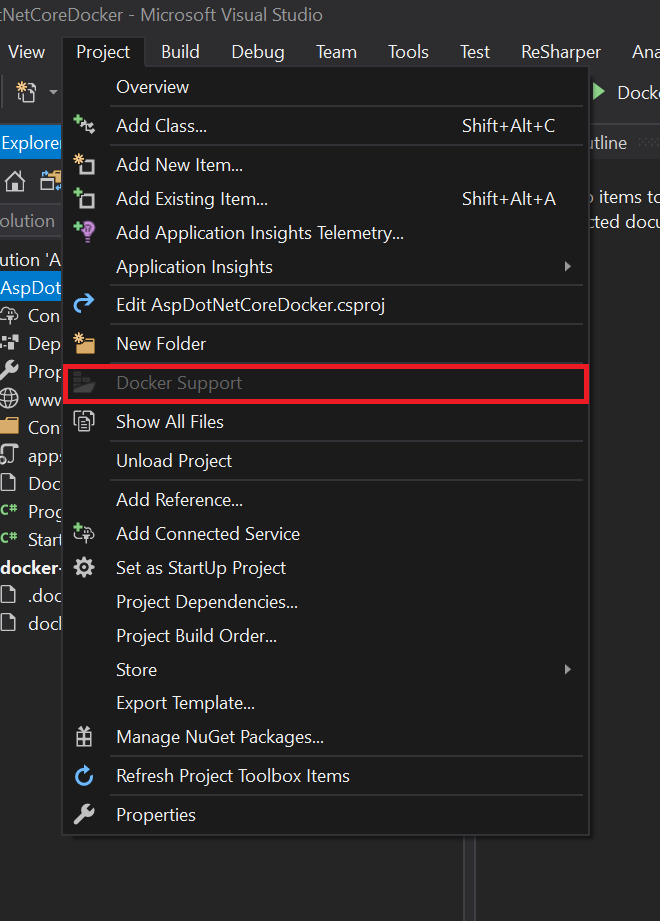
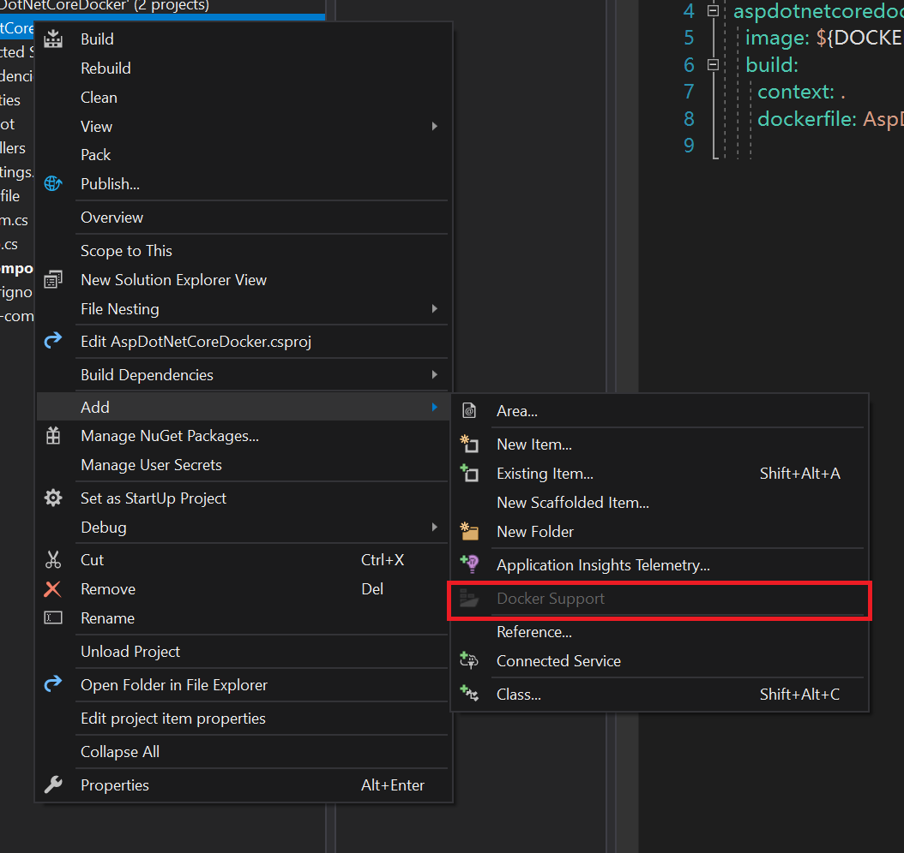

参考资料
- [Building Docker Images for .NET Core Applications](https://docs.microsoft.com/en-us/dotnet/core/docker/building-net-docker-images?view=aspnetcore-2.1)
- [Visual Studio Tools for Docker with ASP.NET Core](https://docs.microsoft.com/zh-cn/aspnet/core/host-and-deploy/docker/visual-studio-tools-for-docker?view=aspnetcore-2.1)

## 微软提供的 Docker Image

微软为 ASP.NET Core 开发人员提供了三种官方 Docker Image: 
- Development: 快速迭代和调试更改，以大尺寸的 Image 换取开发的便利
- Build: 包含所有用于生成应用的依赖和库，如编译器和其他优化编码的工具，开发人员使用该 Image 创建最终要放置在 Production 环境下的 Image 所需的资产，该 Image 主要用于持续集成。这样的好处在于使得生成工具仅仅需要知道如何运行该 Image，而不用关心其他细节。
- Production: 用于生产环境运行的 Image，体积经过了优化，因而在多 Host 部署时节省了网络通信时间，所有位于该 Image 中的内容都是为最优化运行应用程序而准备的。

### Docker Image 命名规则
- `microsoft/dotnet:<version>-sdk`: 该 Image 包含了 .NET Core SDK，其中包含 .NET Core 和 CLI，该 Image 用于支持上述 `Development` 和 `Build` 使用场景。另外，`microsoft/dotnet:sdk` 表示获取最新版本的 Image。
- `microsoft/dotnet:<versuib>-runtime`: 该 Image 包含 .NET Core(运行时和类库)并对运行 .NET Core 应用程序做了优化，对应于上述 `Production` 的使用场景。

### 其他 Image
除了上述三种 Image 之外，微软还提供了一些用于特殊用途的 Image，如
- `microsoft/dotnet:<version>-runtime-deps`: `runtime-deps` 包含了 .NET Core 依赖的操作系统本地库，这种 Image 主要用于 Self-Contained 应用程序。
- 各个 Image 的最新版本:
    - `microsoft/dotnet` 或 `microsoft/dotnet:latest`: SDK Image 的别名
    - `microsoft/dotnet:sdk`
    - `microsoft/dotnet:runtime`
    - `microsoft/dotnet:runtime-deps`

## 开始第一个 ASP.NET Core Docker App

### 准备工作
- 安装 [.NET Core SDK 2.0](https://www.microsoft.com/net/learn/get-started/windows)
- 安装一个喜欢的代码编辑器，例如 Visual Studio(Code)。
- 安装 Docker CE for Windows
- 安装 Git

### 获取示例项目
首先选取一个工作目录，然后执行: 
```bash
$ git clone https://github.com/dotnet/dotnet-docker-samples/
```
克隆完成后，进入 `aspnetapp` 目录，执行 `dotnet run`，在容器化应用程序之前，首先确保该应用程序能够运行。
```bash
$ cd aspnetapp
$ dotnet run

Hosting environment: Production
Content root path: D:\Development\Git Repositories\Github Projects\dotnet-docker-samples\aspnetapp
Now listening on: http://localhost:5000
```
确认 `dotnet run` 正常后，改用 `docker` 生成并运行:
```bash
cd aspnetapp
$ docker build -t aspnetapp . # 生成 Docker Image 并将其 tag 为 aspnetapp

$ docker run -it --rm -p 5000:80 --name aspnetcore_sample aspnetapp

Successfully built 8fb665ff9690
Successfully tagged aspnetapp:latest
```
> Docker 的端口映射为 `host:container`

现在访问 `http://{your-host-ip-address}:5000` 便可得到示例应用程序的页面。

## Visual Studio Docker 工具集
### 为应用程序添加 Docker 支持
要使 ASP.NET 与 Docker 集成，该项目必须是 .NET Core 项目，Linux 和 Windows 两种类别的容器都支持。ASP.NET Core 项目的 Container 类型必须与本机 Docker 引擎运行的 Container 类型相同。可通过在任务栏图标上右键单击 Docker 图标 -> `Switch to Windows containers` 或 `Switch to Linux containers` 功能来进行切换。

### 创建新的应用程序
对于新创建的 ASP.NET Core 项目，勾选 `Enable Docker Support`，并选择一个 Docker Container 类型:


### 为现有项目添加 Docker 支持
Visual Studio 仅支持为 .NET Core 项目添加 Docker 支持，有两种方式，首先打开一个项目
1. 选择 Project 菜单 -> Docker Support
2. 右键单击项目 -> 添加 -> Docker Support

## Visual Studio Docker 概览
当对一个项目添加 Docker 支持后，VisualStudio 将项解决方案目录添加一个 `docker-compose.dcproj` 项目，其中包含:
- _.dockerignore_: 生成 build 时需要忽略的文件和目录匹配字段
- _docker-compose.yml_: Docker Compose 的定义文件，定义了一系列 Image 的集合用于 `docker-compose build` 和 `docker-compose run`。
- _docker-compose.override.yml_: 一个可选文件，也会被 Docker Compose 读取，包含需要对服务进行重写的配置信息。Visual Studio 执行 `docker-compose -f "docker-compose.yml" -f "docker-compose.override.yml"` 来合并这些文件

同时，ASP.NET Core 项目文件夹下自动生成了一个名为 `Dockerfile` 的文件，该文件起始包含 4 个单独的生成环节，其根据 Docker [multi-stage build](https://docs.docker.com/develop/develop-images/multistage-build/) 定义，内容如下:
```bash dockerfile
FROM microsoft/aspnetcore:2.0 AS base
WORKDIR /app
EXPOSE 80

FROM microsoft/aspnetcore-build:2.0 AS build
WORKDIR /src
COPY AspDotNetCoreDocker/AspDotNetCoreDocker.csproj AspDotNetCoreDocker/
RUN dotnet restore AspDotNetCoreDocker/AspDotNetCoreDocker.csproj
COPY . .
WORKDIR /src/AspDotNetCoreDocker
RUN dotnet build AspDotNetCoreDocker.csproj -c Release -o /app

FROM build AS publish
RUN dotnet publish AspDotNetCoreDocker.csproj -c Release -o /app

FROM base AS final
WORKDIR /app
COPY --from=publish /app .
ENTRYPOINT ["dotnet", "AspDotNetCoreDocker.dll"]
```
该 _Dockerfile_ 基于 `microsoft/aspnetcore` Image，该 Image 包含了所有与 ASP.NET Core 相关的 Nuget 包。查看 _docker-compose.yml_ 文件，其中包含了自建 Image 的名称:
```yaml docker-compose.yml
version: '3.4'

services:
  aspdotnetcoredocker:
    image: frosthe/aspdotnetcoredocker
    build:
      context: .
      dockerfile: AspDotNetCoreDocker/Dockerfile
```
在这个例子中，如果应用程序以 `Debug` 模式运行，`aspdotnetcoredocker` Image 会生成 `aspdotnetcoredocker:dev`，以 `Release` 模式运行时，会生成 `aspdotnetcoredocker:latest` Image。

Image 的名称通常以 [Docker Hub](https://hub.docker.com/) 的用户名作为前缀(此处为 `frosthe`)。也可以自建 Registry 来承载私有的 Image。

### 调试
在 `Debug` 模式下按下 F5，同时查看 Visual Studio 的输出窗口，其步骤如下:
- `microsoft/aspnetcore`: 获取 aspnet core runtime Image。
- `microsoft/aspnetcore-build`: 获取编译/发布 Image。
- `ASPNETCORE_ENVIRONMENT`: Container 内环境变量设置为 `Development`。
- Container 暴露 80 端口了并映射到了主机的动态端口，该动态端口由 Docker 主机决定，可通过 `docker ps` 来查询。
- 应用程序被复制到了 Container 中
- 默认浏览器被打开，并通过动态端口将调试器附加到了 Container 中。

完成后执行 `docker images` 可以看到生成好的 `aspdotnetcoredocker:dev` Image 和 `microsoft/aspnetcore` Image。
```bash
REPOSITORY                       TAG                   IMAGE ID            CREATED             SIZE
frosthe/aspdotnetcoredocker      dev                   bf575b94e1c2        2 weeks ago         345MB
microsoft/aspnetcore             2.0.5                 b1a5de255274        3 months ago        305MB
```
执行 `docker ps` 可以看到正在运行的 container。
```bash
CONTAINER ID        IMAGE                             COMMAND               CREATED             STATUS              PORTS                   NAMES
f92786da06e1        frosthe/aspdotnetcoredocker:dev   "tail -f /dev/null"   52 seconds ago      Up 50 seconds       0.0.0.0:32768->80/tcp   dockercompose3863187778964625453_aspdotnetcoredocker_1
```

### 编辑并继续
与传统 .NET 程序的调试一样，针对静态文件和 Razor 视图的更改都将实时更新，而无需重新编译，但针对源代码的修改，则需要重新编译并重启 Kestrel 服务器，这都在 Container 中完成。

### 发布 Docker Image
一旦开发和调试完成，需要首先将配置切换至 `Release`，然后生成应用程序，Docker 工具集会生成一个新的打上 `latest` 标签的 Image，最后可将该 Image 上传至私有仓库或 Docker Hub。