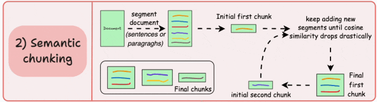
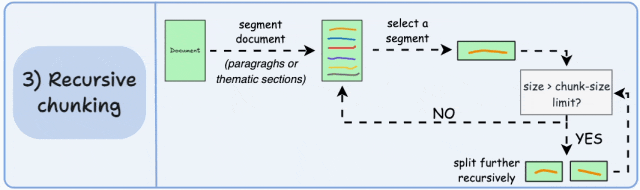
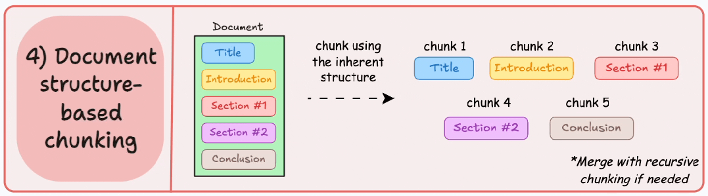
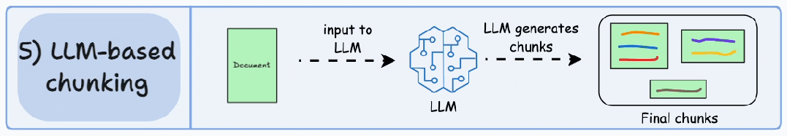
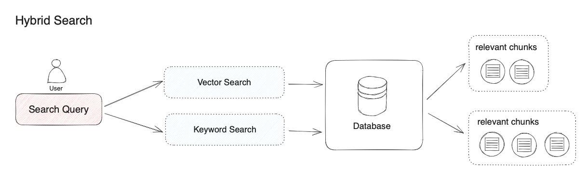
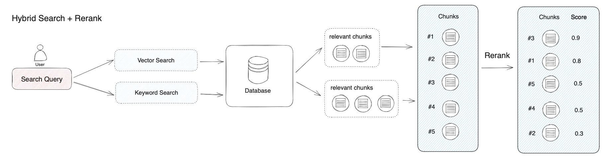
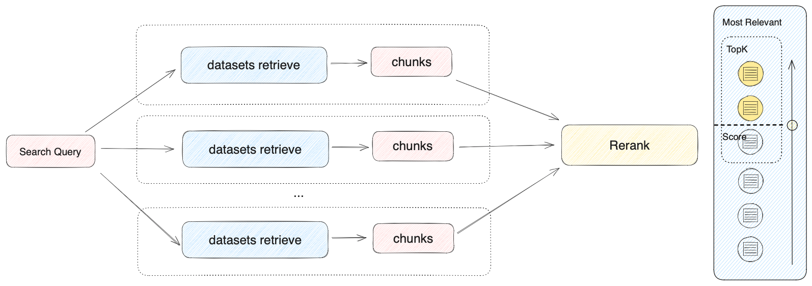

# RAG - Retrieval-Augmented Generation(检索增强生成)

## 概述

以向量检索为核心的 RAG 架构已成为解决大模型获取最新外部知识，同时解决其生成幻觉问题时的主流技术框架，并且已在相当多的应用场景中落地实践。

- 存储信息: 把大量的文档（比如文章、报告）转化成一种特殊的数学形式——向量，存起来备用
- 匹配问题: 当你提出问题时，AI 会把问题也变成向量，然后在信息库中找到与之最匹配的内容
- 生成答案: 最后，AI 把这些匹配的内容和你的问题一起交给大语言模型（LLM），生成一个更准确、更贴切的回答

### 数据源

- 长文本内容（TXT、Markdown、DOCX、HTML、JSON 甚至是 PDF）
- 结构化数据（CSV、Excel 等）
- 在线数据源（网页爬虫、Notion 等）：Jina Reader 和 Firecrawl 均是开源的网页解析工具，能将网页将其转换为干净并且方便 LLM 识别的 Markdown 格式文本，同时提供了易于使用的 API 服务。更多细节查看[从网页导入数据](https://docs.dify.ai/zh-hans/guides/knowledge-base/create-knowledge-and-upload-documents/import-content-data/sync-from-website)
  - [Jina Reader](https://jina.ai/reader/)
  - [Firecrawl 工具](https://www.firecrawl.dev/)

___
## 数据预处理

### 分段(Chunking)

由于大语言模型的上下文窗口有限，无法一次性处理和传输整个知识库的内容，因此需要对文档中的长文本分段为内容块。即便部分大模型已支持上传完整的文档文件，但实验表明，检索效率依然弱于检索单个内容分段。在进行问题与内容块的语义匹配时，合理的分段大小非常关键，它能够帮助模型准确地找到与问题最相关的内容，减少噪音信息。过大或过小的分段都可能影响召回的效果。

> Dify 提供了**通用分段**和**父子分段**两种分段模式，分别适应不同类型的文档结构和应用场景，满足不同的知识库检索和召回的效率与准确性要求。

#### 分段策略 - 固定大小分段

按照固定的字数、词数或标记数（token）把文档切成小块。例如，每500字一块。为了避免句子被拦腰截断，通常会在相邻两块之间留点重叠（比如重叠100字）。

- 优点:
  - 操作简单，像切面包一样直截了当。
  - 处理速度快
- 缺点: 
  - 可能会把一句话或一个完整的想法切成两半。
  - 关键信息分散在不同块中，AI检索时容易漏掉重点。
- 适用场景：文档内容比较零散、不太讲究上下文时可以用，但对复杂文档来说效果一般。

#### 分段策略 - 语义分段

根据内容的 "意思" 来切，先把文档分成句子或段落等有意义的单元，为每个单元生成一个向量表示（嵌入），然后比较相邻单元的相似度：如果很相似，就合并成一块；如果差异大，就另起新块。

- 优点:
  - 保留了内容的自然流畅性和完整思路
  - 每块内容更丰富，AI 检索时能抓住更相关的部分，回答更靠谱
- 缺点: 
  - 需要设定一个相似度的标准（阈值），而这个标准可能因文档不同而变化，需要不断调试
- 当文档有清晰的主题或段落划分时，这种方法能让 AI 更好地理解内容

#### 分段策略 - 递归分段

按文档的自然分隔（比如段落或章节）分成大块，如果某块太大（超过预设大小），就再细分，直到每块都合适为止。

- 优点:
  - 既保留了文档的自然结构，又能控制块的大小
  - 适应性强，适合各种文档
- 缺点: 
  - 比固定大小分块复杂一点，计算量稍微多一些
- 文档有层次结构，又需要控制大小的时候，这种方法很实用

> Dify 的**父子分段**对应递归分段策略

#### 分段策略 - 基于文档结构的分段

这种方法利用文档的天然结构，比如按标题、章节或段落来分块。每块对应一个逻辑单元，比如一个章节或一个小标题下的内容。

- 优点：
  - 尊重文档的逻辑布局，AI 更容易理解
  - 分块边界清晰，管理方便
- 缺点：
  - 要求文档有明确的结构
  - 分块大小可能不均匀，如有的块太大，AI 难以处理
- 适合场景：学术论文、技术文档等结构化强的文件

#### 分段策略 - 基于 LLM 的分段

利用 LLM 来执行分段任务，让它根据内容生成独立、有意义的小块。

- 优点：
  - 语义准确性最高，因为 LLM 能理解深层含义
  - 每块内容质量极佳，AI 用起来得心应手
- 缺点：
  - 计算量大，成本高
  - 不同 LLM 的处理能力不同，需要针对文档选择合适的 LLM 并反复调试。
- 适合场景：预算充足、对质量要求极高

### 清洗

为了保证文本召回的效果，通常需要在将数据录入知识库之前便对其进行清理。例如，文本内容中存在无意义的字符或者空行可能会影响问题回复的质量，需要对其清洗。

> Dify 已内置的自动清洗策略，详细说明请参考 ETL

___
## 检索

- 向量检索: 通过将外部知识库的文档先拆分为语义完整的段落或句子，并将其转换 (Embedding) 为计算机能够理解的一串数字表达(多维向量)，同时对用户问题进行同样的转换操作。
  - 优势: 
    - 相近语义理解: 如老鼠/捕鼠器/奶酪，谷歌/必应/搜索引擎
    - 多语言理解: 跨语言理解，如输入中文匹配英文
    - 多模态理解: 支持文本、图像、音视频等的相似匹配
    - 容错性: 处理拼写错误、模糊的描述
  - 短板: 
    - 搜索一个人或物体的名字，例如，伊隆·马斯克，iPhone 15
    - 搜索缩写词或短语，例如，`RAG`，`RLHF`
    - 搜索 ID，例如, `gpt-3.5-turbo`, `titan-xlarge-v1.01`
- 关键词检索(全文检索): 索引文档中的所有词汇，从而允许用户查询任意词汇，并返回包含这些词汇的文本片段。
  - 优势: 精确匹配: 如产品名称、姓名、产品编号
  - 少量字符的匹配: 通过少量字符进行向量检索时效果非常不好，但很多用户恰恰习惯只输入几个关键词
  - 倾向低频词汇的匹配: 低频词汇往往承载了语言中的重要意义，比如“你想跟我去喝咖啡吗？”这句话中的分词，“喝”“咖啡”会比“你”“想”“吗”在句子中承载更重要的含义
- 混合检索: 同时执行全文检索和向量检索，并应用重排序步骤，从两类查询结果中选择匹配用户问题的最佳结果，需配置 Rerank 模型 API。

关键概念: 

- TOPK: 用于筛选与用户问题相似度最高的文本片段。系统同时会根据选用模型上下文窗口大小动态调整片段数量。系统默认值为 3 。大模型的输入窗口存在大小限制（一般为 4K、8K、16K、128K 的 Token 数量），你需要根据选用的模型输入窗口的大小限制，选择合适的 TopK 值。
- Score 阈值: 用于设置文本片段筛选的相似度阈值，即：只召回超过设置分数的文本片段。系统默认关闭该设置，即不会对召回的文本片段相似值过滤。打开后默认值为 0.5 。
- Rerank 模型：在检索设置中打开 `Rerank 模型`，系统会在语义检索后对已召回的文档结果再一次进行语义重排序，优化排序结果。设置 Rerank 模型后，TopK 和 Score 阈值设置仅在 Rerank 步骤生效。

___
## 重排序

混合检索能够结合不同检索技术的优势获得更好的召回结果，但在不同检索模式下的查询结果需要进行合并和归一化（将数据转换为统一的标准范围或分布，以便更好地进行比较、分析和处理），然后再一起提供给大模型。这时候我们需要引入一个评分系统：重排序模型（Rerank Model）。

重排序模型会计算候选文档列表与用户问题的语义匹配度，根据语义匹配度重新进行排序，从而改进语义排序的结果。其原理是计算用户问题与给定的每个候选文档之间的相关性分数，并返回按相关性从高到低排序的文档列表。常见的 Rerank 模型如：Cohere rerank、bge-reranker 等。

重排序并不是搜索技术的替代品，而是一种用于增强现有检索系统的辅助工具。它最大的优势是不仅提供了一种简单且低复杂度的方法来改善搜索结果，允许用户将语义相关性纳入现有的搜索系统中，而且无需进行重大的基础设施修改。

> 以 [Cohere Rerank](https://cohere.com/rerank) 为例，你只需要注册账户和申请 API ，接入只需要两行代码。另外，他们也提供了多语言模型，也就是说你可以将不同语言的文本查询结果进行一次性排序。

___
## 召回模式

当用户构建知识库问答类的 AI 应用时，如果在应用内关联了多个知识库，此时需要应用召回策略决定从哪些知识库中检索内容。

由于多路召回模式不依赖于模型的推理能力或知识库描述，该模式在多知识库检索时能够获得质量更高的召回效果，除此之外加入 Rerank 步骤也能有效改进文档召回效果。因此，当创建的知识库问答应用关联了多个知识库时，我们更推荐将召回模式配置为多路召回。

___
## 扩展阅读

- [Dify 扩展阅读🎓检索增强生成(RAG)](https://docs.dify.ai/zh-hans/learn-more/extended-reading/retrieval-augment)
- [阅读材料 - 高阶RAG技巧：探索提升RAG系统性能的不同技巧](https://mp.weixin.qq.com/s/VZq2zsuJGsGaYTx6POqUzg)
- [txtai⭐10.5k](https://github.com/neuml/txtai): 多合一词嵌入向量数据库整合包，包括关系型数据库和文档数据库