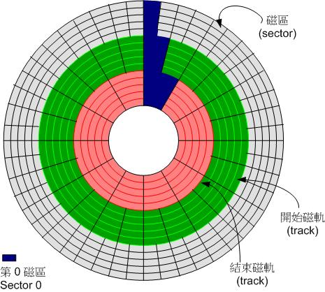
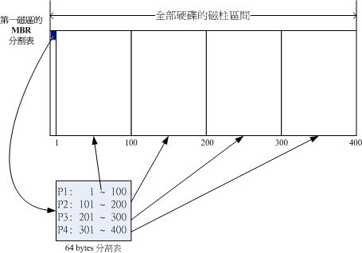
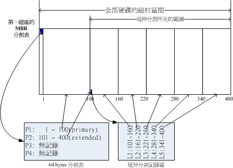
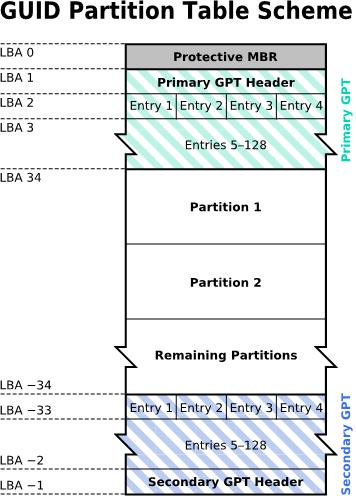
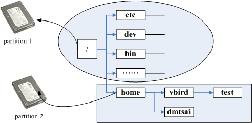

参考资料: 
- [主机规划与磁盘分区](http://linux.vbird.org/linux_basic/0130designlinux.php)

本文索引:
- [前言](#%E5%89%8D%E8%A8%80)
- [硬盘和分区方式](#%E7%A1%AC%E7%9B%98%E5%92%8C%E5%88%86%E5%8C%BA%E6%96%B9%E5%BC%8F)
  - [MSDOS(MBR)](#msdosmbr)
  - [GPT(Guid partition table)](#gptguid-partition-table)
- [BIOS](#bios)
- [UEFI(Unified Extensible Firmware Interface)](#uefiunified-extensible-firmware-interface)
- [存储](#%E5%AD%98%E5%82%A8)
- [df 命令](#df-%E5%91%BD%E4%BB%A4)
- [du 命令](#du-%E5%91%BD%E4%BB%A4)
- [lsblk 命令](#lsblk-%E5%91%BD%E4%BB%A4)
- [blkid 命令](#blkid-%E5%91%BD%E4%BB%A4)
- [fdisk/gdisk - 磁盘分区](#fdiskgdisk---%E7%A3%81%E7%9B%98%E5%88%86%E5%8C%BA)
- [mkfs - 对分区建立文件系统(格式化)](#mkfs---%E5%AF%B9%E5%88%86%E5%8C%BA%E5%BB%BA%E7%AB%8B%E6%96%87%E4%BB%B6%E7%B3%BB%E7%BB%9F%E6%A0%BC%E5%BC%8F%E5%8C%96)
- [mount 挂载分区](#mount-%E6%8C%82%E8%BD%BD%E5%88%86%E5%8C%BA)
  - [查看当前挂载的信息](#%E6%9F%A5%E7%9C%8B%E5%BD%93%E5%89%8D%E6%8C%82%E8%BD%BD%E7%9A%84%E4%BF%A1%E6%81%AF)
  - [卸载分区](#%E5%8D%B8%E8%BD%BD%E5%88%86%E5%8C%BA)
  - [开机自动挂载](#%E5%BC%80%E6%9C%BA%E8%87%AA%E5%8A%A8%E6%8C%82%E8%BD%BD)

## 前言
Linux 所有的设备都以档案的形式参与到目录树中，包括磁盘分区，通常，SATA/USB 都是以 SCSI 模块驱动的，所以这些接口在系统中相当的档案名出现。
- 物理磁盘以 `/dev/sd[ad]` 形式在档案系统中出现，如一台电脑有 6 个 SATA 口，第一和第五分别插入了硬盘，此时两者以 `/dev/sda` 和 `/dev/sdb` 在档案系统中呈现
- 虚拟化之后的磁盘以 `/dev/vd[ad]` 形式在档案系统中出现

## 硬盘和分区方式
物理硬盘以磁盘、机械臂、磁碟头与主轴马达组成，资料都写入在磁盘上，磁盘又分为「磁区(Sector)」与「磁轨(Track)」两种单位，其中磁区的物理量有两种大小: 512 字节和 4K 字节。



### MSDOS(MBR)
Master Boot Record，主开机记录，早期的 Windows 系统对硬盘进行分区的方式，其以第一磁区(512 字节)记录
- 「开机管理程序」: 安装开机管理程序的地方，446 字节
- 「分区表」: 记录硬盘分区的状态，64 字节


由于分区表仅 64 字节大小，所以一块硬盘最多只能包含 4 个分区的信息，这 4 个分区信息被称为「主要(Primary)分区」或「扩展分区(Extended)」，且分区的最小存储单位为「磁柱(cylinder)」。

每块硬盘的 MBR 区域仅允许一个扩展分区，而该扩展分区主要用于划出更多的「逻辑分区」，逻辑分区可使用的磁柱区域被划定在扩展分区边界内，如下图所示:

这样，在 Linix 系统中的档案名为:
- P1:/dev/sda1
- P2:/dev/sda2
- L1:/dev/sda5
- L2:/dev/sda6
- L3:/dev/sda7
- L4:/dev/sda8
- L5:/dev/sda9

系统会保留 MBR 的 4 个分区编号，所以逻辑分区以 `sda5` 开始。由于分区是以「磁柱」为单位的连续磁盘空间，所以分区时尤其要注意主分区与逻辑分区的划分，例如，主分区 P2 与逻辑分区 L1 是无法合并的。而 L1 和 L2 则是可以合并的。

由于每个分区表仅有 16 字节，因此系统无法识别硬盘空间在 2.2TB 以上的硬盘。而每当操作系统需要读写磁盘，都要从 MBR 的分区表中读取参考信息，一旦该硬盘的第一个磁区，即 MBR 损坏了，那么整个硬盘就无法使用了。鉴于这诸多的限制，后来有了 GPT 分区表。

### GPT(Guid partition table)
GPT 已经支持 4K 磁区，但为了兼容以往的 512 字节磁区。GPT 使用「逻辑区块地址(Logic Block Address)」来划分整个硬盘，而 LBA 预设大小为 512 字节，从 0 开始编号，即第一个 LBA 磁区为 LBA0。GPT 磁盘分区的最小物理单位为磁区。

GPT 使用前 34 个 LBA 磁区来记录分区信息，这与 MBR 将所有分区信息记录在第一个磁区上不同，且硬盘的最后 33 个 LBA 磁区作为备份，结构如下: 

从上图可以看到:
- LBA0(MBR 兼容磁区): 该磁区为了与 MBR 兼容，也将其分为「开机管理程序(446 字节)」和分区表(64 字节)两部分，而这里的分区表仅存放一个特殊的分区，以表示此磁盘为 GPT 格式。
- LBA1(GPT表头记录): 该磁区记录了分区表的位置与大小与备份分区表的磁区位置。
- LBA2 ~ 33(实际记录分区信息): 从 LBA2 开始，每个 LBA 都可以记录 4 个分区记录，所以默认情况下，最多可以支持 4 * 32 个分区，而每个 LBA 磁区容量为 512 字节，因此每个分区信息可用 128 字节空间(不同于 MBR 16 字节)，这可以识别高达 1ZB 的硬盘容量。

GPT 分区表也没有了主分区，扩展分区和逻辑分区的概念，每个分区都独立存在。然而并不是所有操作系统都能够读取 GPT 的硬盘分区格式，这取决于「开机引导程序(BIOS 和 UEFI)」。

## BIOS
没有软件程序的硬件是没有用的，操作系统的诞生是为了更好的调配各个硬件资源，但操作系统并不是电脑执行的第一个软件程序，主板首先加载的是写入主板上的开机引导程序，又称固件。

电脑开机后
1. 主板首先启动固件的 BIOS
2. BIOS 分析电脑有哪些设备，找到其第一个磁区的 MBR 位置，然后读取 446 字节的「开机管理程序」，然后 BIOS 将退出，全权交给开机管理程序(Boot Loader)
3. Boot Loader 是由操作系统提供的，因此它认识操作系统提供的文件系统以及启动操作系统所需的核心文件的位置，一旦操作系统的核心文件启动，后续的工作就交给操作系统了。

BIOS 和 MBR 都是硬件支持的功能，而 Boot Loader 则是操作系统安装在 MBR 上的一个软件程序，Boot Loader 提供了:
- 提供选单，用户可以选择不同的开机项目
- 加载核心文件，启动操作系统
- 转交给其他 Loader

## UEFI(Unified Extensible Firmware Interface)
UEFI 使用 C 语言，比起使用组合语言的传统 BIOS 更容易开发，同时支持了更多的功能，UEFI 更像是一个小型的操作系统，UEFI 大多用来作为操作系统启动之前的硬件检测、开机管理、软件设置等目的，一旦操作系统启动，UEFI 就会停止工作。更重要的是，UEFI 可以直接取得 GPT 分区表，并同时兼容 MBR 分区表。

## 存储
Linux 系统内的所有资料都是以文件的形态呈现的，因此整个 Linux 系统就是一个目录树，以根目录为根向下延伸。而文件和目录其实是放置在磁盘分区中，**「挂载(mount)」**就是目录树与磁盘分区的粘合剂。

挂载是将磁盘分区的资料放在目标目录下。进入该目录，就进入了该磁盘分区，如下图所示:


## df 命令
`df` 命令用来查阅系统各个分区的磁盘用量，例如:
例如:
```bash
$ df -hT

Filesystem     Type      Size  Used Avail Use% Mounted on
/dev/root      ext4       15G  5.9G  8.1G  43% /
devtmpfs       devtmpfs  460M     0  460M   0% /dev
tmpfs          tmpfs     464M   20K  464M   1% /dev/shm
tmpfs          tmpfs     464M   48M  416M  11% /run
tmpfs          tmpfs     5.0M  4.0K  5.0M   1% /run/lock
tmpfs          tmpfs     464M     0  464M   0% /sys/fs/cgroup
/dev/mmcblk0p1 vfat       43M   22M   21M  51% /boot
/dev/sda1      xfs       3.7T  2.2T  1.5T  60% /mnt/shared
tmpfs          tmpfs      93M     0   93M   0% /run/user/1000
```

常用选项与参数有:
- `-a`: 列出所有文件系统，包括系统特有的 /proc 等文件系统；
- `-k`: 以 KBytes 的容量显示各文件系统；
- `-m`: 以 MBytes 的容量显示各文件系统；
- `-h`: 以人们较易阅读的 GBytes, MBytes, KBytes 等格式自行显示；
- `-H`: 以 M=1000K 取代 M=1024K 的进位方式；
- `-T`: 连同该 `partition` 的 `filesystem` 名称(如 xfs)也列出；
- `-i`: 不用磁碟容量，而以 inode 的数量来显示

## du 命令
`du` 命令用于查询目标目录或文件的磁盘占用量，例如:
```bash
$ sudo du -hs ./

1.4G .
```
常用选项与参数有:
- `-a`: 列出所有 entry 
- `-h`: 以阅读友好的格式展示数据
- `-s`: 仅展示当前目录下的统计数据

## lsblk 命令
`list block device` 的缩写，列出所有存储设置:
```bash
$ lsblk -dmp

NAME           SIZE OWNER GROUP MODE
/dev/sda       3.7T root  disk  brw-rw----
/dev/sdb     465.8G root  disk  brw-rw----
/dev/mmcblk0  14.8G root  disk  brw-rw----
```
常用可选参数有:
- `-d`: 仅展示存储设备本身，而不展示分区
- `-f`: 包括文件系统名称
- `-m`: 包括权限信息
- `-p`: 展示完整文件名称
- `-t`: 包含详细信息

## blkid 命令
显式存储设置的 UUID 信息:
```bash
$ (sudo) blkid

/dev/mmcblk0p1: LABEL="boot" UUID="A365-6756" TYPE="vfat" PARTUUID="358ecf74-01"
/dev/mmcblk0p2: LABEL="rootfs" UUID="90a83158-560d-48ee-9de9-40c51d93c287" TYPE="ext4" PARTUUID="358ecf74-02"
/dev/sda1: LABEL="NT2" UUID="fef3c944-4e1e-4aeb-9b79-6f567c50ea6c" TYPE="xfs" PARTLABEL="Linux filesystem" PARTUUID="7f99994b-2b44-4f75-a55e-170d32f1c41e"
/dev/mmcblk0: PTUUID="358ecf74" PTTYPE="dos"
```
## fdisk/gdisk - 磁盘分区
MBR 分区使用 `fdisk` 命令，GPT 分区使用 `gdisk` 命令
`gdisk` 只有 root 用户才能执行，对目标设备进行 GPT 分区:
```bash
$ gdisk /dev/sdb

GPT fdisk (gdisk) version 1.0.1

Partition table scan:
  MBR: not present
  BSD: not present
  APM: not present
  GPT: not present

Creating new GPT entries.

Command (? for help): ?
```
根据提示输入 `?`:
```bash
Command (? for help): ?
b       back up GPT data to a file
c       change a partition's name
d       delete a partition
i       show detailed information on a partition
l       list known partition types
n       add a new partition
o       create a new empty GUID partition table (GPT)
p       print the partition table
q       quit without saving changes
r       recovery and transformation options (experts only)
s       sort partitions
t       change a partition's type code
v       verify disk
w       write table to disk and exit
x       extra functionality (experts only)
?       print this menu
```
现在，假设我们需要在该存储设备上创建一个单一的分区，并且文件系统为 `xfs`，输入 `p`:
```bash
Command (? for help): p
Disk /dev/sdb: 976773056 sectors, 465.8 GiB
Logical sector size: 512 bytes
Disk identifier (GUID): 6BA9CCEA-BF10-4D3D-99FA-0016432D489A
Partition table holds up to 128 entries
First usable sector is 34, last usable sector is 976773022
Partitions will be aligned on 2048-sector boundaries
Total free space is 976772989 sectors (465.8 GiB)

Number  Start (sector)    End (sector)  Size       Code  Name
```
可以看到该存储设备上没有任何分区，输入 `n` 新建一个分区:
```bash
Command (? for help): n
Partition number (1-128, default 1):
First sector (34-976773022, default = 2048) or {+-}size{KMGTP}:
Last sector (2048-976773022, default = 976773022) or {+-}size{KMGTP}:
Current type is 'Linux filesystem'
Hex code or GUID (L to show codes, Enter = 8300):
Changed type of partition to 'Linux filesystem'
```
过程中会要求输入第一磁区号，最后磁驱号(默认会占满整个硬盘)，文件系统等，这里均采用默认值。完成之后再次输入 `p`，新的分区已经准备好:
```bash
Command (? for help): p
Disk /dev/sdb: 976773056 sectors, 465.8 GiB
Logical sector size: 512 bytes
Disk identifier (GUID): 6BA9CCEA-BF10-4D3D-99FA-0016432D489A
Partition table holds up to 128 entries
First usable sector is 34, last usable sector is 976773022
Partitions will be aligned on 2048-sector boundaries
Total free space is 2014 sectors (1007.0 KiB)

Number  Start (sector)    End (sector)  Size       Code  Name
   1            2048       976773022   465.8 GiB   8300  Linux filesystem
```
由于创建或删除分区是敏感操作，此时需要输入 `w` 确认操作或输入 `q` 放弃操作
```bash
Command (? for help): w

Final checks complete. About to write GPT data. THIS WILL OVERWRITE EXISTING
PARTITIONS!!

Do you want to proceed? (Y/N): y
OK; writing new GUID partition table (GPT) to /dev/sdb.
The operation has completed successfully.
```
现在，执行 `lsblk /dev/sdb` 确认该分区已经创建:
```bash
$ lsblk /dev/sdb

NAME   MAJ:MIN RM   SIZE RO TYPE MOUNTPOINT
sdb      8:16   0 465.8G  0 disk
└─sdb1   8:17   0 465.8G  0 part
```
## mkfs - 对分区建立文件系统(格式化)
分区创建完成之后，接下来就是要格式化分区以创建目标文件系统，`mkfs`(make filesystem) 是创建文件系统 - 即格式化分区的指令，根据目标文件系统类型的不同，执行不同的子命令，例如，此处要创建的 `xfs` 文件系统，那么应该使用 `mkfs.xfs` 命令:
```bash
$ sudo mkfs.xfs /dev/sdb1

meta-data=/dev/sdb1              isize=512    agcount=4, agsize=30524093 blks
         =                       sectsz=512   attr=2, projid32bit=1
         =                       crc=1        finobt=1, sparse=0, rmapbt=0, reflink=0
data     =                       bsize=4096   blocks=122096371, imaxpct=25
         =                       sunit=0      swidth=0 blks
naming   =version 2              bsize=4096   ascii-ci=0 ftype=1
log      =internal log           bsize=4096   blocks=59617, version=2
         =                       sectsz=512   sunit=0 blks, lazy-count=1
realtime =none                   extsz=4096   blocks=0, rtextents=0
```
执行 `lsblk -mp` 查看当前可用分区:
```bash
$ lsblk -mp

NAME               SIZE OWNER GROUP MODE
/dev/sda           3.7T root  disk  brw-rw----
└─/dev/sda1        3.7T root  disk  brw-rw----
/dev/sdb         465.8G root  disk  brw-rw----
└─/dev/sdb1      465.8G root  disk  brw-rw----
/dev/mmcblk0      14.8G root  disk  brw-rw----
├─/dev/mmcblk0p1  43.1M root  disk  brw-rw----
└─/dev/mmcblk0p2  14.7G root  disk  brw-rw----
```
## mount 挂载分区
分区都以是目录作为挂载点供系统使用，而该目录应该遵循:
- 该目录已经存在
- 同一个目录不应该重复挂载多个分区
- 作为挂载点的目录，理论上应该都是空目录

例如，现在将 `/dev/sdb1` 挂载到 `/mnt/storage1` 目录下，首先创建该目录:
```bash
$ ls /mnt/ -l

drwxrwxr-x+ 13 pi pi 4096 Dec 28 08:17 shared

$ mkdir /mnt/storage1
$ ls /mnt/ -l

drwxrwxr-x+ 13 pi pi 4096 Dec 28 08:17 shared
drwxr-xr-x   2 pi pi 4096 Jan 11 13:57 storage1
```
将分区挂载到该目录下:
```bash
$ mount /dev/sdb1 /mnt/storage1
```
常见选项与参数有:
- `-a`: 将 `/etc/fstab` 中所有未挂载的分区全部挂载
- `-l`: 仅执行 `mount` 命名时将显式当前挂载的信息，加上 `-l` 可包括 Label 名称
- `-t`: 指定欲挂载分区的文件系统，常见的 Linux 支持的类型有 `xfs`、`ext3`、`ext4`
- `-n`: 默认情况下，系统会将实际挂载的信息写入 `/etc/mtab` 中，但在某些情况下(例如单人维护摸下下)为了避免问题想要不写入，则使用 `-n` 选项
- `-o`: 可跟一些常用的参数，例如帐号、密码、读写权限等:
  - `async`，`sync`: 表示该文件系统使用同步写入(sync)还是异步写入(async)
  -` atime`, `noatime`: 是否修改档案的读取时间，为了性能考虑，某些情况下可使用 noatime
  - `ro`, `rw`: 挂载的文件系统为只读(ro)还是可读可写(rw)
  - `auto`, `noauto`: 是否允许此分区可被 `mount -a` 自动挂载
  - `dev`, `nodev`: 是否允许该分区建立存储设备文件
  - `suid`, `nosuid`: 是否允许此分区包含 `suid`/`sgid` 文件格式
  - `exec`, `noexec`: 是否允许可在此分区执行 `binary` 程序
  - `user`, `nouser`: 是否允许其他用户执行 `mount`。一般来说，`mount` 仅有 root 用户能够执行，但添加 `user` 参数可让其他用户也能对该分区执行 `mount`
  - `nofail`: 不进行挂载错误检查，以避免启动挂载错误导致系统无法正常启动
  - `defaults`: 预设值为: `rw`, `suid`, `dev`, `exec`, `auto`, `nouser`, `async`
  - `remount`: 重新挂载，在系统出错或重新更新参数时，很有用。

### 查看当前挂载的信息
```bash
$ mount | grep sd

/dev/sda1 on /mnt/shared type xfs (rw,relatime,attr2,inode64,noquota)
/dev/sdb1 on /mnt/storage1 type xfs (rw,relatime,attr2,inode64,noquota)
```

### 卸载分区
使用 `umount` 命令来执行卸载分区的命令:
```bash
$ umount [设备档案文件或挂载点]
```
常见选项和参数有:
- `-f`: 强制卸载
- `-l`: 立即卸载，比 `-f` 更疯狂的参数
- `n`: 不更新 `/etc/mtab` 的情况下卸载

### 开机自动挂载
查看存储设备的 UUID:
```bash
$ lsblk -f

NAME        FSTYPE LABEL  UUID                                 MOUNTPOINT
sdb
└─sdb1      xfs           235669cd-d06b-4630-8d3e-5881287ba057 /mnt/storage1
```
编辑 `/etc/fstab` 以添加挂载点:
```bash
$ nano /etc/fstab

UUID="235669cd-d06b-4630-8d3e-5881287ba057"    /mnt/storage1    xfs             defaults,noatime,user                0       0
```

执行 `mount -a` 测试自动挂载(特别重要)，如果 `/etc/fstab` 中有语法错误，Linux 系统将无法正常启动，必须进入紧急模式进行恢复，参考 [Emergency Mode due to fstab](https://www.raspberrypi.org/forums/viewtopic.php?p=1105501)

再执行 `df` 查看刚刚添加的挂载点是不是已经挂载:
```
$ df

Filesystem     1K-blocks      Used Available Use% Mounted on
/dev/sdb1      488147016 280117988 208029028  58% /mnt/storage1
```