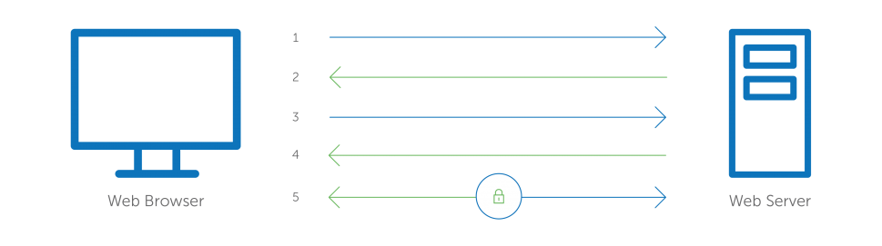
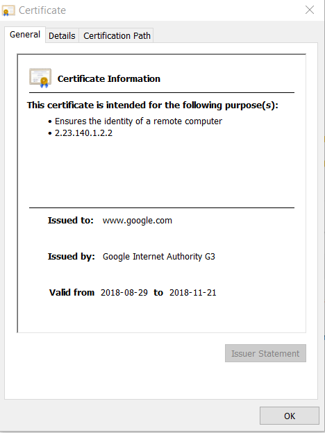

## 数字证书标准 - X.509
X.509 是一种定义「公钥证书」格式的标准，X.509 证书包含一个「公钥」和一个主体标识(主机名称，机构或个人)，由 CA(Certificate Authority) 签名或自签名，一旦证书由受信任的 CA 签名或其他方法进行了验证，持有该证书的机构即可信任其包含的「公钥」，进而与另一方建立安全通信，或验证由其对应的私钥签名的文档。

除了证书本身功能，X.509 还附带了[证书吊销列表](https://zh.wikipedia.org/wiki/%E8%AF%81%E4%B9%A6%E5%90%8A%E9%94%80%E5%88%97%E8%A1%A8)和用于从最终对证书进行签名的证书签发机构直到最终可信点为止的[证书合法性验证算法](https://en.wikipedia.org/wiki/Certification_path_validation_algorithm)

## 数字证书载体
数字证书又称为公开密钥证书(Public key certificate)，用来证明**公开密钥拥有者的身份**。该文件包含了:
- 公钥信息
- 拥有者的身份信息(Subject)
- 数字证书认证机构(Issuer)对这份文件的数字签名

「证书持有方」凭借此文件，可向计算机系统或其他用户表明身份，「证书检验方」通过查看其「签发机构」来检验该证书是否有效，如果检验方信任该签发机构，就代表信任证书上的密钥，双方便可凭借公钥加密进行安全的通信。

### 数字证书编码格式
X.509 证书目前有以下两种编码格式:
- PEM - Privacy Enhanced Mail，以"-----BEGIN..."开头，"-----END..." 结尾，内容以 BASE64 编码。Apache 和 *NIX 服务器偏向于使用这种编码格式。
- DER - Distinguished Encoding Rules，二进制格式，不可读。Java 和 Windows 服务器偏向于使用这种编码格式。

### 扩展名
除了 `.pem` 及 `.der` 之外，不同的系统或程序对数字证书文件载体定义了自己的扩展名，它们除了格式不同之外，内容也有差别，但大多数都能相互转换:
- .crt: 多见于 *NIX 系统 PEM 编码
- .cer: 多见于 Windows 系统 DER 编码
- .key: 通常用于存放单个 key，非证书，可能是 PEM 编码或 DER 编码。
- .csr: Certificate Signing Request，即证书签名请求，并非证书，而是向 CA 发出的证书申领请求，其核心内容包含一个「公钥」及其他主体信息，在生成该请求时，也会生成相应的「私钥」。
- .pfx/p12: Predecessor of PKCS#12，对 *NIX 服务器来说,一般 `.crt` 和 `.key` 是分开存放在不同文件中，但 Windows 的 IIS 则将它们存在一个 `.pfx` 文件中(该文件包含了证书及私钥)，`.pfx` 通常会设置一个「提取密码」，`.pfx` 使用 DER 编码。
- .jks: Java Key Storage，这是 Java 的专利，跟 OpenSSL 关系不大，Java 提供了一个 `keytool` 工具可以将 `.pfx` 转换为 `.jks`。

### 编码的转换
以 PEM 和 DER 编码的 「X.509 证书」，「Key」 以及「CSR」 都可以通过 OpenSSL 进行互转，例如:
```
# 将 X.509 证书由 PEM 转换为 DER 编码格式
$ openssl x509 -in cert.crt -outform der -out cert.der
# 将 X.509 证书由 DER 转换为 PEM 编码格式
$ openssl x509 -in cert.crt -inform der -outform pem -out cert.pem
# 将 RSA 公钥由 PEM 转换为 DER 编码格式
$ openssl rsa -in pubkey.pem -outform der -out pubkey.der
# 将 CSR 由 PEM 转换为 DER 编码格式
$ openssl req -in request.csr -outform der -out request-der.csr
```

## Web HTTPS 的工作原理

`Web HTTPS` 是典型的使用数字证书建立安全通信的应用场景，在此场景中，Web 服务器是「证书持有方」，浏览器是「证书检验方」，对 Web 服务器签发证书的机构为「签发机构」，双方在建立安全的通信连接前，首先要进行以下通信，以求互相信任，证书以文件的形式存储在服务器端。



1. Client 向 Server 发起 TLS 握手消息 `Client Hello`，包含期望的 TLS 协议版本，Cipher Suite 列表和一个 `client random` 的字符串
2. Server 回应 Client 一条 `Server Hello` 的消息，包括 SSL 证书，选定的 Cipher Suite 和一个 `server random` 的字符串，该证书包含 Web 服务器的「公钥」。
3. Client 将 Server 的证书与本地受信 CA 列表确认，检查其是否有效(包括是否过期，是否被撤销，是否与域名匹配)
4. 如果检查结果有效，Client 从证书中提取 Server 的「公钥」，生成一个临时的「对称密钥」，再使用「公钥」加密「对称密钥」，随后将「密文」发送给 Server。
5. Server 收到「密文」并用其「私钥」解密得到「对称密钥」，之后，便使用「对称密钥」对返回值进行加密
6. 随后，Client 和 Server 全程使用临时「对称密钥」进行通信

使用 `Chrome` 访问 `https://www.google.com`，点击地址栏左侧的「绿色锁」按钮，再点击「证书」按钮，便可查看 `www.google.com` 所使用的数字证书，其中包括 `Version`, `Issuer`, `Valid From`, `Valid To`, `Subject`, `Publick Key` 等细节: 



