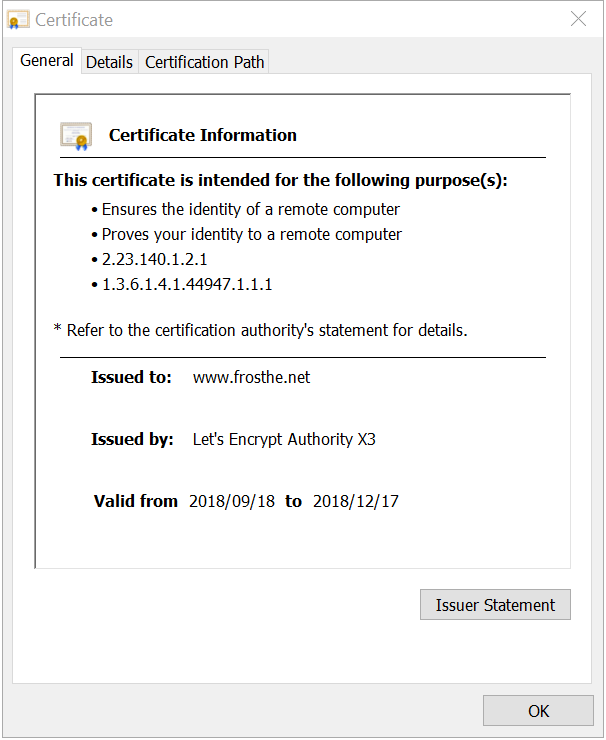

参考资料:
- [How its works - Let's Encrypt](https://letsencrypt.org/how-it-works/)
- [Getting certificates(and choosing plugins)](https://certbot.eff.org/docs/using.html#getting-certificates-and-choosing-plugins)

本文索引:
- [前言](#%E5%89%8D%E8%A8%80)
- [使用 Certbot 管理 Let's Encrypt 颁发的数字证书](#%E4%BD%BF%E7%94%A8-certbot-%E7%AE%A1%E7%90%86-lets-encrypt-%E9%A2%81%E5%8F%91%E7%9A%84%E6%95%B0%E5%AD%97%E8%AF%81%E4%B9%A6)
- [安装 Certbot](#%E5%AE%89%E8%A3%85-certbot)
- [获取证书](#%E8%8E%B7%E5%8F%96%E8%AF%81%E4%B9%A6)
- [安装证书](#%E5%AE%89%E8%A3%85%E8%AF%81%E4%B9%A6)
- [自动更新证书](#%E8%87%AA%E5%8A%A8%E6%9B%B4%E6%96%B0%E8%AF%81%E4%B9%A6)
- [删除证书](#%E5%88%A0%E9%99%A4%E8%AF%81%E4%B9%A6)

## 前言
基于[上一篇文章](/security-how-letsencrypt-works)的介绍，本篇将介绍使用官方推荐的 [ACME](https://github.com/ietf-wg-acme/acme) 客户代理软件[Certbot](https://certbot.eff.org/) 为 `www.frosthe.net` 申请 HTTPS 证书。

## 使用 Certbot 管理 Let's Encrypt 颁发的数字证书
`certbot` 在各个 *NIX 系统的发行版本都提供了对应的版本，以下以 Ubuntu 16.04 LTS 为例，为 `www.frosthe.net` 申请单域名证书。

在不支持通配符证书之前，`Let's Encrypt` 支持两种证书:
1. 单域名证书: 证书仅包含一个域名
2. SAN 证书: 证书可包含多个域名(`Let's Encrypt 限制为 20`)，例如，一个证书可覆盖 `www.example.com`、`www.example.cn`、`auth.example.com` 等。

本文仅介绍单域名证书的申请。

## 安装 Certbot
按照官方文档给出的 Ubuntu 16.04 LTS 系统的指引，执行以下命令:
```bash
$ sudo apt-get update
$ sudo apt-get install software-properties-common
$ sudo add-apt-repository ppa:certbot/certbot
$ sudo apt-get update
$ sudo apt-get install certbot
```

## 获取证书
`certbot` 支持一系列「插件」，这些插件主要服务于两种用途:
- 确认用户对域名的管理权限
  - `dns` 插件: 要求用户添加给定 DNS 记录来确认域名管理权
  - `webroot` 插件: 要求用户在站点根目录下新增给定资源来确认域名管理权
  - `manual` 插件: 手动插件，意即，需要手动操作以完成 `challenge`
- 将证书自动安装至指定 Web 服务器: 
  - Apache 插件: 
  - Nginx 插件:
  - Haproxy 插件: 
  - Plesk 插件: 

如果使用 `certbot certonly` 子命令，将以「交互模式」来选择需要使用哪种「插件」来获取证书，该模式有助于理解证书申请过程，但不便于自动化，以下以 `certbot certonly` 命令及 `webroot` 插件为 `www.frosthe.net` 申请数字证书:
```
$ sudo certbot certonly
How would you like to authenticate with the ACME CA?
- - - - - - - - - - - - - - - - - - - - - - - - - - - - - - - - - - - - - - - -
1: Spin up a temporary webserver (standalone)
2: Place files in webroot directory (webroot)
- - - - - - - - - - - - - - - - - - - - - - - - - - - - - - - - - - - - - - - -
Select the appropriate number [1-2] then [enter] (press 'c' to cancel): 2

Plugins selected: Authenticator webroot, Installer None
Starting new HTTPS connection (1): acme-v02.api.letsencrypt.org
Please enter in your domain name(s) (comma and/or space separated)  (Enter 'c'
to cancel): www.frosthe.net

Obtaining a new certificate
Performing the following challenges:
http-01 challenge for www.frosthe.net
Input the webroot for www.frosthe.net: (Enter 'c' to cancel): 

```
到这里申请人收到 Let's Encrypt 的挑战，要求申请人指定 `www.frosthe.net` 域名的 `webroot`，在进行下一步之前，需要完成以下两件事: 
1. 在 `frosthe.net` 的域名提供商控制台添加一条 DNS 记录将 `www` 记录值指向当前 `Web Server` 的 IP 地址。
2. 配置 `Web Server` 使其能够响应 `http` 请求，这里我使用了 `nginx`:
```
server {
        listen 80;
        listen [::]:80;
        server_name www.frosthe.net;
        root /var/www/html;
        index index.html;
}
```

> 需要指出的是，选用 `webroot` 插件必须保证主机的 80 端口是可访问的，因为 `certbot` 没有提供选项指定目标主机的端口号

接下来，回到刚才的 `certbot` 流程当中: 
```bash
Please enter in your domain name(s) (comma and/or space separated)  (Enter 'c'
to cancel): www.frosthe.net
Obtaining a new certificate
Performing the following challenges:
http-01 challenge for www.frosthe.net
Input the webroot for www.frosthe.net: (Enter 'c' to cancel): /var/www/html
Waiting for verification...
Cleaning up challenges

IMPORTANT NOTES:
 - Congratulations! Your certificate and chain have been saved at:
   /etc/letsencrypt/live/www.frosthe.net/fullchain.pem
   Your key file has been saved at:
   /etc/letsencrypt/live/www.frosthe.net/privkey.pem
   Your cert will expire on 2018-12-17. To obtain a new or tweaked
   version of this certificate in the future, simply run certbot
   again. To non-interactively renew *all* of your certificates, run
   "certbot renew"
```
执行 `sudo certbot certificates` 可以看到 `www.frosthe.net` 域名的证书已经申请成功:
```bash
$ sudo certbot certificates
- - - - - - - - - - - - - - - - - - - - - - - - - - - - - - - - - - - - - - - -
Found the following certs:
  Certificate Name: www.frosthe.net
    Domains: www.frosthe.net
    Expiry Date: 2018-12-17 11:52:22+00:00 (VALID: 89 days)
    Certificate Path: /etc/letsencrypt/live/www.frosthe.net/fullchain.pem
    Private Key Path: /etc/letsencrypt/live/www.frosthe.net/privkey.pem
- - - - - - - - - - - - - - - - - - - - - - - - - - - - - - - - - - - - - - - -
```
为了便于理解，上述过程为全手动操作的「交互模式」，可用选项指定这些值:
```bash
$ certbot certonly -d www.frosthe.net --webroot
```
___
## 安装证书
成功获取证书之后，还没有任何地方使用它，在浏览器中尝试访问 `https://www.frosthe.net` 将会报错。`certbot` 同样提供了一系列「插件」以支持在成功获得证书之后自动安装到对应的 `Web Server` 配置，例如，`nginx` 插件，现在手动安装证书，编辑 `nginx` 的配置文件:
```bash
server {
        listen 80;
        listen [::]:80;

        server_name www.frosthe.net;
        root /var/www/html;
        index index.html;

        listen 443 ssl;
        listen [::]:443 ssl;
        ssl_certificate /etc/letsencrypt/live/www.frosthe.net/fullchain.pem;
        ssl_certificate_key /etc/letsencrypt/live/www.frosthe.net/privkey.pem;
}
```
再次尝试在浏览器中访问 `https://www.frosthe.net`，如预期一般显示了页面，查看该站点的证书文件，得到以下信息:



上述过程可由 `certbot` 的 `nginx` 插件自动安装，目前 `certbot` 通过在 `webroot` 下放置文件来自动验证域名拥有者:
```bash
$ sudo certbot -d www.frosthe.net --authenticator webroot --installer nginx
```

> 插件与 `certbot` 是分离的 `package`，在使用指定的插件以前，必须先通过 `apt-get install` 来安装相应的插件，具体可参考[这里](https://certbot.eff.org/docs/using.html#dns-plugins)

___
## 自动更新证书
由 `Let's Encrypt` 颁发的数字证书有效期仅为 90 天，原因可参考[这里](https://letsencrypt.org/2015/11/09/why-90-days.html)。过期之后 HTTPS 将失效。`certbot` 提供了 `renew` 子命令以更新证书有效期，可首先使用 `sudo certbot --dry-run` 进行测试:
```bash
$ sudo certbot renew --dry-run

- - - - - - - - - - - - - - - - - - - - - - - - - - - - - - - - - - - - - - - -
Processing /etc/letsencrypt/renewal/www.frosthe.net.conf
- - - - - - - - - - - - - - - - - - - - - - - - - - - - - - - - - - - - - - - -
Cert not due for renewal, but simulating renewal for dry run
Plugins selected: Authenticator webroot, Installer None
Starting new HTTPS connection (1): acme-staging-v02.api.letsencrypt.org
Renewing an existing certificate
Performing the following challenges:
http-01 challenge for www.frosthe.net
Waiting for verification...
Cleaning up challenges

- - - - - - - - - - - - - - - - - - - - - - - - - - - - - - - - - - - - - - - -
new certificate deployed without reload, fullchain is
/etc/letsencrypt/live/www.frosthe.net/fullchain.pem
- - - - - - - - - - - - - - - - - - - - - - - - - - - - - - - - - - - - - - - -

- - - - - - - - - - - - - - - - - - - - - - - - - - - - - - - - - - - - - - - -
** DRY RUN: simulating 'certbot renew' close to cert expiry
**          (The test certificates below have not been saved.)

Congratulations, all renewals succeeded. The following certs have been renewed:
  /etc/letsencrypt/live/www.frosthe.net/fullchain.pem (success)
** DRY RUN: simulating 'certbot renew' close to cert expiry
**          (The test certificates above have not been saved.)
- - - - - - - - - - - - - - - - - - - - - - - - - - - - - - - - - - - - - - - -
```
最后，可将该命令以一条 `crontab` 的方式加入任务管理器，以定期执行更新，注意，如果 `certbot` 是以 `root` 用户安装的，则需要首先切换到 `root`。
```bash
$ (sudo) su -
$ crontab -e

0 5 * * 1 certbot renew
```

___
## 删除证书
执行 `certbot delete` 来执行删除证书的功能，该命令将列出已安装的证书，按提示选择目标证书:
```bash
$ (sudo) certbot delete

Saving debug log to /var/log/letsencrypt/letsencrypt.log

Which certificate would you like to delete?
-------------------------------------------------------------------------------
1: www.frosthe.net
-------------------------------------------------------------------------------
Press 1 [enter] to confirm the selection (press 'c' to cancel): 1

-------------------------------------------------------------------------------
Deleted all files relating to certificate www.frosthe.net.
-------------------------------------------------------------------------------
```

执行 `certbot delete --cert-name www.frosthe.net` 以快速删除证书:
```bash
$ (sudo) certbot delete --cert-name www.frosthe.net
```