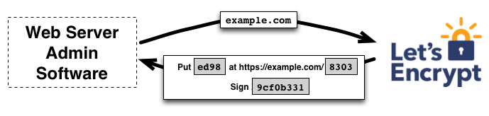
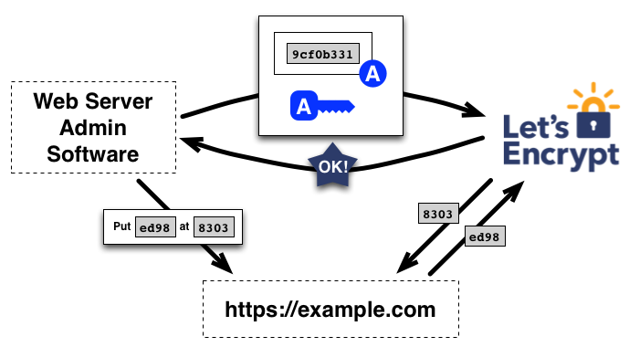
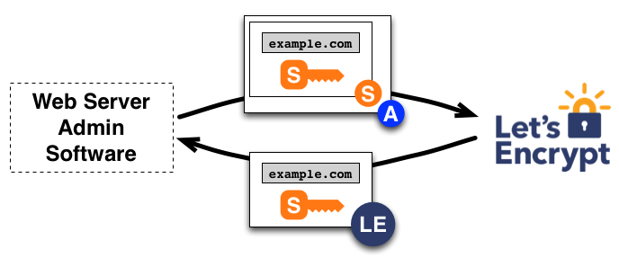
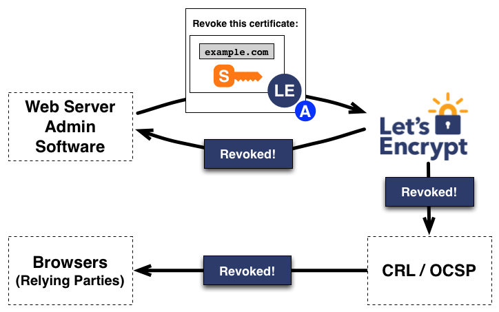

参考资料:
- [How its works - Let's Encrypt](https://letsencrypt.org/how-it-works/)

本文索引:
- [背景](#%E8%83%8C%E6%99%AF)
- [证书申请流程](#%E8%AF%81%E4%B9%A6%E7%94%B3%E8%AF%B7%E6%B5%81%E7%A8%8B)
- [域名认证](#%E5%9F%9F%E5%90%8D%E8%AE%A4%E8%AF%81)
- [证书管理](#%E8%AF%81%E4%B9%A6%E7%AE%A1%E7%90%86)
  - [证书申请](#%E8%AF%81%E4%B9%A6%E7%94%B3%E8%AF%B7)
  - [证书废止](#%E8%AF%81%E4%B9%A6%E5%BA%9F%E6%AD%A2)

## 背景
某网站主体拥有 `www.example.com` 域名的管理权限，为了让该网站启用 HTTPS，网站主体必须首先从「证书颁发机构(CA, Certificate Authority)」获得「数字证书」。传统的 HTTPS 证书完全由人工审核，且大多数 CA 都是收费的。

[Let's Encrypt](https://letsencrypt.org/) 是一个免费签发 HTTPS 证书的非盈利 CA，其目标是推动 HTTPS 协议的普及，并通过其自定的 [ACME(Automatic Certificate Management Environment) 协议](https://github.com/ietf-wg-acme/acme)让申请证书的流程完全自动化。

## 证书申请流程
以 `www.example.com` 为例，申请 HTTPS 证书，通常覆盖以下两个步骤：
1. 域名认证: 网站主体必须向 CA 证明其对 `www.example.com` 拥有管理权。
2. 证书管理: 网站主体向 CA 申请、更新或撤销 `www.example.com` 的 HTTPS 证书。

## 域名认证
在传统 CA 签发流程中，用户首先注册帐户，然后向帐户中添加宣称拥有管理权的域名。在 `Let's Encrypt` 签发证书的流程中，申请人使用一个实现了 ACME 协议的客户代理软件(官方推荐为 [Certbot](https://certbot.eff.org/))与 `Let's Encrypt` CA(下文中的 CA 均代指 `Let's Encrypt`) 通信:
1. 申请人客户代理软件首先向 CA 传递自己的「公钥」以供 CA 唯一标识申请人，然后询问 CA 如何向其证明对 `www.example.com` 域名的管理权
2. CA 向申请人提出若干种 `Challenge` 选项，这些 `Challenge` 通过其实现方式要求申请人证明对 `www.example.com` 的管理权，例如:
   - 请向 `www.example.com` 添加一条给定随机值的 DNS 记录，或
   - 请在 `https://www.example.com/` 下添加一条给定随机值的资源文件
3. 同时，CA 会向申请人提供一条 `nonce` 并要求申请人使用其「私钥」进行签名，以证明申请人确实是「密钥对」的持有方，下图展示了展示了这个过程:

4. 申请人可按需选择上述任何一种 `Challenge` 并以其「私钥」对 `nonce` 进行签名后，告知 CA 以等待验证，下图展示了这个过程

5. 如果签名及 `Challenge` 均验证通过，CA 将认可申请人对 `www.example.com` 域名拥有管理权，并关联该「密钥对」为 `www.example.com` 域名的已授权「密钥对」。

## 证书管理
一旦申请人提供的「密钥对」得到 CA 的授权，就意味着申请人获得了为 `www.example.com` 管理证书的权限。包括申请，更新和撤销证书。实现这些操作均通过签名「证书管理消息」来完成。

### 证书申请
要为 `www.example.com` 申请证书，客户代理软件构造一条 [PKCS#10](https://en.wikipedia.org/wiki/PKCS) 的 [CSR(Certificate Signing Request)](https://tools.ietf.org/html/rfc2986) 请求，该 `CSR` 请求 CA 为 `www.example.com` 域名颁发数字证书并将一个给定的「公钥」与该证书关联。`CSR` 中同时会包含一条使用对应「私钥」签名的消息。并且客户代理软件将整个 `CSR` 消息以前文所述的「授权密钥对」中的「私钥」进行签名。

> 上述中提及的「授权密钥对」和 `CSR` 中关联的「公钥」可能分属于两份「密钥对」

这样，CA 同时接收到 `CSR` 以及整段 `CSR` 签名后的消息。CA 用「授权密钥对」中的「公钥」验证该签名，如果验证通过，CA 将 `www.example.com` 域名与 CSR 中提供的「公钥」关联，并颁发证书，最后返回给客户代理软件。

### 证书废止
证书的废止过程与申请类似，客户代理软件向 CA 发送一条 `CRR(Certificate Revocation Request)` 消息。过程与 `CSR` 类似，可参考下图: 

CA 完成验证之后，发布证书废止信息至 [OCSP](https://en.wikipedia.org/wiki/Online_Certificate_Status_Protocol)，以通知「证书检验方」(如浏览器)该证书已撤销。
