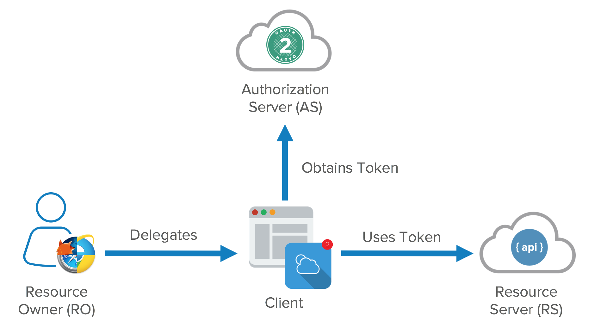
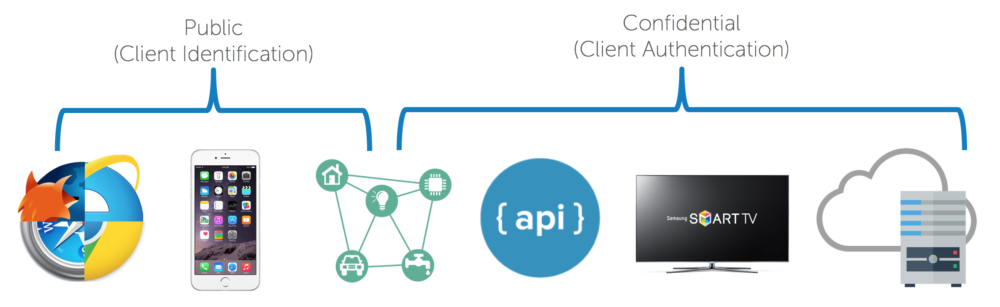
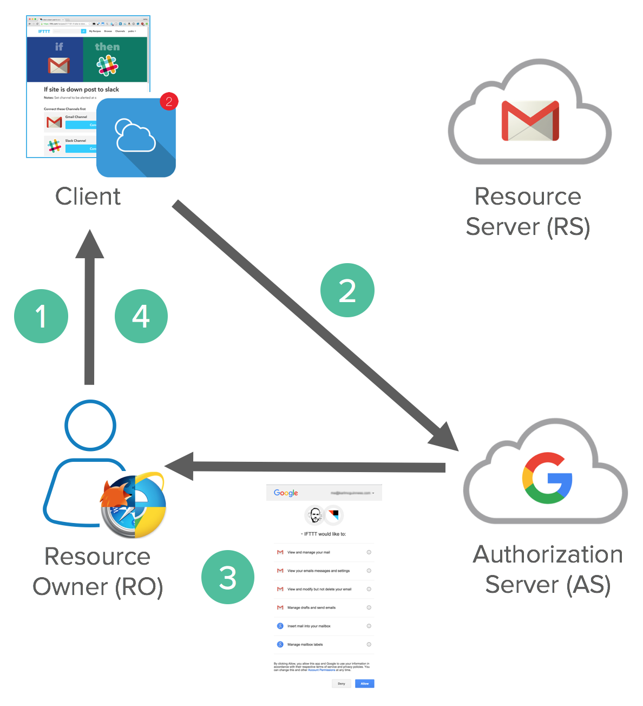
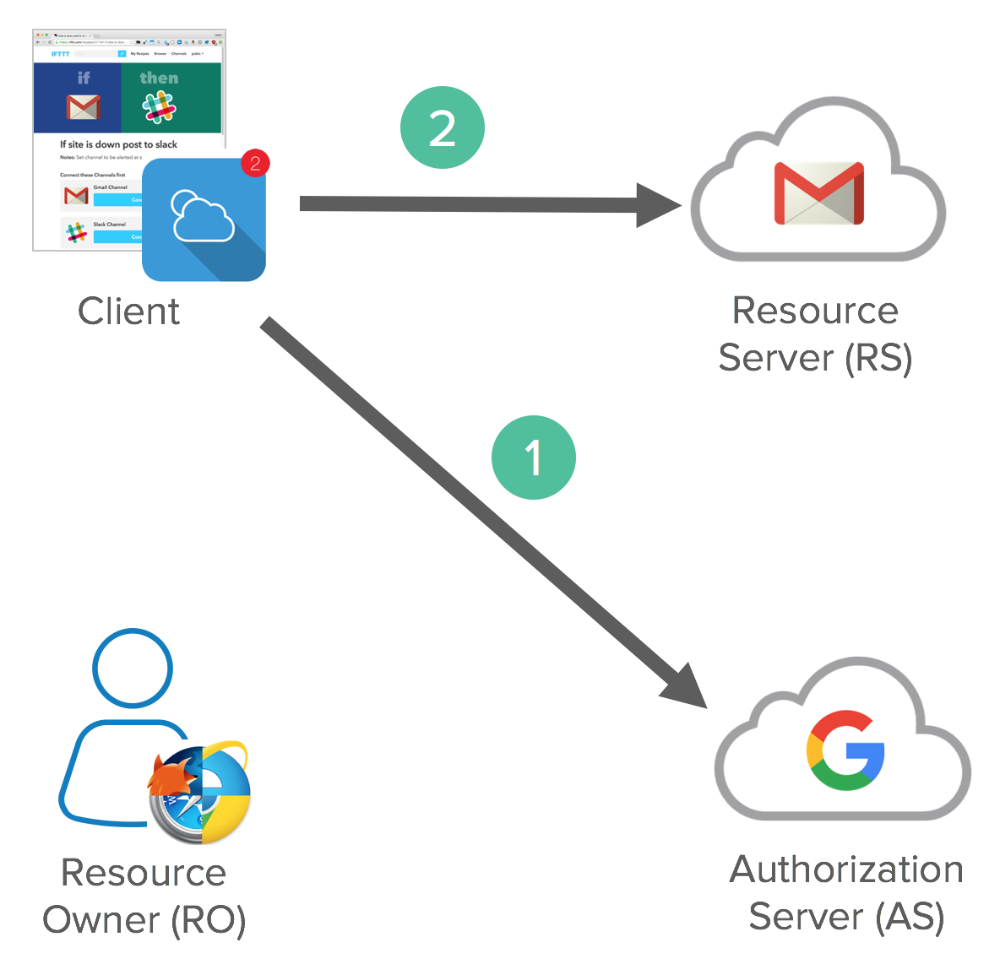
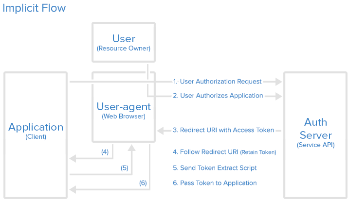
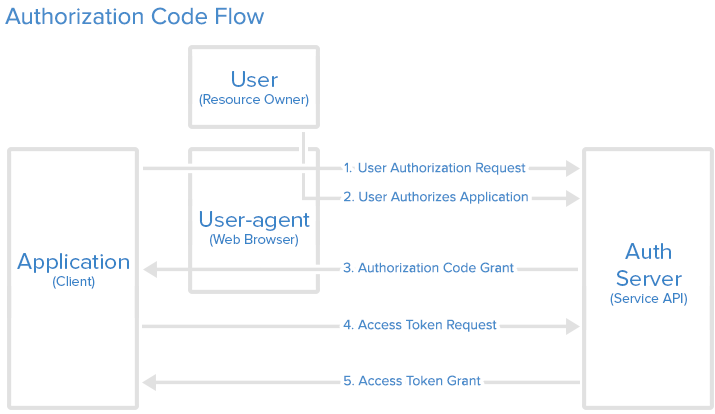
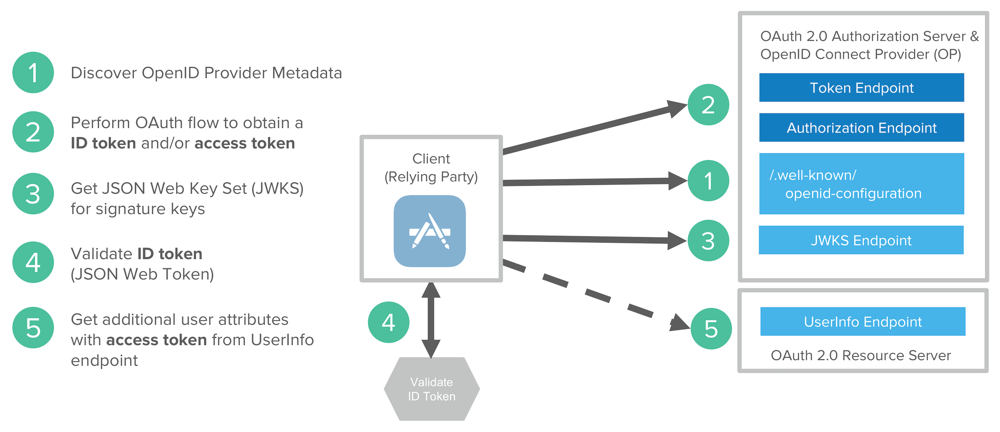

参考资料:
- [OAuth 2.0 Debugger](https://oauthdebugger.com/)
- [OpenID Connect Debugger](https://oidcdebugger.com/)
- [Youtube Video - OAuth 2.0 and OpenID Connect](https://www.youtube.com/watch?v=996OiexHze0)
- [What the Heck is OAuth](https://developer.okta.com/blog/2017/06/21/what-the-heck-is-oauth)

本文索引:
- [前言](#前言)
- [OAuth、OIDC 和 IdentityServer4 三者的关系](#oauthoidc-和-identityserver4-三者的关系)
- [OAuth 角色定义](#oauth-角色定义)
- [OAuth Tokens](#oauth-tokens)
  - [Access Token](#access-token)
  - [Refresh Tokens](#refresh-tokens)
- [Authorization Grant](#authorization-grant)
- [OAuth EndPoints](#oauth-endpoints)
- [授权通信通道](#授权通信通道)
  - [Front Channel](#front-channel)
  - [Back Channel](#back-channel)
- [OAuth Flows](#oauth-flows)
  - [Implicit Flow](#implicit-flow)
  - [Authorization Code Flow](#authorization-code-flow)
  - [Client Credential Flow](#client-credential-flow)
  - [Resource Owner Password Flow](#resource-owner-password-flow)
  - [Device Flow](#device-flow)
- [安全提醒](#安全提醒)
- [OAuth 不是认证协议](#oauth-不是认证协议)
- [Auth 2.0 的伪认证](#auth-20-的伪认证)
- [Open ID Connect](#open-id-connect)

## 前言
工作中经常听到关于 `OAuth2` 的讨论，但很难用只言片语将这一整套体系解释清楚。本文希望通过查阅资料和开发实践，阐明 `OAuth2`、`OIDC` 和 `IdentityServer4` 三者关于 `what`、`why`、和 `how` 的问题。

## OAuth、OIDC 和 IdentityServer4 三者的关系
假设有一个这样的需求: 客户端程序需要访问资源服务器的 API，又不希望每次访问都带上用户名密码做一次认证。面对这样的需求，不同的开发人员有自己的考虑，可能的实现多种多样。在经过长期沉淀和提炼之后，先驱们总结出了在不同场景下「委托授权」的最佳实践，然后为这一套最佳实践制定出一套规范 - `OAuth`。

`OAuth` 标准化了「委托授权」涉及的各个参与方、数据和 `EndPoint`，其目的在于为实现者提供一套统一的参考标准。由于时代原因，`OAuth 1.0` 已经不适合现代 Web 技术的使用场景，所以本文中谈到的 `OAuth` 均指 `OAuth 2.0`。`OAuth` 先于 `OIDC` 诞生，两者均为规范(Specifications)，`OAuth` 对应 [RFC6749](https://tools.ietf.org/html/rfc6749)，`OIDC` 对应 [OpenID Connect Core 1.0 incorporating errata set 1](https://openid.net/specs/openid-connect-core-1_0.html)，而 `IdentityServer4` 为 `OIDC` 在 .NET 平台 [官方授权](https://openid.net/certification/)的实现类库。

## OAuth 角色定义
- `Resource Owner`: 资源数据的拥有者，绝大多数情况下指用户，例如，我是 `Facebook` 帐号数据的拥有者
- `Resource Server`: 受保护资源的服务方，通常以 API 形式向外界暴露资源数据，例如，`Facebook` 的 `User Profile` 服务
- `Client`: 想要访问 `Resource Owner` 托管在 `Resource Server` 数据的第三方应用程序
  - `Public Clients`: 暴露在公开的分发渠道中的应用程序，诸如 `Web App`、`Mobile App` 和 `IoT` 设备
  - `Confidential Clients`: 受信任的机密应用程序，自存储 `secret`。它们没有公开暴露在互联网中，无法轻易被反向工程
- `Authorization Server`: 授权服务方，管理 `Resource Owner` 身份信息和授权列表的服务

一个简单的 `OAuth` 流程如下所示:




## OAuth Tokens
`OAuth` 规范定义了两种 Token: `Aceess Token` 和 `Refresh Token`。
### Access Token
`Access Token` 是为 `Public Client` 用于短期(数小时或数分钟)访问受保护资源(`Resource Server`)的凭证。由于其相对较短的生存期，可以无需为它们设计撤销方案，等待其自动过期即可。

### Refresh Tokens
当 `Resource Owner` 撤销某 `Client` 应用程序的访问权限时，实际是撤销了其 `Refresh Token`，这意味着当用户再次授权 `Client` 访问权限时，`Client` 将使用新的 `Refresh Token`，是一种强制过期措施。而每一次通过 `Refresh Token` 获得的都是一枚新的 `Access Token`。

> `OAuth` 规范中没有对 `Token` 定义具体内容，它可以是任何格式。由于 JWT 的广泛使用，很容易将这里的 `Token` 与 JWT 对等起来，在后文的介绍中将区分它们。

## Authorization Grant
`Authorization Grant` 是「授权许可」的泛化名称，表示 `Authorization Server` 在授权用户之后返回给 `Client` 的许可载体，`Client` 可借由该载体进一步向 `Authorization Server` 换取 `Access Token`。该载体通常以 `code` 表示，为一段随机生成的字符串，有效期非常短。

## OAuth EndPoints
`OAuth` 规范为 `Authorization Server` 定义了标准化的 `Endpoint` 用于不同的场景:
- `/oauth2/authorize`: `Authorize Endpoint`，认证用户并征求用户授权，返回 `Authorization Grant`
- `/oauth2/token`: `Token Endpoint`，分发 `Refresh Token` 和 `Access Token`，当 `Access Token` 过期后，可利用 `Refresh Token` 申请新的 `Access Token`
- `/oauth2/introspect`: 用于检视某个 `Token` 是否仍然有效
- `/oauth2/revoke`: 用于撤销 `Refresh Token`

> 关于 `OAuth` 一个显著的争论是，开发人员不得不管理 `Refresh Token`。这也是开发人员偏爱 `API Keys` 的原因，虽然 `API Keys` 方便很多，但任何客户端都必须保存 `API Keys`，这加大了安全风险。

## 授权通信通道
`OAuth` 中将「委托授权」在各个流程中涉及的步骤分成了前后两步: `Front Channel` 和 `Back Channel`。
### Front Channel
`Front Channel` 表示发生在开放的互联网中的部分，典型的场景是由「用户代理程序」发起的部分。以浏览器为例，其流程如下:
1. `Resource Owner` 委托 `Client` 访问 `Resource Server`
2. `Client` 被重定向至 `Authorization Server` 的 `Authorize Endpoint`
3. `Authorization Server` 认证 `Resource Owner`，展示对话框征求用户授权
4. `Resource Owner` 认证通过，并同意授权后，`Authorization Server` 返回 `Authorization Grant` 并通过浏览器重定向至 `Client` 指定的 `redirect_uri`。



首先来看 `Request`:
```bash
GET https://accounts.google.com/o/oauth2/auth?scope=gmail.insert gmail.send
&redirect_uri=https://app.example.com/oauth2/callback
&response_type=code&client_id=812741506391
&state=af0ifjsldkj
```
请求的查询字符串参数中:
- `scope`: 表示欲访问资源的预定义资源集，此处为 Gmail 的 API
- `redirect_uri`: 指示 `Authorization Server` 在完成授权后应该重定向的地址，该值必须与 `Client` 注册时提供的地址一致
- `response_type`: 指示请求的 `OAuth Flow`
- `client_id`: 标识 `Client`，同样须与 `Client` 注册时的值一致
- `state`: 用于减轻跨站请求伪造的验证数据

接下来是 `Response`:
```bash
HTTP/1.1 302 Found
Location: https://app.example.com/oauth2/callback?
code=MsCeLvIaQm6bTrgtp7&state=af0ifjsldkj
```
- `code`: 代表 `Authorization Grant` 的字面值
- `state`: 将 `request` 中的 `state` 原封不动的传回，以供 `Client` 应用程序验证请求来源

### Back Channel
`Front Channel` 的工作完成之后。`Back Channel` 开始，`Client` 接收到由 `Authorization Server` 的重定向请求后，取得 `code`，接着使用 `code`、`ClientId` 及 `Client Credential` 向 `Authorization Server` 请求换取 `Access Token` 及 `Refresh Token`(可选)。`Client` 再以 `Access Token` 访问受保护的资源。


`Request` 的源数据为:
```bash
POST /oauth2/v3/token HTTP/1.1
Host: www.googleapis.com
Content-Type: application/x-www-form-urlencoded

code=MsCeLvIaQm6bTrgtp7&client_id=812741506391&client_secret={client_secret}&redirect_uri=https://app.example.com/oauth2/callback&grant_type=authorization_code
```
- `grant_type`: 授权许可的类型，代表了一种 `OAuth Flow`，此案例中为 `authorization_code`，这是典型的 `OAuth Flow`

`Response`:
```bash
{
  "access_token": "XXXXXXXXXXXXX",
  "token_type": "Bearer",
  "expires_in": 3600,
  "refresh_token": "XXXXXXXXXXXXX"
}
```
`Response` 的 `Body` 部分为 JSON 格式，描述了 `Token` 的信息。

> 值得注意的是，`access_token` 和 `refresh_token` 不一定是 Jwt。

## OAuth Flows
### Implicit Flow
`Implicit Flow` 又称为简化流程，因为没有任何后台服务参与使用 `Authorization Grant` 换取 `Access Token` 的流程，整个过程由 `Browser` 直接与 `Authorization Server` 通信。



`Implicit Flow` 常见于 `SPA` 应用程序，`Access Token` 由 `Authorization Server` 直接返回给浏览器，并且不支持 `Refresh Token`，它假定 `Resource Owner` 和 `Public Client` 运行在同一设备上。由于所有流程发生在浏览器，它是最脆弱的一种流程。

### Authorization Code Flow
简称为 `Code Flow`，也是 `OAuth` 推崇的方案，该 `Flow` 同时采用了 `Front Channel` 和 `Back Channel`。它常见于 `Web App` 的场景。`Client` 应用程序通过 `Front Channel` 向 `Authorization Server` 申请 `Authorization Code`，再通过 `Back Channel` 用 `Authorization Code` 换取 `Access Token`。它假定 `Resource Owner` 和 `Client` 应用程序运行在不同的设备上，`Access Token` 始终不会传输到「用户代理应用程序」。



### Client Credential Flow
`Client Credential Flow` 适用于 `server-to-server` 的场景。在这种场景中，`Client` 须是 `Confidential Client`，利用 `Client Credential` 作为 `Client` 的凭证完成授权流程，整个过程全部发生在 `Back Channel`，可使用对称或非对称加密算法对 `Client Credential` 进行加密。

### Resource Owner Password Flow
这是一种过时的流程，已不再推荐使用。这种 `Flow` 将用户的帐号密码通过「用户代理应用程序」向 `Authorization Server` 请求 `Access Token`。通常情况下它不支持 `Refresh Token` 并假定 `Resource Owner` 和 `Public Client` 运行在同一设备。

### Device Flow
用于类似 TV 等硬件设备，或仅仅运行一个 Cli 的程序，直接与 `Authorization Server` 通信取得一个 `code`，再用 `code` 换取 `Access Token` 的流程。

## 安全提醒
上述所有这些 `Flow` 都不同程度地涉及了 `OAuth` 规范中定义的角色，应该采用哪种 `Flow` 取决于 `Client` 的类型，但有以下几点值得注意:
- 使用 `state` 参数验证完整性以减轻 [CSRF(Cross-Site Request Forgery)](https://www.owasp.org/index.php/Cross-Site_Request_Forgery_(CSRF)) 攻击
- 启用白名单验证用于重定向的 `Url`
- 使用 `ClientId` 绑定特定的 `Client` 与指定的 `Grant Type` 和 `Token` 类型
- 确保 `Confidential Clients` 的 `Secret` 不会泄露

`OAuth` 规范的 `Token` 并不会与终端用户绑定，它可以像 `Session Cookie` 一样被传递，任何人都能将其拷贝并用在 `Authoriazaion Header` 中。`OAuth` 将授权策略与身份认证解耦，它可以实现细粒度与粗粒度授权的融合，并且代替传统 Web App 的访问管理机制。同时，`OAuth` 对访问受保护资源 API 提供了限制和撤销机制，确保特定 `Client` 只能可访问受限的 API。

## OAuth 不是认证协议
`OAuth` 是一套授权流程的框架并非协议。它关注的重点是如何委托 `Authorization Server` 进行授权，而不是认证。`OAuth` 的官方文档没有提到有关用户的操作，所有 `Flow` 的目的都是为了取得一个可以访问受保护资源 API 的 `Access Token`。

## Auth 2.0 的伪认证
Facebook Connect 和 Twitter 最早使用 `Access Token` 向一个 `/me` 的 `Endpoint` 取得用户数据，该 `Endpoint` 并没有在 `OAuth` 的规范中定义，这种方式被称为伪认证。

## Open ID Connect
为了解决伪认证以非规范化的方式被滥用，`OAuth` 框架的一部分、Facebook Connect 以及 SAML2.0 被合并为 [OpenID Connect(OIDC)](https://openid.net/connect/)，OIDC 在 OAuth 2.0 基础上扩展了一个经过签名的 `ID Token`，以及一个 `UserInfo Endpoint` 用于获取用户数据。`OIDC` 还标准化了针对身份信息的 `scope` 和 `claim`，例如 `profile`、`email`、`address` 和 `phone`。除此之外，OIDC 将注册、发现等功能作为组件纳入规范之中。与 `OAuth` 的 `Request` 相比，其 `scope` 可接受新的值，如 `openid` 和 `email`:
```bash
GET https://accounts.google.com/o/oauth2/auth?
**scope=openid email**&
redirect_uri=https://app.example.com/oauth2/callback&
response_type=code&
client_id=812741506391&
state=af0ifjsldkj
```
以及在 `Authorization Grant` 向 `Authorization Server` 换取 `Token` 后的 `Response` 中新增了 `ID Token`:
```bash
{
  "access_token": "XXXXXXXXXXXXXXX",
  "token_type": "Bearer",
  "expires_in": 3600,
  "refresh_token": "XXXXXXXXXXXXXXXX",
  **"id_token": "eyJhbGciOiJSUzI1NiIsImtpZCI6IjFlOWdkazcifQ..."**
}
```
`ID Token` 是一个 JWT(JSON Wbe Token)，JWT 非常小巧，易于传输，由 3 部分组成:
- `header`: 包含签名所使用的算法
- `body`: 包含代表用户身份信息的 `claim`
- `signature`: 用于完整性验证的签名信息

`OIDC Flow` 涉及以下步骤:
1. 发现 `OIDC` 元数据
2. 发起一种 `OAuth Flow` 来取得 `ID Token` 和 `Access Token`
3. 取得用于 JWT 签名的 `Key` 并动态注册 `Client` 应用程序(可选)
4. `Client` 基于 JWT 的日期与签名离线验证 `ID Token`
5. 利用 `Access Token` 按需获取用户数据

