## 初衷
在树莓派社区广大极客的浸染下，了解到了各种大神的新奇玩法。经过一番研究之后，笔者决定利用市面上能够现成买到的配件，自行组装一个便携式复古游戏机。这款游戏机应该:
- 自带电源
- 自带屏幕
- 即拿即用

## 硬件部分
经过一段时间的调查和试错之后，终于组合出了一个靠谱的解决方案，下面先从硬件部分说起:
### 树莓派 3b+
3B+ 是目前为止树莓派性能最好的型号，既然要用来跑游戏，自然性能越强越好:

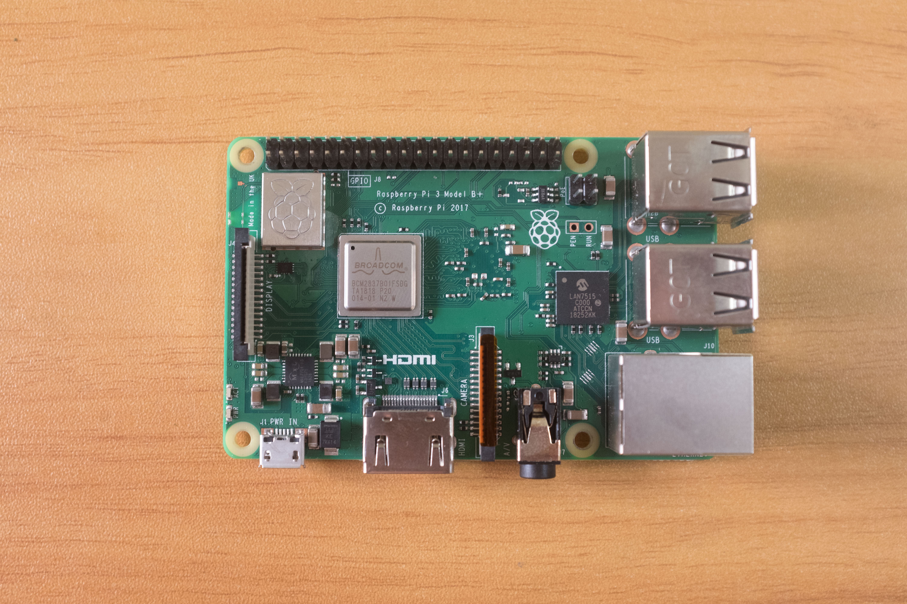 

### Micro-SD 卡(TF 卡)
用于跑系统和存储游戏 ROM，容量自选:

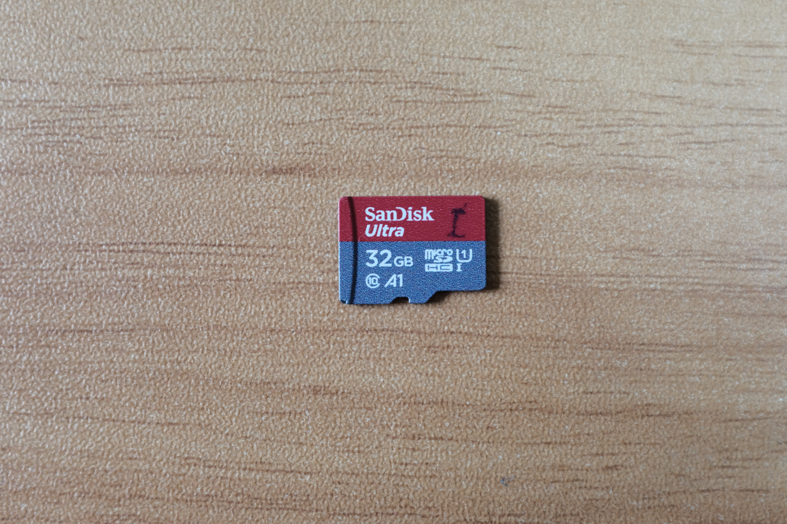 

### 树莓派官方 7 英寸触控屏
之所以选择官方 7 英寸触控屏，是因为笔者没有找到合适的 5V 供电的第三方屏。虽然触控功能在大多数情况下用不到，但聊胜于无，且这块屏幕的做工和设计都挺不错的。
> 使用 Micro-USB 口供电的屏幕可以作为第二选项，但目前没有发现在性价比上超过官方屏的第三方屏

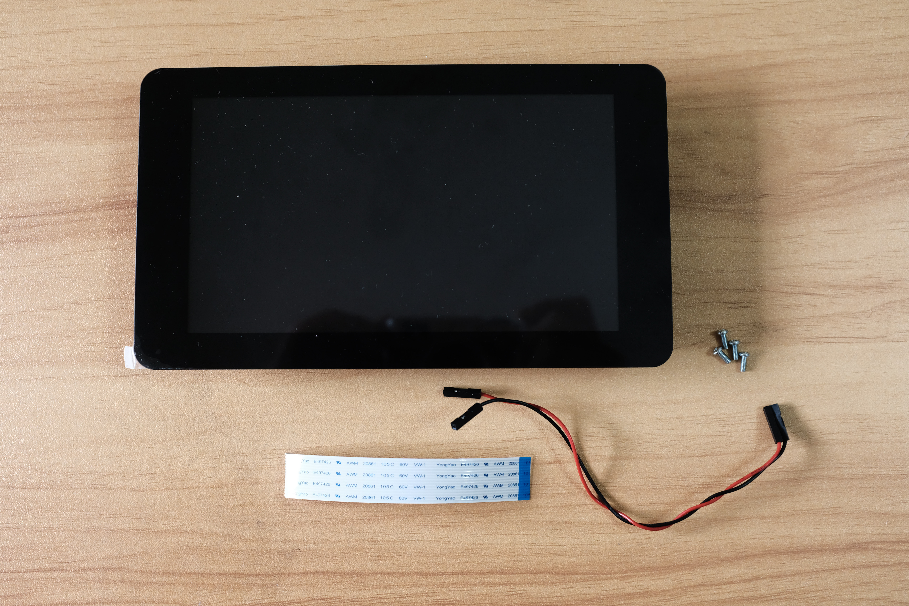 

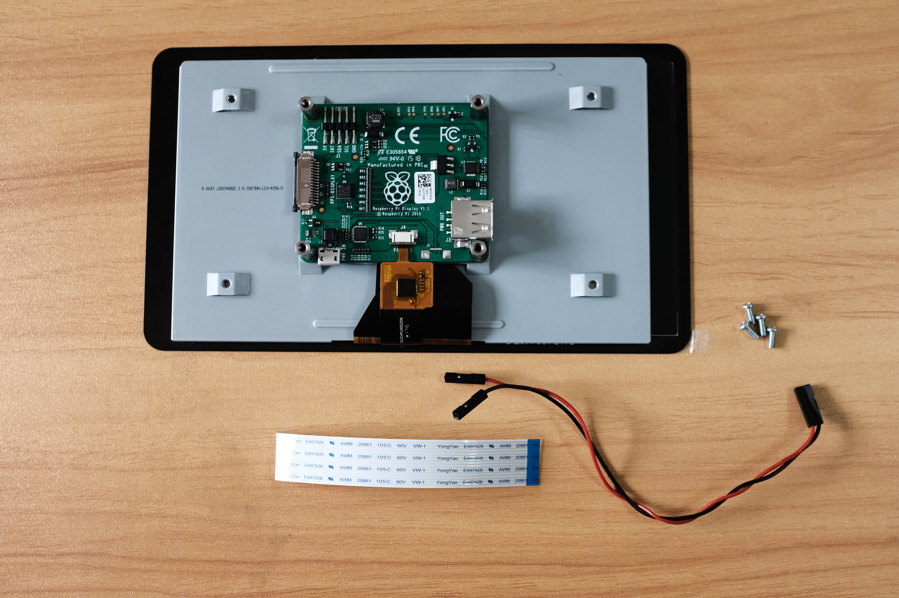 

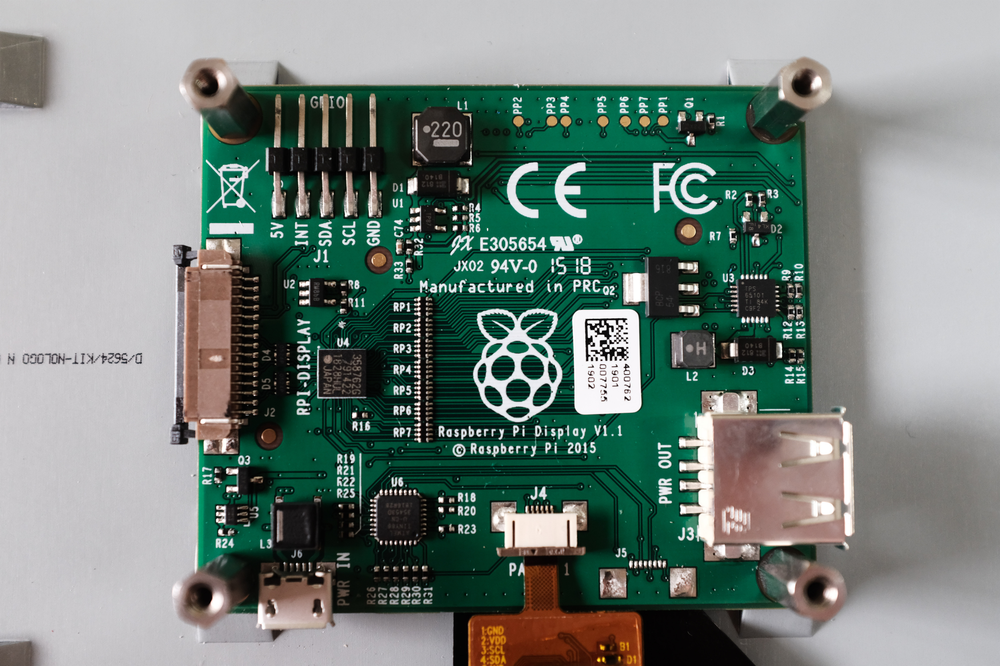 

适配板左侧为 DSI 接口，接受 3 种类型的供电接口:

1. 左上角，GPIO 杜邦线供电
2. 左下角，Micro-USB 接口
3. 右侧，USB Type-A 接口

### UPS 模块
为游戏机提供便携电源一度成为最头疼的问题，树莓派机身需要 5.1V/2.5A 的电源，网友们给出了各种各样 diy 的供电解决方案，比如:
- 充电宝: 最简单但也是最简陋的方案，但大多数充电宝的输出电流都达不到 2.5A，美亚上找到一款专门为树莓派设计的移动电源 [Battery Pack for Raspberry Pi 3 B+, 4000mAh, Suction](https://www.amazon.com/dp/B07BSG7V3J/?coliid=I51AG6BSQZU3Y&colid=T1IGTU2GG2TB&psc=0&ref_=lv_ov_lig_dp_it)
- 自制电池盒: 使用 GPIO 为树莓派供电的模块，后接 AA 电池盒，模块仅供电，没有充电管理功能，类似于充电宝，只是连接形式从 usb 接口换到了杜邦线
- 锂电池模块(UPS 模块): 最理想的移动供电方式，通过杜邦线与树莓派连接的锂电池充放电管理模块，当前最流行的貌似是 [PiJuice HAT](https://uk.pi-supply.com/products/pijuice-standard)，高端型号还带太阳能充电板，价格偏贵，单模块的价格都可以买两个树莓派了，有点 Overkill。在搜遍了某宝，eBay 和亚马逊之后，最终选择了一款国内厂商做的 UPS 模块，带 3800 毫安锂电池，开关和电量指示

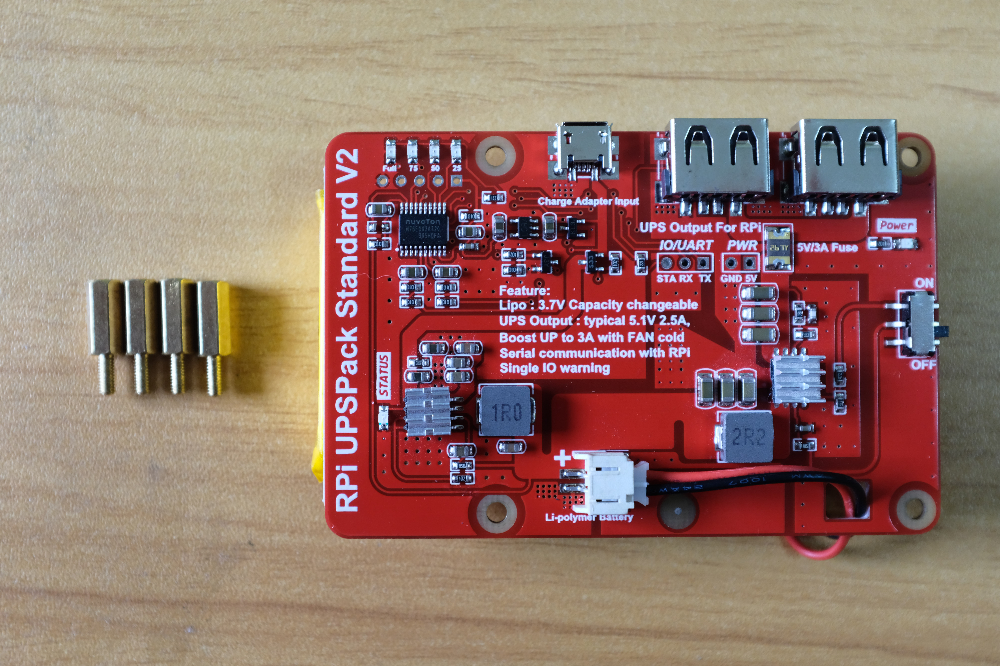

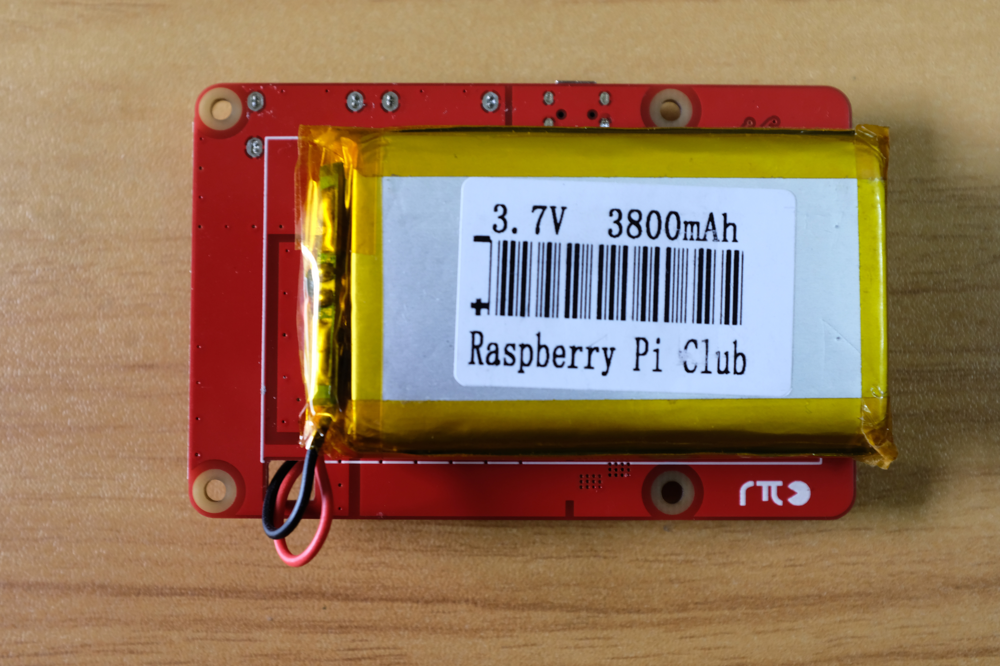 

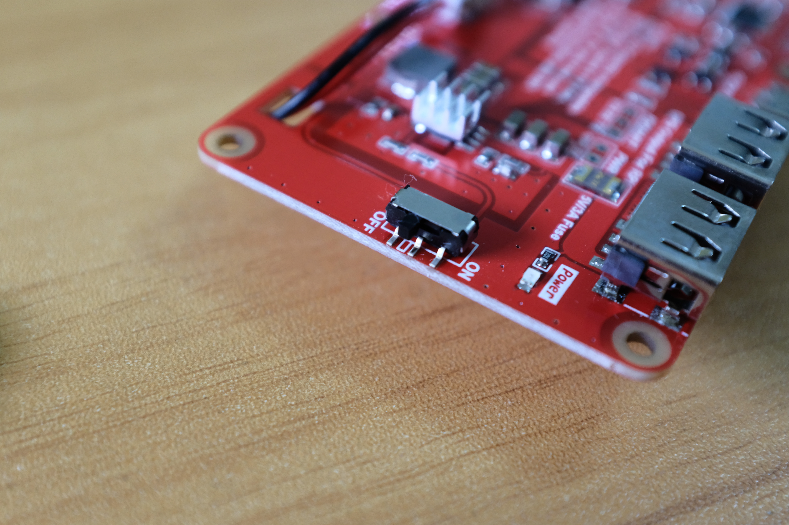 

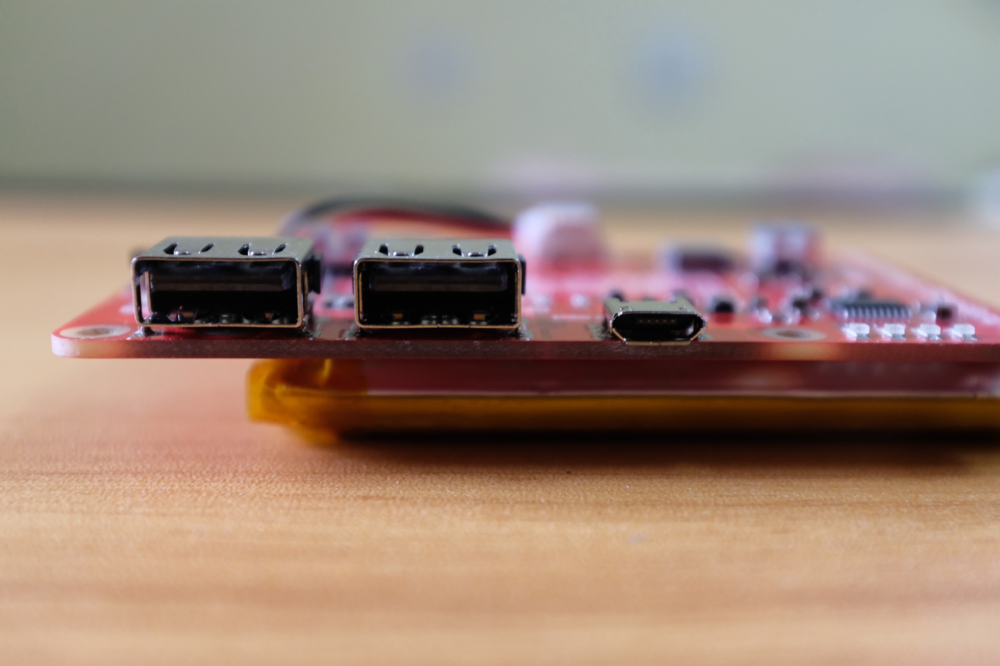

实装 UPS 模块之后，单 USB 输出要同时为树莓派和 7 寸屏幕供电，导致屏幕右上角时不时出现闪电符号，即电压低。跟卖家沟通之后，有两种解决方案
1. 采用两根 Micro-USB 线对屏幕和树莓派分别供电，笔者试过之后情况大有改善
2. 不用 Micro-USB 线，自行焊上排针，改用杜邦线供电以减少线损，这个方案需自己有焊排针的能力，未曾尝试

### Micro-USB 弯头线
树莓派通过 Micro-USB 线连接至 UPS 输出口进行供电，而常规的安卓手机充电线都是直头且长度较长。为了一体化和美观考虑，单独购买了这根 25cm 的双弯头充电线。事实上 25 cm 仍然长了一点，但从正面看已经没有露出的线头了。

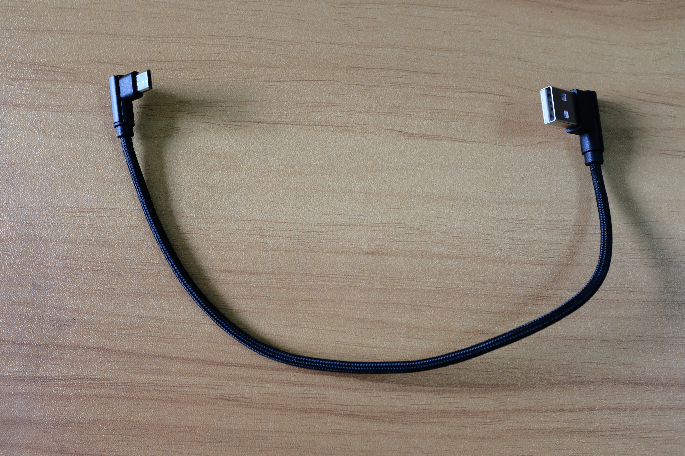

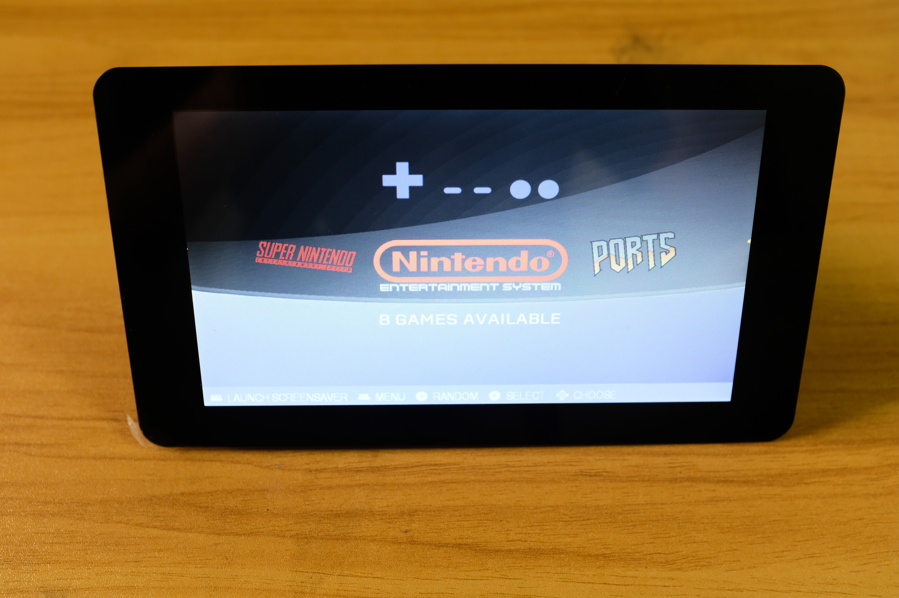

### 其他外设
用于放置游戏机整机的支架，某东上几十块钱买的手机支架:

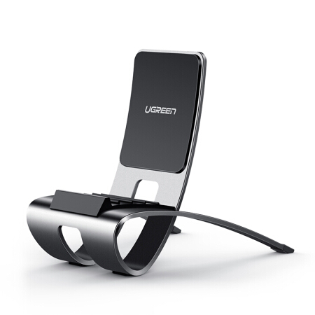

硬件汇总:

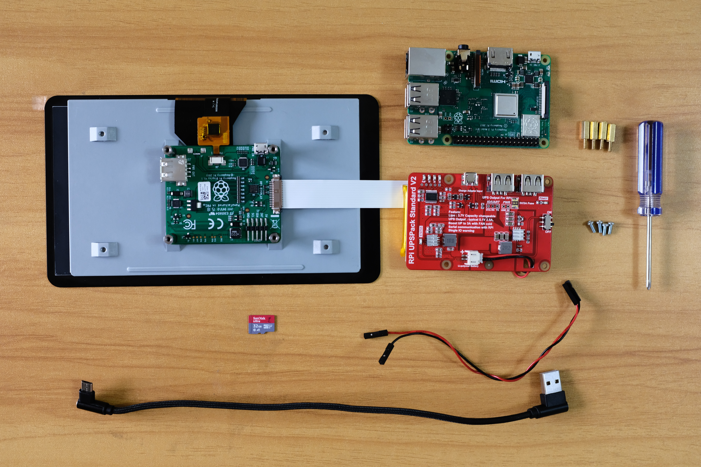

准备就绪，开始组装:


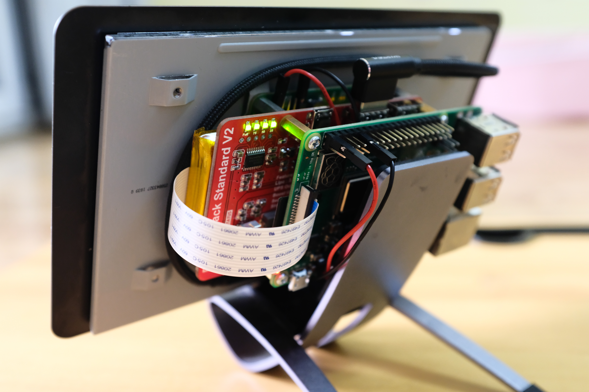

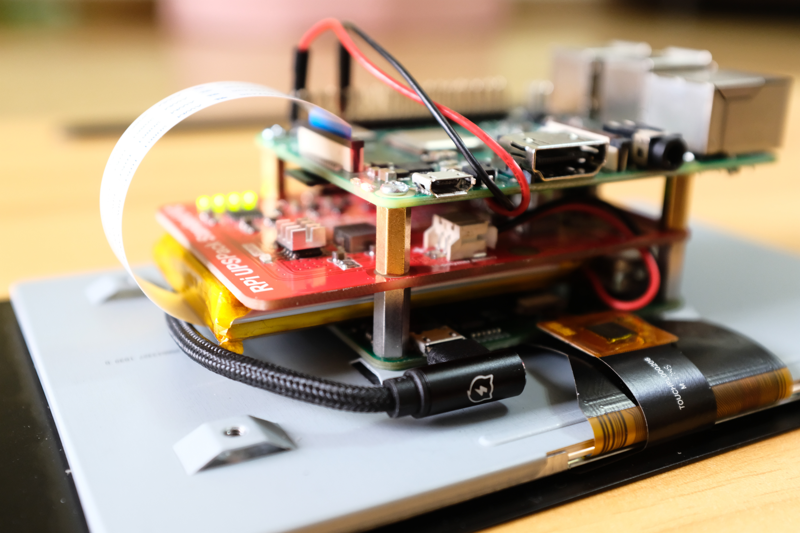

## 软件部分
### RetroPie
RetroPie 是一款模拟器系统，参考其[官方文档](https://retropie.org.uk/)直接使用现成 Image 或基于已有 Raspbian 系统安装。如果选择直接下载 RetroPie 的 Image 进行安装，请参考[家庭数字化系统 - 准备树莓派](/homeserver-setup-raspberry-pi)烧写系统镜像。

### 游戏 ROM
视频的演示中涉及了 PS1 的游戏，目前 3B+ 的性能只能稳定运行 PS1 及以前平台的游戏，PSP 等需要更高性能的计算机。由于众所周知的原因，游戏的 ROM 请自行准备。

## 结论
完工的游戏机从成本来看并不低，但折腾的乐趣就在于过程，对于喜欢折腾也想随时在家有个小游戏机玩的人来说，这提供了一种新思路。