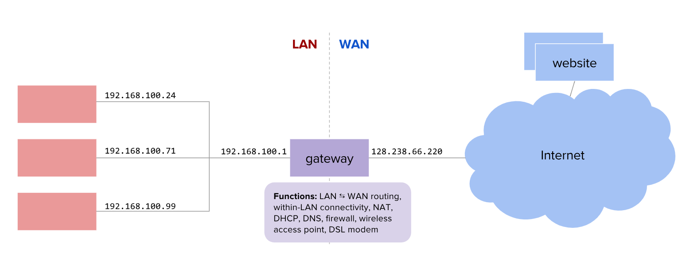
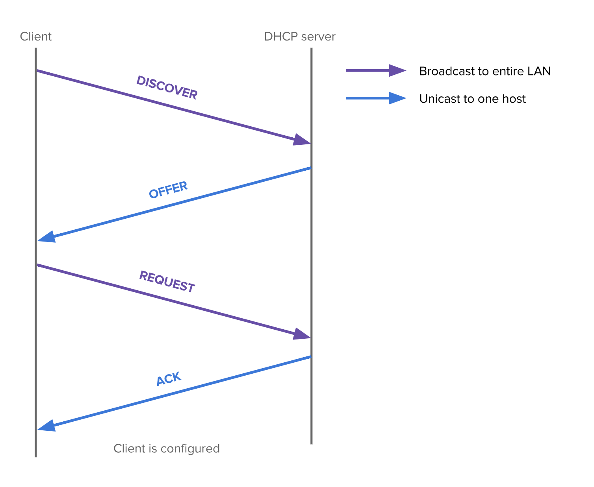
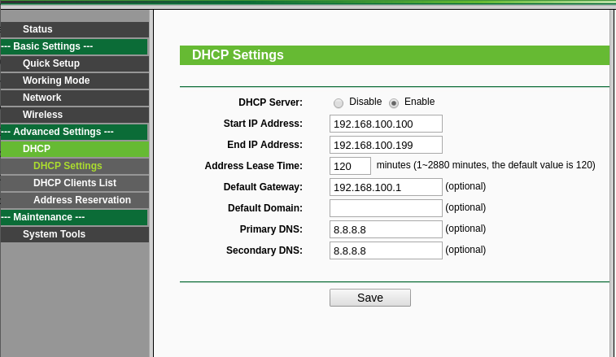
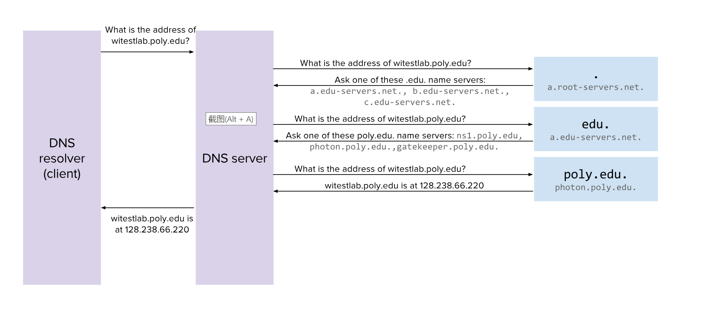
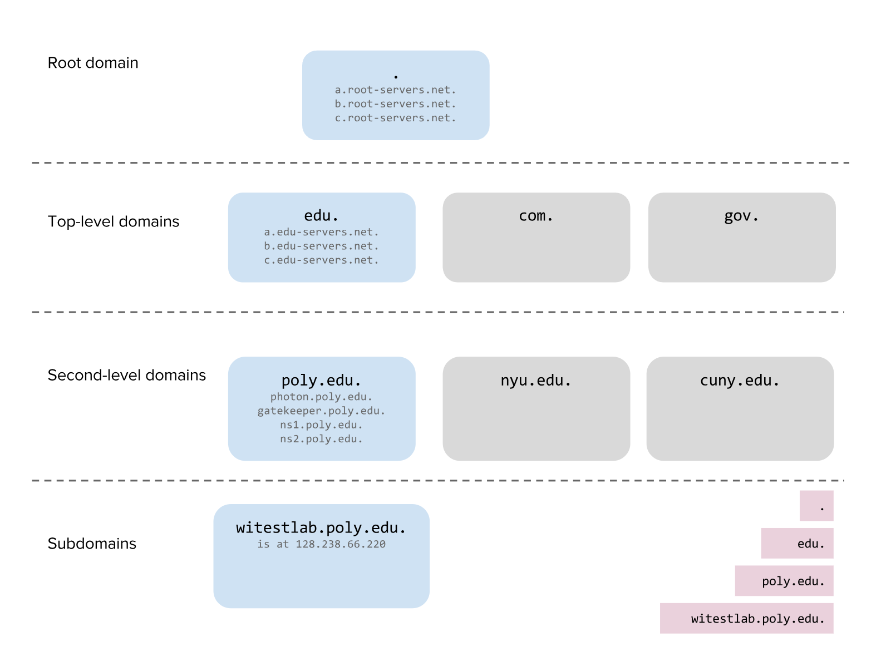
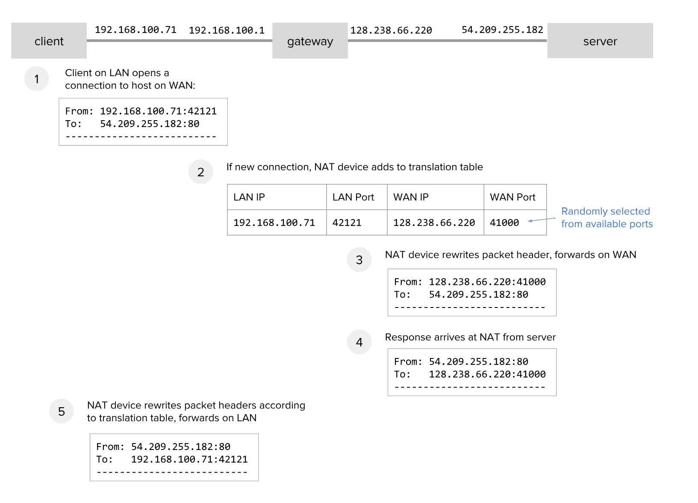
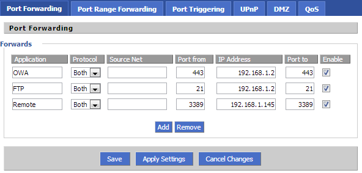

本文索引:
- [前言](#前言)
- [DHCP](#dhcp)
- [DNS](#dns)
- [NAT](#nat)

## 前言
大多数家庭网络，通过一个家庭网关将本地局域网(LAN - Local Area Network，下称 LAN)与广域网(WAN - Wide Area Network，下称 WAN)连接起来，本篇文章将介绍实现这一功能涉及到的一系列软件和硬件基础设施。

**家庭网关**通常指间于广域网和局域网起桥梁作用的设备:

我们最熟悉的家庭网关设备就是**路由器**，其最基本的功能，是在 LAN 和 WAN 之间路由数据。但在多数时候，它还兼顾了其他对 LAN 有用的功能:
- DHCP: 提供 LAN 主机 IPv4 地址的服务
- DNS: 响应 LAN 主机的名称查询
- NAT(Network Address Translation): 将公网 IPv4 地址映射至 LAN 主机 IPv4 地址

___
## DHCP
DHCP(Dynamic Host Configuration Protocol) 是一种用于动态分配 IP 地址至 LAN 主机的协议。它为家庭主机用户或网络管理员省去了手动为每台主机配置 IP 地址的工作。同时，它维护一个 IP 地址池，当一台主机与 LAN 断开连接，它之前占用的 IP 地址将回到该池，并在有新的设备连接至 LAN 时重新分配。以 DHCP 获取 IP 地址的过程包含 4 个阶段，其被称为 DORA - `discovery`, `offer`, `request` 和 `acknowledgement`。如下图所示:

1. 首先，客户主机广播一条 **DHCP DISCOVER** 消息
2. DHCP 服务器收到此消息，以一条 **DHCP OFFER** 单播消息回应，该消息包至少包含一个可用的 IP 地址，或包含网关地址和 DNS 服务器地址。如果 LAN 中有多个 DHCP 服务器，客户主机可能收到多条 **OFFER** 消息。
3. 客户主机用一条 **DHCP REQUEST** 消息回复一条 **OFFER** 消息，该 **REQUEST** 消息将在 LAN 中广播，如果有其他 DHCP 服务器也发布过 **OFFER** 消息，在接收到此条 **REQUEST** 消息后将视为该客户主机已拒绝该 **OFFER**。
4. 收到 **REQUEST** 消息的 DHCP 服务器将以一条 **ACK** 消息发布确认信息。

上述 4 个步骤完成之后，客户主机将被分配一个带有有效期的 IP 地址，在 IP 地址过期之后，客户主机将以一定间隔发布 **REQUEST+ACK** 消息以续期该 IP 地址。当客户主机与 LAN 断开连接时，将会发送一条 **RELEASE** 消息以告知 DHCP 服务器放弃该 IP 地址的使用。

通常，家庭网关设备会内置 DHCP 服务，并允许用户指定可分配 IP 地址的范围以及其他一些选项:

___
## DNS
网络中的主机需要以阅读友好的名称来区分它们，而不是通过 IP 地址(IP 地址太难让人记住)，DNS(Domain Name System) 是一个存储**名称 - IP 地址**映射记录的系统，并提供查询功能(域名解析)。

许多家庭网关设备同时扮演了 DNS 服务器的角色，用以家庭主机以域名形式定位其他主机的 IP 地址。DNS 服务器同时支持递归查询，这意味着本地 DNS 服务器可链接上游 DNS 服务器，形成递归链。DNS 查询从链中第一个节点开始查找，找不到则查询下一个节点，直到找到或链的尾端。DNS 的解析也以 `.` 分割进行渐进式查找，假设 LAN 中的主机想要获取 `witestlab.poly.edu` 域名的 IP 地址。

> 所有的 DNS 域名在最后都有一个 `.`，但即便省略该 `.`，DNS 解析者也能够工作

下图展示了整个过程:

1. LAN 中的 DNS 服务器并没有在本地存储 `witestlab.poly.edu` 的域名映射记录，则将其委托至上游 DNS 服务器
2. 上游 DNS 服务器从最右边开始解析 `witestlab.poly.edu`，找到负责解析 `.` 的根 DNS 服务器
3. 根 DNS 服务器不知道 `witestlab.poly.edu` 的映射记录，但它会回复一个能够解析 `.edu`(顶级域名) 的 DNS 服务器列表
4. `.edu` DNS 服务器也不知道 `witestlab.poly.edu` 的映射记录，但它会回复一个能够解析 `poly.edu`(二级域名) 的 DNS 服务器列表
5. 最终，负责解析 `poly.edu` 的 DNS 服务器知道 `witestlab.poly.edu` 的映射记录，并最终返回期望的 IP 地址

> 因此，任何知道根 DNS 服务器地址的 DNS 服务器最终都能找到对应域名的映射记录(除非本身记录不存在)。

在上述例子中，域名服务器所存储的映射记录如下图所示:

___
## NAT
家庭网关另一个常见的功能是 NAT(Network Address Translation)。NAT 通过**修改穿越网关数据包头部信息**将 IP 地址空间映射到另一个 IP 地址空间。由于全局公网 IPv4 地址稀缺，不可能为 LAN 中的每一台主机分配一个公网 IPv4 地址。相反，ISP(Internet Service Provider) 仅将为家庭网络分配一个公网 IPv4 地址。LAN 中的主机将使用一个私有的 IP 地址空间，如 192.168.0.0/16 空间。然而，这些地址无法在直接广域网中路由，因此 NAT 一个常见的功能是**映射 LAN 中私有 IP 地址至该公网 IPv4 地址**。这样，由 LAN 中主机发起或接收的流量就可被路由至广域网。

下图展示了 NAT 网关如何通过修改数据包头部信息来实现这一功能:

1. LAN 中的主机发起一个指向 WAN 中主机的网络连接，该连接会穿越 NAT 网关。开始发送数据包后，这些数据包的原始 From 地址为 LAN 中的私有 IP 地址。
2. NAT 网关在其翻译表中添加一条新记录，记下 LAN 主机 IP 地址、TCP 端口号、并尝试在 NAT 主机中开放相同的 TCP 端口并记下，如果该端口已经被占用，则尝试其他端口。
3. 当数据包穿越 NAT 网关时，NAT 根据翻译表中的记录，修改数据包的头部信息，将其 From 地址和端口号分别替换为公网 IPv4 地址及记录中的端口号。所以，当数据包实际抵达目标 WAN 主机时，该主机实际收到的是其公网 IP 及家庭网关设备对应的 TCP 端口号
4. 当远程 WAN 主机回发数据包至 NAT 网关，NAT 检查数据包头部信息中的 Destionation Port，再与翻译表中存储的记录比对，提取该条记录对应的 LAN 主机 IP 地址
5. NAT 再次修改入站数据包头部信息的 Destionation IP 地址及端口号，最终成功完成数据包的转发。

NAT 仅服务于出站的新网络连接，如果网络连接直接由 WAN 主机发起，但 NAT 维护的翻译表中找不到任何匹配的记录，那么所有数据包将被丢弃。因此，位于 NAT 网关之后的设备无法接收来自 WAN 主机的网络连接。

想要 WAN 主机主动对位于 NAT 网关之后的主机发起连接，可以借助端口转发(Port Forwarding)。很多家庭网关设备同样内置了该功能，下图展示了一个端口转发的案例:

假设家庭网络的公网 IPv4 地址为 `128.238.66.220`，处于 WAN 中的任何主机都可以对该 IP 地址主动发起连接，并使用 TCP 端口 443。NAT 将检查端口转发表以定位 LAN 主机的 IP 地址，同样修改数据包的头部信息。