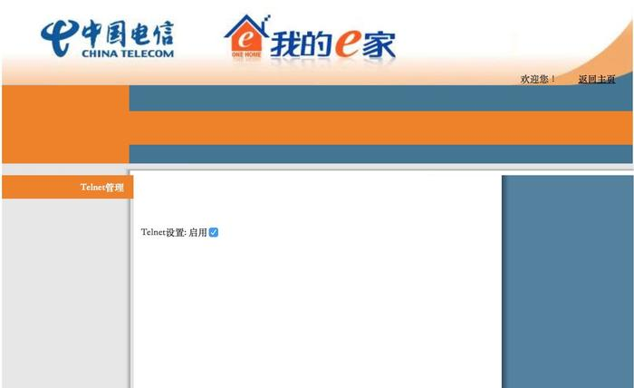
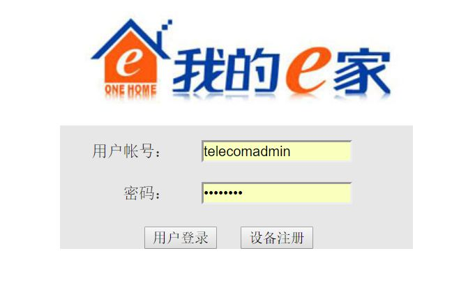
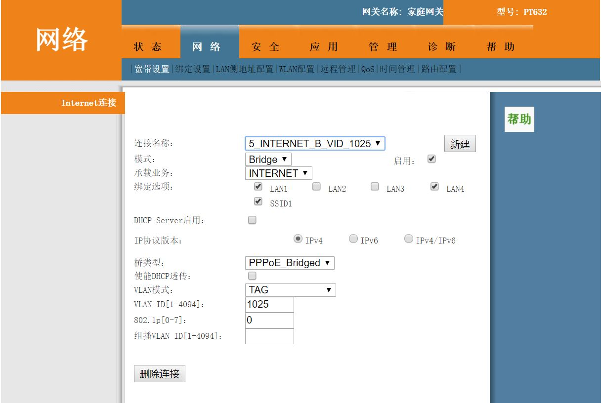
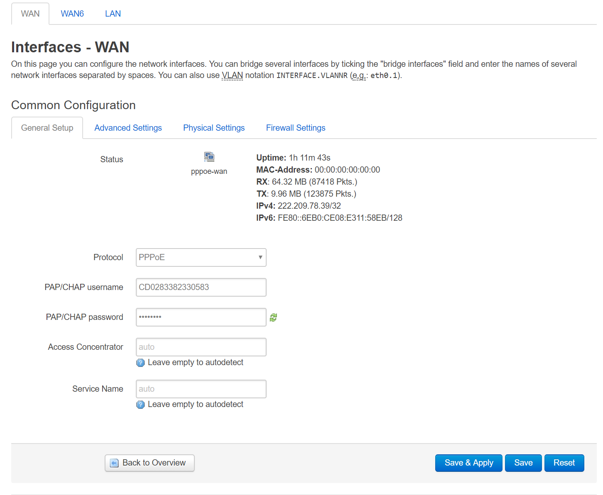
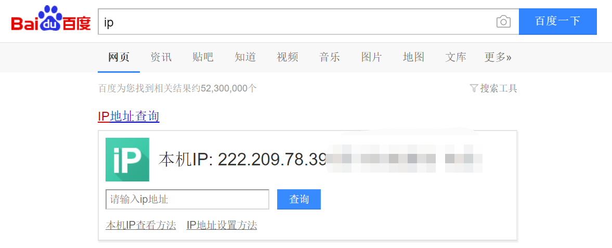
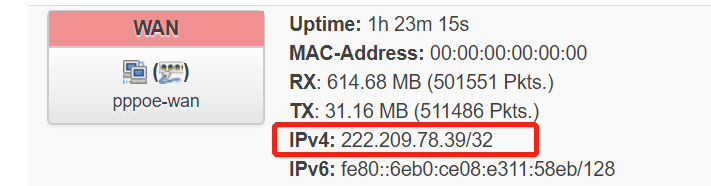

本文索引:
- [前言](#%E5%89%8D%E8%A8%80)
- [获取光猫超级管理员权限](#%E8%8E%B7%E5%8F%96%E5%85%89%E7%8C%AB%E8%B6%85%E7%BA%A7%E7%AE%A1%E7%90%86%E5%91%98%E6%9D%83%E9%99%90)
- [由光猫拨号改为路由器拨号](#%E7%94%B1%E5%85%89%E7%8C%AB%E6%8B%A8%E5%8F%B7%E6%94%B9%E4%B8%BA%E8%B7%AF%E7%94%B1%E5%99%A8%E6%8B%A8%E5%8F%B7)
  - [将电信光猫设为桥接模式](#%E5%B0%86%E7%94%B5%E4%BF%A1%E5%85%89%E7%8C%AB%E8%AE%BE%E4%B8%BA%E6%A1%A5%E6%8E%A5%E6%A8%A1%E5%BC%8F)
  - [在路由器中设置拨号上网](#%E5%9C%A8%E8%B7%AF%E7%94%B1%E5%99%A8%E4%B8%AD%E8%AE%BE%E7%BD%AE%E6%8B%A8%E5%8F%B7%E4%B8%8A%E7%BD%91)
- [确认公网 IP 地址正确可用](#%E7%A1%AE%E8%AE%A4%E5%85%AC%E7%BD%91-ip-%E5%9C%B0%E5%9D%80%E6%AD%A3%E7%A1%AE%E5%8F%AF%E7%94%A8)

## 前言
99 或 199 块钱一个月接入的电信宽带，除了其基础的 100M 或 300M 带宽上网之外，还可以做很多事

## 获取光猫超级管理员权限
首先，将任意一台 PC 直连光猫 LAN 口，打开浏览器，输入 `http://192.168.1.1` ，用 `useradmin` 账号登陆(密码位于光猫背面贴纸)。将地址栏中的连接 `http://192.168.1.1/cgi-bin/content.asp` 改为 `http://192.168.1.1/cgi-bin/telnet.asp`，进入如下的界面：

勾选 `Telnet 设置: 启用`，点击确定。

接下来打开 `Windows` 的 `cmd` 或 `MacOS` 的 `Terminal`，以 `telnet` 连接光猫:
```bash
$ telnet 192.168.1.1

tc login:

# 用户名 admin
# 密码 1234
```
要求输入登录密码，其默认用户名和密码为 `admin` 和 `1234`，登录后输入以下命令:
```bash
$ cat /tmp/ctromfile.cfg
```
将打印出来的所有内容保存至本地本文编辑器，搜索 `telecomadmin`，找到对应行的密码行:
```xml
<Entry0
username="telecomadmin"
web_passwd="{password-for-telecomadmin}"/>
```
`web_passwd` 即为 `telecomadmin` 用户的密码

## 由光猫拨号改为路由器拨号
电信提供的光猫虽然已经自带路由功能，但出于商业目的，功能仍然极其有限，所以很多家庭都会购买单独的路由器，以实现更高级的功能，例如「内网穿透」、「全局科学上网」以及「自动下载机」等等。在此之前，我们希望路由器充当家庭网络的「网关」，以获取正确的公网 ip 地址。

### 将电信光猫设为桥接模式
使用 `telecomadmin` 登录电信光猫:

在「网络」-> 「宽带设置」标签页，选定指定 `Internet` 的「连接名称」(此处为 **5_INTERNET_B_VID_1025**)，将「模式」由 **Route** 改为 **Bridge**:

我们想要使用路由器作为 DHCP 的服务器，光猫仅仅负责传输宽带，保存更改后，把光猫的 LAN 口与路由器的 WAN 口相连，再把路由器的 LAN 接入任意 PC 的以太网口，此时路由器替代光猫成为了「网关」，默认情况下，网关的 ip 地址为 `192.168.1.1`，而 PC 会由路由器 DHCP 服务分配一个该网段下的 ip 地址，例如 `192.168.1.200`。

### 在路由器中设置拨号上网
在浏览器中访问 `192.168.1.1`，此时访问的已是路由器厂商提供的 Web 管理界面了，进入到相应的页面，找到 WAN 口的设置，填入电信宽带上网用的用户名和密码:

> 如何设置无线网络此处不赘述

## 确认公网 IP 地址正确可用
完成上一步操作之后，PC 应该已经可以正常上网了，在百度中输入 `ip` 得到一个公网 ip 地址，在路由器管理界面中，查看当前 WAN 口获取到的 ip 地址:


从百度获取的 ip 地址是从外网检测到的 ip 地址，WAN 口的 ip 地址是由电信分配的 ip 地址，两者可能会不一样，WAN 口获取的 ip 地址可能是某个大区域的子网 ip 地址，虽然不影响上网，但无法实现「内网穿透」等功能。如果遇到类似情况，拨打 10000 号申诉通常都会解决。有了正确的公网 ip 地址，才能实施下一步的内网穿透功能。

