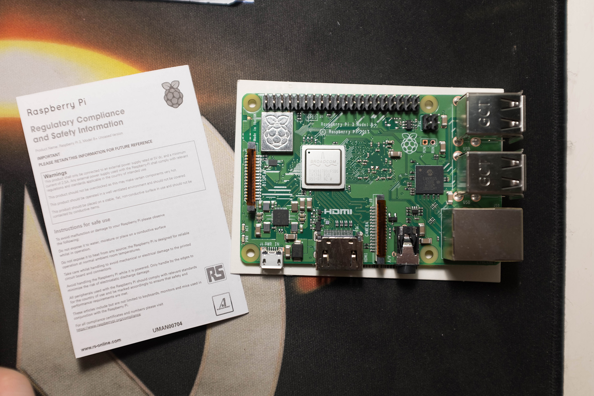
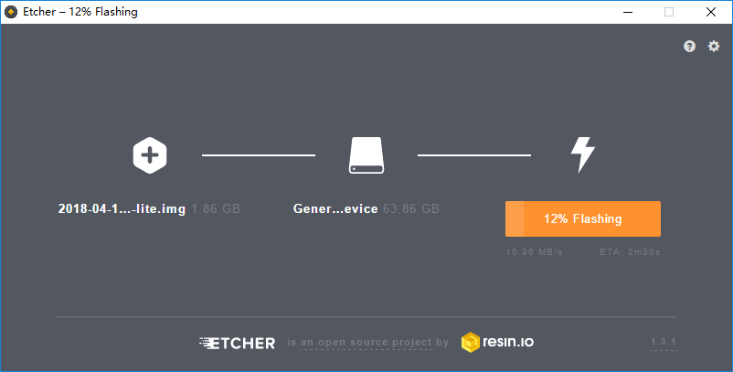
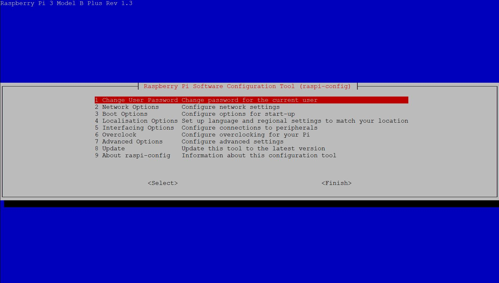
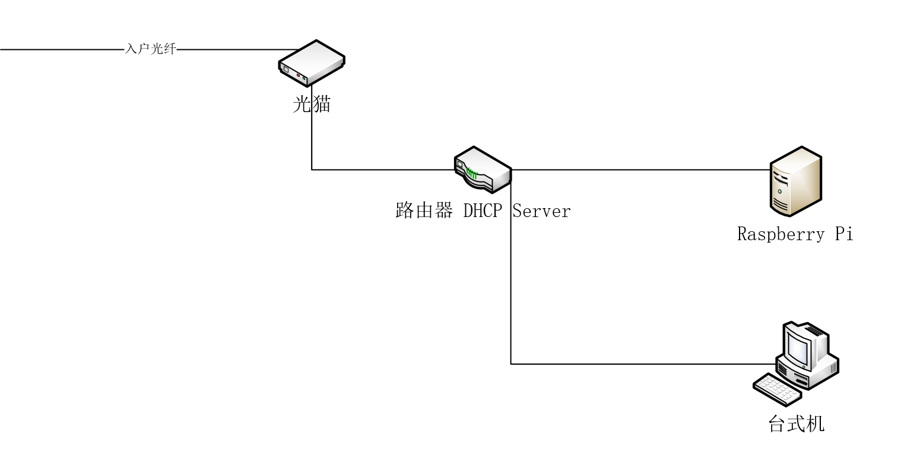

参考资料:
- [Docker Comes to Raspberry Pi](https://www.raspberrypi.org/blog/docker-comes-to-raspberry-pi/)

本文目录:
- [背景](#%E8%83%8C%E6%99%AF)
- [硬件准备](#%E7%A1%AC%E4%BB%B6%E5%87%86%E5%A4%87)
- [软件准备](#%E8%BD%AF%E4%BB%B6%E5%87%86%E5%A4%87)
- [安装及配置系统镜像](#%E5%AE%89%E8%A3%85%E5%8F%8A%E9%85%8D%E7%BD%AE%E7%B3%BB%E7%BB%9F%E9%95%9C%E5%83%8F)
- [为树莓派 Raspbian 系统安装 Docker 引擎](#%E4%B8%BA%E6%A0%91%E8%8E%93%E6%B4%BE-raspbian-%E7%B3%BB%E7%BB%9F%E5%AE%89%E8%A3%85-docker-%E5%BC%95%E6%93%8E)
  - [安装 Docker 引擎](#%E5%AE%89%E8%A3%85-docker-%E5%BC%95%E6%93%8E)

## 背景
作为一名技术宅，自然是希望自己家里的「数字化系统」越 fancy 越好，但考虑到腰包里毛爷爷的数量，不得不搜寻物美价廉的方案来实现一些「非刚需，但 Nice to Have」的需求，这些需求包括但不限于:
- 局域网多设备的文件共享
- 7 * 24小时无人值守的下载器
- 绕过第三方云存储的私有云同步方案
- 家庭媒体中心的搭建
- 家庭智能设备的网关系统

笔者打算针对上述罗列的内容单辟一个系列，以一篇一个主题覆盖其中所有的细节。如果你也有以上列表中的一项或多项需求，不妨继续往下看。

## 硬件准备
为了达成这一愿景，需要在基础设施上投入一些成本，其中最重要的是家庭服务器。我们对家庭服务器的期待至少有: 性能稳定，功耗低，价格低廉。如今爆火的树莓派非常符合家庭小型服务器的要求，网络上关于树莓派的文章很多，这里不再赘述。



假设我们手上已经有了一台树莓派(2 代以上的版本都可以)，还需要准备以下设备: 
- 网线 * 1
- Micro SD 卡 * 1，容量大于 8 GB
- Micro SD 读卡器 * 1
- 键盘 * 1
- HDMI 线 * 1
- 显示器 * 1
- USB 电源线 * 1

## 软件准备
- Raspbian Stretch Lite 系统镜像 -> [下载地址](https://www.raspberrypi.org/downloads/raspbian/)
- Etcher 映像烧录软件 -> [下载地址](https://etcher.io/): 将树莓派系统镜像烧录至 Micro SD 卡的工具软件

> 官方提供了 3 个版本的系统镜像，本文为了尽量保持简单，选择最为精简的版本 Raspbian Stretch Lite，此镜像是基于命令行工具的版本，本系列文章均基于命令行工具版本的系统镜像介绍，如果对命令行界面不熟悉，可以选择另外两个自带桌面 GUI 的版本

## 安装及配置系统镜像

1. 使用 Etcher 将 Raspbian Stretch Lite 烧录至 Micro SD 卡中 
   
2. 将 Micro SD 卡插入树莓派
3. 将网线，电源线，HDMI 线和键盘与树莓派相连
4. 树莓派开机，第一次启动大概需要 1-2 分钟
5. 使用预设用户/密码为 pi/raspberry 登录系统
6. 键入 `sudo raspi-config` 进行如下设置:
   
    1. -> 1 Change User Password，修改 pi 用户登录密码
    2. -> 2 Network Options -> N1 Hostname，更改 Hostname
    3. -> 2 Network Options -> N2 Wi-fi，设置家庭局域网的 Wifi，不管是使用无线还是有线网络，确保树莓派与家庭中的其他设备位于同一个局域网即可
    4. -> 5 Interfacing Options -> P2 SSH，启用 SSH，对于使用命令行或需要通过其他主机远程管理树莓派的需求，这一步是必须的
7. 配置完成后，重启树莓派
8. 在 PC 上使用 SSH 客户端软件(如 PuTTY 等)远程登录树莓派
9. (可选)为了防止 IP 地址过期，可通过路由器管理界面给树莓派分配静态的 IP 地址
    

至此，树莓派的准备工作就完成了，其网络拓扑如下:


## 为树莓派 Raspbian 系统安装 Docker 引擎
> 之所以将这一步纳入树莓派的准备工作中，是因为笔者发现在实际使用过程中，几乎所有常见的服务都发布了其相应的 Docker 镜像。对容器化不熟悉的朋友可以参考 iOS 对 App 的管理思路: 每个 App 都从统一的入口(App Store)下载，在单独的隔离环境运行，卸载时也不会出现诸如 Windows 上大量残余文件需要手动清理的问题。

对计算机(特别是服务器)的管理和维护是非常乏味的工作，相信各位在使用 Windows 系统时或多或少都有过系统盘空间越来越少，系统使用起来越来越卡顿的经验。而服务器是以高可用性为宗旨的，如何最大程度的降低维护成本是管理服务器的首要考量。`Docker` 解决了不同的服务在部署时由于依赖问题而污染宿主机的问题。使得安装和部署某个服务在单独的隔离环境中进行，简化了流程，也更加清晰。

### 安装 Docker 引擎
树莓派官网提供了安装 `Docker` 引擎的脚本，下载安装脚本并执行: 
```bash
$ curl -sSL https://get.docker.com | sh

Client:
 Version:      18.05.0-ce
 API version:  1.37
 Go version:   go1.9.5
 Git commit:   f150324
 Built:        Wed May  9 22:24:36 2018
 OS/Arch:      linux/arm
 Experimental: false
 Orchestrator: swarm

Server:
 Engine:
  Version:      18.05.0-ce
  API version:  1.37 (minimum version 1.12)
  Go version:   go1.9.5
  Git commit:   f150324
  Built:        Wed May  9 22:20:37 2018
  OS/Arch:      linux/arm
  Experimental: false
If you would like to use Docker as a non-root user, you should now consider
adding your user to the "docker" group with something like:

  sudo usermod -aG docker pi

Remember that you will have to log out and back in for this to take effect!

WARNING: Adding a user to the "docker" group will grant the ability to run
         containers which can be used to obtain root privileges on the
         docker host.
         Refer to https://docs.docker.com/engine/security/security/#docker-daemon-attack-surface
         for more information.
```

将 `pi` 用户加入 `docker` 群组
```bash
$ sudo usermod -aG docker pi
```
> 如提示所说，用户 `pi` 加入群组后需要再次登录以生效

再次以 `pi` 用户登录树莓派，执行 `docker -v`，看到版本号即表示安装成功:
```bash
$ docker -v

Docker version 18.05.0-ce, build f150324
```
至此，树莓派准备就绪，可以开始部署各种应用服务了。