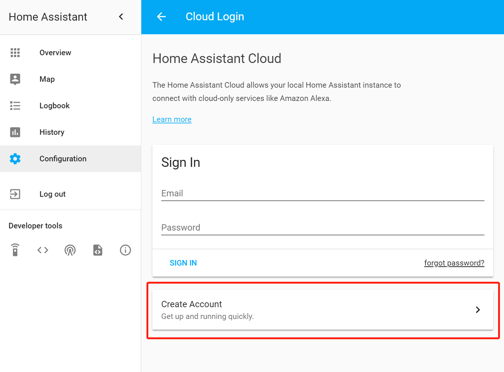
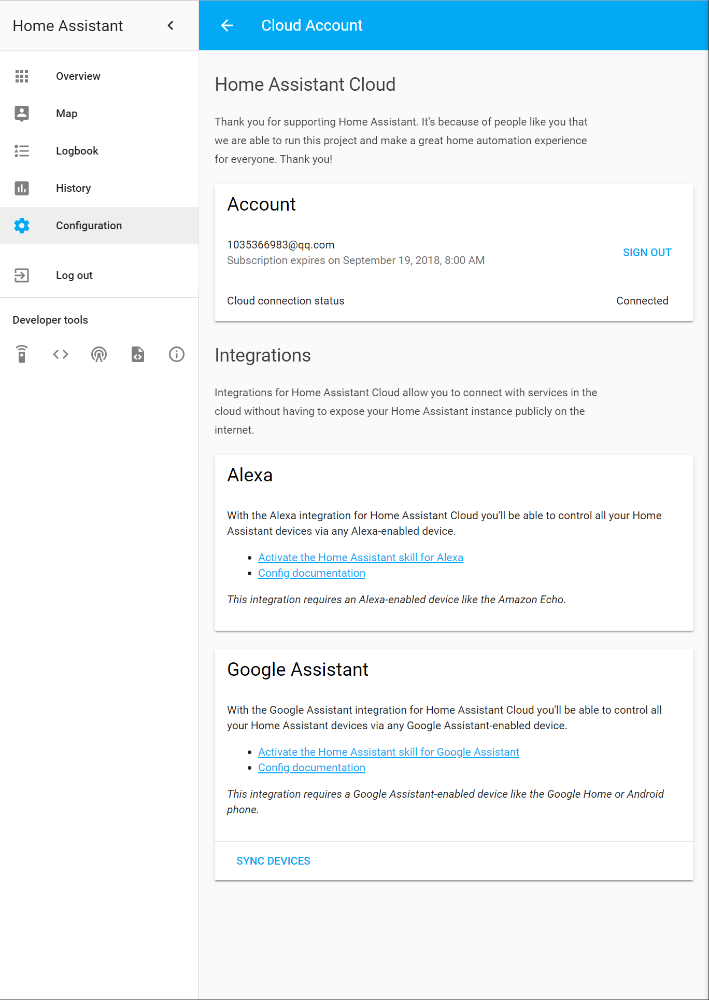
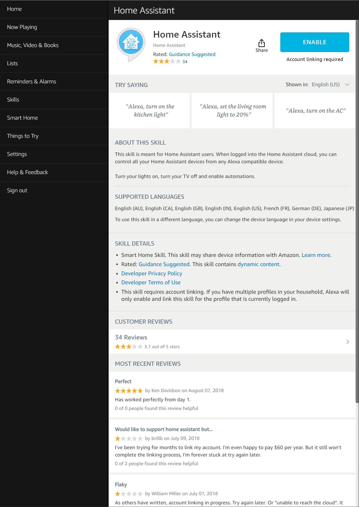
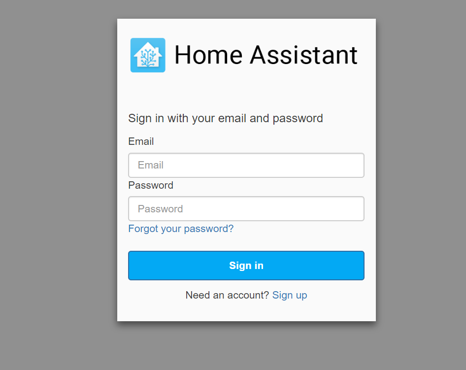
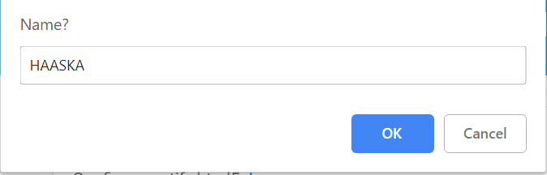
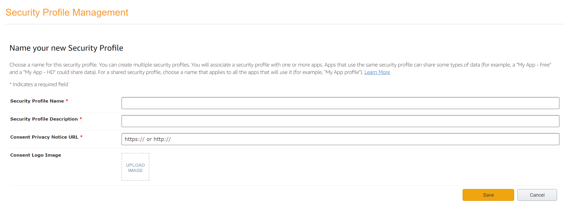

参考资料:
- [Home Assistant Cloud](https://www.home-assistant.io/cloud/)
- [HAASKA](https://github.com/mike-grant/haaska)
- [HA - Alexa/Amazon Echo](https://www.home-assistant.io/components/alexa/)

本文索引:
- [前言](#%E5%89%8D%E8%A8%80)
- [通过 Home Assistant Cloud 实现](#%E9%80%9A%E8%BF%87-home-assistant-cloud-%E5%AE%9E%E7%8E%B0)
  - [配置 Home Assistant Cloud](#%E9%85%8D%E7%BD%AE-home-assistant-cloud)
    - [创建 Home Assistant Cloud 账号](#%E5%88%9B%E5%BB%BA-home-assistant-cloud-%E8%B4%A6%E5%8F%B7)
    - [激活 Alexa Home Assistant Skill](#%E6%BF%80%E6%B4%BB-alexa-home-assistant-skill)
- [通过 HAASKA 实现(TBD)](#%E9%80%9A%E8%BF%87-haaska-%E5%AE%9E%E7%8E%B0tbd)
  - [准备 HAASKA](#%E5%87%86%E5%A4%87-haaska)
    - [配置 Amazon AWS](#%E9%85%8D%E7%BD%AE-amazon-aws)
- [通过 Emulated Hue Bridge 的方式实现](#%E9%80%9A%E8%BF%87-emulated-hue-bridge-%E7%9A%84%E6%96%B9%E5%BC%8F%E5%AE%9E%E7%8E%B0)
  - [原理](#%E5%8E%9F%E7%90%86)
  - [实现](#%E5%AE%9E%E7%8E%B0)

## 前言
要使用 `Amazon Alexa` 控制接入 `HomeAssistant` 的智能设备，有以下可能的办法:
- `Home Assistant Cloud`: 官方推崇的方式，通过启用 `Alexa` 的 `HomeAssistant Skill`，结合 [Home Assistant Cloud](https://www.nabucasa.com/) 服务可实现开箱即用的集成，不差钱的可选择这种方案
- `HAASKA`(Home Assistant Alexa Skill Adaptor): 社区的开源项目，用 `python` 编写适用于 `Alexa Skill` 的 `AWS Lamba` 函数包，实现了 [Home Assistant Smart Home API](https://www.home-assistant.io/components/alexa/#smart-home) 和 [Alexa Smart Home Skill API](https://developer.amazon.com/alexa/connected-devices) 之间的桥梁作用，需要一系列进阶的配置，动手能力的强可选用此方案。
- `Emulated Hue Bridge`: 纯本地方式，将 `Alexa-based` 设备作为 [Emulated Hue Bridge](https://www.home-assistant.io/components/emulated_hue/) 网关接入 HA，通过 `Hue API` 与 HA 中的设备进行交互，最简单的方案，但功能非常有限

接下来将分别展示这些方案的实现过程。

## 通过 Home Assistant Cloud 实现
### 配置 Home Assistant Cloud
`Home Assistant Cloud` 是由 [NABU CASA](https://www.nabucasa.com/) 提供的云服务，可试用 31 天。
#### 创建 Home Assistant Cloud 账号
进入 HA 的 `Configuration Tab`，点击 `Create Account`



注册完成后，在相同的界面登录，进入到管理界面:



#### 激活 Alexa Home Assistant Skill
进入 `Alexa Skills` 列表，搜索 `Home Assistant`，点击激活，之后登录刚刚注册的 `Home Assistant Cloud` 账号。





之后，在 HA 的 `configuration.yaml` 中进行配置:
```
cloud:
  alexa:
    filter:
      include_entities:
        - light.yeelight_ct2_7c49eb1551e8
      include_domains:
        - switch
      exclude_entities:
        - switch.outside
    entity_config:
      light.yeelight_ct2_7c49eb1551e8:
        name: Lamp
        description: The lamp with a green cover
      switch.stairs:
        display_categories: LIGHT
```

以上 `cloud` 节点是配置如何向 `Alexa` 暴露 HA 中的实体，与之前讨论的 `homekit` 组件配置方法类似，具体可参考: [Alexa via Home Assistant Cloud](https://www.nabucasa.com/config/amazon_alexa/)。

完成之后重启 HA，对 `Alexa` 说一声 "Alexa, turn on the lamp." 试试看。

___
## 通过 HAASKA 实现(TBD)
由于 `Amazon` 对 `Alexa Skill` 的限制条件(例如只能使用 HTTPS)，要通过 `HAASKA` 实现通过 `Alexa` 控制 `HomeAssistant`，需要确保以下条件得到满足:
- `Home Assistant` 实例的版本高于 0.78
- 路由器可配置端口转发
- `Home Assistant` 必须以 `HTTPS` 向外暴露: `Amazon` 的要求
- 如果家中的 WAN 不是静态 IP 地址，则需要配置 `DDNS`
- 成为 `Amazon` 开发者并创建一个 `AWS` 账号: `HAASKA` 将使用 `AWS Lamba` 服务，`AWS` 支持每月 100 万免费请求。

### 准备 HAASKA
可直接至 [Release](https://github.com/mike-grant/haaska/releases) 页面下载 `HAASKA` 的 `Zip` 包。接着，在 `configuration.yaml` 文件中添加以下组件的配置节:
```yaml
api:

alexa:
  smart_home:
```
然后导航至 `HomeAssistant` 的 UI 界面上的 `Profile` 页面，在底部的 `Long-Lived Access Tokens` 中创建一个长生存期的 `Access Token`:

完成之后，记录下返回的 `Token` 以作后用，它形如:
```bash
eyJ0eXAiOiJKV1QiLCJhbGciOi......
```
#### 配置 Amazon AWS
首先导航至 [Login with Amazon Console](https://developer.amazon.com/loginwithamazon/console/site/lwa/overview.html)，点击 `Create a New Security Profile`:


___
## 通过 Emulated Hue Bridge 的方式实现
### 原理
这种办法是使用 HA 的 [Emulated Hue Bridge](https://www.home-assistant.io/components/emulated_hue/) 组件暴露 `Hue API`，让 `Alexa-based` 设备误以为 HA 是一个 `Philips Hue Hub`。

### 实现
编辑 `configuration.yaml` 配置文件: 
``` bash
# Amazon Alexa
emulated_hue:
  host_ip: 192.168.1.140
```
保存更改，重启 HA 服务
```
$ docker container restart home-assistant
```
重新使用 `Echo` -> `Start Home` 查找设备，即会将所有与 HA 关联的设备列出。