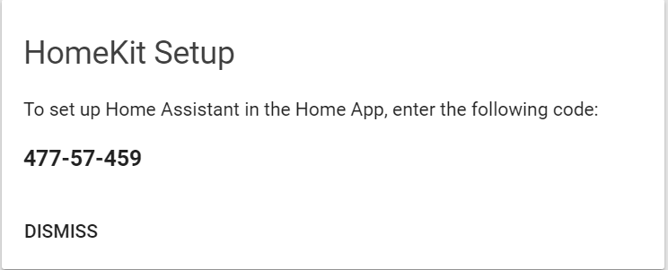
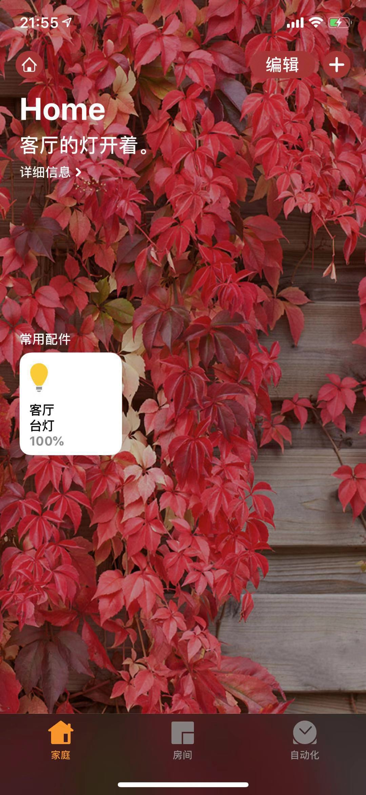
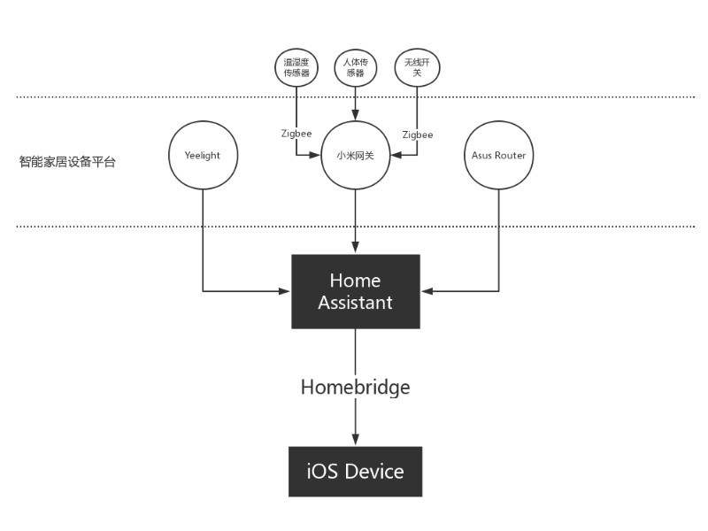

参考资料:
- [Github - Homebridge](https://github.com/nfarina/homebridge)
- [Github - Home Assistant Plugin](https://github.com/home-assistant/homebridge-homeassistant)
- [Github - HomeBridge Docker](https://github.com/oznu/docker-homebridge)
- [HomeKit - HomeAssistant](https://www.home-assistant.io/components/homekit/#disable-auto-start)

本文索引:
- [背景](#背景)
- [通过 HomeKit 组件实现](#通过-homekit-组件实现)
  - [注意事项](#注意事项)
- [通过 HomeBridge 及其插件实现(老方法)](#通过-homebridge-及其插件实现老方法)
  - [安装 NodeJs(Optional)](#安装-nodejsoptional)
  - [安装 Homebridge](#安装-homebridge)
  - [安装 HA 插件](#安装-ha-插件)
  - [配置 config.json](#配置-configjson)
  - [配置开机启动 Homebridge](#配置开机启动-homebridge)

## 背景
比起 `Alexa` ，通过 `Siri` 联通 **HA** 的优势在于:
- 支持中文语音
- 至少有一台 iOS 设备就可以实现，无需购买 **Echo** 系列的产品

`Siri` 通过 `HomeKit` 与 `Apple Home` 通信，`HomeKit` 扮演了 `Apple Home` 数据库的角色。只要 `HomeAssistant` 中暴露的实体能够被 `HomeKit*` 识别就可以由 `Siri` 进行控制。从 **HA 0.64** 开始就内置了 `homekit` 组件，不再需要单独运行 `HomeBridge` 及其 `HomeAssistant` 插件来实现。

## 通过 HomeKit 组件实现
首先安装必要组件:
```bash
$ sudo apt-get install libavahi-compat-libdnssd-dev
```

找到 `configuration.yaml` 文件，添加以下配置信息:
```yaml
homekit:
  auto_start: true
  filter:
    include_entities:
      - light.lamp

  entity_config:
    light.lamp:
      name: 台灯
```
`homekit` 组件支持以下参数:
- `auto_start`: 指示 `HomeKit Server` 是否应该在 `HomeAssistant Core` 启动完成后重新启动，可选，默认值为 `true`
- `port`: 自定义 `HomeKit Server` 暴露的端口，可选，默认值为 51827
- `name`: 指定 `HomeKit` 的名称，同一网络中单个 `HomeAssistant` 实例必须唯一，可选，默认值为 *Home Assistant Bridge*
- `ip_address`: 显式指定 IP 地址，仅当 `Home Assistant` 的默认值不起作用时有用，可选
- `safe_mode`: 仅当配对出现问题时设置该值，可选，默认为 `false`
- `filter`: 定义被暴露/隐藏的 `HomeAssistant` 实体:
  - `include_domains`: 需要包含的域，可选
  - `include_entities`: 需要包含的实体，可选
  - `exclude_domains`: 需要排除的域，可选
  - `exclude_entities`: 需要排除的实体，可选
- `entity_config`: 针对实体的单独定义
  - `<entity_id>`: 实体的引用
    - `name`: 在 `HomeKit` 中用以显示的名称，可选，`HomeKit` 在首次运行时会缓存名称，当设备发生任何变化时，需要先移除并重新添加
    - `code`: 仅针对闹钟设备 `arm / disarm` 或智能锁设备 `lock / unlock` 有效，可选
    - `feature_list`: 仅针对 `media_player` 实体有效，以字典形式添加的功能列表，可选
      - `feature`: 添加至实体的功能名称，必填，有效值为 `on_off`、`play_pause`、`play_stop` 和 `toogle_mute`。且 `media_player` 实体必须这些功能才能生效
    - `type`: 仅针对开关(`switch`) 实体有效。表示在 `HomeKit` 中的开关类型，可选。有效值有 `faucet`、`outlet`、`shower`、`sprinker`、`switch` 和 `value`，默认值为 `switch`。`HomeKit` 在首次运行时会缓存类型，当设备发生任何变化时，需要先移除并重新添加。

保存，重启 **HA**，将在主页面看到一个新的 Card:


确保 iOS 设备与 **HA** 及智能设备处于同一 wifi 网络，打开 iOS 上的 Home App
1. 点击「添加配件」
2. 选择「没有代码或无法扫描」
3. 输入上图所示的 PIN Code
4. 弹出未认证配件时点击「仍然添加」

添加完成后的配件如下图所示:


现在，通过 iOS 设备呼出 `Siri`，让 TA 关闭台灯，即可生效。

### 注意事项
1. `homekit` 组件使用 `accessory id(aid)` 将连接至 `HomeAssistant` 的实体 `entity_id` 绑定起来，`homekit` 组件使用 `aid` 来识别设备。因此，一旦改变某个连接至 `HomeAssistant` 的设备的 `entity_id`，所有在 `Home App` 中针对该设备的改动都将丢失。
2. 单个 `HomeKit` 最多包含 100 个附件
3. 内置的 `homekit` 组件无法持久化 **Home Assistant Bridge** 桥接设备，但已被添加至该桥接设备的配件会被持久化，这是 **HomeKit** 本身的问题。为了解决这个问题，可引入一个 `Automation` - 当 `HomeKit` 所依赖的实体设置完成后启动 `HomeKit`。做法如下:
   1. 首先禁用 `homekit` 组件的自动启动:
```yaml
homekit:
  auto_start: false
```
   2. 定义用于启动 `homekit` 组件的 `Automation`:
  ```yaml
   automation: 
     - alias: 'Start HomeKit'
       trigger:
         - platform: event
           event_type: light.lamp.network_ready
       action: homekit.start
  ```
   3. 也可以使用一种更加泛化的判定方式，在 `HomeAssistant` 启动 5 分钟后再启动 `homekit` 组件:
  ```yaml
   automation: 
     - alias: 'Start HomeKit'
       trigger:
         - platform: event
           event_type: homeassistant_start
       action: 
         - delay: 00:05  # Waits 5 minutes
         - service: homekit.start
  ```
___
## 通过 HomeBridge 及其插件实现(老方法)
`HomeBridge` 是一个发布在 `npm` 中的包，依赖 `NodeJs`，并且有各种各样的插件以支持不同的网关系统。



### 安装 NodeJs(Optional)
首先安装 `NodeJs`:
```
$ sudo curl -sL https://deb.nodesource.com/setup_10.x | sudo -E bash -

## Run `sudo apt-get install -y nodejs` to install Node.js 10.x and npm
## You may also need development tools to build native addons:
     sudo apt-get install gcc g++ make
## To install the Yarn package manager, run:
     curl -sL https://dl.yarnpkg.com/debian/pubkey.gpg | sudo apt-key add -
     echo "deb https://dl.yarnpkg.com/debian/ stable main" | sudo tee /etc/apt/sources.list.d/yarn.list
     sudo apt-get update && sudo apt-get install yarn

$ sudo apt install -y nodejs

Reading package lists... Done
Building dependency tree
Reading state information... Done
The following NEW packages will be installed:
  nodejs
0 upgraded, 1 newly installed, 0 to remove and 45 not upgraded.
Need to get 13.4 MB of archives.
After this operation, 66.7 MB of additional disk space will be used.
Get:1 https://deb.nodesource.com/node_10.x stretch/main armhf nodejs armhf 10.9.0-1nodesource1 [13.4 MB]
Fetched 13.4 MB in 6s (2,042 kB/s)
Selecting previously unselected package nodejs.
(Reading database ... 38984 files and directories currently installed.)
Preparing to unpack .../nodejs_10.9.0-1nodesource1_armhf.deb ...
Unpacking nodejs (10.9.0-1nodesource1) ...
Setting up nodejs (10.9.0-1nodesource1) ...
Processing triggers for man-db (2.7.6.1-2) ...
```

### 安装 Homebridge
通过 `npm` 安装 `HomeBridge` 包:
```bash
$ sudo npm install -g --unsafe-perm homebridge

make: Leaving directory '/usr/lib/node_modules/homebridge/node_modules/ed25519-hap/build'
+ homebridge@0.4.44
added 40 packages from 35 contributors in 54.124s
```
现在执行 `homebridge` 命令，表示安装成功了。
``` bash
$ homebridge
config.json (/home/pi/.homebridge/config.json) not found.
No plugins found. See the README for information on installing plugins.
```

### 安装 HA 插件
不带插件的 `Homebridge` 没有任何用
```
$ sudo npm install -g homebridge-homeassistant

+ homebridge-homeassistant@3.1.0
added 53 packages from 60 contributors in 17.553s
```
### 配置 config.json
在创建 `config.json` 之前，Homebridge 不会做任何事，`config.json` 放置在 `~/.homebridge` 目录下:
```bash
$ cd ~/.homebridge
$ sudo nano config.json

{
    "bridge": {
        "name": "Homebridge",
        "username": "CC:22:3D:E3:CE:30",
        "port": 51826,
        "pin": "031-45-154"
    },

    "platforms": [
      {
        "platform": "HomeAssistant",
        "name": "HomeAssistant",
        "host": "http://127.0.0.1:8123",
        "password": "YOURPASSWORD",
        "supported_types": ["automation", "binary_sensor", "climate", "cover", "device_tracker", "fan", "group", "input_boolean", "light", "lock", "media_player", "remote", "scene", "script", "sensor"$
        "default_visibility": "visible",
        "logging": false,
        "verify_ssl": false
      }
    ]
}
```
`HomeBridge` 以被 **HomeKit** 识别的组件向其暴露，`bridge` 对象用于向 **HomeKit** 描述其组件自身的信息，包括用作显示名称的 `name`，用作唯一标识的 Mac 地址 `username`，端口号及 `pin`，该 `pin` 用于与 **HomeKit** 进行配对。`platforms` 是一个数组，代表配置的多种插件信息，这里仅安装了 **HA** 的插件，配置对象的信息均与 **HA** 有关，包含了诸如 `host`，`api-password`，支持的 `entity` 类型等，具体可参考 [Github Repo](https://github.com/home-assistant/homebridge-homeassistant)。

配置完成后，重新启动 Homebridge:
```bash
$ homebridge
```
打开 iOS 系统自带的 Home App 扫描屏幕上的二维码，取得 `HomeAssistant` 中暴露的 Entity(HA 中将所有接入网关的设备称为一个 Entity)并试试控制它们。然后再用「Hey, Siri」来控制试试。


### 配置开机启动 Homebridge
1. 粘贴默认配置信息:
```
$ sudo nano /etc/default/homebridge 

# Defaults / Configuration options for homebridge
# The following settings tells homebridge where to find the config.json file and where to persist the data (i.e. pairing and others)
HOMEBRIDGE_OPTS=-U /var/homebridge

# If you uncomment the following line, homebridge will log more 
# You can display this via systemd's journalctl: journalctl -f -u homebridge
# DEBUG=*
```
2. 创建 systemd service 文件:
```bash
$ sudo nano /etc/systemd/system/homebridge.service

[Unit]
Description=Node.js HomeKit Server 
After=syslog.target network-online.target

[Service]
Type=simple
User=homebridge
EnvironmentFile=/etc/default/homebridge
ExecStart=/usr/bin/homebridge $HOMEBRIDGE_OPTS
Restart=on-failure
RestartSec=10
KillMode=process

[Install]
WantedBy=multi-user.target
```
3. 创建专用于执行该服务的用户和群组:
```bash
sudo useradd --system homebridge
```
4. 创建 homebridge 配置目录并拷贝配置文件
```bash
$ sudo mkdir /var/homebridge
$ sudo cp ~/.homebridge/config.json /var/homebridge/
```
5. 将其他必要文件夹拷贝至该目录:
```bash
$ sudo cp -r ~/.homebridge/persist /var/homebridge
```
6. 更改该目录的权限:
```bash
$ sudo chmod -R 0777 /var/homebridge
```
7. 创建 system service 链接并启动服务:
```bash
$ sudo systemctl daemon-reload
$ sudo systemctl enable homebridge
$ sudo systemctl start homebridge
```
8. 检查服务启动状态及查看日志:
```bash
$ sudo systemctl status homebridge

$ journalctl -f -u homebridge
```