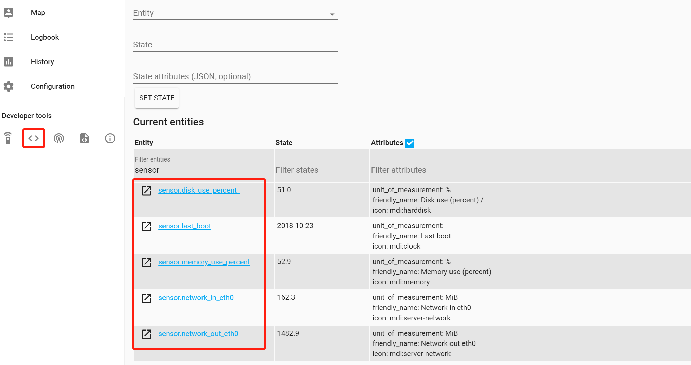
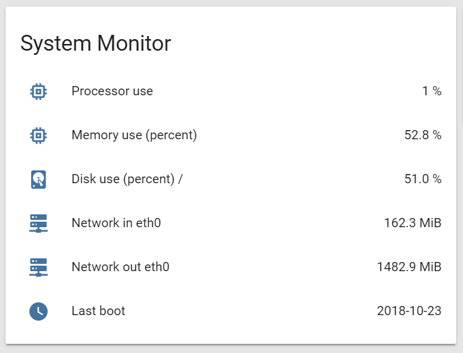

本文索引:
- [启用认证系统](#%E5%90%AF%E7%94%A8%E8%AE%A4%E8%AF%81%E7%B3%BB%E7%BB%9F)
- [配置 Zone 信息](#%E9%85%8D%E7%BD%AE-zone-%E4%BF%A1%E6%81%AF)
- [为 HA 主机添加系统监控组件](#%E4%B8%BA-ha-%E4%B8%BB%E6%9C%BA%E6%B7%BB%E5%8A%A0%E7%B3%BB%E7%BB%9F%E7%9B%91%E6%8E%A7%E7%BB%84%E4%BB%B6)

## 启用认证系统
相关组件:
- [Authentication](https://www.home-assistant.io/docs/authentication/)
- [Authentication Providers](https://www.home-assistant.io/docs/authentication/providers/)

HA 以 `auth_provider` 的方式支持不同种类的认证，在 `configuration.yml` 中的 `homeassistant` 节点下添加:
```yaml
homeassistant:
  auth_providers:
   - type: {auth provider type}
```
截至 0.80 版本，HA 支持 3 种 `auth_provider`:
1. `home assistant auth provider`: 默认的认证提供器，类似于用户管理系统，type 名称为 `homeassistant`
2. `trusted network`: 安全网络，例如，配置家庭局域网不受认证系统的限制，type 名称为 `trusted_networks`
3. `legacy api password`: 该功能主要是为了向前兼容 `api_password` 认证功能

一个完整的例子为:
```yaml
homeassistant:
  auth_providers:
   - type: homeassistant
   - type: trusted_networks
   - type: legacy_api_passowrd

http:
  api_password: !secret http_password
  trusted_networks:
    - 127.0.0.1
    - 192.168.1.0/24
```
> 上面的例子同时支持 3 种认证，可根据需要选择认证种类。根据官方的说法，`legacy_api_passowrd` 认证会在未来的版本中移除，且 `trusted_networks` 的配置信息将从 `http` 模块移动到认证系统下。

值得注意的是，使用 `trusted_networks` 认证时，[`multi-factor authentication`](https://www.home-assistant.io/docs/authentication/multi-factor-auth/) 模块将不会参与认证过程。另外，如果在同一机器使用反向代理服务器(如 `nginx`)向外暴露 **HA**，那么任何来自 WAN 并由反向代理服务器转发至 **HA** 的请求都会被认为处于可信任网络中，详情参考[这篇文章](https://community.home-assistant.io/t/trusted-networks-when-using-nginx-reverse-proxy/37836/6)以及 [Nginx](https://www.home-assistant.io/docs/ecosystem/nginx/)。

## 配置 Zone 信息
相关组件:
- [Zone](https://www.home-assistant.io/components/zone/)

`Zone` 组件用于划分自定义地图区域，这些区域可作为其他组件的参考信息，例如 `Device Tracker` 可根据 `Zone` 来判断一个移动设备是否位于某区域内。首先在 `configuration.yaml` 根配置中启用 `Zone` 组件，并指定从 `zones.yaml` 文件中提取具体 `Zone` 信息:
```yaml
zone: !include zones.yaml
```
新建 `zones.yaml` 文件，并定义 `Zone` 如下:
```yaml
- name: Home
  latitude: {latitude-of-your-home}
  longitude: {longitude-of-your-home}
  radius: 250
  icon: mdi:account-multiple

- name: Office
  latitude: {latitude-of-your-office}
  longitude: {longitude-of-your-office}
  radius: 250
  icon: mdi:briefcase
```
一条 `Zone` 节点提供以下参数:
- `name`: 指定该 `Zone` 的名称，可选
- `latitude`: 指定 `Zone` 的纬度，必填
- `longitude`: 指定 `Zone` 的经度，必填
- `radius`: 覆盖半径，以米为单位，可选，默认值为 100 米
- `icon`: 指定 `Zone` 的图标，`mdi` 的标准名称，可至 https://materialdesignicons.com/ 参考查询
- `passive`: 指示是否仅使用 `Zone` 组件用于自动化并从 Web 前端隐藏，默认为 `false`

> 经纬度信息因使用的 `Map` 组件不同而异，HA 默认采用的 `Map` 是 `OpenStreetMap`，可至 [Google Map](https://www.google.com/maps/) 查询经纬度。如果不分配任何 `Zone` 配置节，**HA** 将使用根配置中指定的经纬度信息绘制一个默认的 `Home Zone`。

## 为 HA 主机添加系统监控组件
相关组件:
- [Fast.com](https://www.home-assistant.io/components/sensor.fastdotcom/)
- [System Monitor](https://www.home-assistant.io/components/sensor.systemmonitor/)

在 `sensors.yaml` 文件中包含 `System Monitor` 组件:
```yaml
- platform: systemmonitor
  resources:
    - type: disk_use_percent
      arg: /
    - type: memory_use_percent
    - type: processor_use
    - type: network_in
      arg: eth0
    - type: network_out
      arg: eth0
    - type: last_boot
```

> 注意，读取的磁盘信息需要相应的 `UNIX` 用户权限

引用实体的 ID 可在 Web UI 的 `States` 面板找到:


在 `groups.yaml` 创建一个群组以展示这些信息:
```yaml
system_monitor:
  entities:
    - sensor.processor_use
    - sensor.memory_use_percent
    - sensor.disk_use_percent_
    - sensor.network_in_eth0
    - sensor.network_out_eth0
    - sensor.last_boot
```

最后，在 `customize.yaml` 中修改某些实体的自定义信息:
```yaml
group.system_monitor:
  friendly_name: System Monitor
```
最终的效果如下图:
