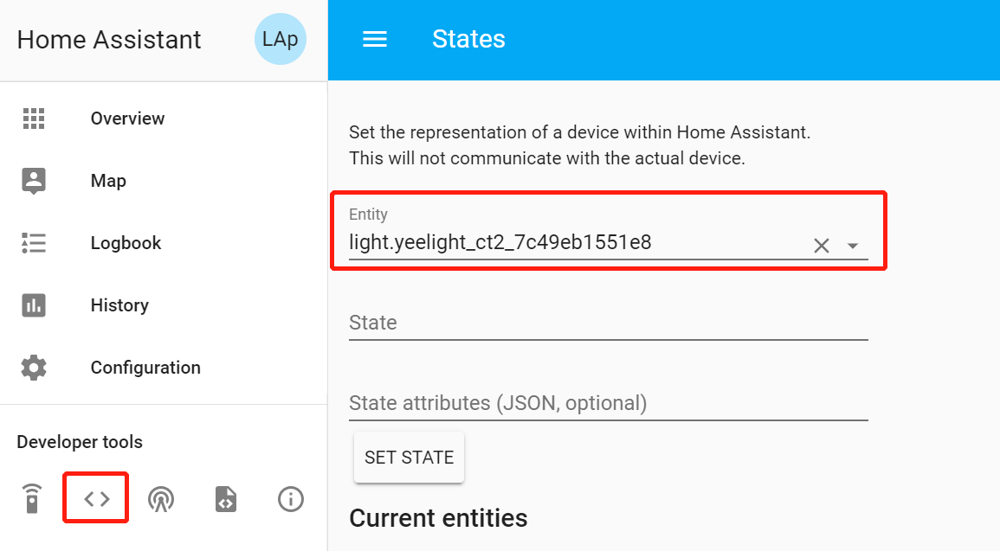
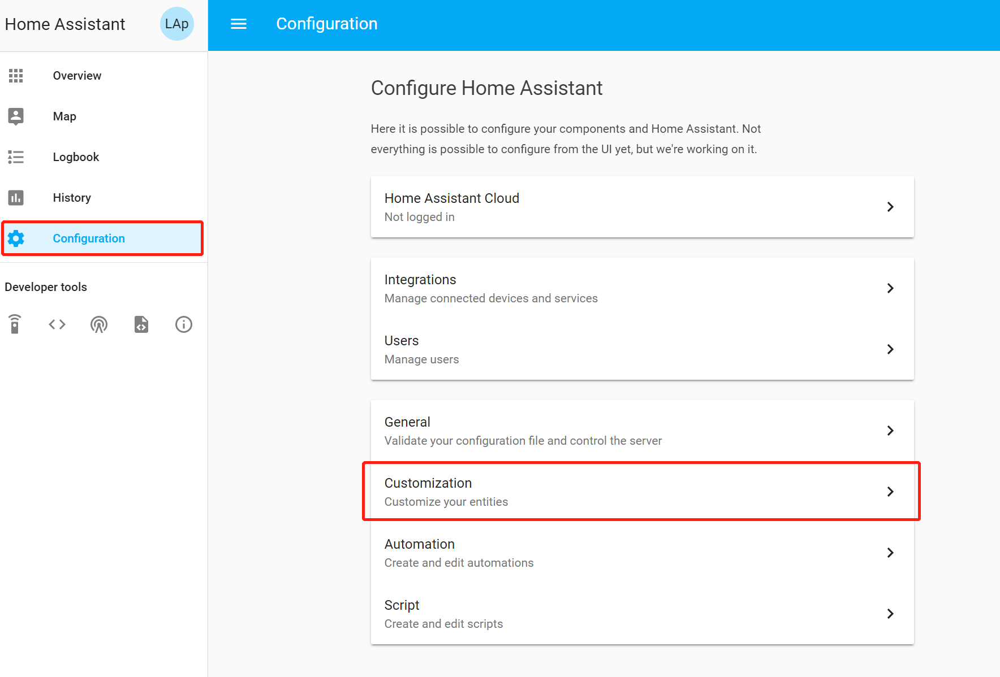

本文索引:
- [前言](#%E5%89%8D%E8%A8%80)
- [YAML](#yaml)
  - [使用环境变量](#%E4%BD%BF%E7%94%A8%E7%8E%AF%E5%A2%83%E5%8F%98%E9%87%8F)
  - [使用缺省值](#%E4%BD%BF%E7%94%A8%E7%BC%BA%E7%9C%81%E5%80%BC)
  - [包含其他文件](#%E5%8C%85%E5%90%AB%E5%85%B6%E4%BB%96%E6%96%87%E4%BB%B6)
- [基本配置信息](#%E5%9F%BA%E6%9C%AC%E9%85%8D%E7%BD%AE%E4%BF%A1%E6%81%AF)
- [向 HA 添加设备](#%E5%90%91-ha-%E6%B7%BB%E5%8A%A0%E8%AE%BE%E5%A4%87)
  - [风格1: 将所有实体以父级类聚](#%E9%A3%8E%E6%A0%BC1-%E5%B0%86%E6%89%80%E6%9C%89%E5%AE%9E%E4%BD%93%E4%BB%A5%E7%88%B6%E7%BA%A7%E7%B1%BB%E8%81%9A)
  - [风格2: 单独定义每个设备](#%E9%A3%8E%E6%A0%BC2-%E5%8D%95%E7%8B%AC%E5%AE%9A%E4%B9%89%E6%AF%8F%E4%B8%AA%E8%AE%BE%E5%A4%87)
  - [群组](#%E7%BE%A4%E7%BB%84)
- [自定义实体特性](#%E8%87%AA%E5%AE%9A%E4%B9%89%E5%AE%9E%E4%BD%93%E7%89%B9%E6%80%A7)

## 前言
**HA** 是由「组件」堆砌出的系统，官方提供了海量的组件及其用法的介绍，其中涵盖了使 **HA** 成为「家庭大脑」的方方面面，一个「组件」大致由两部分组成:
- 组件模块: 组件功能的核心逻辑
- 配置信息: 组件由外部加载的必要信息，可能包括 `platform` 信息，第三方服务的 `key` 等等

以下代码展示了一个 `notify` 组件，并采用 `pushbullet platform` 所有定义的配置信息:
```yaml
notify:
  platform: pushbullet
  api_key: "o.1234abcd"
  name: pushbullet
```

> 组件描述了功能的抽象含义，`platform` 指定可提供该功能的具体实现

**HA** 将所有「组件」通过配置信息定制，因此，配置信息成了描述整个 **HA** 的数据源，虽然 **HA** 社区正致力于实现通过 Web UI 来配置所有内容，但了解其数据模型对于解决问题及理解其运作方式非常有好处。**HA** 的配置信息会随着接入系统的设备增多而包含越来越多的信息，为了将不同类别的配置信息分开管理，官方推荐的做法是把根配置文件 `configuration.yaml` 下的不同节点以不同文件的形式进行管理，例如，默认的配置文件就包含了:
- `configuration.yaml`
    - `automations.yaml`
    - `customize.yaml`
    - `groups.yaml`
    - `scripts.yaml`
    - ...

由于配置信息会随时间增大，社区还推荐将配置文件夹作为 `Git Repository` 与远端进行同步，以防止数据丢失，并可跟踪修改历史。

> 不应将敏感信息文件纳入版本管理，请将 `secrets.yaml` 文件等包含敏感数据的配置文件添加至 `.gitignore` 中。

## YAML
**HA** 使用 `YAML` 语法定义配置信息，几乎每种组件都定义了单独的配置节，`YAML` 语法需要注意以下细节:
- 以 `-` 开头表示集合元素
- 以 `:` 分割代表键值映射
- 默认使用两个空格代表一级缩进，`Tab` 不能用于缩进

### 使用环境变量
以 `!env_var {VAR_NAME}` 从系统环境变量中取得值:
```yaml
http:
  api_password: !env_var PASSWORD
```
### 使用缺省值
配置信息可包含缺省值，例如:
```yaml
http:
  api_password: !env_var PASSWORD {default_password}
```
`default_password` 代表缺省值

### 包含其他文件
可将同一类别的配置分割到单独的文件中以提高可读性，例如:
```yaml
lights: !include lights.yaml
```

## 基本配置信息
首先编辑 `configuration.yaml` 的基本配置信息:
```yaml
homeassistant:
  # Location required to calculate the time the sun rises and sets
  latitude: {latitude-for-your-home}
  longitude: {longitude-for-your-home}
  # Impacts weather/sunrise data (altitude above sea level in meters)
  elevation: {elevation-for-your-home}
  # metric for Metric, imperial for Imperial
  unit_system: metric
  # Pick yours from here: http://en.wikipedia.org/wiki/List_of_tz_database_time_zones
  time_zone: America/Los_Angeles
  # Name of the location where Home Assistant is running
  name: My Awesome Home
```

## 向 HA 添加设备
默认情况下，[Discovery](https://www.home-assistant.io/components/discovery/) 组件开启，**HA** 会自动查找同一网络中的设备与服务。通常，每种「实体(entity)」都需要在 `configuration.yaml` 文件中进行手动配置，**HA** 支持两种风格来组织它们。

### 风格1: 将所有实体以父级类聚
例如:
```yaml
sensor:
  - platform: mqtt
    state_topic: "home/bedroom/temperature"
    name: "MQTT Sensor 1"
  - platform: mqtt
    state_topic: "home/kitchen/temperature"
    name: "MQTT Sensor 2"
  - platform: rest
    resource: http://IP_ADDRESS/ENDPOINT
    name: "Weather"

switch:
  - platform: vera
  - platform: tplink
    host: IP_ADDRESS
```
`mqtt` 和 `rest` 都属于 `sensor` 类别，将他们作为集合元素排列至 `sensor` 节点之下是以「类别」作为父级进行类聚。

### 风格2: 单独定义每个设备
为了区分不同的实体，必须在其后跟上数字或名称，并且保持唯一:
```yaml
sensor bedroom:
  platform: mqtt
  state_topic: "home/bedroom/temperature"
  name: "MQTT Sensor 1"

sensor kitchen:
  platform: mqtt
  state_topic: "home/kitchen/temperature"
  name: "MQTT Sensor 2"

sensor weather:
  platform: rest
  resource: http://IP_ADDRESS/ENDPOINT
  name: "Weather"

switch 1:
  platform: vera

switch 2:
  platform: tplink
  host: IP_ADDRESS
```
以**类别 名称**单独定义实体，此处定义的 `entity` `name` 会转换为以 `_` 分隔的 `entity_id`，例如 `Living Room` 会转换为 `living_room`。

### 群组
一旦设置好设备，便可对它们进行「逻辑分组」，每个群组由其名称和一组「实体 ID」组成，「实体 ID」可在 Web UI 的 **Developer Tools** 面板的 **Set State** 页面找到:


可由以下两种风格定义群组:
```yaml
group:
  # 数组风格
  living_room:
    entities: light.table_lamp, switch.ac
  # 集合风格
  bedroom:
    entities:
      - light.bedroom
      - media_player.nexus_player
```

## 自定义实体特性
不同类别的「实体」提供了一组通用的 `attribute` 用于实现定制化，这些值包括但不限于:
- friendly_name: 在 UI 中显示的名称
- homebridge_name: 在 **HomeBridge** 中显示的名称
- hidden: 是否在 **HA** 中隐藏实体，`true` 为隐藏，默认值为 `false`
- homebridge_hidden: 是否在 **HomeBridge** 中隐藏实体，`true` 为隐藏，默认值为 `false`
- emulated_hue_hidden: 是否在 **emulated_hue** 中隐藏实体，`true` 为隐藏，默认值为 `false`
- entity_picture: 指定一个图片的 `url` 与实体关联
- icon: 从 [MaterialDesignIcons.com](http://materialdesignicons.com/)([Cheatsheet](https://cdn.materialdesignicons.com/3.0.39/)) 选择的任何图标，前缀为 `mdi:`，示例值为 `mid:home` 
- assumed_state: 为「开关」类别指定预设状态，如果设置为 `false`，将得到默认的开关图标，默认值为 `true`
- device_class: 实体类别，该值将决定 UI 的显示图标及状态，但不会影响测量单位，默认值为 `None`，暂时有以下实体支持该值:
  - Binary Sensor: 具体参考 [Binary Sensor](https://www.home-assistant.io/components/binary_sensor/)
  - Sensor: 具体参考 [Sensor](https://www.home-assistant.io/components/sensor/)
  - Cover: 具体参考 [Cover](https://www.home-assistant.io/components/cover/)
- unit_of_measurement: 测量单位，未指定测量单位的传感器将显示离散值，默认值为 `None`
- initial_state: 为自动化设置初始状态，`on` 或者 `off`

定制化特性可在配置目录的 `customize.yaml` 中指定
```yaml
light.yeelight_ct2_7c49eb1551e8:
  friendly_name: Lamp
sensor.yr_symbol:
  friendly_name: Wether
```
**HA** 社区开发团队正在致力于实现通过 Web UI 来完成所有信息的配置，例如，`Customize` 的 UI 入口如下:
