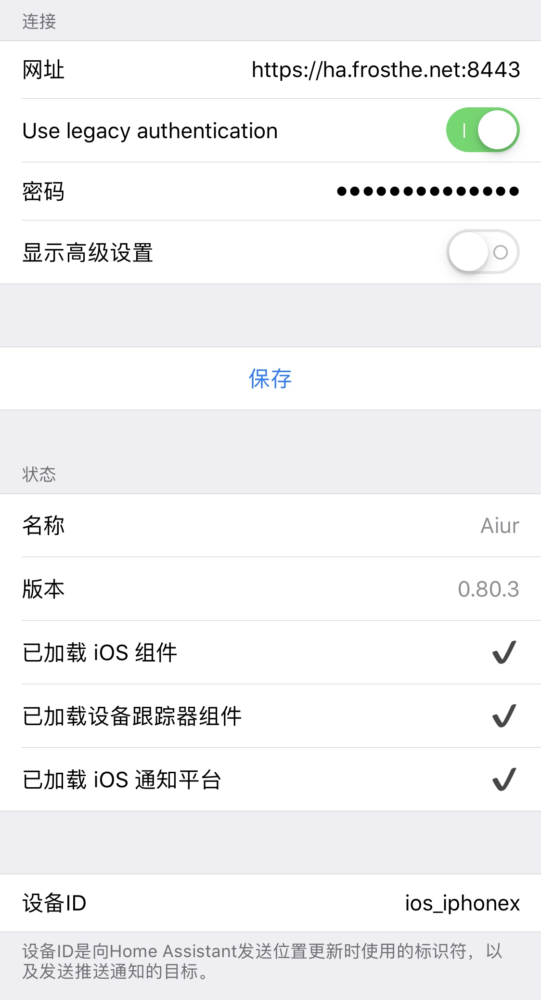
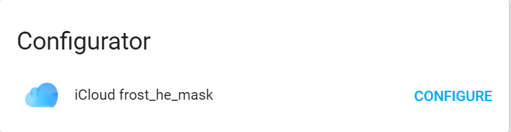
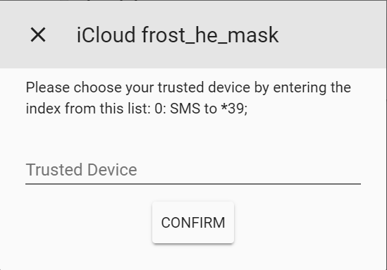
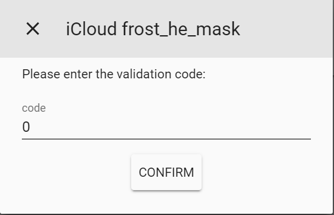
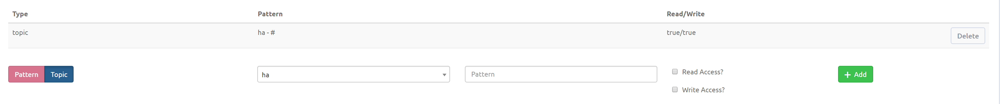
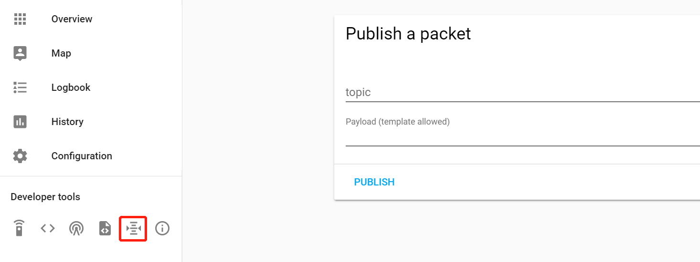
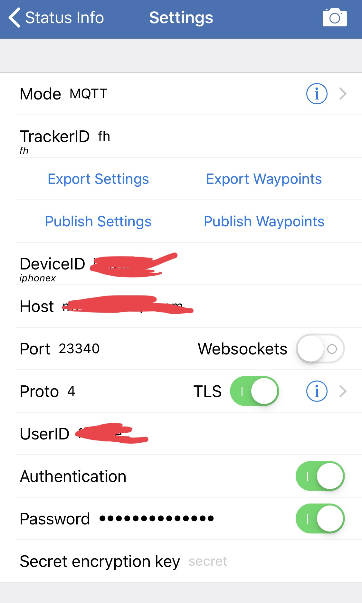

本文索引:
- [前言](#%E5%89%8D%E8%A8%80)
- [iOS 用户的专有追踪平台](#ios-%E7%94%A8%E6%88%B7%E7%9A%84%E4%B8%93%E6%9C%89%E8%BF%BD%E8%B8%AA%E5%B9%B3%E5%8F%B0)
  - [使用 ios 组件](#%E4%BD%BF%E7%94%A8-ios-%E7%BB%84%E4%BB%B6)
  - [使用 iCloud 组件](#%E4%BD%BF%E7%94%A8-icloud-%E7%BB%84%E4%BB%B6)
- [使用 MQTT Broker 组件追踪设备](#%E4%BD%BF%E7%94%A8-mqtt-broker-%E7%BB%84%E4%BB%B6%E8%BF%BD%E8%B8%AA%E8%AE%BE%E5%A4%87)
  - [为 HA 添加第三方 MQTT Broker](#%E4%B8%BA-ha-%E6%B7%BB%E5%8A%A0%E7%AC%AC%E4%B8%89%E6%96%B9-mqtt-broker)
  - [为 Device Tracker 组件添加 MQTT Platform](#%E4%B8%BA-device-tracker-%E7%BB%84%E4%BB%B6%E6%B7%BB%E5%8A%A0-mqtt-platform)
  - [为手机安装 OwnTracks 发送位置变化消息](#%E4%B8%BA%E6%89%8B%E6%9C%BA%E5%AE%89%E8%A3%85-owntracks-%E5%8F%91%E9%80%81%E4%BD%8D%E7%BD%AE%E5%8F%98%E5%8C%96%E6%B6%88%E6%81%AF)

## 前言
HA 提供了 [Device Tracker](https://www.home-assistant.io/components/device_tracker.owntracks/) 组件用于追踪设备，该组件支持众多 `Platform`，不同的 `Platform` 通过不同的手段实现设备位置变化的检测，它们包括但不限于:
- [ios](https://www.home-assistant.io/docs/ecosystem/ios/): iOS 设备用户的可选 `Platform`，可通过 `HomeAssistant iOS App` 向 HA 上报位置信息。
- [Bluetooth Tracker Platform](https://www.home-assistant.io/components/device_tracker.bluetooth_tracker/) 和 [Bluetooth LE Tracker Platform](https://www.home-assistant.io/components/device_tracker.bluetooth_le_tracker/): 通过蓝牙近距离通信技术，HA 主机与蓝牙设备之间的握手以确定设备是否在家，要求 HA 的主机和设备均支持蓝牙硬件
- [MQTT(Message Queue Telemetry Transport) Broker Platform](https://www.home-assistant.io/docs/mqtt/broker#run-your-own): 设备向 `MQTT Broker` 发布位置变化信息，`Device Tracker` 向 `MQTT Broker` 拉取位置变化信息实现。要求移动设备安装能够向 `MQTT` 服务发送消息的 App。如果使用 HA 内置的 MQTT Server，则 HA 的 iOS App 已集成了发送消息的功能。
- [OpenWrt Platform](https://www.home-assistant.io/components/device_tracker.luci/): 通过路由器 `OpenWrt` 系统的 `DHCP` 服务进行检测，要求设备与路由器必须位于同一网络
- [Nmap Platform](https://www.home-assistant.io/components/device_tracker.nmap_tracker/): 通过 `Nmap` 扫描接入同一 LAN 中各个设备的 IP 地址实现，同样要求设备与 HA 主机处于同一网络
- [iCloud Platform](https://www.home-assistant.io/components/device_tracker.icloud/): Apple 设备通过 `Find My iPhone` 功能持续向 `iCloud` 报告位置数据，`Device Tracker` 向 `iCloud` 拉取位置变化数据。要求设备必须开启 `Find My iPhone` 并在 `Device Tracker` 组件中提供 `iCloud` 的用户名和密码。

可结合多个不同的 `Platform` 一起使用，`Device Tracker` 将以最近报告的 `Platform` 作为参考。如果设备被标记为「在家」，将不会在地图上显示。一旦一个新的设备以某种 `Platform` 被 `device_tracker` 组件捕获，则会在 `known_devices.yaml` 中创建一条该设备的记录，以 `DeviceID` 标识，并支持以下参数:
- `name`: 设备的友好名称
- `mac`: 设备的 MAC 地址，每设备唯一，要使用诸如 `Nmap` 或 `SNMP` 等 `network device tracker` 时必须为设备指定 MAC 地址
- `picture`: 指定一张用于快速辨识设备的图片地址，可新建一个与 `configuration.yaml` 同级的 `www` 目录并将图片放于该目录下，然后使用 `/local/{picture-file-name}` 来引用该图片，也可直接使用网络 Url
- `icon`: 为设备指定图标
- `gravatar`: 设备主人的 Email 地址，如果设置该值，将覆盖 `picture` 参数
- `track`: 根据 `Platform` 不同可指定 `yes`/`on`/`true` 值，均表示该设备需要被追踪，否则它的位置和状态将不会更新
- `hide_if_away`: 根据 `Platform` 不同可指定 `yes`/`on`/`true` 值，均表示如果设备「不在家」将隐藏
- `consider_home`: 该设备「离开家」之后等待多少时间以将该设备标记为「不在家」，单位为秒，该值将重写 `platform` 级别的 `consider_home` 值

例如，以下节点表示一台设备:
```yaml
pangoiphonese:
  hide_if_away: false
  icon:
  mac:
  name: Pango.iPhone SE
  picture:
  track: true
```
___
## iOS 用户的专有追踪平台
HA 社区为 iOS 设备的用户提供了特有的 `device_tracker platform`。 
### 使用 ios 组件
用到的组件:
- [ios](https://www.home-assistant.io/docs/ecosystem/ios/)
- [Location](https://www.home-assistant.io/docs/ecosystem/ios/location/)

> 由于 iOS App 需要连接至家庭服务器的 HA 实例，所以 iOS 组件要求 HA 实例能够以某种方式被外网访问，具体可参考 `ddns` 和 `port forwarding`。

`Home Assistant` 0.42.4 自开始支持 iOS 版 App，iOS 用户可在 App Store 下载 `Home Assistant` App 配置连接到自家的 `Home Assistant` 的服务器，该 App 以 Web App 加载 HA 的实例，并实现了上报位置信息，通知等功能。首先在 App Store 下载 App，填写配置界面相关信息:


> 设备 ID 代表 HA 在 `known_devices.yaml` 中识别该设备的 ID

要实现和 HA 服务端的通信，还需要在 `configuration.yaml` 中启用 `ios` 组件:
```yaml
ios:
```
启用 `ios` 组件意味着同时启用 [`device tracker`](https://www.home-assistant.io/components/device_tracker)、[`zeroconf`](https://www.home-assistant.io/components/zeroconf) 和 [`notify`](https://www.home-assistant.io/components/notify) 组件:
- 使得 HA 接收由 iOS App 发送的位置信息
- HA 将通知推送至 App，
- HA 接收 iOS 设备的 `sensor` 信息
重启 HA 实例，之后 iOS App 便会在适当的时刻向指定服务器报告当前设备的信息。由于 Apple 报告位置信息的时机没有对外公开，手机在家时 iOS App 也会时不时向服务器报告位置，为了解决这个问题，在 `zones.yaml` 文件中禁用 iOS 设备追踪:
```yaml
- name: Home
  latitude: xx.xxxxxx
  longitude: yy.yyyyyy
  radius: 250
  icon: mdi:account-multiple
  track_ios: false
```

### 使用 iCloud 组件
iOS 用户的另一个选择是使用 `iCloud Platform`，可在 `configuration.yaml` 文件中添加如下节点:
```yaml
device_tracker:
  - platform: icloud
    username: {your-apple-id}
    password: {password-for-your-apple-id}
```
`iCloud Platform` 提供了以下参数:
- `username`: Apple Id，必填
- `password`: Apple Id 的密码，必填
- `account_name`: 自定义名称
- `max_interval`: 当 Apple 设备静止时使用的位置更新间隔时间，以分钟为单位，默认值为 30 分钟。。当设备移动时，位置更新时间为 1 分钟一次。
- `gps_accuracy_threshold`: 位置变化触发更新的阈值，以米为单位，默认值为 1000 米。这意味着当 gps 变化小于 1000 米时，`device_tracker` 将不会更新设备的状态。

设置好 `iCloud Platform` 之后，重启 HA，此时面板中将出现一个 `Configurator` 询问要使用该 Apple Id 下关联的哪一个设备作为受信任的设备:

点击 `CONFIGURE` 按钮，弹出以下对话框，输入代表设备的索引值(此处为 0)，点击 `Confirm`，等待接收短信验证码:

受到手机验证码之后，再次点击 `Configurator` 的 `CONFIGURE` 按钮，填入验证码:

等待 HA 与 iCloud 通信完成之后，HA 的面板中会出现代表该设备的 `sensor`，设置完成。Apple 对这种认证的有效期通常为 2 个月，2 个月之后需要重新认证。
___
## 使用 MQTT Broker 组件追踪设备
MQTT 是基于 TCP/IP 定义的专用于 IoT 的通信协议，采用轻量级的订阅/发布消息传输。HA 提供了支持 [MQTT Broker](https://www.home-assistant.io/docs/mqtt/broker/) 组件，HA 实例和移动设备无需直接通信，而是借助 `MQTT Broker` 作为通信桥梁。HA 也支持了运行内置的 `MQTT` 消息代理。要使用内置的 MQTT 组件，在 `configuration.yaml` 中加入以下配置:
```yaml
mqtt:
```
该组件提供了以下参数:
- `broker`: `MQTT Broker` 服务所在主机的 IP 地址或主机名，可选
- `port`: `MQTT Broker` 服务连接所使用的端口，可选，默认值为 1883
- `client_id`: HA 访问 `MQTT Broker` 服务时所使用的客户端 ID，字符串类型，可选，默认值随机生成
- `keep_alive`: 发送 `keep_alive` 消息的时间间隔，单位为秒，可选，默认值为 60
- `username`: 访问 `MQTT Broker` 服务的用户名，可选
- `password`: 与 `username` 对应的密码，可选
- `protocol`: 使用的协议版本，可选值为 3.1 或 3.1.1，默认使用 3.1.1，如果服务不支持则使用 3.1
- `certificate`: 证书文件的物理路径，可选
### 为 HA 添加第三方 MQTT Broker
官方推荐使用第三方服务商以确保稳定性，此处选择 [CloudMQTT](https://www.cloudmqtt.com/) 作为 `MQTT Broker`，其 `Cat Plan`(免费) 最大支持 `5` 个并行连接。创建完帐号后，登录到后台，创建专用用户 `ha` 及密码，在 `ACLs` 面板下选中 `Topic`，选择 `ha` 用户，`topic` 输入 `#`:

在 HA 的 `configuration.yaml` 中引入 `MQTT Broker` 组件并填入以下参数:
```yaml
mqtt:
  broker: CLOUTMQTT_SERVER      // address for the server
  port: CLOUDMQTT_PORT          // SSL Port
  certificate: auto             // load corresponding certificate
  username: CLOUDMQTT_USER      // ha user
  password: CLOUDMQTT_PASSWORD  // password for ha
```
配置好 `mqtt broker` 之后，重启 HA 实例，可在其 Web UI 上发现一个新的按钮，并通过发送相应的消息来测试该功能:


### 为 Device Tracker 组件添加 MQTT Platform 
`Device Tracker` 组件支持 `MQTT Platform` 平台([MQTT Device Tracker](https://www.home-assistant.io/components/device_tracker.mqtt/))，在 `configuration.yaml` 中加入以下配置信息:
```yaml
device_tracker:
  - platform: mqtt
    devices:
      iphone_se: 'location/iphone_se'
      iphone_6p: 'location/iphone_6p'
```
配置好 `mqtt platform` 之后，被追踪的设备需要以某种方式向远端 `mqtt broker` 发送消息，否则 HA 将无消息可拉取。官方推荐了 `owntracks platform` 作为 iOS/Android 设备的消息推送方案，HA 服务端也需要开启 `owntracks` 组件以设置相关的配置，于是，修改上面的配置用 `owntracks platform` 代替 `mqtt platform`:
```yaml
device_tracker:
  - platform: owntracks
```
`owntracks platform` 支持一些额外的参数:
- `max_gps_accuracy`: 设置上报位置信息的最大变化阈值，以过滤在某些情况下的 GPS 错误数据上报，避免造成副作用。可选，默认值 200
- `waypoints`: `OwnTracks` App 用户可定义 `WayPoints` 区域，与 HA 的 Zone 类似，用户可选择在 App 端导出 `WayPoints` 而 HA 可将其映射为 `Zone`。可选，默认值为 `true`
- `secret`: Payload 加密密钥，当使用第三方或公共 MQTT 服务商时可能希望对发送的位置数据进行加密。可选，默认值为空，该参数要求 HA 主机安装了 `libsodium` 库
- `mqtt_topic`: HA 订阅 MQTT Broker 的消息模板。可选，默认值为 `owntracks/#`
- `events_only`: 仅拉取地图区域的进入与离开信息，不关注移动设备的位置变更信息。可选，默认值为 `false`
- `region_mapping`: 配置 `OwnTracks` 定义的 `Region` 与 HA 实例定义的 `Zone`。字典结构，可选

### 为手机安装 OwnTracks 发送位置变化消息
[OwnTracks](https://owntracks.org/booklet/) 是一个免费开源的位置数据共享 App，支持以 HTTP 或 MQTT 协议向指定服务端发送位置数据。从 App Store 或 Android 应用市场下载 `OwnTracks`，此处以 iOS 为例，点击左上角的 `i` -> `Settings`，填入在 CloudMQTT 实例上获取的配置信息:

解释为文本版的配置信息为:
```bash
Mode: MQTT
TrackerID: {tracker-id}
DeviceID: {device-model}
Host: {your-mqtt-broker-instance-address}
Port: {ssl-port}
WebSockets: disabled
Proto: 4
TLS: enabled
UserID: {my-username-for-iOS-device}
Authentication: enabled
Password: {password-for-my-username}
Secret encryption key: 
```