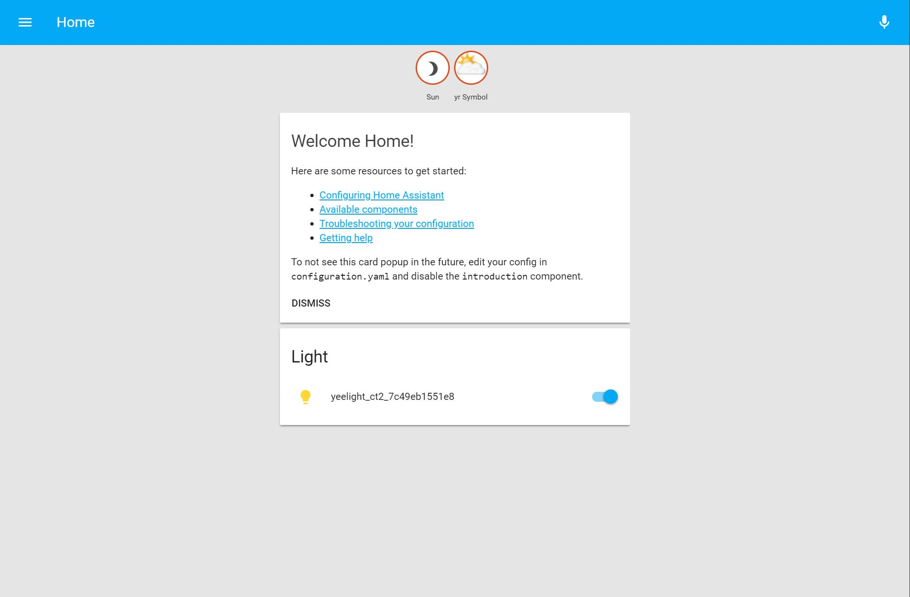

参考资料:
- [HA Installation on Docker](https://www.home-assistant.io/docs/installation/docker/)
- [HA Http](https://www.home-assistant.io/components/http/)
- [HA Nginx](https://www.home-assistant.io/docs/ecosystem/nginx/)

本文索引:
- [Home Assistant 简介](#home-assistant-%E7%AE%80%E4%BB%8B)
- [前提条件](#%E5%89%8D%E6%8F%90%E6%9D%A1%E4%BB%B6)
- [安装 Home Assistant](#%E5%AE%89%E8%A3%85-home-assistant)
  - [拉取 HomeAssistan Docker Image](#%E6%8B%89%E5%8F%96-homeassistan-docker-image)
- [开机启动 HA Container](#%E5%BC%80%E6%9C%BA%E5%90%AF%E5%8A%A8-ha-container)
- [更新 HA](#%E6%9B%B4%E6%96%B0-ha)

## Home Assistant 简介
[Home Assistant](https://www.home-assistant.io/)(以下简称 HA) 是一个开源的智能家居网关项目，它可以将市面上所有支持的智能硬件设备整合到一起进行统一管理，并提供了默认的 Web UI。HA 社区开发了海量组件以支持市面上主流的设备，在 IoT 中扮演了大脑的角色。在家庭服务器上架设 HA 有多种实现方式，官方也制作了对应的系统镜像 `Hass.io`，并推荐使用「树莓派3B+」作为其宿主机器。

## 前提条件
为了验证预期效果，最好提前准备好以下设备:
- 一台安装了 **Raspbian** 系统的树莓派 3B+，安装指南可参考「[准备树莓派 3b+](/homeserver-setup-raspberry-pi/)」
- 任何支持 HA 的智能设备一台，本文选用了 「[Yeelight LED 智能灯](https://item.jd.com/7122991.html)」。

## 安装 Home Assistant
通过 **Docker Image** 安装及更新一种服务免去了为该服务准备依赖环境的繁琐步骤，**HA** 官方推出了对应的 **Docker Image** 且支持树莓派的 CPU 架构，本文主要介绍通过 `Docker` 安装 `HomeAssistant`。如果你不喜欢 `Docker`，可以参考 [Install Home Assistant](https://www.home-assistant.io/getting-started/) 以其他方式安装。

### 拉取 HomeAssistan Docker Image
使用 **Docker** 安装 **HA** 是非常简单的，官方提供了支持 **Raspberry Pi 3** 的 **Docker Image** 和「[安装指南](https://www.home-assistant.io/docs/installation/docker/)」:
```bash
$ docker run -d --name="home-assistant" -v /path/to/your/config:/config -v /etc/localtime:/etc/localtime:ro --net=host homeassistant/raspberrypi3-homeassistant
```
参数 `/path/to/your/config:/config` 映射 `container` 的 `/config` 至本地主机的物理路径，此处我选择了 `~/.homeassistant`。如果希望安装指定版本的 Image，参考「[HA 在 Docker Hub 上的 Tag 列表](https://hub.docker.com/r/homeassistant/raspberrypi3-homeassistant/tag/)」选择版本，例如 0.69.1:
```bash
$ docker run -d --name="home-assistant" -v ~/.homeassistant:/config -v /etc/localtime:/etc/localtime:ro --net=host homeassistant/raspberrypi3-homeassistant

Unable to find image 'homeassistant/raspberrypi3-homeassistant:0.69.1' locally
0.69.1: Pulling from homeassistant/raspberrypi3-homeassistant
95d54dd4bdad: Pull complete
72bf7d76c392: Pull complete
9620ed938a4f: Pull complete
a16372392f2e: Pull complete
cd5a28710c58: Downloading [===================================>               ]  2.695MB/3.766MB
9b376789f5cb: Downloading [====>                                              ]   1.49MB/16MB
428cd24e8c1b: Download complete
3e7ded663f3a: Downloading [=>                                                 ]  45.59kB/2.24MB
5ad200a39e9a: Waiting
47c50281d4f4: Waiting
34a35918edbb: Waiting
ff968d62969e: Waiting
88d8e837fc65: Waiting
0048f1b252d1: Waiting
fe24e50f4c0c: Waiting
8a894406a1f7: Waiting
c521d5fa0262: Waiting
b87db931bad3: Waiting
faa8f2005c47: Waiting
0316d5cde9e4: Waiting
aca6725ed6a1: Waiting

# ...Docker 正从远程拉取所需的 image...

Digest: sha256:76d8f1dee1d372fee469f688275854865e12ca662d4090800bb1a3ea5cefdf0f
Status: Downloaded newer image for homeassistant/raspberrypi3-homeassistant:0.69.1
c360dbc77bede87b4eae2210d7b2df11c80f13a5acb227feaf53b3b8554ef2cd
```
安装完成后，**HomeAssistant** 的 `container` 已经开始运行:
```bash
$ docker ps

CONTAINER ID        IMAGE                                             COMMAND                  CREATED             STATUS              PORTS               NAMES
c360dbc77bed        homeassistant/raspberrypi3-homeassistant:0.69.1   "/usr/bin/entry.sh p…"   5 minutes ago       Up 5 minutes                            home-assistant
```
查看刚刚指定的配置文件目录，出现了以下文件及目录:
```bash
$ ls -l .homeassistant

-rw-r--r-- 1 root root      2 May 21 03:42 automations.yaml
-rw-r--r-- 1 root root   1800 May 21 03:42 configuration.yaml
-rw-r--r-- 1 root root      0 May 21 03:42 customize.yaml
drwxr-xr-x 2 root root   4096 May 21 03:42 deps
-rw-r--r-- 1 root root      0 May 21 03:42 groups.yaml
-rw-r--r-- 1 root root    106 May 21 03:43 home-assistant.log
-rw-r--r-- 1 root root 126976 May 21 04:11 home-assistant_v2.db
-rw-r--r-- 1 root root      0 May 21 03:42 scripts.yaml
-rw-r--r-- 1 root root    157 May 21 03:42 secrets.yaml
drwxr-xr-x 2 root root   4096 May 21 03:43 tts
```
`config` 目录(此处为 `~/homeassistant/`)下的 `configuration.yaml` 是配置文件的入口点，其他由 `yaml` 为扩展名的配置文件均是为了实现独立管理而单独分离出来的文件，可在 `configuration.yaml` 文档中找到如下入口载入这些配置文件:
```yaml
  customize: !include customize.yaml
  group: !include groups.yaml
  automation: !include automations.yaml
  script: !include scripts.yaml
```
`8123` 是 **Web UI** 的默认端口，尝试在浏览器中输入 **http://{ip-address-to-raspberry}:8123** 访问，得到如下结果:



**HA** 会自动查找接入同一 wifi 网络中的智能设备，是因为 `configuration.yaml` 中默认配置了 `Discovery` 组件:
```yaml
# Discover some devices automatically
discovery:
```
> 接入 HA 的设备无需打开相应的 App 进行绑定。

## 开机启动 HA Container
一切正常之后，每次重启树莓派必须手动执行 `docker container start [Container ID]/NAME` 的方式来启动 **HA** 服务，我们需要将其做成服务或加入开机启动脚本，编辑 `/etc/rc.local` 文件:
```bash
$ sudo nano /etc/rc.local

docker container start home-assistant
```

> 该脚本文件具体可参考 [RC.LOCAL](https://www.raspberrypi.org/documentation/linux/usage/rc-local.md)

重启树莓派，**HA** 开机启动成功，至此，一个基本款的家庭 **HA** 搭建就完成了。

## 更新 HA
**HA** 目前仍然在快速迭代中，对应的 `Docker Image` 也会同步放出。要更新以 `Docker Container` 运行的 **HA** 实例，只要重新拉取最新版本的 `Image` 即可:
```bash

$ docker stop home-assistant
$ docker pull homeassistant/raspberrypi3-homeassistant
$ docker container rm home-assistant
$ docker run -d --name="home-assistant" -v /path/to/your/config:/config -v /etc/localtime:/etc/localtime:ro --net=host homeassistant/raspberrypi3-homeassistant
```

> 只要保持 `container` 的 `name` 一致，已添加至开机启动脚本中的代码在更新完 `Image` 之后无需更改。