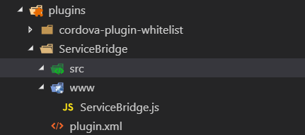
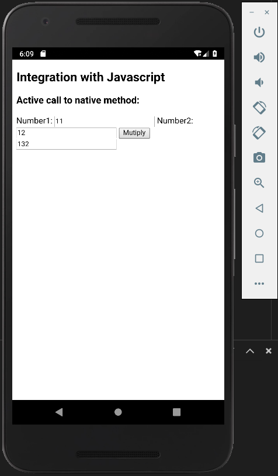
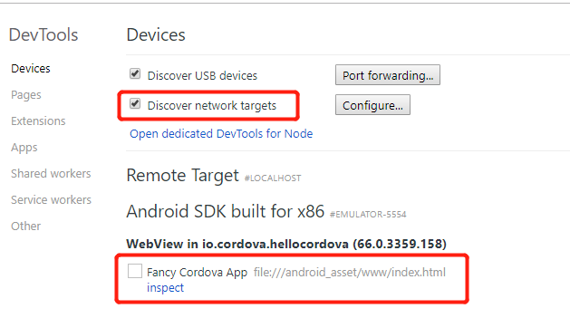
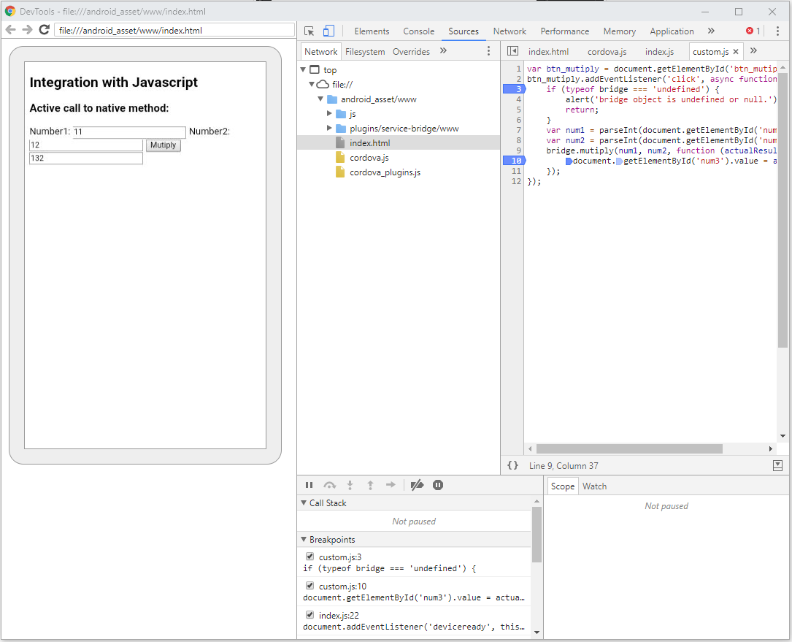
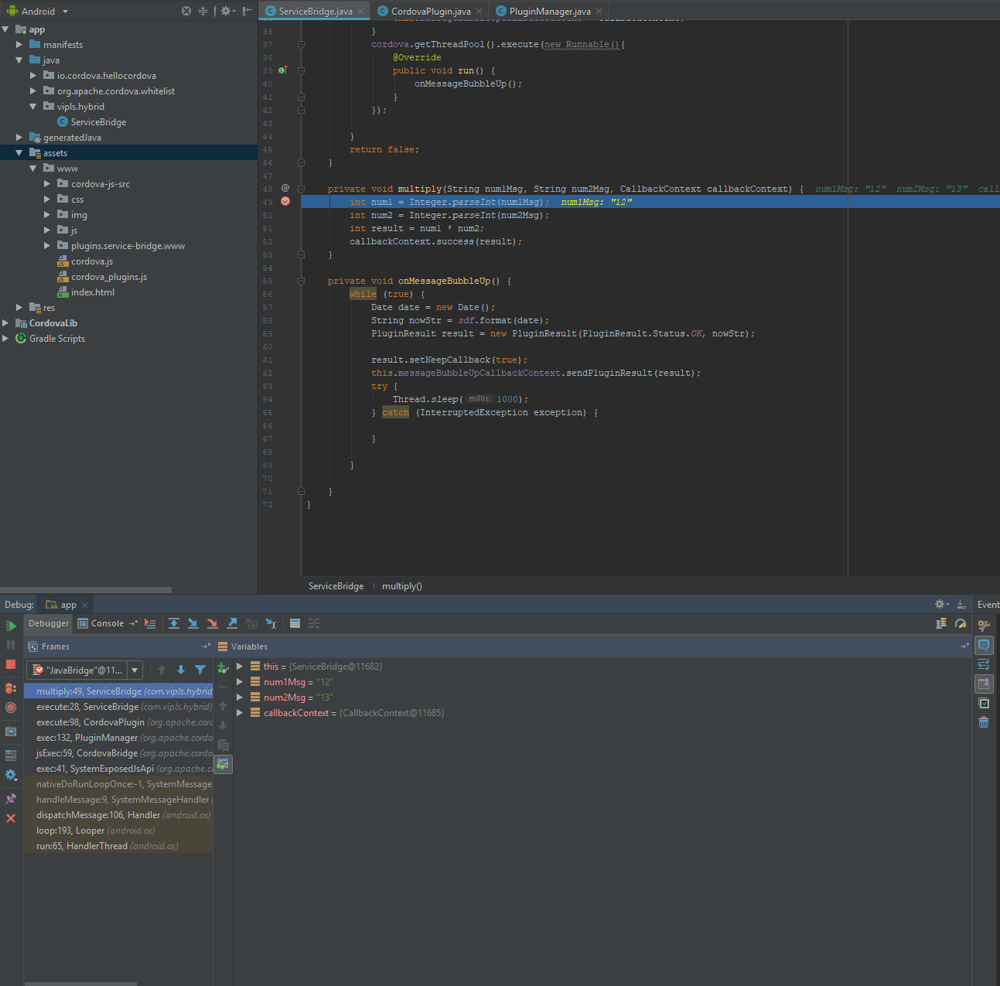

## 添加 plugin
为了让 `web app` 能够访问移动设备的本地功能，`cordova` 以 `plugin` 的方式粘合 `web app` 和移动设备本地 SDK。`plugin` 将移动设备本地 SDK 的功能以 `Javascript API` 的方式暴露给 `web app`。标准化的 `plugin` 大多以 `npm` 包的形式提供，可借助类似 `cordova plugin search camera` 的命令搜索相应的 `plugin`，而一些通用的 API 则被 `cordova` 内置集成，它们被称为 [Core Plugin APIs](https://cordova.apache.org/docs/en/8.x/guide/support/index.html#core-plugin-apis)。现在，我们将提供本地相机功能的 `camera plugin` 添加至 [Cordova 快速开始](/cordova-get-started)中的初始项目:
```bash
$ cordova plugin search camera
```
取到准确的 `plugin` 名称之后，安装该 `plugin`:
```bash
$ cordova plugin add cordova-plugin-camera

Fetching plugin "cordova-plugin-camera@~2.1.0" via npm
Installing "cordova-plugin-camera" for android
Installing "cordova-plugin-camera" for ios
```
可执行 `cordova plugin ls` 查看当前已安装的 `plugin`:
```bash
$ cordova plugin ls

cordova-plugin-camera 2.1.0 "Camera"
cordova-plugin-whitelist 1.2.1 "Whitelist"
```
___
## 添加 Android 平台支持
首先为 `cordova` 项目添加 `android` 平台:
```bash
$ cordova platform add android

Installed platforms:
  android 7.1.2
  browser 5.0.4
```
检查 `config.xml` 及 `package.json` 文件，确保其相应的配置已保存。

## Plugman
`Plugman` 是一个用于管理 `cordova plugin` 的 `npm` 包，也是官方推荐的用来开发 `plugin` 的工具，关于 `Plugman` 的命令可参考 [Using Plugman to Manage Plugins](https://cordova.apache.org/docs/en/latest/plugin_ref/plugman.html)
### 安装 Plugman
```bash
$ npm install -g plugman
```
## 创建 Plugin
导航至 Plugin 的目标目录，执行:
```bash
$ plugman create --name <pluginName> --plugin_id <pluginID> --plugin_version <version> [--path <directory>] [--variable NAME=VALUE]
```
上述命令表示，`name`，`plugin_id`，和 `plugin_version` 为必填项，`path` 为可选项。例如:
```bash
$ plugman create --name ServiceBridge --plugin_id service_bridge --plugin_version 0.0.1 --path ./plugins
```
 该命令会在指定 `./plugins` 下创建一个名为 `ServiceBridge` 的 `plugin`，并填充一系列初始化配置:
 
 该命令生成了标准化的目录结构及 `plugin.xml` 和 `www/ServiceBridge.js` 两个文件。
 
 ### plugin.xml 文件
 `plugin.xml` 必须位于插件目录的顶层，为插件的描述文件，由 `Plugman` 生成的初始模板为:
 ```xml
<?xml version='1.0' encoding='utf-8'?>
<plugin id="service-bridge" version="0.0.1" xmlns="http://apache.org/cordova/ns/plugins/1.0" xmlns:android="http://schemas.android.com/apk/res/android">
    <name>ServiceBridge</name>
    <js-module name="serviceBridge" src="www/serviceBridge.js">
        <clobbers target="bridge" />
        <merges target="bridge" />
    </js-module>
</plugin>
 ```
其中
- `plugin` 节点: 
  - `id`: 用于 `npm` 唯一标识该 `plugin`
  - `version`: 指示当前 `plugin` 的版本号
- `name` 节点: 阅读友好的 `plugin` 名称
- `js-module`: 通常， `plugin` 都包含一个或多个 `Javascript` 文件，每个 `js-module` 节点对应一个 `Javascript` 文件，这使得 `plugin` 的使用者无需手动在自己的源代码文件中添加 `<script>` 节点。安装上述 `plugin` 后，`www/serviceBridge.js` 被拷贝至对应 `platform` 项目下的 `www/plugins/service-bridge/serviceBridge.js`，并在 `www/cordova_plugins.js` 库中添加一条 `entry`。在运行时，`cordova.js` 库使用 `XHR` 读取每个 `Javascript` 文件并在 `Html` 中添加相应的 `<script>` 节点。
  - `src`: 引用一个文件(相对于 `plugin.xml` 文件的相对路径)
  - `name`: 表示模块名称的最后一个部分，可为任意值，仅当希望在该 `Javascript` 文件使用 `cordova.require` 引入插件的其他部分时起作用。一个 `js-module` 的模块名称通常为 `{plugin-id}.{name}`。上述例子的 `js-module` 的完整名称为 `service-bridge.serviceBridge`。
  - `<clobbers target="some.value">`: 指示 `module.exports` 将以 `window.some.value` 的对象注入至 `window` 对象，可以包含任意多个 `clobbers` 节点。(若 `window` 上不存在该对象，将自动创建）
  - `<merges target="some.value">`: 指示模块将合并至 `window.some.value`，如果该值已经存在，将覆盖原始版本。同样，可以包含任意多个 `merges` 节点。(若 `window` 上不存在该对象，将自动创建）
- 一个空的 `js-module` 节点仍会加载，并且可以在其他模块中以 `cordova.require` 访问。
- 在 `platform` 节点下嵌套 `js-module` 表示该模块仅用于该 `platform` 下。

> `plugin.xml` 的详细内容可参考 [Plugin Specification](https://cordova.apache.org/docs/en/latest/plugin_ref/spec.html)

## 定义 Javascript 接口
查看 `www/serviceBridge.js` 文件:
```javascript
var exec = require('cordova/exec');

exports.coolMethod = function (arg0, success, error) {
    exec(success, error, 'ServiceBridge', 'coolMethod', [arg0]);
};
```
可进一步组织 `Javascript` 接口的编码风格，但在与本地 SDK 进行交互时总是需要调用 `cordova.exec`，其语法大致为:
```javascript
cordova.exec(function(winParam) {},
             function(error) {},
             "service",
             "action",
             ["firstArgument", "secondArgument", 42, false]);
```
这些参数表明:
- `function(winParam){}`: 执行成功时的回调函数
- `function(error){}`: 执行失败时的回调函数
- `service`: 在本地库中所要调用的服务，通常对应本地库的**类型名称**
- `action`: 在本地库中所要执行的动作，通常对应本地库的**方法名称**
- `[/* arguments */]`: 传递给本地库方法的参数数组

现在，修改 `www/serviceBridge.js` 文件，以定义 `Javascript` 接口:
```javascript
var exec = require('cordova/exec');

exports.mutiply = function (num1, num2, callback) {
    exec(callback, function (err) {
        console.log('something is wrong, ' + err);
    }, 'ServiceBridge', 'multiply', [num1, num2]);
}
```
上述代码表明该 `plugin` 将一个 `multiply` 函数导出至 `js-module`，并提供了与本地库交互的功能。

## 本地实现
对 `Javascript` 接口定义完成后，需要至少提供一种 `platform` 的本地实现，本文以 `Android` 平台为例。`Android` 插件基于 `Cordova-Android` 机制，最终由 `Android` 本地库的 `WebView` 加上一个 `Java` 类型提供实现。`plugin` 的本地 `Java` 类型由一个继承自 `CordovaPlugin` 的类型实现(需要重写父类的 `execute` 方法)。

### 创建 Java 实现类
在 `plugin` 目录的 `src/android` 下创建 `ServiceBridge.java` 文件，并填充如下实现:
```java
package com.sample.plugin;

import org.apache.cordova.CordovaPlugin;
import org.apache.cordova.CallbackContext;

import org.json.JSONArray;
import org.json.JSONException;
import org.json.JSONObject;

import io.cordova.hellocordova.R.string;

/**
 * This class echoes a string called from JavaScript.
 */
public class ServiceBridge extends CordovaPlugin {

    @Override
    public boolean execute(String action, JSONArray args, CallbackContext callbackContext) throws JSONException {
        if (action.equals("multiply")) {
            String num1 = args.getString(0);
            String num2 = args.getString(1);
            this.multiply(num1, num2, callbackContext);
        }
        return false;
    }

    private void multiply(String num1Msg, String num2Msg, CallbackContext callbackContext) {
        int num1 = Integer.parseInt(num1Msg);
        int num2 = Integer.parseInt(num2Msg);
        int result = num1 * num2;
        callbackContext.success(result);
    }
}
```
`CordovaPlugin` 类型位于顶部 `import` 的 `org.apache.cordova.CordovaPlugin` 包中，该类型的 `execute()` 方法接收 `Javascript` 接口中的 `exec` 方法的消息，返回值 `bool` 表明当前方法的执行结果，`true` 或 `false` 被分别解释为不同的返回类型并触发由 `Javascript` 接口传入的成功或失败的回调函数。

接下来，该方法查询传入参数的 `action` 的值，并将 `callbackContext` 一起传入私有方法 `multiply`，值得注意的是，`callbackContext.error()` 和 `callbackContext.success()` 将分别触发 `Javascirpt` 的失败和成功回调函数。

以上述 `multiply` 方法为例，当 `Javascript` 接口中执行:
```javascript
cordova.exec(<successFunction>, <failFunction>, <service>, <action>, [<args>]);
```
时，方法将 `WebView` 中的请求封送至本地库，调用 `service` 下的 `action` 方法。本地库代码在 `Plugin` 中可由 `.java` 源代码或 `.jar` 包的形式存在。

### 更新 plugin.xml 
`Java` 实现完成之后，更新 `plugin.xml` 文件声明:
```xml
<?xml version='1.0' encoding='utf-8'?>
<plugin id="service_bridge" version="0.0.1" xmlns="http://apache.org/cordova/ns/plugins/1.0" xmlns:android="http://schemas.android.com/apk/res/android">
    <name>ServiceBridge</name>
    <js-module name="serviceBridge" src="www/serviceBridge.js">
        <clobbers target="bridge" />
        <merges target="bridge" />
    </js-module>

    <platform name="android">
        <source-file src="src/android/ServiceBridge.java" target-dir="com/sample/plugin/" />

        <config-file target="res/xml/config.xml" parent="/*">
            <feature name="ServiceBridge">
                <param name="android-package" value="com.sample.plugin.ServiceBridge"/>
            </feature>
        </config-file>
    </platform>
</plugin>
```
在 `js-module` 之后加入了以下节点:
- `platform`: 标识一个 `native` 平台，不包含 `platform` 节点的 `plugin` 会被认为是 `Javascript Only`，可被安装至任意 `platform`
  - `name` 标识具体的平台名称，该值必须为小写，且为以下可选值:
    - `amazon-fireos`
    - `android`
    - `blackberry10`
    - `ios`
    - `wp8`
- `source-file` 元素: 指定可执行程序的源代码文件，并将被安装至相应的项目下。
  - `src`: 必须，相对于 `plugin.xml` 的路径，如果找不到指定文件，`plugman` 将报错并回滚安装
  - `target-dir`: 文件应该被拷贝的目录，相对于对应根目录，该特性主要服务于 `Java-based` 平台，一个位于 `com.alnny.foo` 包的文件，该值则必须为 `com/alunny/foo` 目录，对于源代码目录不敏感的平台，该值可被忽略。
- `config-file` 元素: 代表一个期望被追加的 `xml` 配置文件，该元素仅表示希望追加的子元素内容，其子元素则为具体追加的内容，目前 `xml` 和 `plist` 文件。
  - `target`: 指示被追加的文件路径，相对于 `Cordova` 项目根目录，该值支持 `*` 通配符，`plugman` 将在所有符合条件的匹配项取第一个，如果目标文件无法找到，则 `plugman` 继续安装并忽略这些追加
  - `parent`: 以 `XPath` 指定希望搜索的父级目录，同样支持 `*`
  - `feature` 元素: 指定被追加至目标 `xml` 文件的子元素，该元素代表了目标功能的声明。
    - `name`: 对应于 `Javascript` 接口中调用 `exec` 时的 `service` 参数，此处值为 `ServiceBridge`
    - `param`: 节点的 `value` 值对应于 `Java` 类型的「完全限定名」。

## 安装及更新 Plugin
`plugin` 开发完成之后，将其安装至当前 `Cordova` 项目的 `Android` 平台下:
```bash
plugman install --platform android --project platforms/android --plugin '{full_path_your_plugin}\plugins\Servic
eBridge'
```
由于 `plugin` 暂时在本地开发，更新流程通过重装的方式实现，卸载插件:
```bash
$ plugman uninstall --platform android --project platforms/android --plugin '{full_path_your_plugin}\plugins\Servic
eBridge'
```

## 调试 Plugin
`Cordova` 是包含了所添加的 `platform` 的原生 `app` 项目的，使用 `Android Studio` 打开 `platforms/android` 目录，它被识别为一个有效的 `Android` 项目:

在 Android Studio 中开始调试，选择一个 `Android` 模拟器，成功启动之后，即可开始调试:


### 调试 Javascript 源代码
项目的 `Javascript` 部分可通过 `Chrome Remote Debug` 连接至 `Android` 模拟器远程调试，打开 `Chrome` 新的标签页，输入 `chrome://inspect/#device`，勾选 `Discover network targets`，加载片刻之后，运行中的安卓模拟器出现，点击 `inspect` 开始远程调试:



### 调试 Android 源代码
在 Android Studio 中为 `Java` 源代码设置断点，即可开始调试:

