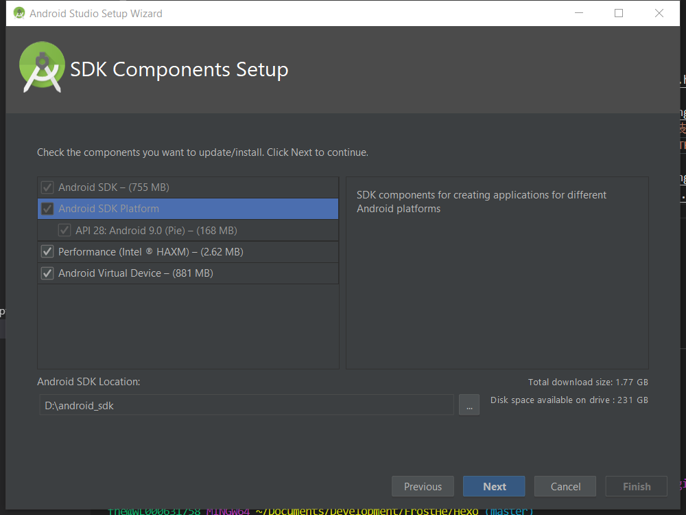
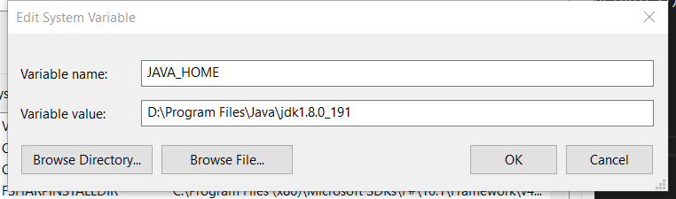
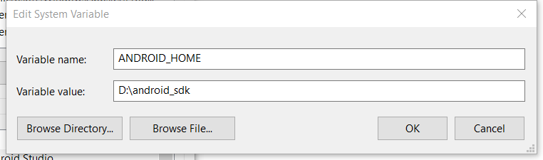
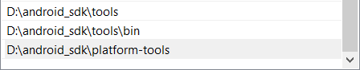
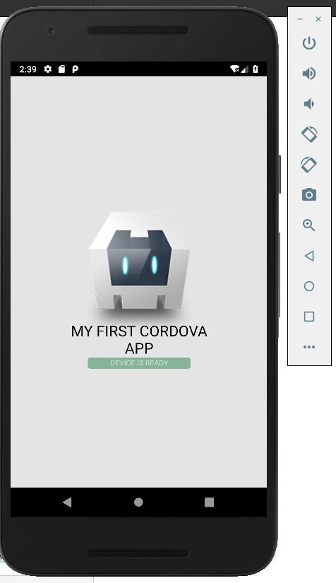

## 准备
确保以下工具集已安装好:
- `nodejs` 和 `npm`: `cordova cli` 是一个运行在 `nodejs` 上的 `npm` 包
- `git`: 用于在安装过程中下载某些依赖 `git` 仓库的文件

## 安装 cordova cli
```bash
$ npm install -g cordova
```

## 创建 cordova app
1. 导航至一个目标目录，执行 `cordova create hello`
2. 导航至项目目录内: `cd hello`
3. 添加支持的 `platform`: 可执行 `cordova platform ls` 查看当前已支持的 `platform` 及可支持的 `platform`，添加对 `browser`，`ios`，和 `android` 的支持
    1. `cordova platform add browser`
    2. `cordova platform add ios`
    3. `cordova platform add android`
4. 安装对应 `platform` 的 SDK: 要生成不同 `platform` 的 app，要求开发环境中必须包含编译该 `platform` 所需的 SDK，`browser platform` 无需任何特定的 SDK，以下列出常见 `platform` 编译所需环境的参考：
    1. Android: 参考 [Android Platform Guide](https://cordova.apache.org/docs/en/8.x/guide/platforms/android/index.html#requirements-and-support)
    2. iOS: 参考 [iOS Platform Guide](https://cordova.apache.org/docs/en/8.x/guide/platforms/ios/index.html#requirements-and-support)
    3. Windows: [Windows Platform Guide](https://cordova.apache.org/docs/en/8.x/guide/platforms/windows/index.html#requirements-and-support)
5. 初始化: 默认情况下，`cordova create` 创建的是基于 `browser platform` 的项目，可在 `www/js/index.js` 中的 `onDeviceReady` 扩展初始化逻辑
6. 生成: 
    1. 执行 `cordova requirements [platform]` 检查当前环境是否满足生成对应 `platform` 的要求，若不指定 `platform`，则检查所有已支持 `platform` 的编译要求
    2. 执行 `cordova build [platform]` 生成对应 `platform`，不指定 `platform` 则生成所有支持的 `platform` 

## 在 Android 上测试 cordova app
### 准备
- `JDK`(Java Development Kit): 前往 [JDK 官网](https://www.oracle.com/technetwork/java/javase/downloads/jdk8-downloads-2133151.html) 下载对应的开发套件，在 Windows 系统下需要设置 `JAVA_HOME` 环境变量至 JDK 的安装目录(参考[这里](https://cordova.apache.org/docs/en/8.x/guide/platforms/android/index.html#setting-environment-variables))
- `Gradle`: 生成 `Android` 应用时必须的工具库，其依赖 JDK 或 JRE，参考[安装指南](https://gradle.org/install/)在不同系统中安装 `Gradle`。在 Windows 系统下需要在 `PATH` 环境变量中指定 `Gradle` 的路径(参考[这里](https://cordova.apache.org/docs/en/8.x/guide/platforms/android/index.html#setting-environment-variables))，安装完成后，检查版本:
```bash
$ gradle --version
------------------------------------------------------------
Gradle 4.10.2
------------------------------------------------------------
```
- `Android SDK`: `Android Studio` 集成了 `Android SDK`，可至[官网](https://developer.android.com/studio/)下载并安装，`Android Studio` 安装完成后，使用其集成的 SDK Manager 安装以下必备的 SDK:
    - Android Platform SDK
    - Android SDK build-tools: 版本 19.1.0 或更高
    - Android Support Repository
    

> 注意: x86 的 Android Image 要求使用硬件加速，该功能不能与 Windows 系统上的 Hyper-V 共存，在安装 Intel Hardware Accelerated Execution Manager 之前确保 Hyper-V 已被禁用

### 设置环境变量
当以上所有依赖的环境安装完成后，开始设置环境变量:
- `JAVA_HOME` 环境变量设置到 JDK 的安装目录
    
- `ANDROID_HOME` 环境变量设置到 `Android SDK` 的安装目录
    
- `Android SDK` 的 `tools`，`tools/bin` 及 `platform-tools` 目录添加至 `PATH` 环境变量
    

一切就绪之后，执行以下命令检查当前环境是否能够成功生成 `Android App`: 
```bash
$ cordova requirements android

Requirements check results for android:
Java JDK: installed 1.8.0
Android SDK: installed true
Android target: installed android-28,android-27
Gradle: installed D:\Program Files\Android\Android Studio\gradle\gradle-4.6\bin\gradle
```
生成 `Android App`:
```bash
$ cordova build android

BUILD SUCCESSFUL in 2s
46 actionable tasks: 1 executed, 45 up-to-date
Built the following apk(s):
        D:\projects.untracked\lightspeed\poc-webapp-cordova\platforms\android\app\build\outputs\apk\debug\app-debug.apk
```
在模拟器上测试 `App`:
```bash
$ cordova emulate android
```
或者:
```bash
$ cordova run android --emulator

Built the following apk(s):
        \\{your-project-root-directory}\platforms\android\app\build\outputs\apk\debug\app-debug.apk
Using apk: \\{your-project-root-directory}\platforms\android\app\build\outputs\apk\debug\app-debug.apk
Package name: io.cordova.hellocordova
INSTALL SUCCESS
LAUNCH SUCCESS
```



如果手上有一台搭载 Android 系统的手机，执行 `cordova run android` 在真机上测试。
___

## 使用 merges 为单独的 platform 提供定制化内容
`cordova` 使用 `merges` 目录为 `platform` 存储定制化内容，项目顶层目录下的 `merges/{platform}` 目录镜像了 `www` 的目录结构，将希望覆盖或额外添加的内容放置在 `merges/{platform}` 目录下。

## 更新 cordova 及项目
更新 `cordova`:
```bash
$ (sudo) npm update -g cordova
```
更新 `platform`:
```bash
$ cordova platform update android --save
$ cordova platform update ios --save
```