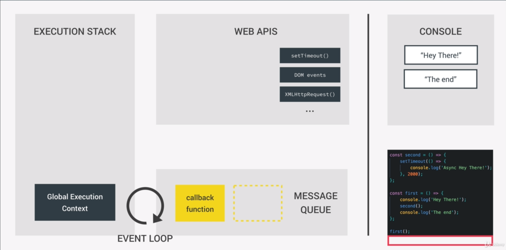

- [ES History](#es-history)
- [Javascript Basics](#javascript-basics)
  - [Falsy and Truthy Values](#falsy-and-truthy-values)
  - [Double exclamation marks](#double-exclamation-marks)
  - [Equal Operations](#equal-operations)
  - [Function Expression and Function Declaration](#function-expression-and-function-declaration)
  - [Arrays](#arrays)
- [Javascript Engine](#javascript-engine)
  - [Execution Context](#execution-context)
  - [Hoisting(提升)](#hoisting提升)
  - [Event & Event Loop](#event--event-loop)
    - [Message Queue](#message-queue)
    - [setTimeout](#settimeout)
- [Prototype Inheritance](#prototype-inheritance)
- [Functions](#functions)
  - [Passing Functions as Arguments](#passing-functions-as-arguments)
  - [Functions Returning Functions](#functions-returning-functions)
  - [Immediately Invoked Funtion Expression(IIFE)](#immediately-invoked-funtion-expressioniife)
  - [Closures](#closures)
  - [Bind, Call and Apply](#bind-call-and-apply)

## ES History

- 1997: ES1 became the first version of the Javascript language standard.
- 2009: ES5, fully supported in all browers.
- 2015: ES2015/ES6 released in 2015. Changed to annual release cycle.
  - Asynchronouse Javascript
  - AJAX and API calls
  - Modern dev setups(Webpack and Babel)
- 2016/2017/2018/2019/...: ES2016/ES2017/ES2018/ES2019/...

Using transpiling and polyfilling to convert to ES5.

---

## Javascript Basics

### Falsy and Truthy Values

The following values are considered by Javascript to be truthys:

- Object: `{}`
- Array: `[]`
- Not empty string: `"anything"`
- Number other than zero: `3.14`
- Date: `new Date();`

The following values are considered by Javascript to be falseys:

- `undefined`
- `null`
- `0`: Even if a variable is assigned `0`, but it still tells it's undefined when testing with `if`, it's a common pattern in javascript to test a variable whether it's undefined by using `if(variable || variable === 0)`. See more [here](https://www.udemy.com/course/the-complete-javascript-course/learn/lecture/10788426?start=187#bookmarks)
- `''`: empty string value.
- `NaN`: Not a number

### Double exclamation marks

`!!` is used to cast a Javascript variable to boolean:

```javascript
var name = "Brain";
// cast to boolean, it will return true.
var bool = !!name;
```

The JavaScript engine that is executing your code will attempt to convert(or coerce) a value to a boolean when necessary, such as when evaluated in an if-statement.

### Equal Operations

Always use `===/!==` to compare in javascript, see [here](https://dorey.github.io/JavaScript-Equality-Table/).

### Function Expression and Function Declaration

```javascript
// Function declaration
function doSometing() {}

// Function Expression
var doSomething = function () {};
```

### Arrays

```javascript
// could store elements of different data types
var john = ["John", "Smith", 1990, "Teacher", false];
// push method add element to the last of an array.
john.push("blue");
// unshift method add element to the first of an array.
john.unshift("Mr.");
// pop method pop the last element of an array.
var lastElement = john.pop();
// shift method pop the first element of an array.
var firstElement = john.shift();
// retrieve the index of a given element. If the given element can not found, returns -1.
var index = john.indexOf(1990);
```

---

## Javascript Engine

### Execution Context

A new execution context is created on top of the current execution context every time a function gets called. There're 2 phases for an execution context to be put on the execution stack:

1. Creation phase:
   - Creation of the **Variable Object(VO)**:
     - The argument object is created, containing all the arguments that were passed into the function
     - Function declarations are scanned: for each function, a property is created in the Variable Object, pointig to the function.
     - Variable declarations are scanned: for each variable, a property is created in the Variable Object, and set to `undefined`.
   - Creation of the **Scoping Chain**: Each new function creates a scope, it stores all the Variable Object up to global scope. The only way to create a new scope is to write a new function.
     - Lexical scoping(作用域继承)): A function that is lexically within another function gets access to the scope of the outer function.
   - Determine value of the `this` variable
     - Regular function call: `this` keyword points to the global object(the `window` object in browser)
     - Method call: `this` keyword points to the object that is calling the method.
       - Inner function defined inside a method, `this` keyword still points to the global object!
       - `this` keyword only gets assigned when the function is called, which means the value of `this` keyword is determined instantly at runtime.
2. Execution phase: run the function that generated the current execution context line by line.

Global Context: for variables and functions not inside of any function. Associated with `window` object.

A function like below may cause a series of changes like below:

```javascript

function calculate(year){
    console.log(year);
}

window object(execution context)
  - calculate function object(execution context)
    - argument object: contains function arguments
    - variable object
        - all functions
        - all variables set to undefined
```

> Anonymouse functions' scoping chain remains the same as the declared functions.

### Hoisting(提升)

Functions and variables are available before the execution actually get started. They are hoisted in different ways:

- Functions: functions are already defined before the execution phase starts. Hositing only works for **Function Declarations** over **Function Expressions**.
- Variables: available are set to `undefined` and will be defined in the execution phase.

### Event & Event Loop

See details [here](https://developer.mozilla.org/en-US/docs/Web/JavaScript/EventLoop).

- `Execution Stack`: stores a set of execution context, the first execution context is the `Global Execution Context`. Each time a function is executed, a new execution context bound to that function is created and pushed into the execution stack.
- `Message Queue`: Stores all functions that are to be executed. Event handler functions or async functions are all stored here. They are in form of `callback` functions.
- `Event Loop`: The job of the event loop, is to constantly monitor the `Message Queue` and `Execution Stack`, and to push the first callback function in line onto the execution stack as soon as the stack is empty(the `Global Execution Context` is idle).
- `Event Listener`: The event listener is normally a function, which also has its own execution context.



#### Message Queue

A JavaScript runtime uses a message queue, which is a list of messages to be processed. Each message has an associated function which gets called in order to handle the message. The runtime handles message from the oldest. To do so, the message is removed from the queue and its corresponding function is called with the message as an input parameter. As always, calling a function creates a new stack frame for that function's use.

Each message is processed completely before any other message is processed. It cannot be pre-empted and will run entirely before any other code runs(prevent modify data the function manipulates). A downside of this model is that if a message takes too long to complete, the web application is unable to process user interactions like click or scroll. A good practice to follow is to make message processing short and if possible cut down one message into several messages.

A very interesting property of the event loop model is that JavaScript, unlike a lot of other languages, never blocks. Handling I/O is typically performed via events and callbacks, so when the application is waiting for an `IndexedDB` query to return or an `XHR` request to return, it can still process other things like user input.

#### setTimeout

The function `setTimeout` is called with 2 arguments:

- a message to add to the queue, and a time value (optional; defaults to 0).
- The time value represents the (minimum) delay after which the message will actually be pushed into the queue.

If there is no other message in the queue, and the stack is empty, the message is processed right after the delay. However, if there are messages, the setTimeout message will have to wait for other messages to be processed. For this reason, the second argument indicates a minimum time—not a guaranteed time.

---

## Prototype Inheritance

Every javascript object has a property called `prototype`. The `Object` object is the root constructor of every other object. This is also known as `Prototype Chain`.

- `new` operator will create an new empty object and call the function constructor with `this` keyword points to the empty object. Which means `this` keyword will be set as the object's scope.
- `instandOf`:
- `object.create()`: receive an object parameter as the new object's prototype, and another arguments object describing the properties.

> Variables that associated with an object contains the reference to that object in memory.

---

## Functions

### Passing Functions as Arguments

Behaves like delegates.

### Functions Returning Functions

Returns a delegate from functions.

### Immediately Invoked Funtion Expression(IIFE)

An IIFE looks something like below:

```javascript
(function (goodLuck) {
  var score = Math.random() * 10;
  console.log(score >= 5 - goodLuck);
})(5);
```

> IIFE creates a new function scope and variables defiend inside an IIFE will not be visible outside the function.

### Closures

An inner function has always access to the variables and parameters of its outer function, even after the outer function has returned. What makes it happen is the scope chain always stay **intact** despite the execution context.

### Bind, Call and Apply

`function.call({target-object}, params...)` actually is borrowing method from other objects.
`function.apply({target-object}, [params])` works the same way as `call` but accepts the arguments as array.

`function.bind()` returns a function copy with preset arguments:

```javascript
var johnFriendly = john.presentation.bind(john, "friendly");
johnFriendly("morning");

var emilyFormal = john.presentation.bind(emily, "formal");
emilyFormal("afternoon");
```

This is called `function carrying`.
